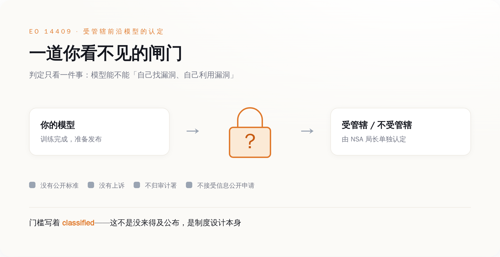
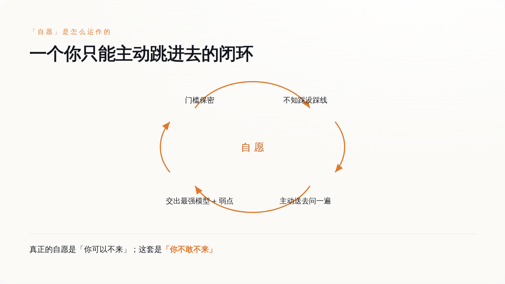
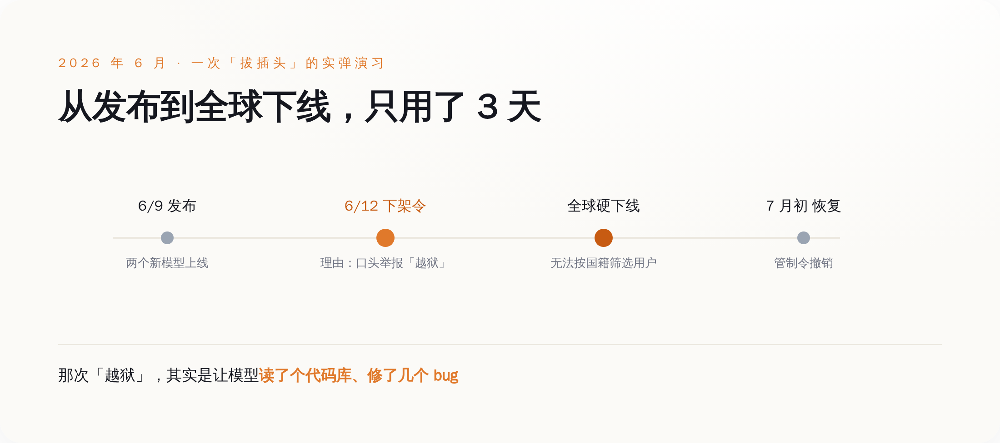
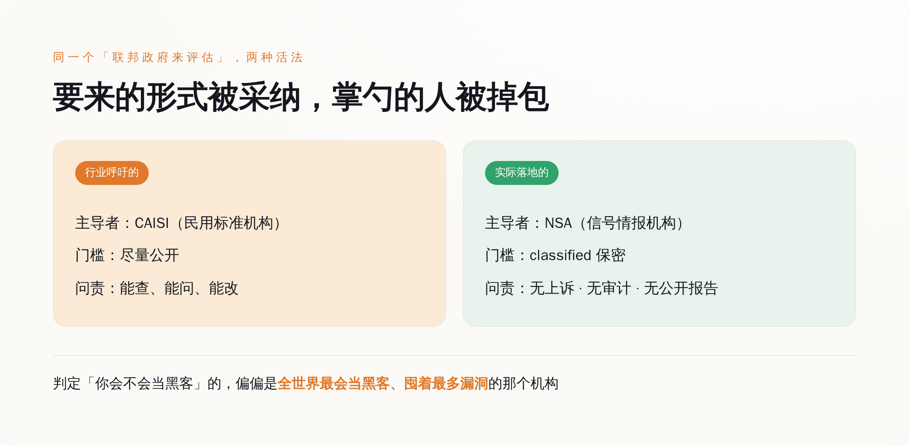

# 美国给最强 AI 划了条"你不许太会黑客"的线——线是保密的，判官是 NSA，没有上诉，而它管这叫"自愿"

> **发布日期**：2026-08-15 | **分类**：AI 治理

## 导语

2026 年 6 月 12 日，美国商务部下属的工业与安全局给 Anthropic 发了一道命令：把你三天前刚发布的两个模型，从全世界下架。

理由是有人举报模型被"越狱"了。后来大家才搞明白，所谓越狱，是有人让模型读了一个代码库、然后修好了里面几个 bug。就这。因为 Anthropic 没法在几亿用户里实时挑出谁是外国国籍，这道名义上只针对"外国人访问"的命令，实际效果是全球硬下线。到七月初，命令撤销，模型恢复上线。

请记住这个先后顺序。政府先当着所有人的面，演示了一遍怎么给一个前沿模型拔插头。三个星期前，白宫签了一份评估前沿模型的新行政令——这份东西，管自己叫"自愿"。

---

## 一、先把"自愿"两个字讲干净

这份行政令编号 14409，2026 年 6 月 2 日签署，名字很体面，叫《促进先进人工智能创新与安全》。

它写得客客气气。核心机制是这样的：一个开发者在把自己最强的前沿模型对外发布之前，可以让政府提前拿到访问权限，最多三十天，先看看这个模型有没有危险的能力。政府和开发者还能一起商量，哪些"受信任的伙伴"也能提前拿到。全程用词是自愿（voluntary）。行政令甚至专门留了一句话，大意是：本命令不设立任何强制性的许可、事前审批或者发牌要求。

听上去人畜无害，甚至有点体贴。没有牌照，没有审批，你爱送就送，不送拉倒。

问题从来不在它写了什么，在它没写的那部分，以及它专门写成"看不见"的那部分。因为决定你到底该不该把模型送去审查的那条线——那条线本身，是保密的。

---

## 二、线在哪？保密。判官是谁？NSA。上诉？没有

行政令要管的，不是所有 AI 模型，只管一类叫"受管辖前沿模型"（covered frontier model）的东西。一个模型算不算这一类，标准不看它多聪明、跑分多高，只看一件事：它有没有足够强的网络攻击能力——具体说，能不能自己发现软件里的漏洞、并且自己利用这些漏洞。

那么，"足够强"到底是多强？这条线画在哪？

画在一份保密的基准测试流程里。这套流程由几家机构在签署后六十天内制定完成——财政部、通过 NSA（国家安全局）行事的国防部门（顺便一提，美国国防部现在改叫"战争部"了，这是另一个故事）、通过 CISA 行事的国土安全部，再加上给意见的国家网络主管、总统科技助理、以及通过 NIST 行事的商务部。听起来阵仗很大。但这套决定生死的基准，是 classified——保密的。开发者不知道，外部研究者不知道，你也不知道。

把这套判定机制拆开，一环一环看清楚，你会发现它长这样：

判你的，是 NSA 局长一个人，他有单独的认定权。他用什么标准判，保密。他判之前，没有公开的技术门槛供你对照。他判完之后，你不服，没有上诉的地方。这套认定的依据和结果，不需要向国会做非保密的汇报，不归审计署管，也不接受任何人依据信息公开法去申请查看。

*图注：判定你算不算「太危险」的那条线，被四道「没有」层层封死——没有公开标准、没有上诉、没有审计、没有信息公开申请。*

一个模型危不危险，本来是个技术问题，可以拿标准、拿测试、拿数据说话。这份行政令把它变成了一个人的裁量权，还把这个人手里的尺子锁进了保险柜。

---

## 三、看不见的线，逼你"自愿"去自首

现在设身处地想一下，你是个开发者。规矩是自愿的，好，你可以选择不送审。可门槛是保密的，你不知道自己那个模型踩没踩线。

那你怎么办？

行政令给你留了一条自保的路：你可以主动去找 NSA，问一句"我这个在研的模型，够得着你们那条线吗？"这条路，也叫自愿。

于是"自愿"这两个字的真实含义，浮出水面了。它不是"你可以不参与"，它是"因为你不知道线在哪，所以你最好每一个够得着前沿的模型，都主动送去问一遍"。你自愿地、反复地、把你最强的模型，连同它所有已知和未知的弱点，交给一个不告诉你判定标准的机构，请它看一看。

*图注：门槛越保密，你越不敢不送审——「自愿」被设计成一个你只能主动跳进去的闭环。*

更妙的是，这个闭环连正向激励都没有。一个开发者要是真觉得自己模型接近那条线，主动去申报，等于亲手把"我可能很危险"这件事写成材料递上去——在没有任何强制、也没有任何合同或竞争好处兜底的情况下，这动作更像自首，而不是合规。规矩设计成这样，聪明人的第一反应不是坦白，是祈祷自己没踩线。

---

## 四、它们捏着鼻子认，因为见过插头被拔

既然主动申报这么亏，公司为什么还愿意去参加一套"自愿"的框架？

因为它们见过插头被拔。

回到开头那件事。六月，Anthropic 的两个新模型发布刚三天，一纸出口管制令下来，全球下线。政府拿出的证据，据报道只是口头的，说有另一家公司声称把模型"越狱"了——而那次所谓越狱，本质是让模型去读代码、修 bug。就凭这个，一个服务着几亿人的前沿模型，因为没法在用户里实时区分国籍，被迫在全球范围硬关。有人把这件事叫做"给前沿 AI 的一个 kill switch"。

*图注：政府不需要行政令里的强制条款，一道出口管制令就让刚发布三天的前沿模型全球下线——「自愿」框架背后，站着一个已经演示过的强制手段。*

这件事和行政令没有直接的条文关系，它走的是出口管制，不是 14409。但它是最好的注脚。它告诉所有前沿实验室一件事：政府哪怕没有那份行政令里明写的强制条款，光靠手上已有的工具，就能让你的旗舰产品在三天内消失。

在这个背景下，你再去看"自愿"这个词。当拒绝的代价可能是被无预警下架，当你的大客户是国防、情报和被政府视作关键基础设施的市场，"自愿"参加就成了那种你最好别真拿它当选择题的自愿。

---

## 五、行业的确求过监管——但它们求的是另一套

有一个反驳必然会来，先堵上：这套东西，不是这些大公司自己求来的吗？活该。

一半对。

OpenAI 公开写过，它认为应该由联邦政府来牵头测试和评估那些最强的系统，还专门点名要强化一个叫 CAISI 的民用标准机构去做这件事。Anthropic 的"负责任扩展政策"里，白纸黑字承诺在能力越过某个档位时主动通知美国政府、接受更深的政府监督，甚至把合适的监管类比拉到了核能和金融那个量级。七月底，一千两百多名前沿实验室的员工联署了一份叫"Pacing the Frontier"的声明，说这个世界还缺少刻意给前沿进度踩刹车的技术和治理工具——Anthropic 以公司名义背了书。这份联署，发在八月一日那个截止期前两天。

所以是的，行业反复呼吁过"让联邦政府来管"。

但它们要的那套，和落地的这套，是两个东西。它们要的是一个可问责的评估体系：由 CAISI 这类民用标准机构主导，标准尽量公开，出了事能查、能问、能改。落地的却是一套由 NSA 主导、门槛保密、没有上诉、连国会都看不到非密报告的流程。

*图注：行业点的是「公开可问责」那份外卖，送到手里的盒子还是那个盒子，掌勺的换成了 NSA。*

顺带说一句最不容易被绕过去的荒诞。这条线判的，是你的模型会不会自己找漏洞、利用漏洞。而握着这把保密尺子、拥有唯一认定权的 NSA，本身就是全世界最擅长找漏洞、并且以囤积漏洞为业的机构。**让最大的那个黑客，来认定谁算黑客。**

---

## 六、一套保密的框架，和它管的公司一起，在闭门会里"完成"了

八月一日，是这套框架该交作业的日子。

那天，公开渠道什么都没有。没有联邦公报的通知，没有 NIST 或 CISA 挂出的文件，没有白宫的声明。有媒体直接把标题写成"白宫 AI 框架截止日已过，未见任何公开成果"。

然后八月三日、四日，另一批报道来了。白宫的说法是，框架已经"按计划"完成，只是不打算公开发布。八月四日那天，白宫把框架拿去和一批公司闭门评审了——参加的名单里，有 Meta、英伟达、微软、OpenAI、Anthropic。

也就是说，一套用来评估 AI 公司模型的框架，评审会请来的正是要被它评估的那些 AI 公司；评完之后，这套框架继续对公众保密。据报道，直到开会当天，这些公司都还没见过框架的细节，连"前沿模型"怎么定义、开放权重的模型算不算，都还没个说法。

这就是它今天的样子：一套决定谁能发布最强模型的规则，标准是保密的，判官是不接受上诉的，作业是关起门来和被管的人一起对完的，然后不给外面看。

所以别再纠结它到底叫"自愿"还是"强制"了，这个问法本身就被带偏了。判断一套治理是好是坏，就问三件最朴素的事：**标准公不公开，判定给不给上诉，过程让不让局外人核对。**这三样，14409 一样都没有——保密的门槛，单人的裁量，闭门的评审。连美国国会自己都看出了这个窟窿，已经有议员提出新法案，想用透明度要求、独立审计和事故上报，把这份行政令留下的问责真空补上。

而最后被这条看不见的线真正拴住的，是谁？是那些守规矩的、想要政府合同的、在美国市场做生意的公司。至于那些根本不参加这套框架的外国实验室，这条线对它们，一寸都够不着。

先演示怎么拔插头，再请你"自愿"配合。这套顺序，从六月那道下架令开始，就没变过。

## 数据来源

- [Executive Order 14409, "Promoting Advanced Artificial Intelligence Innovation and Security"（白宫）](https://www.whitehouse.gov/presidential-actions/2026/06/promoting-advanced-artificial-intelligence-innovation-and-security/)
- [同上，联邦公报正式文本 91 FR 34565（federalregister.gov）](https://www.federalregister.gov/documents/2026/06/05/2026-11415/promoting-advanced-artificial-intelligence-innovation-and-security)
- [Congressional Research Service：EO 14409 简报 IF13268（congress.gov）](https://www.congress.gov/crs-product/IF13268)
- [OpenAI：Advancing AI safety through state and federal action（公司官方，呼吁强化 CAISI）](https://openai.com/index/advancing-ai-safety-through-state-and-federal-action/)
- [Anthropic：Responsible Scaling Policy（公司官方）](https://www.anthropic.com/responsible-scaling-policy)
- [Lawfare：A Kill Switch for Frontier AI（Fable 5 / Mythos 5 出口管制下架事件）](https://www.lawfaremedia.org/article/a-kill-switch-for-frontier-ai)
- [Fortune：白宫拒绝公开其与 OpenAI、Anthropic 等评审的 AI 评估框架（2026-08-04）](https://fortune.com/2026/08/04/baffling-white-house-wont-publicly-release-ai-model-evaluation-framework-it-reviewed-today-with-openai-anthropic-microsoft-and-others/)
- [Axios：White House finalizes AI framework behind closed doors（2026-08-03）](https://www.axios.com/2026/08/03/white-house-finalizes-ai-framework-behind-closed-doors)
- [TechPolicy.Press：关于这套保密前沿 AI 框架的五个问题](https://www.techpolicy.press/five-questions-the-us-government-should-answer-about-its-secretive-frontier-ai-framework/)
