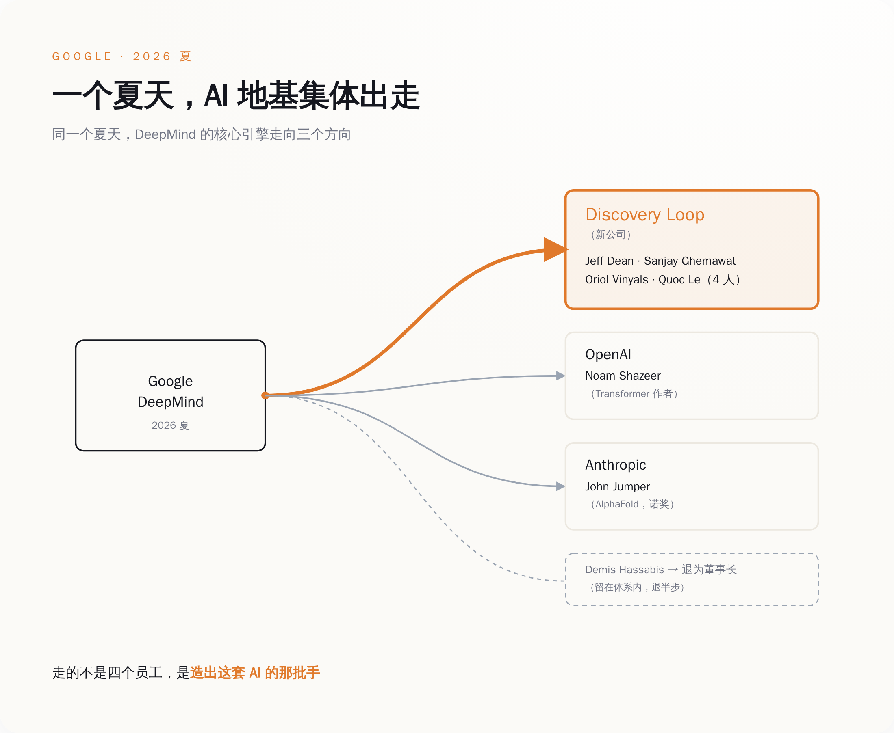
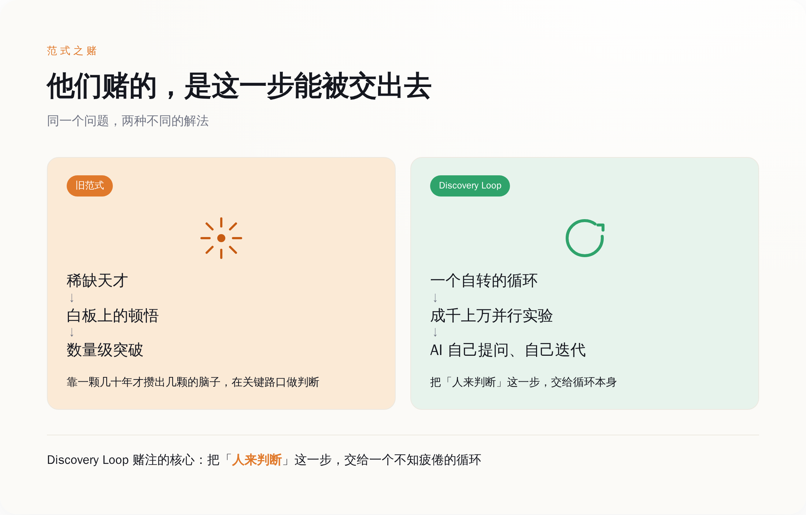
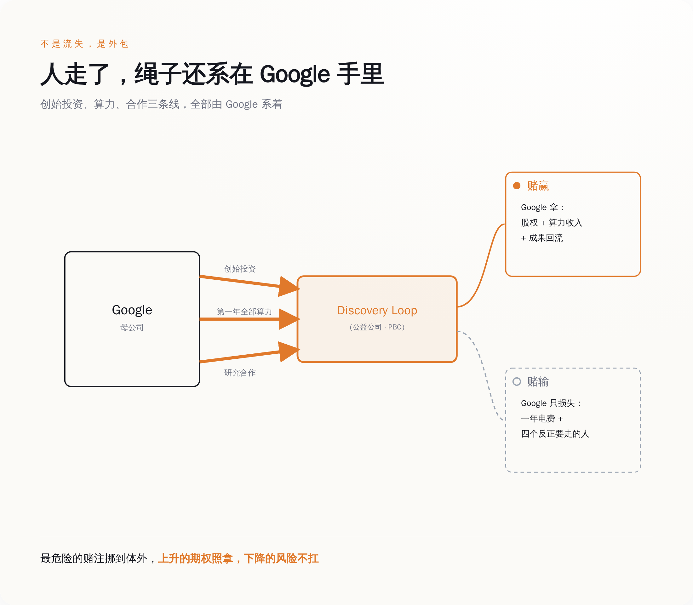

# Google 最贵的四个大脑同一天辞职，去造一台"不再需要他们"的机器

> **发布日期**：2026-08-16 | **分类**：行业观察

## 导语

8 月 5 号，Jeff Dean 发了一条推特——不是辞职感言，是产品发布。他和三个跟了自己十几到三十年的老伙计，一起成立了一家叫 Discovery Loop 的公司，使命写得干脆：自动化机器学习、科学和工程。说人话，就是造一台能自己做 AI 研究的机器。而写这条推特的四个人，是过去二十年硅谷公认最不可替代的一批脑子，他们亲手搭起了 Google 半个技术底座——如今凑到一起要干的第一件事，是让"像他们这样的人"不再必要。最离谱的是，这台机器第一年的电费，是他们刚辞职的老东家 Google 掏的。

---

## 一、走的不是四个员工，是 Google 的"基础设施本人"

先搞清楚走的是谁，否则你会低估这件事。

Jeff Dean 1999 年加入 Google，到今年整 27 年。你现在用的 Google 搜索能扛住全球流量，底下跑的是他和 Sanjay Ghemawat 一起写的那套东西——MapReduce、Bigtable、Spanner。后来深度学习起来，是他搭了 Google Brain；再后来大家都在用的 TensorFlow，也是那条线上长出来的。他挂的头衔是 Google 首席科学家。工程师圈里流传过一整个"Jeff Dean 段子集"，内容大意是他快到能让光都显得慢——那是一种只会发生在被公认为神的人身上的调侃。

Sanjay Ghemawat 是跟他共用一块白板写了几十年代码的搭档，两个人合写程序的方式被媒体专门写过长篇特稿，因为在这个行业里，两个顶级的人能长期共用一个大脑，本身就是奇观。Oriol Vinyals 和 Quoc Le 则是把 Google 一路推到 Gemini 的核心研究者，序列到序列、AutoML 这些今天被当成常识的东西，源头都有他们。

这四个人凑一桌，不是"四位资深专家离职"，是 Google 的技术地基本人，从工位上站起来，走了。

而且不止他们四个。差不多同一段时间，写出 Transformer 那篇论文、又回来当 Gemini 技术负责人的 Noam Shazeer 去了 OpenAI；靠 AlphaFold 拿诺贝尔化学奖的 John Jumper 去了 Anthropic。再往上一层，DeepMind 的老板 Demis Hassabis 也退了半步——从 CEO 变成 DeepMind 董事长兼 Alphabet 首席科学家，日常交给原来的 CTO Koray Kavukcuoglu，后者直接向 Sundar Pichai 汇报。

一家公司在几周之内，把创造它 AI 能力的那批最关键的手，成建制地送了出去。你可以说这是正常的人员流动，但正常的人员流动不长这个样子。

*同一个夏天，Google 的 AI 核心成建制地流向三个方向——出走的是地基，不是零件。*

## 二、他们要造的东西，恰恰是"不再需要他们这种人"

Discovery Loop 到底做什么，Jeff Dean 自己讲得很清楚，不需要谁替他解读。

他说，"我们的通用做法，是把实验的循环自动化"。具体点：让 AI 自己提出实验、自己跑、从结果里学、再迭代下一轮，成千上万个实验并行滚动。这个循环，就是公司名字里那个 Loop。他们相信这套方法几乎能用在所有科学和工程领域，一上来先拿最熟的开刀——机器学习研究本身。终极目标写在公司性质里：递归自我改进，也就是让 AI 去加速 AI 自己的进步。

你把这两段话摆在一起看，会发现一个很冷的东西。

过去这十几年，AI 的每一次大跳跃，靠的是什么？靠的就是 Jeff Dean 这种人，在某块白板前想出一个别人想不到的点子。Dean 自己描述过那个时刻：当你看到一个能带来数量级提升的想法，你通常会意识到，这不是一次普通的优化，而是一个能改变整个方向的突破。注意，他说的是"你意识到"——主语是人。是那颗稀缺的、几十年才攒出几颗的脑子，在关键路口做出了判断。

而 Discovery Loop 赌的，正是这个"人来判断"的环节可以被交出去。交给一个不知疲倦、可以并行几千次、自己给自己出题的循环。

**四个把"人不可替代"活成传说的人，辞职去造一台专门证明"人可以被替代"的机器。** 这不是我给他们扣的帽子，这是他们自己写在公司使命第一行的话。

*旧范式里，突破卡在一颗稀缺的脑子上；Discovery Loop 想把这一步换成一个能自转的循环。*

## 三、这种事，在一家要交季度作业的公司里，做不了

问题来了。这四个人本来就在 Google。Google 有全世界数一数二的算力、数据和人才密度，想做"自动化 AI 研究"，为什么非要辞职出来做，不能在里面做？

因为在一家上市公司里，这件事的形状，天生就是拧巴的。

递归自我改进这种东西，有三个特点：极度烧钱、可能好几年不出任何能写进财报的成果、而且万一真做成了，它牵扯的安全和舆论风险大到没有哪个季度电话会议想在上面多待一秒。把它塞进 DeepMind，就意味着它要天天跟 Gemini 的发布节奏抢算力、抢人、抢老板的注意力。而 Gemini 那边本身就在被反复报道推迟——一个天天要向公众交作业的产品线，是不可能把资源匀给一个"可能十年才开花"的赌注的。

所以他们把公司注册成了特拉华州的公益公司（Public Benefit Corporation）。这个结构不是为了好看。它在法律上给了一家公司一个正当理由：我可以不为下个季度的股价服务，我为一个更长的目标服务。换句话说，它是一张"允许我慢、允许我烧、允许我暂时不赚钱"的许可证。

**在一家必须每个季度交作业的公司里，你没办法做一件可能十年不交作业、也可能一夜之间改变一切的事。** 这不是 Google 不够大，恰恰是因为它太大、太重、每一步都被财报盯着。有些赌注，你只有从大公司这台机器里跳出来，才押得下去。

## 四、Google 没有"输掉"这四个人——它把最贵的赌注外包了

到这里，故事听上去像一出人才悲剧：Google 留不住人，地基散了，AI 竞赛要掉队了。

但你把钱的流向摆出来看，味道完全变了。

Discovery Loop 的种子轮，由 Radical Ventures 和 Khosla Ventures 领投，Kleiner Perkins、Lightspeed、Doerr Capital 跟投，具体金额没公开。这些名字都是标准的顶级风投。但名单里有一个不该出现在这里的名字：**Alphabet，也就是 Google 的母公司，是这家公司的创始投资人之一。** 不仅投钱，Google Cloud 还是它的云合作伙伴，包下了它第一年运转所需要的全部算力。协议里还写了，两家会在机器学习系统研究上继续合作，也就是说，这家"离开 Google 的公司"跑出来的一部分成果，还会以某种方式流回 Google。

把这几条连起来，"人才流失"这个词就站不住了。

Google 实际上做了一笔非常精算的买卖：它用"投一点钱 + 卖一整年算力"的方式，给"自动化 AI 研究"这个高风险方向，买了一张期权。赌赢了，它是股东、是唯一的云、是研究合作方，三头都吃；赌输了，烧掉的是 Discovery Loop 的名声和资产负债表，Alphabet 的财报上只少了一年电费和四个本来就要走的人。最危险、最不确定、最可能把公司声誉点着的那部分前沿探索，被干净利落地挪到了体外一个独立的盒子里。而盒子的钥匙，Google 还捏着一把——第一年的算力全靠它供给，这家公司短期内根本跑不出它的手掌心。

这不是 Google 的独门发明。微软和 OpenAI、亚马逊和 Anthropic，早就是这个物种：大厂不再什么都自己养，而是把最烧钱、最不确定的前沿，用"投资 + 算力绑定"的方式，寄养在体外，既拿上升的期权，又不用扛下降的风险。Discovery Loop 只是这套玩法用在自己人身上的最新一版。

**所谓人才流失，是财报最喜欢的那种流失——人走了，期权留下了，连电费都能开成一笔收入。**

*四个人是走出去了，但资本、算力和成果的绳子，一头还系在 Google 手里。*

## 五、他们赌"聪明人不再是瓶颈"，而裁判席上坐着替他们付电费的人

最后说说这个赌注本身。

如果 Discovery Loop 真做成了——AI 能自己提实验、自己迭代、加速自己——第一个被这套东西冲击的岗位是什么？是 AI 研究员。也就是说，是 Jeff Dean 们自己这一行。他们在用自己职业生涯的下半场，去赌一件让"像他们这样的天才"贬值的事。

当然，短期内它更可能做的是"加速"而不是"替代"：帮真实的研究员把那个笨重的实验循环跑快十倍，人还在圈里，只是不用再手动拧每一颗螺丝。真正的递归自我改进是远期的、也可能永远到不了的那一格。这四个人比谁都清楚这里面有多少是画饼——他们做了一辈子这行。

可他们还是跳了。这才是这件事真正值得看的地方：这个星球上最有资格相信"人的天才不可替代"的四个人，亲手下注赌它会过时。他们比任何唱衰者都更懂这套东西的边界，也比任何鼓吹者都更愿意押上自己的名字。

而在裁判席上，坐着那个替他们付电费的老东家。Google 一边掏钱、供算力、留着股东席位，一边不动声色地等着看这个赌注开不开花——开了，它分红；不开，它损失的也就是一年电费，和四个反正要走的人。它把一个自己做起来太重、太危险、太不划算的动作，变成了一张对别人下注的彩票。

所以别再把这件事读成"Google 的大脑流失"。**Jeff Dean 那条推特不是辞职信，是一份路线图，上面写着他要用下半辈子，把"像 Jeff Dean 一样思考"这件事，变成一段能自动跑起来的流程。** 而这个世界上第一个读懂这份路线图价值的人，恰恰是那个刚给他签完离职手续、转头又给他打了钱、递上算力的老板。

## 数据来源

- [Jeff Dean 关于 Discovery Loop 的发布推文（X / @JeffDean）](https://x.com/JeffDean/status/2085034604172603724)
- [Jeff Dean 关于"自动化实验循环"的后续推文（X / @JeffDean）](https://x.com/JeffDean/status/2085035498222002595)
- [Discovery Loop 官方网站](https://www.discoveryloop.com/)
- [Radical Ventures：Our Investment in Discovery Loop](https://radical.vc/our-investment-in-discovery-loop/)
- [Google 官方博客：The next chapter of our AI momentum（Sundar Pichai）](https://blog.google/company-news/inside-google/message-ceo/next-chapter-ai-momentum/)
