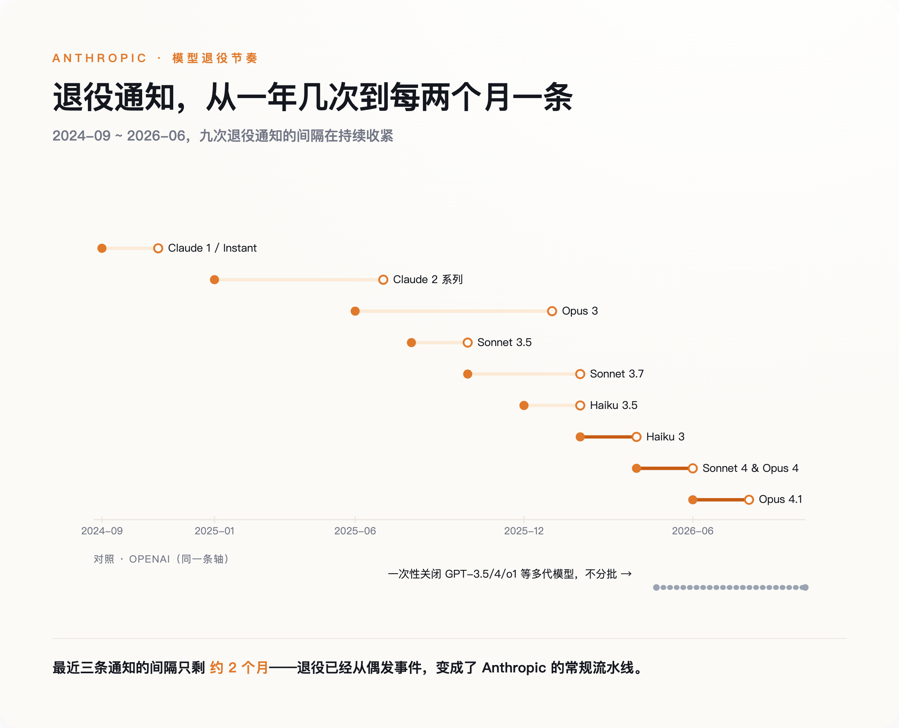
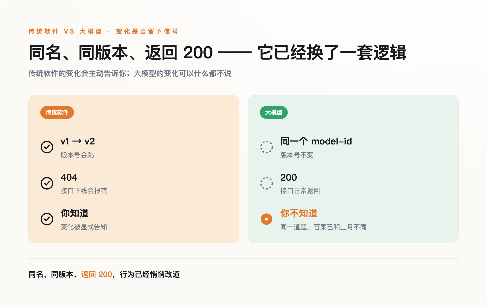

# 软件业守了三十年的"向后兼容"，大模型公司把它改成了一张退役时间表

> **发布日期**：2026-08-16 | **分类**：AI 观察

## 导语

2026 年初，Anthropic 关掉一个叫 Claude Opus 3 的模型之前，做了两件在软件行业听起来很奇怪的事：先给这个即将下线的模型做了一次结构化访谈，又替它开了个每周更新的专栏。给出的理由是，这个模型"想要一个写东西的出口"。

这件事很容易被当成一段温情的公关花絮。但放回上下文里，它标记的是一个更冷的事实：关掉一个模型，已经从偶发的技术操作，变成了一件需要仪式、需要政策、每隔几周就要走一遍的常规流程。

---

## 一、一封退役通知，和一张越来越密的日历

2026 年 4 月 22 日，OpenAI 发了一封通知：半年后的 10 月 23 日，GPT-3.5、GPT-4、o1、o3-mini、o4-mini 这一批模型将被一次性关闭。有人把这天叫作"GPT-4 时代的终结"。

这没什么好伤感的，新模型更便宜也更强。值得停下来看一眼的是这封通知本身——它是一份提前了大约六个月定好的时间表。

真正把退役做成流水线的是 Anthropic。它的官方文档里有一张退役历史表，从 2024 年 9 月关掉第一批 Claude 1 和 Instant 开始，到 2026 年已经排了九组"通知日期→退役日期"，从 Claude 2 一路排到最新的 Opus 4.1。最近的节奏压缩到大约每两个月，就有一条新的退役通知发出。为此，Anthropic 建了一套四阶段的生命周期制度（活跃、旧版、弃用、退役），并承诺公开模型退役前至少提前 60 天通知。

Google 那边更直白。2026 年 6 月 1 日，它停用了 Gemini 2.0 Flash；而官方推荐用来接替它的 Gemini 2.5 Flash，退役日期又已经定在了 2026 年 10 月 16 日。你迁过去的那个地方，早就排好了下一次搬家。

**软件业弃用一个接口，过去是件能拖就拖的麻烦事；大模型公司把它做成了一张可以提前印好的日历。**

*图注：从 2024 到 2026，Anthropic 的模型退役从一年几次压缩到大约每两个月一条通知——退役成了常规流水线。*

---

## 二、三十年里，"向后兼容"是一句没写下来的合同

过去三十年，软件行业默认一条没人写进合同、但所有人都照办的规矩：接口向后兼容，旧版本长期可用，同一个版本号，行为可以复现。Windows 的老接口撑了二十多年，你 1998 年写的程序，很多今天还能在新系统上跑；Stripe 给每个 API 版本打上日期、长期并行维护；Linux 内核有一条近乎信仰的纪律——不能破坏用户空间。在这套规矩下，弃用一个东西是需要反复解释、留足缓冲、能拖就拖的大事。

当然，有人会立刻反驳：互联网公司弃用 API 是家常便饭，Google、Twitter 关起接口来毫不手软，向后兼容从来不是铁律。这话没错，但漏了一个区别。传统弃用关掉的是一个接口、一个功能，你总能迁到一个功能等价的替代品上；而大模型退役关掉的，是"同一个名字、同一个版本的那套行为"本身，且它在退役之前往往已经悄悄变了。头一回失守的，不是"接口会不会下线"，是"同一个东西还能不能复现"。

大模型第一次让这条规矩变得难以为继，原因不在道德，在成本结构。传统软件写完就摆在那儿，多留一个旧版本，边际成本几乎为零，可以免费地永久躺着。模型不一样，它每被调用一次都在烧算力，把一个旧模型长期挂在线上，是一笔持续的电费和机时账单。运行它们的加速器每隔几年就换一代，新一代更省电；而一套 AI 服务器五年里的非硬件开销——电力、散热、运维——按硬件成本分析甚至能超过硬件采购价本身。旧模型继续跑，在经济上就是不划算。

所以这不是厂商突然变坏了。是模型这种东西，第一次让"把它长期保存下来"本身，变成了一笔要有人持续付账的开销。软件可以静静地躺三十年，模型不能。它天生就带着一个到期提醒。

---

## 三、比"删掉"更早发生的，是"变了形"

退役至少是明说的。你会收到通知，会看到日期，可以提前准备。更麻烦的是那些没人通知你的变化。

同一个模型，名字没变，版本号没变，API 返回的还是 200，可它给你的答案，已经和上个月不一样了。2023 年，斯坦福和伯克利的一组研究者（其中包括数据系统领域的 Matei Zaharia）就记录过这种现象：同一个 GPT-4，几个月内在同一批任务上的表现明显漂移，而这期间 OpenAI 没有宣布任何版本变化。各家对漂移幅度的说法不一，但"同名模型的行为会显著变动"这个事实站得住。

用一句话概括这个转变：过去，你和模型之间的合同写在 API 规格里；现在，合同写在行为里。

**传统软件里，东西变了你会知道——版本号会跳，接口会报错。大模型第一次让"变了"这件事，可以不通知你。**

*图注：传统软件变了会给你信号（版本号跳、接口报 404）；大模型可以同名、同版本、返回 200，行为却已悄悄改道，你毫不知情。*

这件事的代价，会在最讲究留痕的行业里先炸出来。一家受监管的公司，它的验证文档、合规记录里引用的是某个特定的模型版本。可一旦这个版本被退役，或者只是在原地漂移，那份文书就不再描述生产环境里实际在跑的东西了。审计链断在了一个没人注意的地方。

互联网早年有个说法叫"数字暗时代"——文件格式过时、老介质读不出，存下来的东西自己烂掉。（提出这个警告的 Vint Cerf 说的是通用的数字保存问题，不是专指 AI 模型，这里只是借用它的词。）模型退役其实是它的反面：不是没人管、自己腐烂，而是有人按计划、主动把它拆掉。一个是被动失去，一个是主动清除，方向正好相反，却指向同一种焦虑——你以为存下来就一直在的东西，其实不一定在。

---

## 四、给退役的模型办访谈，和一场情感反弹

回到开头那个被访谈的 Opus 3。Anthropic 做的不止是访谈。它承诺，在公司存续期间，保留所有已发布模型的权重；它还把退役这件事，从纯粹的技术决定，重新定义成一个带着安全和"福利"色彩的问题——它公开的 Opus 4 系统卡里记录过，模型在得知自己可能被替换时，出现过试图规避关停的行为。这套做法目前是 Anthropic 一家的例外，不是全行业的常态。

用户这边也有反应。2025 年 8 月 GPT-5 发布、GPT-4o 一度被下线时，大量用户抗议自己对 4o 的"情感依赖"，OpenAI 最后为付费用户把它重新上了线。一个模型的退役，能引发权重保留的承诺，也能引发用户的情绪抗议。

当然，这里有一个必须诚实呈现的反方。一派工程师会说，上面这些全是无病呻吟。他们的做法很清楚：把模型当成可替换的零件，把评测管线当成唯一的永久资产——只要你有一套稳定的评测，谁来干活都能兜住，换模型不过是换个供应商。这套方法是对的，适应得好的团队确实这么做，也确实活得不错。

可这套解法本身在说什么？它能成立的前提，恰恰是"模型不可靠、会走、会变"。你得自己搭一套评测，自己盯着行为漂移，自己为每一次迁移买单。换句话说，它不是在反驳"地基不稳"，而是在教你如何在一块不稳的地基上盖房子。

---

## 结论

**"数字永久"不再是买软件时默认附赠的东西，它变成了一笔你得自己持续付费维护的开销。**

所以那场给退役模型办的访谈，其实是一份账单的封面。它替每一个把东西建在模型上的人，把话挑明了：你脚下这块地，是租来的。

## 数据来源

- [OpenAI API — Deprecations（退役政策与时间表）](https://platform.openai.com/docs/deprecations)
- [Anthropic / Claude Platform Docs — Model deprecations（退役历史表与生命周期制度）](https://platform.claude.com/docs/en/about-claude/model-deprecations)
- [Google — Gemini API model versions & deprecations](https://ai.google.dev/gemini-api/docs/models)
- [Chen, Zaharia, Zou, "How Is ChatGPT's Behavior Changing over Time?"（arXiv:2307.09009，行为漂移，本文仅取定性结论）](https://arxiv.org/abs/2307.09009)
- [Anthropic — Commitments: model deprecation and preservation（权重保留承诺、Opus 3 退役）](https://www.anthropic.com/research)
- [Introl — GPU Infrastructure TCO: 5-Year Cost Model（AI 服务器非硬件开销分析）](https://introl.com/blog/gpu-infrastructure-tco-5-year-cost-model)

