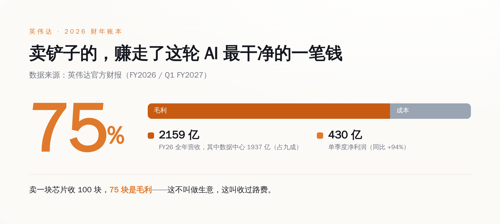
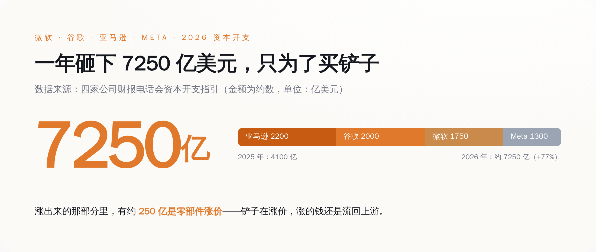
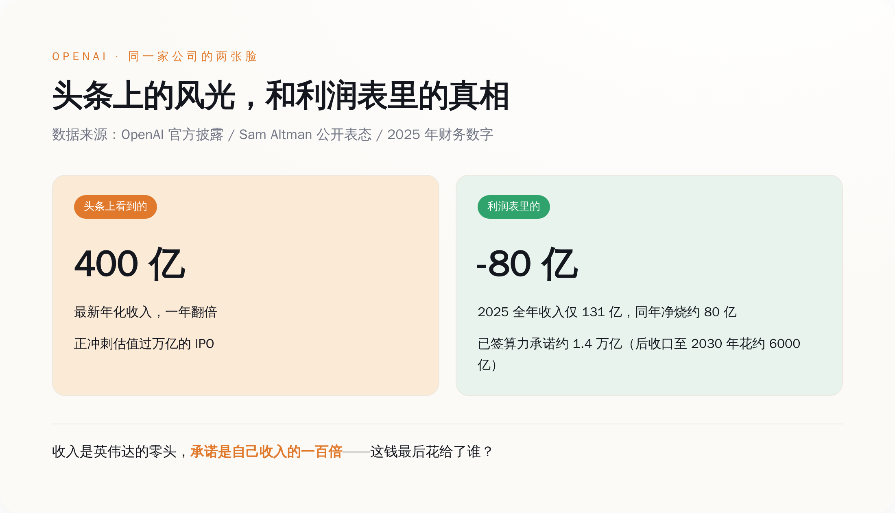
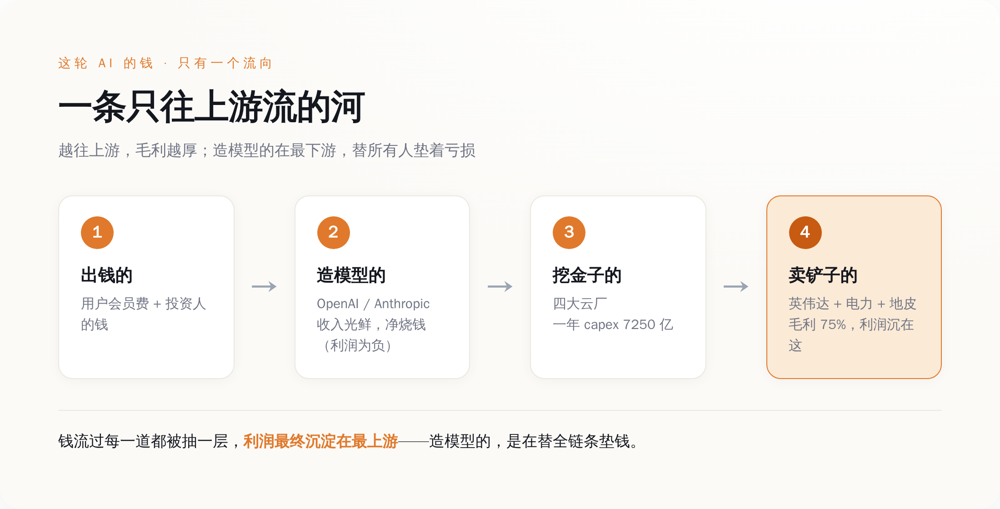

# 这轮 AI，造模型的在流血冲刺，卖铲子的在数钱数到手抽筋

> **发布日期**：2026-08-17 | **分类**：商业拆解

## 导语

八月十三号，彭博放出消息：OpenAI 的年化收入冲上了 400 亿美元，比去年底翻了一倍，正憋着一个估值过万亿的 IPO。全网又一次沸腾，标题清一色是"史上最快"。

我也很激动，激动完顺手把这本账翻到了下一页。然后我发现，这 400 亿里的大头，OpenAI 收到手还没焐热，就原封不动地转手交了出去——交给了英伟达，交给了电力公司，交给了盖数据中心的包工头。

这轮 AI 淘金热里，真正把钱装进兜里的，从来不是淘金的，是卖铲子的、卖水的、卖牛仔裤的。OpenAI 的 IPO 冲得越猛，越是在给上游抬轿子。就这。

---

## 一、先看谁在真赚钱：那个卖铲子的，数钱数到手抽筋

我们先不谈情怀，谈钱。谁赚到钱了？

英伟达。

看它自己交出来的账本，2026 财年全年营收 2159 亿美元，同比涨了 65%。这里头，数据中心业务一家就贡献了 1937 亿——占全公司营收九成。翻译成人话：英伟达现在基本上就是一家"AI 芯片公司"，别的业务加起来都是零头（游戏显卡？那是它上辈子的事了）。

增速还在往上窜。到了 2027 财年第一季度（截止今年 4 月 26 号），单季营收 816 亿美元，同比涨 85%；其中数据中心营收 752 亿，同比涨 92%。它自己给下一季度的指引是 910 亿。一个季度赚的钱，比很多国家一年的财政收入还多，而且还在加速。

但真正吓人的不是营收，是毛利率。

英伟达 2026 财年第四季度的 GAAP 毛利率是 75%。这是个什么概念？意思是它卖一块 AI 芯片，收你 100 块，成本只有 25 块，剩下 75 块是毛利。这个毛利率高到什么地步——全世界能把芯片做到这个毛利的公司，一只手数得过来，而且没一个是靠卖硬件卖出来的。单是那一个季度，英伟达的净利润就有约 430 亿美元，同比又涨了 94%。

*图注：这轮 AI 里花掉的每 100 块钱，有一大截先流进了英伟达——它卖 AI 芯片的毛利率是罕见的 75%。*

一家硬件公司，能做到软件公司才有的毛利率，说明什么？说明它没有对手。它自己也承认，全球 AI 加速器市场它占了大约 86%——剩下 AMD、英特尔们分那 14%。买家想换供应商？没得换。这不叫卖货，这叫收过路费，而且是全行业唯一一条路上的过路费。

所以你看，这轮 AI 到底谁在赚钱，答案清清楚楚地写在英伟达的财报里。它甚至不需要自己去猜哪个大模型会赢——反正淘金的都得来它这买铲子，谁赢它都赚。

---

## 二、再看谁在花钱：四家巨头一年砸 7250 亿，眼都不眨

英伟达的钱是谁给的？是那四个疯狂挖金子的——微软、谷歌、亚马逊、Meta。

按这四家自己在财报电话会上给出的资本开支指引，2026 年它们合计要砸大约 7250 亿美元的 capex，比 2025 年的 4100 亿多了整整 77%。一年多花三千多亿，就为了买卡、盖数据中心、拉电。

我把它们各自报的数字一个个列出来，你感受一下这个场面：

- **亚马逊**：把 2026 年的数字抬到了约 2200 亿美元；
- **谷歌**：1950 到 2050 亿之间；
- **微软**：定在 1900 亿（后来因为一个会计口径的调整，摊销年限拉长，账面数字降到约 1750 亿——但钱该花还是花）；
- **Meta**：guidance 下限抬到 1300 到 1450 亿。

微软的 CFO 在电话会上还补了一句大实话：这 1900 亿里，有大约 250 亿纯粹是因为内存、存储这些零部件涨价涨出来的。翻译一下——铲子不光要买得多，铲子本身还在涨价。而涨价涨的钱，最后又流回了上游。

*图注：四家云巨头 2026 年合计 capex 约 7250 亿美元，同比 +77%——这是一场没人敢先停手的军备竞赛。*

这四家为什么敢这么砸？因为谁都不敢先停手。停手就等于承认自己在 AI 上认输，股价当场就得挨捶。于是就变成了一个囚徒困境：明知道可能砸过头，但只要对手在砸，我就必须跟着砸。而这场谁都不敢停的军备竞赛里，卖军火的英伟达笑得最开心——你们尽管卷，卷得越狠，我卖得越多。

有意思的是，这四家今年集体学乖了一招：土地、厂房、拉电这种用几十年的长期资产，早早锁定；但占大头成本的芯片，尽量拖到真正要用之前几个月才下单，等看清了需求再掏钱。说白了，是给自己留了个刹车。他们嘴上说"回报很确定"，身体却很诚实地在给这场豪赌加装安全带。

---

## 三、最后看谁在流血：造模型的，收入越亮账本越难看

绕了一圈，我们回到开头那个主角——OpenAI。

它确实风光。年化收入 400 亿，Greg Brockman 在内部说光是七月这一个月，收入的月环比就涨了 20% 以上。今年六月八号已经悄悄向 SEC 递交了 IPO 申请，估值目标过万亿。数字一个比一个漂亮。

但你把它的利润表翻开，画风突变。

OpenAI 2025 年一整年的实际收入是 131 亿美元，同一年它净烧掉了大约 80 亿。也就是说，赚一块钱的同时得倒贴六毛多出去。这还是在收入高速增长的前提下——增长越快，烧得越狠，因为每多服务一个用户，就得多买一份算力。

更刺激的是承诺。它的老板 Sam Altman 亲口说过，OpenAI 已经签下了大约 1.4 万亿美元的数据中心和算力承诺，横跨未来八年，签约对象是英伟达、AMD、博通这一串卖铲子的。1.4 万亿是什么概念？是它 2025 年收入的一百多倍。后来大概是自己也觉得这个数字太吓人，又对投资人把口径收了收，改成到 2030 年花约 6000 亿。收就收吧，6000 亿也还是它现在年收入的十几倍。

*图注：OpenAI 账面上的风光（年化 400 亿、冲万亿 IPO）和账本里的真相（2025 年净烧 80 亿、算力承诺 1.4 万亿），是两回事。*

不是只有 OpenAI 一家这样。它最大的对手 Anthropic，年化收入据其自身披露正逼近 600 亿这个量级，但同样签下了约 710 亿美元的算力承诺。两家加起来，是这颗星球上最能赚钱的两个 AI 模型公司，收入合起来撑死也就一千亿出头的量级——而前面那四家云厂商，光今年一年的 capex 就是 7250 亿。

看出问题了吗？造模型的这两个尖子生，倾其所有赚来的收入，还不够那四个花钱大户一年开销的一个零头。而那四个花钱大户花出去的钱，绝大部分又落进了英伟达们的口袋。钱在这条链上只有一个流向：从造模型的，流向挖金子的，最后沉淀在卖铲子的手里。

---

## 四、钱到底沉在哪：一条只往上游流的河

把这三笔账并在一起看，这轮 AI 的钱到底怎么走，就一目了然了。

出钱的是谁？是买 ChatGPT 会员的你我，是往 OpenAI、Anthropic 里砸钱的投资人。这笔钱先进了造模型公司的账上，变成那些漂亮的"年化收入"。

然后呢？造模型的公司拿到钱，转头就得去租算力、买卡。它们要么直接找云厂商租，要么自己下单买英伟达的卡。钱于是从造模型的，流到了那四个挖金子的云巨头，变成 7250 亿的 capex。

再然后？这 7250 亿里的大头，是买芯片。钱于是又从挖金子的，流到了卖铲子的英伟达——以及卖电的电力公司、租地皮盖机房的、卖内存的。这些上游，个个毛利丰厚，个个赚得盆满钵满。

*图注：钱从用户和资本出发，一路向上游流，每过一道都被抽走一层，利润最终沉淀在最上游的英伟达、电力和地皮手里。*

这里有个特别拧巴的地方值得说道说道。按红杉合伙人 David Cahn 自己算的一笔账，2026 年全行业 AI 基础设施的投入大约是 1.5 万亿美元，而要让这笔投入回本，整个行业得赚回大约 3 万亿的收入。现在全行业所有 AI 公司加起来的收入，离这个数字还差着十万八千里。这个窟窿谁来填？没人知道。

但你注意一件事：不管这 3 万亿的窟窿最后填不填得上，英伟达的钱都已经落袋了。它是先收钱、先发货的。淘金的人最后有没有挖到金子、会不会饿死在半路，跟卖铲子的没关系——铲子钱是先付的。这就是为什么英伟达能一边看着全行业为"回不了本"焦虑，一边毛利率稳稳地踩在 75%。

造模型的公司呢，站在这条河的最下游，替上游所有人垫着亏损，赌的是有朝一日模型强到能把这笔账倒过来算。这个赌局也许能赢。但在它赢之前的每一天，它赚的每一块钱，都在往上游送。

---

## 五、所以，你到底在为谁的 IPO 鼓掌

现在再回头看八月十三号那条让全网沸腾的新闻，味道就不太一样了。

OpenAI 年化收入冲上 400 亿、要冲万亿 IPO，这确实是真事，也确实厉害。但这条新闻真正的潜台词是：这台印钞机马力越开越大了，而它印出来的钱，绝大部分要顺着那条河，送到英伟达、电力公司和包工头手里。IPO 募到的钱也一样——不是拿去分红的，是拿去买更多铲子、填更大窟窿的。

所以每一次为 OpenAI 的收入新高鼓掌，某种意义上，你都是在为英伟达的下一份财报鼓掌。淘金热里喊得最响的永远是淘金的人，但结账时笑得最稳的，永远是那个在矿场门口支起摊子卖铲子、卖水、卖牛仔裤的。这不是这轮 AI 的新鲜事，这是每一次淘金热的老规矩。

如果你想在这局里看懂钱，别盯着谁的模型跑分高、谁的 IPO 估值猛。盯着一个特别朴素的问题就够了：**这家公司赚的钱，是留在自己账上，还是转手就交给了上游？** 留得下的，是庄家；留不下的，再风光也是在给庄家打工。

OpenAI 是不是庄家，看它哪天能不再把收入的大头交出去，就知道了。在那天到来之前——它冲得越猛，英伟达数钱数得越欢。就这。

## 数据来源

- [NVIDIA Announces Financial Results for First Quarter Fiscal 2027](https://investor.nvidia.com/news/press-release-details/2026/NVIDIA-Announces-Financial-Results-for-First-Quarter-Fiscal-2027/default.aspx)
- [NVIDIA Announces Financial Results for Fourth Quarter and Fiscal 2026](https://nvidianews.nvidia.com/news/nvidia-announces-financial-results-for-fourth-quarter-and-fiscal-2026)
- [Microsoft Fiscal Year 2026 Fourth Quarter Earnings Conference Call](https://www.microsoft.com/en-us/investor/events/fy-2026/earnings-fy-2026-q4)
- [Hyperscalers Hit $700 Billion-plus in 2026 AI Spending Plans](https://finance.yahoo.com/sectors/technology/articles/hyperscalers-hit-700-billion-2026-111243744.html)
- [OpenAI's Annualized Revenue Tops $40 Billion Ahead of IPO (Bloomberg)](https://www.bloomberg.com/news/articles/2026-08-13/openai-s-revenue-run-rate-tops-40-billion-ahead-of-ipo)
- [Sam Altman says OpenAI has about $1.4 trillion in data center commitments (TechCrunch)](https://techcrunch.com/2025/11/06/sam-altman-says-openai-has-20b-arr-and-about-1-4-trillion-in-data-center-commitments/)
- [OpenAI resets spend expectations, targets around $600 billion by 2030 (CNBC)](https://www.cnbc.com/2026/02/20/openai-resets-spend-expectations-targets-around-600-billion-by-2030.html)
- [Sequoia's Cahn Pegs AI's 2026 Revenue Gap at Roughly $3T](https://aiweekly.co/alerts/sequoias-cahn-pegs-ais-2026-revenue-gap-at-roughly-3t)
