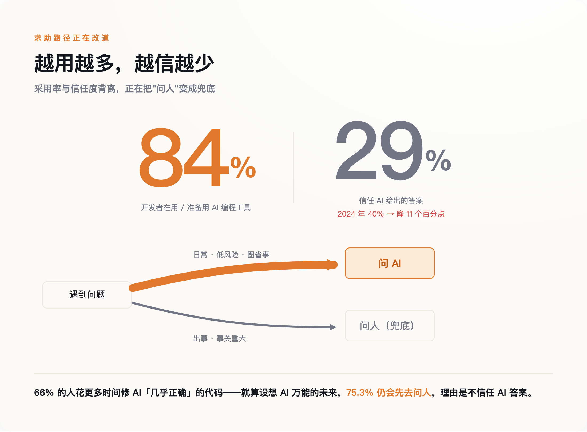
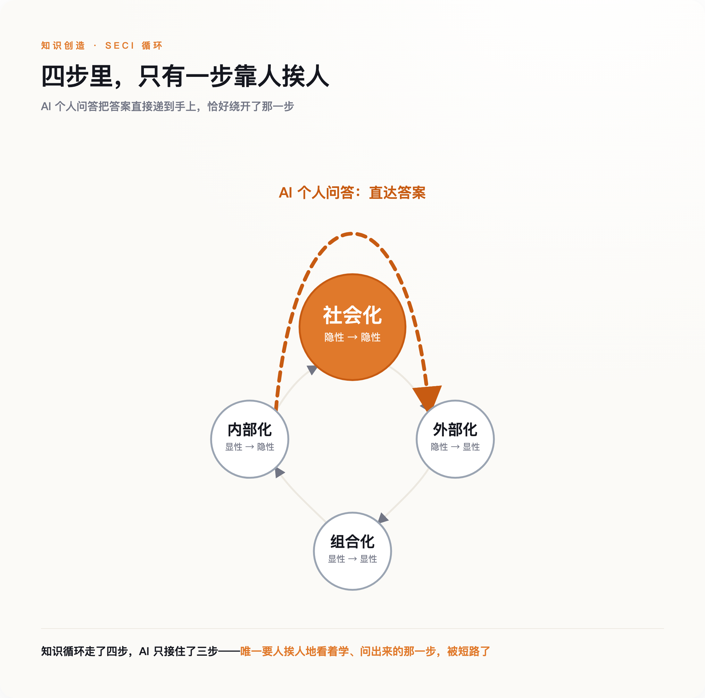
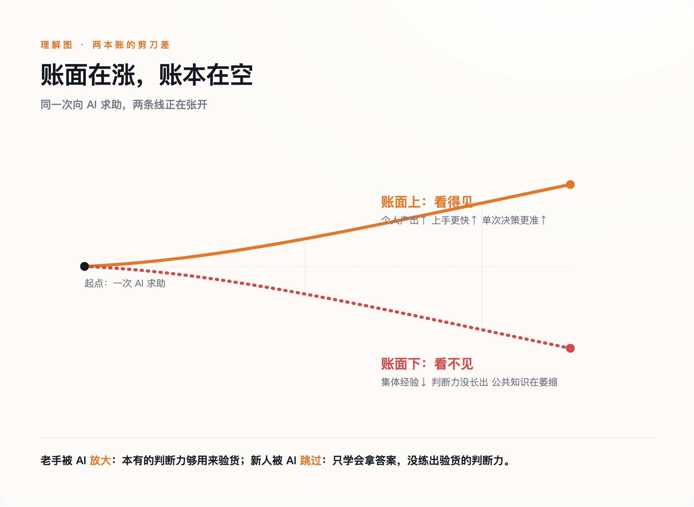

# AI 让每个员工都更强了，公司却在悄悄变笨

> **发布日期**：2026-08-18 | **分类**：AI 深度观察

## 导语

先看两个放在一起有点别扭的数字。

2025 年 Stack Overflow 的开发者调查里，超过八成的人在用 AI 写代码，而信任它答案准确性的只有 29%——一年前这个数字还是 40%。一件工具，你越来越不信，却越用越多。

这不矛盾。矛盾的是另一件被这两个数字盖住的事。过去，一段代码拿不准，程序员会转头问旁边那个干了十年的同事；现在他先问 AI，只有 AI 的答案实在信不过，才回头找人。同一份调查里，75.3% 的人说，哪怕将来 AI 强到能包办大部分编码，他们遇事还是想去问一个人——因为不信 AI。

问人这件事，正在从日常动作，退化成出事时的兜底。

每个人的活确实交得更快了。只是有件事没人算过：那个"转头问一句"的动作，过去顺带传下去的东西，现在断了。

---

## 一、越不信，越在用

先把这组数字说完整，因为它是后面所有推断的地基。

Stack Overflow 2025 年的调查覆盖了近五万名开发者。八成以上在用或准备用 AI 编程工具，这是采用率；信任其答案的只有 29%，比 2024 年掉了十一个百分点，这是信任度。两条线一个往上一个往下，中间张开的口子，Stack Overflow 自己起了个名字，叫"采用—信任差距"。

差距是怎么被消化的？调查里还有几个数字。66% 的人说，他们现在花更多时间去修 AI 生成的那种"看着几乎对、其实不对"的代码。而在设想"AI 无所不能"的那个未来里，仍然选择去问人的理由，排第一的是"不信任 AI 的答案"（75.3%），紧跟着是"出于伦理或安全的顾虑"（61.7%）和"我想真正弄懂自己的代码"（61.3%）。

把这些拼起来，浮现的是一条改了道的求助路径：低风险、日常的问题，默认先问 AI，快、不用欠人情、不怕问了个蠢问题被人记住；只有当 AI 明显不靠谱、或者事关重大，人才被重新请回来。

*图注：越用越多，越用越不信——被这道『采用—信任差距』盖住的，是求助从『问人』改道成了『问 AI』，问人退为兜底。*

这里要诚实。这份调查能证明的，是开发者对 AI 答案的信任在降、是"信不过时才去找人"，它并不能直接证明"绝大多数日常求助都已经从问人转成了问 AI"——后者是一个更强的行为断言，眼下还没有大规模的硬数据能钉死它。国内一个技术论坛上有人写过一篇《带甲方新人有感》，说新人遇到任何问题，第一反应都是问 AI 而不是扭头问坐在一米外的人。这是真实的观察，但它是个案，不是统计。

更稳的说法是：一条以前靠人和人之间完成的求助通道，正在被一条人和机器之间的通道分流。分流多少，暂时没人量得准。但只要这个分流真实存在，接下来的问题就成立——被这条通道顺带运送的，到底是什么？

## 二、有些本事，只能"看会"，不能"问会"

要回答这个问题，得请出六十年前的一本小书。

1966 年，哲学家迈克尔·波兰尼写下一句后来被反复引用的话：我们知道的，比我们能说出来的多（we can know more than we can tell）。他举的例子是认脸——你能在一千张脸里认出某个人，却几乎说不清你到底根据什么认出来的。后人把这叫"波兰尼悖论"：大量真本事是"知道怎么做、但讲不出规则"的，它从来不以条款的形式存在。

这类知识有个要命的性质：你没法通过"提一个规范的问题"把它取出来。因为提问的前提，是你已经知道该问什么、答案长什么样。而隐性知识恰恰是那种你说不清、因此也问不出口的东西。AI 再强，它擅长的是回答被问清楚的问题；它帮不了你的，是那些你根本不知道该问的地方。

组织管理学者野中郁次郎把这件事讲得更具体。他那个被商学院讲烂了的 SECI 模型，第一步叫"社会化"——隐性知识传给隐性知识。他说得很明白：这一步没有捷径，唯一的途径是共享经验、是观察、是模仿，是新人在老手旁边并肩干活，看他怎么下手、在哪儿犹豫、为什么这里绕了个弯。

那个绕了个弯的地方，往往就是二十年攒下的判断。哪个模块当年为什么这么设计、哪段代码碰不得、客户嘴上要的和真正想要的差在哪儿——这些从没写进任何文档，也写不进去，因为写下来的一瞬间它就丢了一半。它过去靠一次次"你看这个咋弄"，在人和人之间一点点渗过去。

AI 的个人化问答，恰好绕开的就是"社会化"这一环。它把你要的答案直接递到你手上，干净、高效、不需要你去打扰任何人。代价是，那个"打扰"本身，才是知识流过去的通道。

*图注：知识循环的四步里，只有『社会化』靠人挨人地看着学、问出来——而 AI 把答案直接递到手上，恰好把这一环短路了。*

## 三、这根线，AI 之前已经被剪过一次

切断这条通道的第一刀，其实不是 AI 砍的。

2021 年，微软把自己六万一千名员工的协作数据拿出来做了一项研究，发表在《自然·人类行为》上。结论是：当全公司转向远程办公，员工之间的协作网络变得更"孤岛化"了——各人缩回自己那一小簇熟人里，跨团队的连接明显减少，员工花在跨群体协作上的时间份额，相对疫情前掉了大约四分之一。

这里要说清楚：那项研究测的是远程办公的后果，不是 AI 的。把它搬到这里，不是说 AI 干了同样的事，而是说，同一条通道——人和人之间那些没安排、没必要、纯属顺带的接触——在 AI 大规模进来之前，已经被远程办公先削过一遍了。

被削掉的那部分，社会学里有个不起眼的名字，叫弱关系。走廊里撞见、茶水间等咖啡时的两句闲聊、隔壁工位探过头来的一句"你这个我以前踩过坑"。这些接触低效到几乎不该存在，KPI 上永远记不进去。可组织里大量的经验、预警和门路，恰恰是搭着这些没用的接触传过去的。

现在的情形是两重叠加。第一重，物理上，大家已经不怎么在一个屋里了；第二重，认知上，就算在一个屋里，遇到问题也先低头问屏幕，而不是抬头问人。两刀落在同一个地方。第一刀削薄了偶遇的机会，第二刀替换掉了本来还剩下的那点主动求助。

## 四、账面上更快，账面下更空

个人那本账好算，公司这本账要难看得多。

沃顿商学院的伊森·莫里克，一直在讲这件事的一个侧面：当 AI 接手了那些原本交给新人的基础活儿，活儿照样干完了，甚至更快，但伴随这些活儿本该长出来的成长，消失了。他还点破了更扎心的一层：真正能把 AI 用出水平的，恰恰是那些本来就有专长的资深员工——只有他们的判断力，够得着 AI 什么时候在一本正经地胡说。

**AI 放大的，是已经有本事的人；跳过的，是本该在这些活儿里长出本事的人。**

这就构成一个很别扭的时间差。存量的老手，用 AI 如虎添翼；增量的新人，用 AI 越用越顺手，却没有在任何一次求助里，被逼着去理解一件事为什么这么做。他们学会的是"怎么拿到答案"，不是"怎么判断答案对不对"。等到有一天老手退休、而新人要坐上那个需要判断力的位子，会发现自己手里只有一堆用过就忘的答案。

MIT 的经济学家达龙·阿西莫格鲁给这件事做了个更冷的模型，管它叫"知识坍塌"。（这篇 2026 年的工作论文还没经过同行评审，得如实说一句。）他的推演是：当 AI 的准确率越过某个临界点，哪怕它给每个人的即时答案质量都在变好，整个系统赖以运转的那份公共知识——通用的那一层——反而会开始萎缩。短期每一次决策都更对了，长期的知识底子却在被一点点抽走。

工程圈里流传着一个更黑色幽默的说法。过去衡量一个团队的脆弱程度，看"巴士系数"——多少人被巴士撞了，这个项目就没人懂了，数字越小越危险。而现在有人说，AI 把它推向了一个新极限：巴士系数归零。不是"只剩一个人懂"，是一个提交了几十个 AI 生成补丁的项目，那套架构的完整设想，从一开始就没在任何一个人的脑子里存在过——它只存在于某个人和 AI 的一段聊天记录里，那段记录关掉，就再也拼不回来了。（这类描述目前还是行业观察者的模式归纳，不是某一起实名事故，得打个折看。）

**公司账面上，新人上手更快了；账面下，一批人的经验，正随着他们退休一起，永久离场。**

*图注：账面上，个人产出和上手速度都在涨；账面下，集体经验和判断力在被抽空——两条线正在剪刀式分开。*

## 五、能不能把老师傅装进硬盘

当然，有一种反驳听上去很有道理：AI 不光会绕过隐性知识，它还能反过来把隐性知识捞出来、存起来啊。

这不是空想，是一门正在卖的生意。已经有一批公司（Glean、eGain 这类）在推销这样的方案：用 AI 去访谈资深专家，把他们那些讲不清的窍门、变通、"凭手感"的判断一点点问出来，映射进一张可检索的知识图谱——赶在老师傅退休之前，把他脑子里的东西抢救下来。用野中的话说，这是在给 SECI 里的"外部化"装一台发动机，把隐性变显性。

这条路不假，但它有三个洞。

其一，证据几乎全来自厂商和咨询公司自己的口径，很难找到带着具体公司、人名、前后对比的独立验证。那些被反复引用的吓人数字——某某损失多少亿、多少成关键专长只在员工脑子里——追下去大多是估算，源头存疑，我在这篇里一个都没敢当硬数据用。

其二，逻辑上它自己拌了自己一跤。这些方案一边说"要赶紧把隐性知识捕获下来"，一边又把"这种知识的深度正是人类不可被替代的原因"当卖点。可如果它真能被一台机器完整地问出来、存下来，那它就没那么不可替代；如果它真不可替代，那台机器就注定只能捞到浮在表面的那层。两句话不能同时为真。

其三，也是最要命的一层：AI 真正擅长的，是在已经被写下来的知识里做模式匹配。它能把文档、代码、聊天记录里的东西整合得很好，容易让人误以为它已经把那个人的全部本事都装进去了。但波兰尼那句话还立在那儿——最深的那部分，本来就是说不出、因而也录不下的。你录下来的，是老师傅愿意说、也说得出的那一半；剩下那一半，随人走。

所以隐性知识会不会流失，答案不是简单的"会"。SECI 是个螺旋，被破坏的环节理论上能重建，AI 也确实能在"显性—显性"那几环上帮大忙。真正的问题只落在一个环节上：社会化——人挨着人、看着学、问出来的那一环。这一环，是整个链条里最难自动化的，偏偏也是眼下被 AI 绕得最彻底的。

这件事不需要什么宏大的结论，只提醒一件很具体的事：下次一个新人放着 AI 不用、绕过来问你一个本可以自己查到的问题，别嫌他浪费时间。那句话来回的功夫，可能是这家公司账面上看不见、却真正在增值的东西。

## 数据来源

- [Stack Overflow 2025 Developer Survey（AI 采用与信任）](https://survey.stackoverflow.co/2025/)
- [Microsoft & UC Berkeley: The effects of remote work on collaboration among information workers, Nature Human Behaviour (2021)](https://www.nature.com/articles/s41562-021-01196-4)
- [Michael Polanyi, The Tacit Dimension (1966)](https://en.wikipedia.org/wiki/The_Tacit_Dimension)
- [Nonaka & Takeuchi, SECI model of knowledge creation](https://en.wikipedia.org/wiki/SECI_model_of_knowledge_dimensions)
- [Ethan Mollick, on the "apprenticeship" problem of AI](https://www.oneusefulthing.ai/)
- [Daron Acemoglu et al., AI, Human Cognition and Knowledge Collapse, NBER Working Paper w34910 (2026, 未经同行评审)](https://www.nber.org/papers/w34910)
