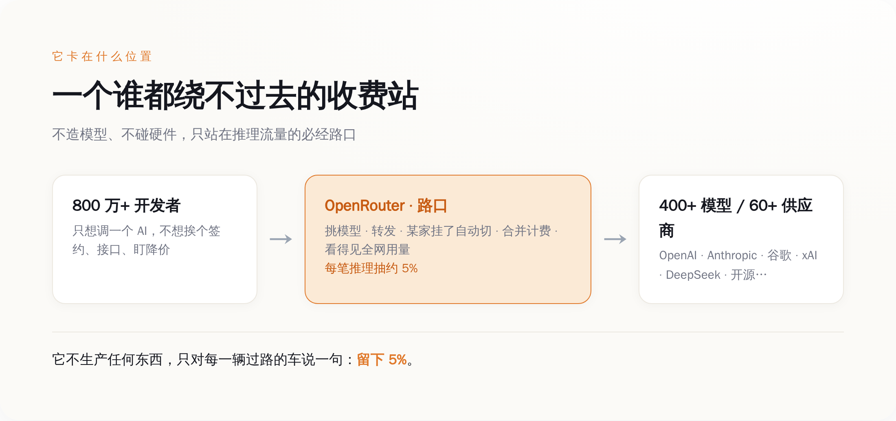
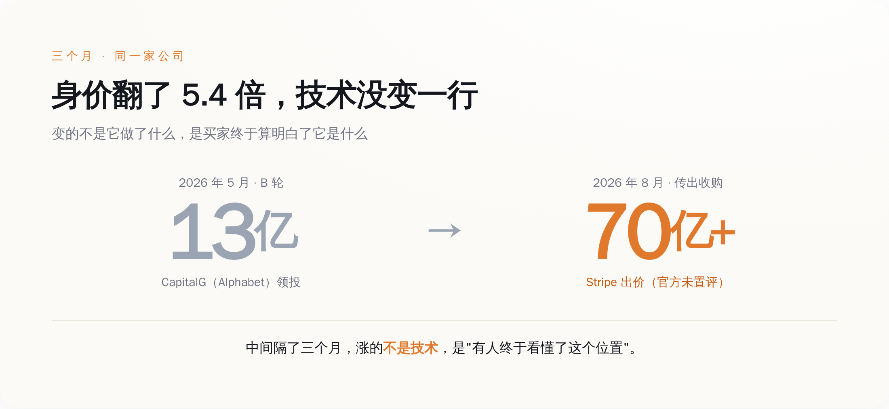
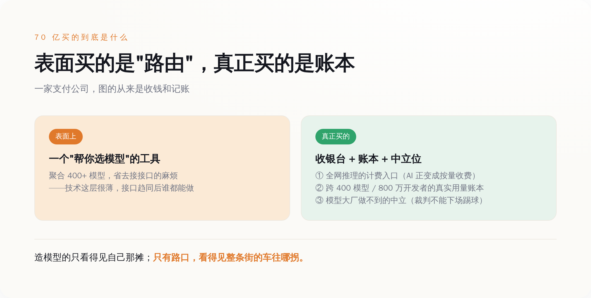

# AI 最肥的位置，是路口那个收 5% 过路费、还顺手抄走所有人账本的中间商

> **发布日期**：2026-08-19 | **分类**：AI 深度观察

## 导语

先说一个听着不太对劲的价钱。

有一家公司，自己不造模型，也不卖芯片，甚至连一张显卡都不用囤。它干的活，说白了就是"帮你决定这次该调用哪个 AI"——你把请求扔给它，它替你从 OpenAI、Anthropic、谷歌、xAI、DeepSeek 里挑一个最合适的，转发过去，再把账单归到一处。就这么个活儿。

这家公司叫 OpenRouter。今年 5 月，它刚融完一轮，估值 13 亿美金。三个月后的 8 月 16 日，多家媒体传出：Stripe 要花超过 70 亿美金把它买下来（Stripe 官方照例不予置评）。

从 13 亿到 70 亿，5.4 倍，中间隔了三个月。

一个正常人的第一反应是：三个月里它能干出什么惊天动地的技术，值这个溢价？答案是——没有。它的技术三个月前是什么样，现在还是什么样。变的不是它做了什么，是买家终于想明白了它**站在什么位置**。

这篇文章想说的就是这个位置。因为这轮 AI 打到现在，最烧钱、最悲壮的是造模型的，最扎眼、最赚吆喝的是卖铲子的，但真正闷声站在一个别人抢不走的位置上、还顺手把所有人家底都看光的，是这种你平时根本注意不到的中间商。

Stripe 花 70 亿，就是给这个位置盖了个章。

---

## 一、它什么都不造，只是站在路口收钱

要看懂这 70 亿，先得看清楚 OpenRouter 到底卡在哪儿。

今天你要做一个 AI 应用，面前摆着一个甜蜜的麻烦：能用的模型太多了。OpenAI 一家就好几个型号，Anthropic 一堆，谷歌的 Gemini 一堆，还有 xAI、DeepSeek、Meta，以及一大批你没听过的开源模型。它们各有各的脾气——这个便宜但慢，那个聪明但贵，这个半夜偶尔抽风，那个某类活儿特别灵。你不可能挨个去签合同、接接口、盯着谁家今天又降价了。

OpenRouter 就是来收拾这个烂摊子的。它把 60 多家供应商、400 多个模型，统统包进一个接口。你只跟它说话，它替你干四件事：挑模型、转发请求、某家挂了自动切到另一家、最后把所有账合到一张单子上。开发者省了心，代价是每一笔推理花销，OpenRouter 抽大约 5%。

这个抽成听着不多，但你要看它下面过的是多大的水。按它自己披露的口径，平台上跑着 400 多个模型、服务着超过 800 万开发者，一年过手的 token 数量，已经是"千万亿"（quadrillion）这个量级。这么大的流水，5% 抽下来，就是一门躺着的生意。

**它不生产任何东西，它只是站在所有人必经的那个路口，对每一辆过路的车说：留下 5%。**

你把这轮 AI 的产业链摊开看，会发现大家挤的位置其实很不一样。造模型的（OpenAI、Anthropic 这些）在最上游流血冲刺，烧几百亿去训练，是最重、最险的活。卖铲子的（英伟达、各家云）在中间供货，赚的是实打实的硬件和算力钱，重资产，但吃得饱。而 OpenRouter 卡的是最下游、最轻的那个点——它不碰模型、不碰硬件，只碰"分发"这个动作本身。

轻，意味着它没有护城河吗？恰恰相反。正因为它轻，它才能中立。这一点，是后面 70 亿的全部秘密。

*图注：OpenRouter 不造模型、不碰硬件，只卡在 800 万开发者与 400+ 模型之间的路口，每笔推理抽约 5%。*

## 二、三个月涨 5.4 倍，涨的不是技术，是买家开窍了

回到那个别扭的价钱。

今年 5 月，OpenRouter 融了 1.13 亿美金的 B 轮，估值定在 13 亿。领投的是 CapitalG——谷歌母公司 Alphabet 旗下的成长基金。也就是说，早在 5 月，谷歌系的钱就已经嗅到这个位置的味道了。

三个月后，Stripe 直接把牌桌掀了：传出的收购价超过 70 亿，是三个月前那轮估值的 5.4 倍。

我知道这几年 AI 圈的估值已经离谱到让人麻木，动不动几十亿、几百亿，看多了就觉得数字只是个符号。但你把这个具体的时间差摆出来，还是会觉得哪里不对：**三个月，一家公司的技术、团队、产品几乎没变，身价翻了五倍多。中间到底发生了什么？**

发生的不是技术进步，是认知补课。

三个月前，多数人看 OpenRouter，看到的是一个"方便的工具"——帮开发者省点接接口的麻烦，一个聚合器而已，值 13 亿，差不多了。三个月后，Stripe 看它，看到的是另一样东西：一个已经架在全行业推理流量必经之路上的收费站，加上一份别人搞不到的账本。

这就是估值这件事最诚实也最残酷的地方。价钱涨的，从来不是那个东西本身，而是"有人终于算明白了它是什么"。OpenRouter 三个月前和三个月后，是同一家公司；变的是有一个手里攥着支付网络、最懂"收钱"这门生意的买家，突然意识到自己缺的正是这块拼图。

顺便说一句，有第三方（Sacra）估算，OpenRouter 的年化营收当时大约在 5000 万美金上下——这个数得打个"估算"的折。可即便按这个数算，70 亿的价钱也是它营收的一百多倍。这么高的倍数说明一件事：Stripe 掏的钱，压根不是买它今天赚的那点抽成，是买它站的那个位置，和那个位置能看到的东西。

*图注：三个月里技术几乎没变，估值从 13 亿跳到 70 亿+——涨的不是它做了什么，是买家看懂了它站的位置。*

## 三、Stripe 买的不是"路由"，是收银台和账本

那 Stripe 到底在买什么？

得先想清楚 Stripe 是谁。它是做支付的，全世界最懂"怎么在一笔交易里干净利落地把钱收走"的公司之一。一家支付公司，不去买模型、不去买算力，偏偏花 70 亿去买一个"帮人选 AI"的中间商——这个选择本身，就已经把答案说出一半了。

因为 AI 的推理，正在变成一门**按量计费的生意**。你调用一次模型，就像用一度电、打一分钟电话，是可以被计量、被计价、被开账单的。而计量和收钱，正是支付公司的主场。OpenRouter 现在这个位置，恰好是全行业推理流量的计费入口——每一次调用从它这儿过，花了多少、调了谁、贵还是便宜，它一清二楚。对 Stripe 来说，这不是一个 AI 项目，这是一个天生的、已经跑起来的 AI 计费网络。

但比收银台更值钱的，是账本。

OpenRouter 站在 800 万开发者和 400 多个模型的中间，它手里攥着一份全行业都眼馋、却谁都拿不到的数据：此时此刻，大家真金白银在用哪个模型、弃了哪个、谁家悄悄涨价掉了单、哪个新模型突然起量。这不是发布会上的跑分，是用钱投出来的真实票数。造模型的自己只看得见自己那一摊，云厂商看得见算力消耗但看不清模型偏好，**只有站在路口的 OpenRouter，看得见整条街的车流往哪拐。**

当然有人会泼冷水，而且泼得有道理：路由这层太薄了，随着各家模型接口越来越统一（大家都在兼容 OpenAI 那套 API），换供应商成本趋近于零，OpenRouter 迟早会把自己存在的理由给磨没了。这个质疑不假。但它算错了护城河在哪儿。OpenRouter 真正的壁垒，从来不是"接口转换"这点技术活，那确实谁都能做；它的壁垒是那份跨 400 个模型、800 万开发者攒出来的账本，和它站着的那个中立位置——这两样，恰恰是越用越厚、越晚越难追的。

而"中立"这两个字，解释了为什么最后接盘的是 Stripe，而不是某个模型大厂。你让 OpenAI 来做这个路由，开发者敢信它会公平地把请求转给隔壁 Anthropic 吗？不敢。裁判自己下场踢球，这生意就塌了。能守住中立的，只能是一个跟所有模型都没有直接竞争关系的角色——而一家支付公司，天生就是干这个的。

*图注：Stripe 表面买的是"路由工具"，真正买下的是全网推理的计费入口、跨 400 模型的真实用量账本，和模型大厂给不了的中立。*

## 四、这条街的钱，正在往收银台那头挪

把这笔交易放到更大的背景里，你会看到一个正在发生的转向。

一个行业早期，钱都堆在"能不能造出来"这件事上——谁的模型强，谁就值钱，天经地义。但当东西越造越多、越来越像、开始变成随手可换的标准件时，价值就会悄悄从"生产"那头，往"分发和结算"这头挪。因为当产品本身拉不开差距了，谁掌握了通往用户的那条路、谁攥着收钱的那个闸口，谁就重新握住了定价权。

这不是 AI 独有的剧本。当年货架上的商品拼到最后，最肥的不是厂家，是收银台；应用多到数不清的时候，最赚钱的不是每一个 App，是那个抽三成的应用商店。规律很朴素：东西越多越贱，站在所有东西必经出口上的那个角色，就越贵。

AI 现在正走到这一步。模型这两年卷生卷死、疯狂降价，OpenAI 敢把新模型三周就砍价八成——这说明模型本身正在快速滑向"标准件"。而模型越贱、越同质，OpenRouter 那个"替你在一堆差不多的东西里挑一个、顺手收钱记账"的位置，就越金贵。Stripe 这 70 亿，赌的就是这个方向：造模型的仗还没打完，但结算这门生意，已经可以提前占坑了。

所以这件事对旁观者真正的提醒，不在于 OpenRouter 值不值 70 亿——那是 Stripe 的赌注，赢输它自己认。真正值得记下来的是那条正在移动的价值线：**在一个疯狂内卷、拼命降价的行业里，最稳的位置，往往不是那个把东西造得最好的人，是那个站在所有交易必经之路上、替大家收钱记账的人。**

造模型的还在流血，卖铲子的还在数钱，而路口那个收 5% 过路费、顺手把整条街的账本都抄在手里的中间商，刚刚被人用 70 亿美金请进了保险箱。

这条街上最贵的从来不是车，是路口。就这。

## 数据来源

- [Stripe 将以超过 70 亿美金收购 OpenRouter（Bloomberg，2026-08-16 报道；Stripe 未置评）](https://www.bloomberg.com/news/articles/2026-08-16/stripe-nears-deal-to-buy-ai-firm-openrouter-for-over-7-billion)
- [Stripe clinches over $7 billion deal to buy AI firm OpenRouter（Fortune，2026-08-16）](https://fortune.com/2026/08/16/stripe-7-billion-deal-ai-firm-openrouter-acquisition/)
- [OpenRouter 完成 1.13 亿美金 B 轮，估值 13 亿，CapitalG（Alphabet）领投（TechCrunch，2026-05-26）](https://techcrunch.com/2026/05/26/openrouter-more-than-doubles-valuation-to-1-3b-in-a-year/)
- [OpenRouter：统一 API 接入 400+ 模型 / 60+ 供应商（官方）](https://openrouter.ai/)
- [OpenRouter now processes more than a quadrillion tokens a year（Menlo Ventures）](https://menlovc.com/perspective/openrouter-now-processes-more-than-a-quadrillion-tokens-a-year/)
- [OpenRouter revenue, valuation & funding（Sacra，含年化营收估算）](https://sacra.com/c/openrouter/)
