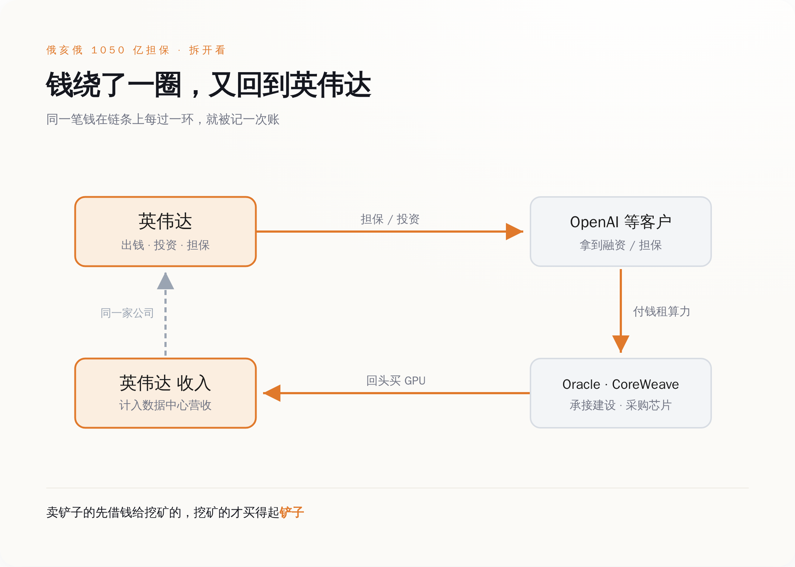
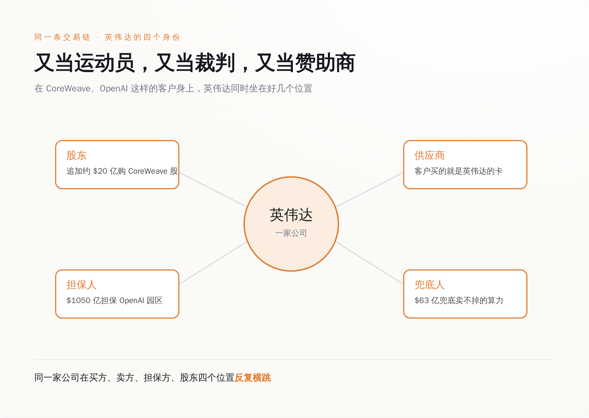
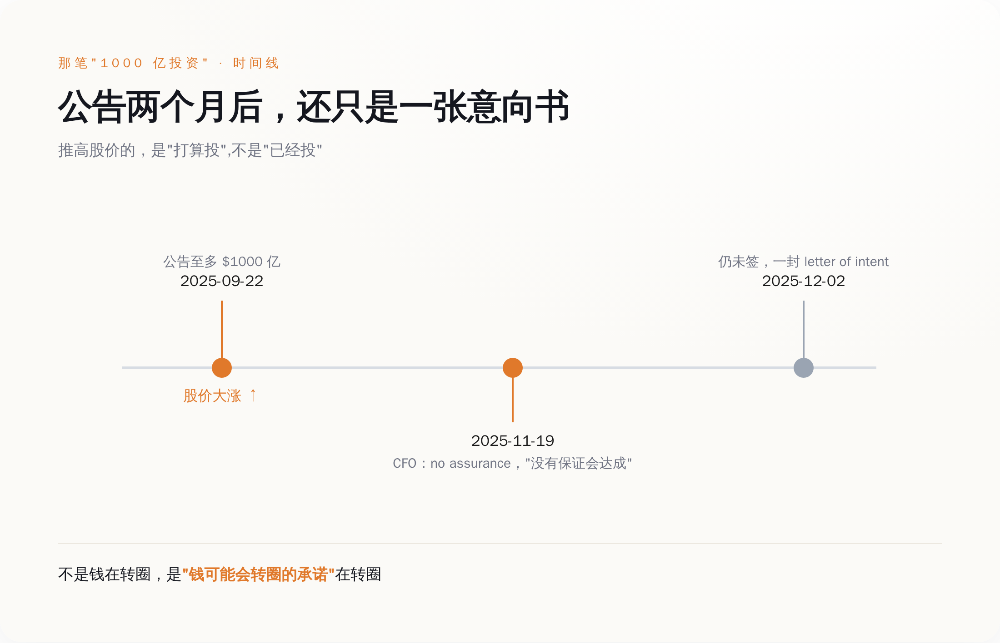
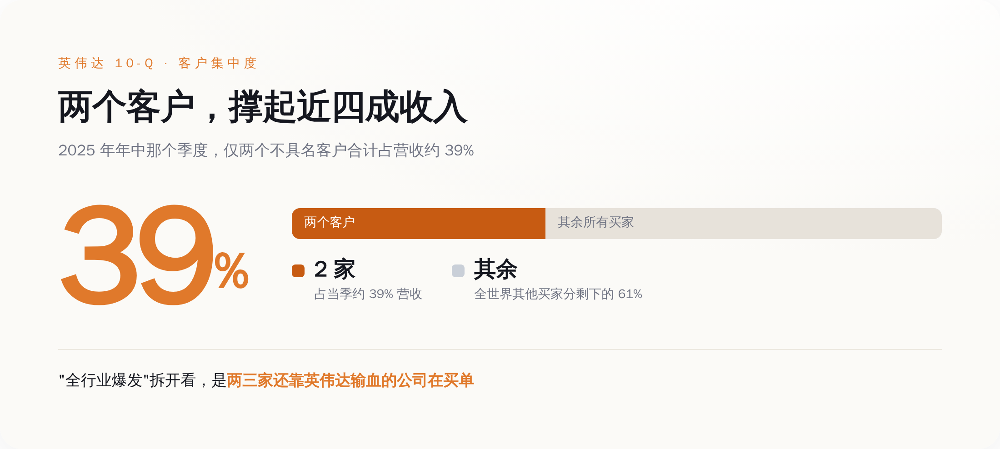
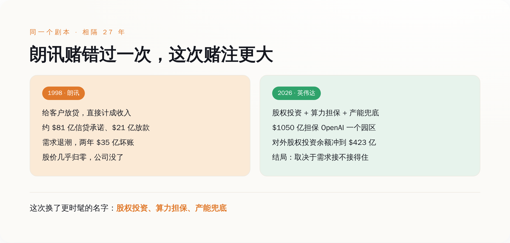

# 英伟达最猛的客户，是英伟达自己

> **发布日期**：2026-08-19 | **分类**：AI 商业观察

## 导语

八月十七号，英伟达发了个公告，说要给 OpenAI 在俄亥俄州盖的一个数据中心"担保"，金额最高一千零五十亿美元。

新闻标题写得很热闹，什么"英伟达重仓 OpenAI"、"AI 基建再下一城"。

把这句话翻回人话是这样的：英伟达出面做保，让 OpenAI 能借到一大笔钱，然后 OpenAI 拿这笔钱，去买英伟达的芯片。

**卖铲子的，现在得先借钱给挖矿的，挖矿的才买得起铲子。**就这。

---

## 一、那张一千零五十亿的借条，到底担保了个啥

先说清楚这笔钱的形状，因为大部分标题都懒得说清楚。

英伟达不是掏一千零五十亿现金砸给 OpenAI。它干的是"担保"——OpenAI 要在俄亥俄州一个叫 Ports-Pike 的园区上算力，电力和厂房由软银旗下的 SB Energy 出面盖、签二十年租约，OpenAI 当承租方。英伟达在这中间做的，是给这套融资安排背书，额度最高一千零五十亿美元，撑起初期 4.25 吉瓦、可选再加 3.75 吉瓦、合计约八吉瓦的算力，2028 年起分批上线。顺手，英伟达还往 SB Energy 里投了十五亿美元的股权。

这套结构，本质就是供应商融资（笑）。它翻译过来就是：我要卖东西给你，但你没钱，那我想办法帮你搞到钱，你再拿这笔钱来买我的东西。你买了，我的销售额就好看了；至于你还不还得起，那是以后的事。

这个俄亥俄项目的担保规模，一周之内变了好几次。最早传出来的方案是两千五百亿美元担保、十吉瓦算力；八月十号前后，市场上开始有声音说规模会明显缩水；到十七号正式官宣，定格在一千零五十亿、八吉瓦。

一个星期，纸面上的数字缩水了将近六成。

一笔正常的生意，是不会在一周内规模腰斩的。会在一周内腰斩的，是谈判——是双方还在拉扯"我到底要担保多少、你到底要盖多大"的过程。一个连自己规模都还没谈定的东西，已经可以拿去当"AI 需求强劲"的证据满天飞了。

---

*英伟达出钱担保→客户拿到融资→云厂承接采购→货款计回英伟达收入，同一笔钱转一圈被记好几次账。*

## 二、英伟达一个人，分饰三角

想看清这套玩法，得把英伟达在每一笔交易里坐的位置，一个一个数出来。

在 CoreWeave 这家云厂身上，英伟达同时是三个身份：它是股东，招股书里就持股，2026 年一月又追加了大约二十亿美元买它的股票；它是 CoreWeave 的芯片供应商，云厂盖机房买的就是英伟达的卡；它还是"你卖不掉的算力我来兜底"的担保人——一份签到 2032 年四月、初始价值六十三亿美元的协议，白纸黑字写着如果 CoreWeave 自己的客户消化不完容量，英伟达买单。

在 OpenAI 身上，英伟达是投资人（承诺至多一千亿美元）、是芯片供应商、又是俄亥俄园区万一 OpenAI 跑路时的接盘担保人（一千零五十亿美元）。

英国的 AI 初创 Nscale，拿了英伟达六亿八千三百万美元投资，配套把大约六万块 GPU 铺进英国的数据中心。Anthropic 那边，英伟达承诺投资至多一百亿美元。连马斯克的 xAI，据报道也有大约二十亿美元的英伟达跟投。

这些还只是点名点得出来的。英伟达自己的季度报告（10-Q）里有一栏叫"非上市股权证券"，说白了就是它投出去、还没上市变现的那些公司股份——这一栏的余额，到 2026 年四月底冲到了四百二十三亿美元，光那一个季度就净增了将近一百八十亿。

同一家公司，在一条交易链的买方、卖方、担保方、股东四个位置上反复横跳。这个词，英文原文就叫 circular——循环。

黄仁勋对"循环融资"这个指控的回应，是先称它"荒谬"，然后补一句："OpenAI 会付租金的。"

他说得没错，OpenAI 大概率会付租金。问题从来不是某一笔租金付不付得出来，问题是当同一家公司又当运动员、又当裁判、又当赞助商的时候，它报出来的那个比分，你还能不能全信。

---

*在同一个客户身上，英伟达同时是股东、供应商、担保人、兜底人——这就是「循环」的字面意思。*

## 三、那笔"一千亿投资"，公告两个月后还只是一张纸

这套循环里最漂亮的一层，不是钱，是承诺。

2025 年九月二十二号，OpenAI 和英伟达联合宣布：英伟达将分批向 OpenAI 投资至多一千亿美元，OpenAI 部署至少十吉瓦的英伟达系统，每上线一吉瓦，英伟达注资一部分。这条消息当天就把英伟达的股价往上顶了一大截，此后被无数篇分析引用为"英伟达生态正在滚雪球"的铁证。

一千亿美元，多提气的数字。

然后是十一月十九号，英伟达自己的首席财务官 Colette Kress 在公开场合说了一句话：这笔协议，"没有保证"（no assurance）会达成最终版本。到十二月二号，媒体追问，答复是：还没签。

一笔在九月就点燃了整个市场的"一千亿投资"，到了年底，连一份具约束力的正式协议都还不是。它自始至终是一封意向书——letter of intent，商业世界里分量最轻的那种纸，写着"我们打算",不写"我们必须"。

一份还没签的意向书，已经足够推高股价、足够被反复当成"需求真实"的论据。

**不是钱在转圈，是"钱可能会转圈的承诺"在转圈。**

这是这套叙事的第一层泡沫，也是最省成本的一层——你甚至不用真的把钱掏出来，光是宣布"我打算掏",市场就先替你把估值涨好了。

---

*那笔点燃股价的「1000 亿投资」，公告两个多月后连一份具约束力的协议都还不是。*

## 四、收入表越来越挤，挤到只剩两三个人

循环融资本身不犯法，也不必然出事。真正该看的，是这套循环最后流进英伟达收入表的那一头，到底有多结实。

英伟达最新一个季度的数据中心收入是七百五十二亿美元，占公司总营收的百分之九十二。这个数字大得吓人，也确实是真金白银的出货。

但翻开它季报（10-Q，美股公司按季度交给监管机构的财报）里一个不太起眼的角落——客户集中度。2025 年年中那个季度，英伟达在 10-Q 里承认：仅仅两个没具名的客户，就贡献了当季约百分之三十九的营收。

两个客户，近四成收入。

这两个客户具体是谁，10-Q 里没点名。但市场普遍猜测，无非是那几家超大云厂和 AI 实验室——也正是英伟达一边投资、一边担保、一边兜底的那几家。

"全行业爆发式增长"这个故事，真拆开看，收窄成了一句话：几家还严重依赖英伟达自己输血的大客户，在替整张收入表买单。

这就是循环的闭环处：英伟达投钱或担保给 A，A 拿钱向 B（比如 Oracle、CoreWeave）租算力或者直接采购，B 再拿这笔预算回过头来买英伟达的 GPU，计入英伟达那七百五十二亿里。据报道，光 OpenAI 和 Oracle 之间就有一份五年、约三千亿美元的云计算合同；OpenAI 和 CoreWeave 之间的合同，2025 年一年之内三次加码，滚到了两百二十四亿美元。

钱转了一大圈，每经过一个环节，就被记一次账。你以为看到的是三笔独立的繁荣，其实可能是同一笔钱，在三张不同的财务报表上，各自亮了一次相。

---

*两个不具名客户就占了当季约 39% 营收——需求高度集中在英伟达自己也在输血的那几家。*

## 五、这个剧本，上一次上演是 1998 年

觉得眼熟，是对的。这套"供应商借钱给客户买自己产品"的打法，二十多年前电信设备行业整整演了一遍，而且演到了结局。

那时候的主角叫朗讯（Lucent），是从 AT&T 拆出来的设备巨头，卖交换机、卖光通信设备。九十年代末互联网起来，一堆新兴电信运营商冒出来要建网，但它们和今天的 AI 实验室一样——没有稳定现金流，银行不敢大额低息借钱给它们。

朗讯的解法，和今天英伟达的解法，是同一个：我来帮你融资。据学界后来整理朗讯当年提交给美国证券交易委员会（SEC）的文件，到 2000 财年末，朗讯累计给客户提供的信贷和贷款担保承诺高达约八十一亿美元，其中约二十一亿已经实际放了出去。更关键的是，朗讯把这些靠自己放贷撑起来的销售，直接计成了收入——货卖出去了，收入确认了，至于客户拿什么还钱，那笔风险还挂在朗讯自己的资产负债表上。

同一份整理显示，北电（Nortel）跟着做，供应商融资承诺约三十一亿美元；思科也做，约二十四亿美元。整个行业都在自己给自己的需求做担保。

结局大家可能不爱听。互联网第一波退潮，那些借钱建网的运营商还不上了。朗讯 2001 年计提了二十二亿美元的客户贷款坏账，2002 年再计提十三亿，两年合计三十五亿美元打了水漂。其中光一家叫 Winstar 的运营商就占了约七亿——朗讯拒绝再给它展期九千万美元，Winstar 直接破产。朗讯的股价从高位一路跌到几乎归零，最后被并购，这家公司作为独立巨头，没了。

我不想说"历史会重演"这种话，因为它不一定重演。这次和当年，确实有一个不一样的地方：AI 的算力需求，眼下是真实存在的、烧钱烧得见效果的，不是当年那种"先把光纤埋进地里赌未来有人用"的空炒。黄仁勋自己也甩出过一个数字，说到 2030 年，OpenAI 的基建规划可能给英伟达带来大约六千亿美元的采购机会。如果这些需求真的都能自己站稳脚跟、自己还得起账，那这套循环就只是一个聪明的、加速行业建设的金融安排，不是泡沫。

但黄仁勋在为自己辩护的时候，还说了另一句更值得琢磨的话。他承认：前沿 AI 实验室的增长速度，已经超过了它们自己的资产负债表和长期信用状况所能支撑的水平。

这句话翻译过来就是：它们靠自己，是借不到这么多钱的。所以，得我来担保。

---

*朗讯当年靠给客户放贷撑收入，需求退潮后两年计提 35 亿坏账、股价归零；英伟达这次赌注大得多。*

回到最开始那张一千零五十亿的借条。

黄仁勋说这不是循环融资，说 OpenAI 会付租金，说这些指控"荒谬"。这些话可能都对。但把他那句辩护词和那句自白摆在一起看——"OpenAI 会付租金"和"它们的增长已经超过了自己信用能支撑的水平"——你会发现它们说的其实是同一件事的两面：客户会还钱，但客户自己借不到钱，所以钱得先从英伟达这儿出去，再从客户那儿绕回来。

这套结构不必然崩。它甚至可能是聪明的。朗讯当年赌错了，是因为需求没接住；英伟达这次会不会不一样，取决于那几吉瓦的算力，到底是有人真金白银用起来了，还是又一次"先建起来赌未来"。

下次再看到"英伟达需求强劲""AI 基建又签大单"这种标题，可以多做一个动作：先把英伟达自己借出去、担保出去、投出去的那部分钱扣掉，再看剩下的、由客户自己现金流真金白银买的，还有多少。

**那个剩下的数字，才是这轮 AI 真实需求的底。**

英伟达最大的客户是不是英伟达自己，答案就藏在那个数字里。就这。

## 数据来源

- [NVIDIA 官方新闻稿：为 SB Energy 俄亥俄 Ports-Pike 园区提供担保](https://nvidianews.nvidia.com/news/nvidia-guarantees-sb-energy-s-ports-pike-technology-campus-in-ohio-to-exclusively-host-nvidia-ai-compute)
- [SB Energy 官方：NVIDIA AI Compute · Ports-Pike Ohio](https://sbenergy.com/nvidia-ai-compute-ports-pike-ohio/)
- [CNBC：Nvidia financing OpenAI data center in Ohio（2026-08-17）](https://www.cnbc.com/2026/08/17/nvidia-financing-open-ai-data-center-ohio.html)
- [OpenAI 官方：OpenAI 与 NVIDIA 系统合作伙伴关系（2025-09-22）](https://openai.com/index/openai-nvidia-systems-partnership/)
- [NVIDIA 官方新闻稿：部署 10GW NVIDIA 系统的战略合作](https://nvidianews.nvidia.com/news/openai-and-nvidia-announce-strategic-partnership-to-deploy-10gw-of-nvidia-systems)
- [CNBC：Nvidia says "no assurance" of OpenAI deal after $100B pact（2025-11-19）](https://www.cnbc.com/2025/11/19/nvidia-says-no-assurance-of-deal-with-openai-after-100-billion-pact.html)
- [CoreWeave 投资者关系：与 OpenAI 合同追加至多 $6.5B（累计 $22.4B）](https://investors.coreweave.com/news/news-details/2025/CoreWeave-Expands-Agreement-with-OpenAI-by-up-to-6-5B/default.aspx)
- [CNBC：Nvidia 前两大神秘客户占 Q2 营收 39%（引自 10-Q）](https://www.cnbc.com/2025/08/28/nvidias-top-two-mystery-customers-made-up-39percent-of-its-q2-revenue-.html)
- [NVIDIA 10-Q（截至 2026-04-26，非上市股权证券余额等）](https://www.sec.gov/Archives/edgar/data/0001045810/000104581026000052/nvda-20260426.htm)
- [CNBC：英伟达 CEO 黄仁勋盛赞英国 AI 初创 Nscale（$683M 投资，约 6 万块 GPU）](https://www.cnbc.com/2025/09/17/ai-startup-nscale-from-uk-is-blowing-away-nvidia-ceo-jensen-huang.html)
- [学界对朗讯/北电/思科当年供应商融资 SEC 文件的整理（MPRA 论文）](https://mpra.ub.uni-muenchen.de/22012/1/MPRA_paper_22012.pdf)
