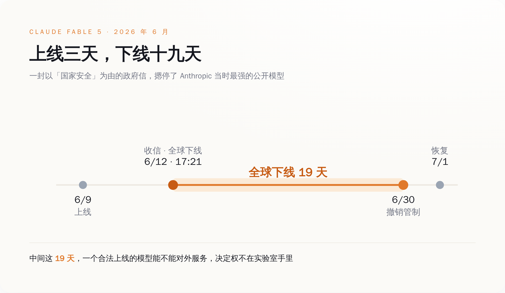
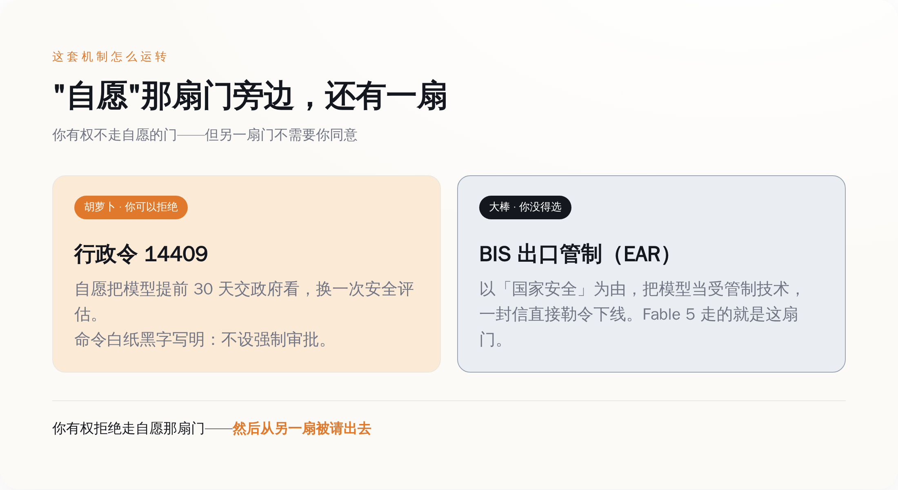
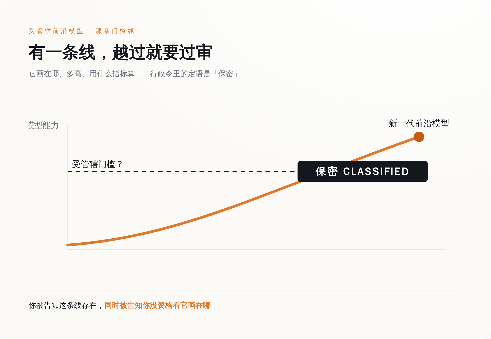

# 管你模型能不能上线的那道闸，写着"自愿"俩字，Claude 最猛的模型照样被关了 19 天

> **发布日期**：2026-08-22 | **分类**：AI 深度报道

2026 年 6 月 12 日，星期五，下午五点二十一分，Anthropic 收到一封信。

发信的是美国政府，落款的理由是国家安全。要求写得很具体：立刻停止向所有非美国公民提供 Claude Fable 5 和 Claude Mythos 5 的访问，不管这个人坐在地球上哪个角落。

*Claude Fable 5 从上线到恢复整整 19 天，一个合法模型能不能对外服务，决定权不在实验室手里。*

Fable 5 是 Anthropic 当时最强的公开模型，三天前——6 月 9 日——刚上线，每百万 token 输入 10 美元、输出 50 美元，上下文一百万。从上线到收信，中间隔了整整三天。

麻烦在于，一个 API 服务没办法在你敲下回车的那一刻，实时验明你是哪国国籍。既然核不出谁是非美国公民，那就只能一刀切：Anthropic 把 Fable 5 和 Mythos 5 对全世界所有人下线，包括美国人自己。

然后就是 19 天。

## 你造的模型，开关不在你手里

这件事最该让人坐直的地方，不是"被政府管了"，是被管的那个姿势。

Anthropic 没犯法。它按流程发布了一个通过内部安全评估的模型，明码标价，公开上线。三天后一封信来了，它照办，全球下线自己卖得最贵的产品，一关 19 天——期间每天都在烧钱、掉用户、被对手抢客。它做错了什么？什么也没做错。它只是不再是那个能决定"我的模型现在要不要对外服务"的人了。

（补一句背景：政府这封信针对的，是一个被发现的越狱方法——有人找到了绕过 Fable 5 安全防护的路子。Anthropic 事后配合政府重新训了安全分类器。这是 Anthropic 自己在声明里说的。）

**按下上线键的那只手，和松开这只手的权力，第一次被分给了两个人。**你负责把手放上去，华盛顿负责决定它什么时候必须拿开。

到 6 月 30 日，商务部长 Howard Lutnick 出面，宣布撤销 6 月 12 日那封信里的管制。他的说法是，基于工业与安全局（BIS）对 Mythos 5 和 Fable 5 扩散风险的重新评估，这两个模型的出口、再出口、境内转移不再需要许可证。他还补了一句：过去两周，"我们与 Anthropic 密切合作，分析并批准了 Fable 5"。

批准。一家公司发布自己训练的模型，配的动词是"批准"。7 月 1 日，Fable 5 恢复访问。从下线到恢复，掐头去尾，19 天。

## "自愿"这两个字，是怎么变成摆设的

你大概会以为，把一个商业模型摁下线 19 天，背后总得有一部写得明明白白的强制审查法撑着。

没有。恰恰相反。

管这件事的，是 2026 年 6 月 2 日签署的第 14409 号行政令，三天后登上联邦公报，编号 91 FR 34565。这份行政令里有一句很关键的话，大意是：本命令不授权设立任何强制性的政府许可、审批或预先审查制度，来管理 AI 模型的开发、发布与分发。它甚至专门点明，开发者把模型提前 30 天交政府预看这套流程，是"明确自愿"的。

白纸黑字，自愿。（笑）

那 Fable 5 那 19 天算什么？算另一扇门。

*行政令那扇“自愿”的门你可以拒绝，BIS 出口管制那扇门不需要你同意——Fable 5 走的正是后者。*

行政令这扇门是胡萝卜：你自愿把模型提前 30 天交出去，政府帮你做一遍安全评估，你好我好。你不想走，行，没人拿枪逼你。

另一扇门是大棒，而且它压根不在行政令里——它在 BIS 手上的出口管制条例（EAR）里。政府要摁停你的模型，用不着援引那份"自愿"的行政令，只要以国家安全为由，把你的模型当成一项受管制的出口技术处理就行。Fable 5 走的就是这扇门。所以你确实有权拒绝走"自愿"那扇——然后从另一扇被请出去。

这就叫自愿。

OpenAI 那边客气一点，剧本一模一样。6 月 26 日，GPT-5.6 三档模型（旗舰 Sol、日用 Terra、最便宜的 Luna）先"预览"，访问权只发给约 20 家经政府审查过的机构；应谁的要求？白宫的国家网络主任办公室和科技政策办公室。这么关着，一直关到 7 月 9 日才对所有人开放，中间隔了约两周。Sam Altman 后来跟 CNBC 形容这段审批，用的词是跟高层官员"来回沟通"。

一个把最强模型关了 19 天，一个把新模型攥在手里两周、只给 20 家先看。两家的做法不一样，共同点只有一条：上线的时间表，最后那支笔不在他们手里。

## 那条线画在哪，不告诉你

到这一步，讲道理的人会说：行，要国家安全审查就审查，把规矩挑明，大家照着办不就完了。

规矩确实有。你不能看。

行政令要求，签署后 60 天内——也就是 8 月 1 日之前——由国家安全局、财政部、国土安全部下属的 CISA，加上商务部下属的 NIST，一起搭一套流程，评估 AI 模型的高级网络能力，据此划一条门槛：越过它，你就是"受管辖的前沿模型"，得进审查通道。

这套流程，行政令给它的定语是 classified——保密。

*受管辖前沿模型的门槛线，被行政令定语为“保密”：你被告知它存在，却无权看它画在哪。*

保密的意思是，那条决定你的模型要不要过审的门槛线，画在哪、多高、拿什么指标算，你不知道，你的对手不知道，公众也不知道。它由国家安全局牵头、会同几个白宫办公室一起定，没有公开定义。你被明确告知有这么一条线，越过就得过闸；同时被明确告知，这条线你没资格看。

对一家要砸几亿美元、耗一两年训一个前沿模型的公司来说，这是最难受的一类规矩。它不是"不许做 X"——那还能绕开。它是"有个 X 不许做，但 X 是什么，等你踩上去那天你就知道了"。你只能把模型练出来，交上去，然后等一封信——那封信可能就在某个周五下午五点二十一分到达。

## 这道闸不新，新的是它拦的东西

上市前先过政府这道闸，这件事本身一点不新鲜。

新药进市场前要过 FDA 的上市前批准，无线电设备铺货前要过 FCC 的设备认证，军民两用技术出境前要过出口管制的许可。哪个国家都一样：一件东西在合法进入市场、或者跨境流动之前，先得让政府点个头。这套逻辑跑了几十年，没人觉得奇怪。

AI 这道闸，是把同一套老逻辑，架到了一个它从没管过的东西上——一个像打补丁一样发布、单次训练成本以亿计、上线只要点一下部署键的软件。药和飞机零件愿意在闸前排队，是因为它们造得慢、改得贵、看得见摸得着；一份模型权重可以今天上线、后天更新、大后天就降价，快到监管的节奏根本追不上。于是就有了这么个别扭产物：**一道贴着"自愿"标签的闸，配一根随时能落下的出口管制大棒。**

而这道闸自己，也没那么利索。行政令定的是 8 月 1 日前交出那套保密评估流程。8 月 1 日过去了，到今天快三周，政府没有公开宣布任何一项做完了。（得说清楚：这是"没见到官方宣布"，不等于官方承认没做完。）闸已经在运转——Fable 5 和 GPT-5.6 就是活证据——可那本决定谁过谁不过的规则手册，对外始终是一页空白。

所以那封下午五点二十一分的信，真正的分量不在于它关了 Claude 19 天。在于它当众演示了一件事：2026 年，一个前沿模型能不能活着上线，最后那个开关，已经从实验室的服务器机房，搬到了华盛顿一张你看不见的名单上。

你还是能造模型。**你只是不再能决定，它什么时候、以及到底能不能，真的见到人。**

而那条决定它命运的线画在哪——不告诉你。

---

## 数据来源

- [第 14409 号行政令 · 联邦公报 91 FR 34565（2026-06-05，行政令原文一手）](https://www.federalregister.gov/documents/2026/06/05/2026-11415/)
- [Claude Fable 5 与 Mythos 5 发布说明 · Anthropic 官方文档（一手：上线日期 / $10·$50 每百万 token / 100 万上下文）](https://platform.claude.com/)
- [Anthropic 官方声明：Fable 5·Mythos 5 下线与恢复（一手公司声明：6-12 下午 5:21 ET 政府函件 / 全球下线 / 7-1 恢复 / 共 19 天）](https://www.anthropic.com/news)
- [商务部长 Howard Lutnick 与 BIS：撤销出口管制、"批准 Fable 5"（2026-06-30，政府一手声明）](https://www.commerce.gov/)
- [OpenAI：GPT-5.6（Sol·Terra·Luna）发布与政府审查（公司一手：6-26 限量预览 / 约 20 家受审机构 / 7-9 公开；Altman 对 CNBC "来回沟通"表述）](https://openai.com/)

> 说明：文中"分类基准流程 / 保密门槛 / 60 天期限（8-1）/ 明确自愿、不设强制预审"等条款要点，据行政令正文及国会研究局 CRS 产品 IF13268 归纳，非逐字引用；GPT-5.6 政府闸天数各口径略有出入，文中取"约两周"；8 月 1 日交付截止后未见政府公开成果，系"未见官方公告"的消极推断，非官方确认；历史对照（FDA 上市前批准 / FCC 设备认证 / 出口管制 EAR 许可）为常识性制度对照，未引用具体数字。本文只用一手来源（行政令原文、公司与政府官方声明），不采二手转述作为事实依据。
