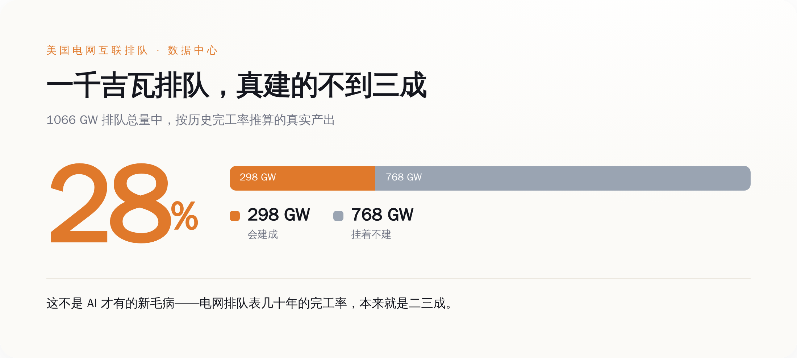
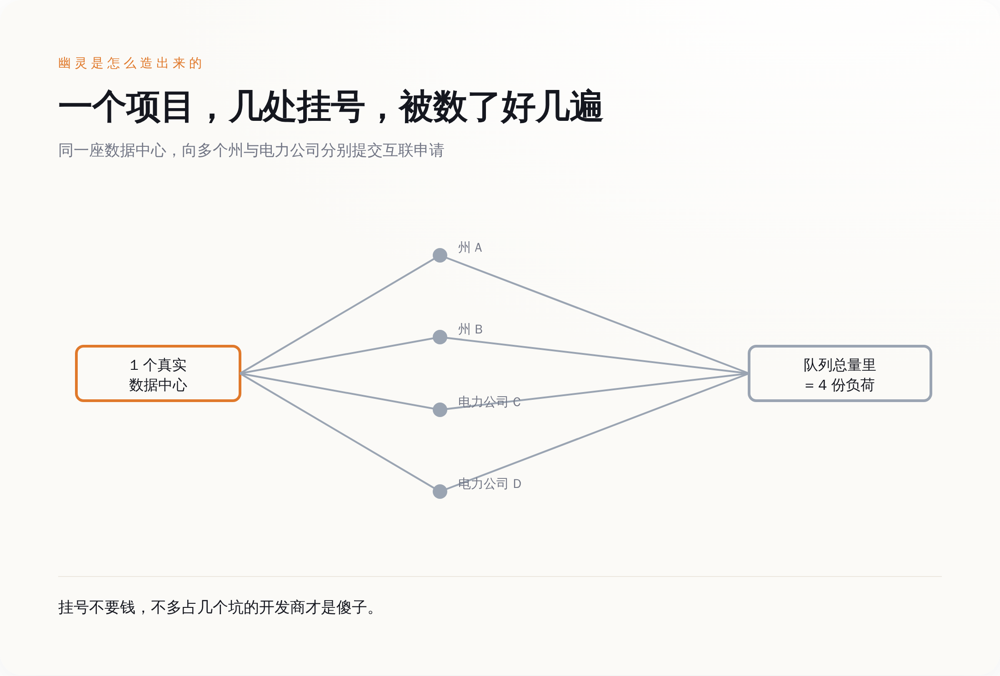
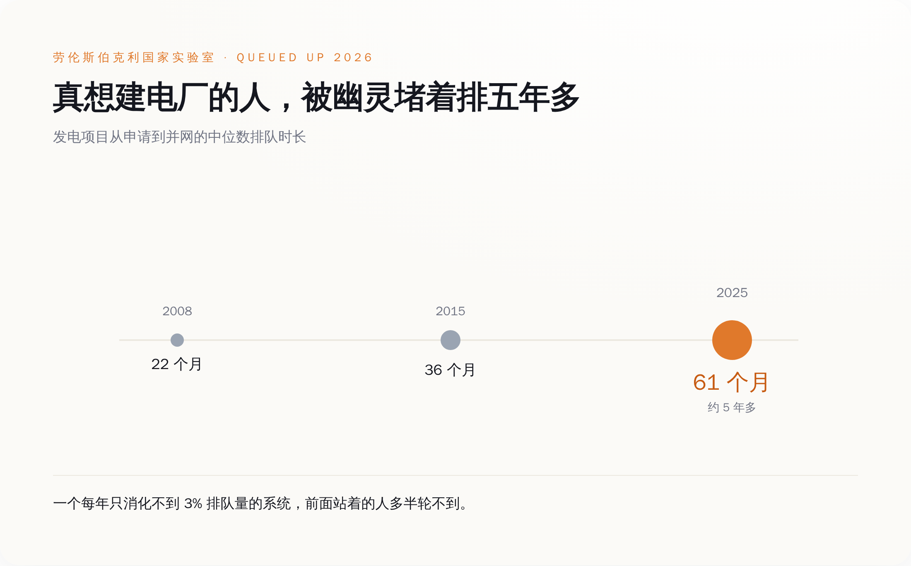
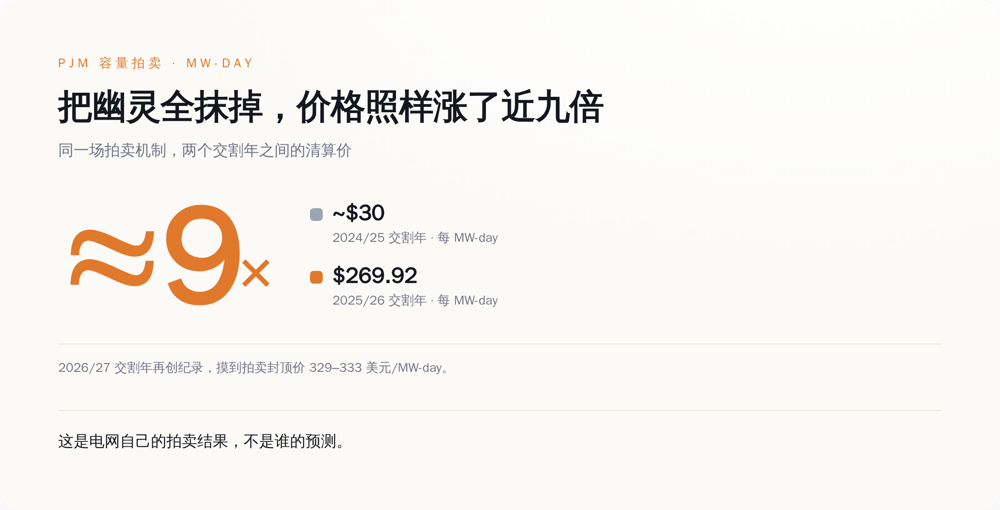

# 一千吉瓦 AI 用电排队，最后真会建的不到三成

> **发布日期**：2026-08-23 | **分类**：AI · 能源

## 导语

德州电网 ERCOT 的大用户排队表上，2025 年底挂着 233 吉瓦的用电申请，七成以上是数据中心。而德州历史上用电最猛的那一刻，全州加起来也就 85 吉瓦。这些人排队要的电，是这个州有史以来峰值的两倍还多。真正接进电网、开始用电的，7.5 吉瓦。剩下那 225 吉瓦，挂在表上，不动。

---

  
🎨

  
概念图占位

  

生成 Prompt
<pre>Editorial photograph, a row of high-voltage electricity transmission towers marching across a vast empty twilight plain toward a single distant half-built data center, most of the fenced land bare and unused with survey stakes in the dirt, long cold shadows, cinematic lighting, shallow depth of field, 85mm lens, muted steel-blue and faint amber dusk tones, quiet sense of overbuilt infrastructure waiting for demand that never came, no people, no text, no logo, no watermark</pre>

## 那个天天上新闻的数字，本身是灌了水的

过去两年，你大概被同一类标题喂了无数遍：AI 太耗电，电网扛不住，美国要缺电了。撑起这类标题的，通常是一个吓人的总量——整个美国电网的互联排队表上（互联，就是项目并进电网前、电力公司要走的那套排队审批），跟数据中心相关的用电申请加起来大约 1066 吉瓦。开头德州那 233 吉瓦，就是这 1066 里最大的一块。做能源咨询的 Wood Mackenzie 把这堆申请过了一遍，给出的判断是：电网公司最后大概只会真正落实其中 28% 左右，约 298 吉瓦。剩下那七百多吉瓦，不会变成任何一台真的在运转的服务器。

要判断这个总量的水分有多大，得先看「互联排队」这套东西几十年来是怎么运作的。劳伦斯伯克利国家实验室每年出一份叫《Queued Up》的报告，盯的是发电和储能项目排队并网的情况——这是电网的供给侧，和数据中心排队要用电的需求侧，本是两条不同的队。但两条队用的是同一套排队制度，也就长着同一种毛病。这份报告 2026 版翻出来的历史账很难看：2000 到 2020 年之间提交过并网申请的发电容量，按吉瓦算，截至 2025 年底只有 13% 真的建成投运；按项目个数算是 19%；有 75% 的申请，中途撤回，人间蒸发。

发电侧几十年的完工率就卡在二成上下，说明「排队表」从来不是「即将建成清单」，更接近「有人动过念头清单」，这不是 AI 来了才有的新毛病。数据中心的用电排队是这两年才冒出来的新东西，可它接的是同一套制度：挂号几乎免费。Wood Mackenzie 对需求侧那 1066 吉瓦给出的 28% 兑现判断，和发电侧几十年 13% 到 19% 的完工率，是同一种病在两条队上的两次发作。

报道电荒的时候，用的是清单顶上那个总量；而这个总量，按排队制度几十年的规律，本来就注定要蒸发一大半。你拿一个注定蒸发七成的数字去论证「电不够用」，论证过程本身就先漏了。

*1066 GW 排队里，历史完工率下真正建成的不到三成，剩下七成大概率只是占着队伍的位置。*

## 幽灵是怎么造出来的：一个项目，几个州，同时挂号

要理解这些水是怎么来的，得看开发商在选一个数据中心厂址时，实际上在干什么。

一个 AI 园区，几百上千兆瓦的电，选址的时候有一大堆变量没定：哪个州给的税收减免多，哪家电力公司能最快拉来电，哪里的电价便宜，哪里的地便宜，哪里的政府批得快。这些答案在拍板之前都是未知数。而提交一份互联申请这个动作，长期以来几乎不要钱，也几乎不用交定金。

于是理性的做法就只有一个：挨个挂号。同一个项目，向三四个州、七八家电力公司，分别提交互联申请，先把位置都占上，最后再从里面挑一两个真的开工，剩下的直接放弃，或者干脆挂在那儿不管，变成僵尸申请。

在电力公司的统计表里，这一个项目，就被记成了三四份彼此独立的「新增负荷」。一个真实的数据中心，在总量里显示成三四个。全国几千个开发商都这么干，加起来的总数，自然就离谱。

*同一座数据中心向多个州和电力公司分别挂号，在全国排队总量里被算成了四份负荷。*

宾夕法尼亚的电力公司 PPL Electric，自己在给投资者的披露里承认了这件事的荒诞程度：它的互联队列里挂着大约 20 吉瓦「已签约」的大负荷，而它整个系统历史上用电最高的那一刻，只有 7.8 吉瓦。排队要的电，是它扛过的最大负荷的两倍半。PPL 自己都在披露里写明白，这里面藏着搁浅资产、成本收不回、要其他用户交叉补贴的风险。**一家电力公司主动告诉投资者「我这排队表可能是假的」，你就知道这数字虚到了什么份上。**

## 为什么以前没人管：因为挂号不要钱

**一个不要钱的号，永远会被挂满。** 这不是道德问题，是这套制度自己算出来的必然结果。

挂一个互联申请，过去的成本低到可以忽略，而占住一个好位置的潜在收益极高。任何一个不挂满号的开发商，都是在把便宜的选择权白白让给对手。所以你不能怪开发商投机——在一个挂号不要钱的系统里，不投机的人才是傻子。系统奖励虚报，那大家就都虚报，仅此而已。

代价是把整条队伍堵死。伯克利那份报告显示，2025 年真正完成并网的项目，在队列里排的时间中位数是 61 个月，五年多。而这个数字在 2015 年是 36 个月，2008 年是 22 个月。十七年，排队时间涨了将近两倍。电网公司要为队列里每一个申请做互联研究、算潮流、评估影响，哪怕其中大部分最后会消失。真心想建电厂的人，被一大群占着坑不动的幽灵堵在后面，一堵就是五年。

*幽灵占坑不动，把真想建电厂的人越堵越久——中位数排队时长从 2008 年的 22 个月拉长到 2025 年的 61 个月。*

顺着发电侧这条队再看一个数字：2025 年底，全美活跃的并网排队项目大约 8200 个，合计 1312 吉瓦发电加 749 吉瓦储能；而这一整年，真正接进电网的，53 吉瓦。吞吐率约为存量队列的 2.6%。一个每年只能消化自己不到 3% 的队伍，前面站着的人，绝大多数这辈子都轮不到。

## 监管终于开始卖门票了

真正值得写进新闻、但基本没上过热搜的转折，是过去这一年，监管机构和电网运营商，开始给挂号这件事标价了。

2026 年 6 月 18 日，美国联邦能源监管委员会 FERC 依据《联邦电力法》第 206 条，向 PJM、MISO、ERCOT 等六大区域电网组织发出「举证责任令」（Docket RM26-4），要求它们证明现行规则到底扛不扛得住大负荷的高效接入，扛不住就得交修改方案。这不是一句空话，配套的动作已经落地：

- **PJM** 的加急互联通道，一年最多只受理 10 个 250 兆瓦以上的大项目，前提是你得握有 100% 的场地控制权、拿得出州级选址部门的建设进度承诺，外加交 5 万美元研究定金和每兆瓦 1.5 万美元的准备金。一个 500 兆瓦的项目，光押金就是七百多万美元。
- **MISO** 把前期押金翻倍，还加了自动罚没：一个 200 兆瓦的储能项目，开工研究前得先押约 190 万美元，中途在并网谈判阶段退出，最高被罚没 160 万美元。
- **德州** 干脆在 2025 年 6 月立了法（SB6），要求开发商证明自己真握有地块的所有权或租约、并缴纳前期费用——不过新规要等审批流程走完才挤得出水，那 233 吉瓦短期内还降不下来。
- **俄亥俄** 的公用事业委员会在 AEP Ohio 那桩案子（Case No. 24-508-EL-ATA）里裁定，25 兆瓦以上的新数据中心客户，必须签 12 年长约，并且按申报容量的 85% 保底付费——哪怕实际没用那么多电，这笔钱也得掏。

这几条规矩，本质是同一个动作：把挂号从免费改成收费，从口头改成压真金白银。你想占坑，可以，先把钱压上；不建，钱没收。这一下就把「多挂几个号总不亏」的算盘打穿了——现在多挂号是真的会亏。

AEP Ohio 那条 85% 保底付费的条款一出，亚马逊、谷歌、Meta、微软联手俄亥俄的制造商协会一起反对，说这是惩罚性条款。翻过来就是：过去他们习惯了免费保留灵活性，想在几个地方都占着坑、随时能走；现在电力公司要他们为这份灵活性付费，他们不乐意了。谁不乐意，谁就最可能是那个在多处挂号的人。

## 别急着高兴：剩下那三成，是真的，而且真得吓人

到这里如果你的结论是「原来 AI 电荒全是编的」，那你又被另一个极端骗了。

幽灵是真的，但把幽灵挤掉之后，剩下那 28% 的真实增量，本身就是一个史无前例的数字。看电网自己的钱包最诚实。PJM 的容量拍卖——电网为了保证未来有足够发电备用而预先付的钱——2025/2026 交割年拍出了 269.92 美元每兆瓦日（也就是每保留一兆瓦备用、每天要付的价），比上一年涨了将近九倍；2026/2027 交割年再创纪录，冲到 329 到 333 美元每兆瓦日，直接顶到价格上限。而即便花了这么多钱，PJM 这轮实际买到的备用容量，还比它自己定的 20% 备用目标少了大约 6625 兆瓦。

*就算把幽灵全部抹掉，剩下的真实增量已经把 PJM 容量拍卖价格从一年前推高了近九倍。*

这是电网运营商自己的拍卖结果，不是谁的预测。它的独立市场监察官把数据中心负荷点名为价格飙升的头号推手。就算你把那七百吉瓦幽灵全部抹掉，剩下真会建成的那部分，已经足够把美国最大的区域电网逼到备用线以下。

德州那边也一样。据 EIA 测算，2025 年 ERCOT 的大型灵活负荷——主力就是数据中心——实际用电大约 540 亿千瓦时，比 2024 年涨了近六成，占到 ERCOT 全部用电的一成左右。这部分是已经真实发生的用电，不是排队表上的意向。它反过来说明：真实需求本身已经这么猛，而排队表还在它上面又叠了三四倍的水。

真相就卡在中间——一个被严重高估的总量，罩着一个已经足够吓人的真实内核。

## 谁买单：账单已经在涨了

幽灵负荷不会自己消失，它消失之前，得有人为它多建的电厂、多拉的电线埋单。这笔账现在正从两个方向落地。

一个方向是普通人的电费。弗吉尼亚是全美数据中心最密集的地方，那里的电力公司 Dominion，2025 年 11 月拿到州公司委员会批准的新费率：普通住宅用户的月账单，2026 年起每月多掏约 11.24 美元，2027 年再加 2.36 美元，到 2027 年一个月要多掏十三块六上下。同一份裁决里，委员会还专门给 25 兆瓦以上的大用户新设了一个费率类别 GS-5，2027 年 1 月 1 日生效——等于监管机构承认，大用户得单独拉出来算账，不能再让居民不明不白地替他们分摊。

另一个方向是把成本按住不让它外溢。2026 年 3 月 4 日，白宫拉着亚马逊、谷歌、Meta、微软、OpenAI、甲骨文、xAI 七家公司，签了一份「电价保护承诺」，内容是这些公司同意自己出钱建或买新增发电、自己承担数据中心那部分的电网升级成本，不把账转嫁给普通居民。

这份承诺读起来很体面，只有一个小问题：它是自愿的，没有任何强制约束力。七家全球最有钱的公司，郑重承诺不把成本转嫁给你——用的是一份谁都不用真正对它负责的文件。至于真到了那天，钱到底压在谁头上，是股东，是这份自愿承诺，还是你那张每月十几块起跳的电费单，这份文件一个字都没锁死。

## 数据来源

- [Wood Mackenzie: Newly added US data center capacity slows in Q4 2025](https://www.woodmac.com/press-releases/newly-added-us-data-center-capacity-slows-down-considerably-in-q4-2025-as-market-struggles-to-keep-up-with-explosive-demand/)
- [Lawrence Berkeley National Laboratory: Queued Up — 2026 Edition](https://emp.lbl.gov/publications/queued-2026-edition-characteristics)
- [FERC Docket RM26-4: Large Load Interconnection](https://www.ferc.gov/news-events/news/ferc-act-large-load-interconnection-docket-june-2026)
- [Texas SB6 (2025) — Large Load Interconnection](https://capitol.texas.gov/BillLookup/History.aspx?LegSess=89R&Bill=SB6)
- [PUCO Case No. 24-508-EL-ATA — AEP Ohio Data Center Tariff](https://puco.ohio.gov/news/puco-orders-aep-ohio-to-create-data-center-specific-tariff)
- [Virginia State Corporation Commission — Dominion Rate Case](https://scc.virginia.gov/)
- [White House Fact Sheet: Ratepayer Protection Pledge (March 2026)](https://www.whitehouse.gov/fact-sheets/2026/03/fact-sheet-president-donald-j-trump-advances-energy-affordability-with-the-ratepayer-protection-pledge/)
