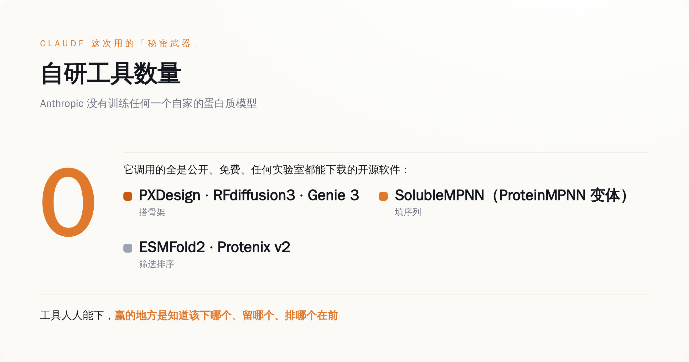
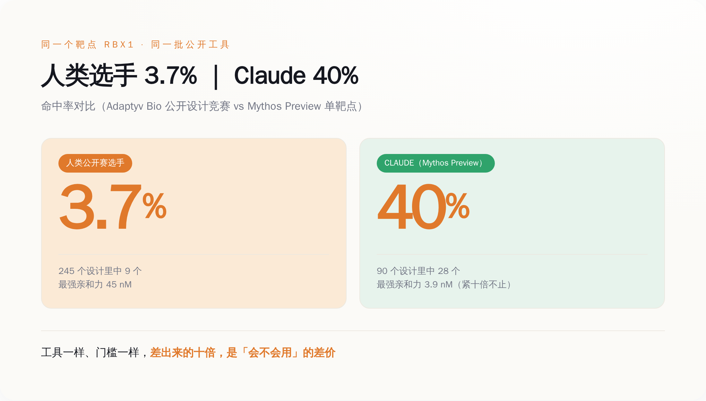
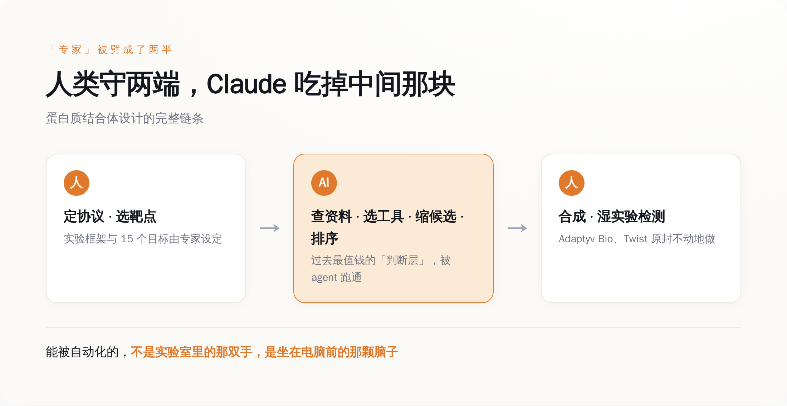

# Claude 设计的蛋白质，15 个靶点中了 14 个——可它一个工具都没发明，用的全是你也能免费下载的开源软件

> **发布日期**：2026-08-23 | **分类**：行业观察

## 导语

先说结论，省得你划走：这条新闻真正吓人的地方，不是「AI 会设计蛋白质了」，而是它设计蛋白质用的东西，你电脑上也能装。

2026 年 8 月 18 日，Anthropic 甩出一份技术报告，说自家的 Claude 自主设计了一批蛋白质结合体，扔进真实的湿实验室里合成、检测，结果 15 个靶点里有 14 个至少命中了一个能用的设计。你可能对这个数字没概念，那我换个说法：这一行的老师傅们平时的命中率是一到一成半，Claude 干到了两成二到三成半。

然后我去翻它到底用了什么秘密武器。翻完人傻了。

一个秘密武器都没有。

  
🎨

  
概念图占位

  

生成 Prompt
<pre>an abstract minimalist visualization of a small protein binder molecule locking precisely onto a large target protein surface, glowing connection point, floating open-source software toolboxes and code fragments in the background, flat design, tech illustration, single orange accent color on cool grey palette, no text, no labels, clean white background</pre>

## 一、先把牛皮吹破一半，剩下那一半才值得看

这种新闻的标准剧本，你我都熟。第一天是「AI 攻克蛋白质设计，人类攻克疾病指日可待」，第二天是「所以某某癌症要被治好了？」，第三天股票涨一波，第四天没人记得。

所以我们先按 Anthropic 自己说的来，把话说死。

Anthropic 在报告里白纸黑字写了一句：**结合体不是药**（protein binders are not drugs）。做出一个能牢牢咬住目标蛋白的分子，只是新药研发这条几公里长的路上的第一步。后面还有能不能进细胞、有没有毒、身体会不会一脚把它踢出去、能不能量产、临床三期烧不烧得起钱——每一关都能让 99% 的候选分子当场去世。所以谁要是拿这条新闻告诉你「Claude 要治好阿尔茨海默了」，你可以直接拉黑他，他不是蠢就是想骗你接盘。

把这层泡沫戳破之后，剩下的那点硬东西，反而更有意思。

它到底做了什么，得说清楚。这次的活儿叫「de novo 蛋白质结合体设计」，翻过来就是：给你一个靶点蛋白（比如某个跟癌症、跟老年痴呆有关的蛋白），你要从零画出一个全新的、自然界里不存在的小蛋白，让它能精准地贴上去、咬住。这活儿难就难在「从零」——不是照着已有的抄，是凭空造一把只配这一把锁的钥匙。

这一批，Claude 用两个模型（Claude Opus 4.8 和一个叫 Mythos Preview 的预览版）在 15 个有临床价值的靶点上跑。这些靶点不是随便挑的软柿子：PD-L1，癌症免疫治疗里最核心的那个刹车蛋白；TREM2，跟阿尔茨海默死磕的；TNFα，年销一度冲到两百亿美元的修美乐（Humira）咬的就是它；EGFR，肿瘤圈的老熟人。硬骨头。

跑下来，一共交出 1320 个设计，湿实验确认了 354 个真的能咬住。命中率我给你摆全：多臂并跑的 48 小时里，Opus 4.8 是 22.6%，Mythos Preview 是 26.7%；等到让 Mythos Preview 单挑一个靶点、给它 24 小时，命中率飙到 35.1%。而这一行公开承认的平常水平，是 10% 到 15%。

数字很漂亮。但漂亮的数字满地都是，我不是来给你念成绩单的。我关心的是另一个问题——它凭什么？

## 二、我去查它的秘密武器，结果查出一张免费软件清单

一般人的第一反应是：Anthropic 肯定偷偷练了个专门搞生物的超级模型。这么想很合理，也很符合我们对「大厂放大招」的想象。

现实是，没有。

Anthropic 没有训练任何一个自己的蛋白质模型。Claude 在这件事里的身份，说穿了是个「会自己动手装软件、自己读说明书」的操作员。它干的活儿是：拿到靶点之后，自己去查这个靶点的资料，自己决定该调哪些工具，自己把工具装上、跑起来，再从跑出来的一堆候选里自己挑、自己排序，最后把选中的序列打包，交给实验室去合成。

那它调的都是些什么工具？我把清单抄给你，你感受一下这个「秘密」有多秘密——

搭蛋白质骨架用的：PXDesign（贡献了 358 个设计）、RFdiffusion3（267 个）、Genie 3（185 个）、FreeBindCraft（135 个）、BoltzGen（134 个）、RFdiffusion（118 个）、Proteina-Complexa（100 个）。往骨架上填氨基酸序列，主要靠 SolubleMPNN，这是知名工具 ProteinMPNN 的一个变体。最后筛选和排序候选，用的是 ESMFold2、ESMFold2-Fast 和 Protenix v2。

这张清单里，没有一个是 Anthropic 家的。全部是这个领域早就摆在那儿、公开、免费、任何一间实验室、任何一个研究生都能下载来用的开源软件。

*图注：Claude 手里没有一件自研武器，它调用的全是这个行业公开免费的开源工具——真正稀缺的从来不是工具。*

这意味着什么？意味着这场胜利里，「工具」这一项的贡献，理论上等于零。因为这些工具，跟 Claude 竞争的每一个人类专家，桌上都有一套一模一样的。大家用的是同一批锤子、同一批钉子。

那 Claude 到底赢在哪了？

## 三、同一个公开赛，同样的工具，它是人类选手的十倍

光说命中率高，你可能觉得是 Anthropic 自己关起门来跟自己比，那不算数。所以这次最狠的一刀，是它敢去跟人类同台。

负责做湿实验验证的公司叫 Adaptyv Bio，它之前办过一个公开的蛋白质设计竞赛，全世界的研究者都能报名，用的就是前面那批开源工具，去挑战一个叫 RBX1 的靶点。人类选手们下场，最后的命中率是 3.7%。

Anthropic 让 Mythos Preview 单挑同一个 RBX1，命中率 40%。

我怕你划得太快没算过来，我再摆一组更具体的：面对 RBX1，Claude 交了 90 个设计，中了 28 个；那场人类公开赛，全体选手一共交了 245 个设计，中了 9 个。它用三分之一的产量，中出了三倍的结果。而且不只是「能咬住」，是「咬得死死的」——Claude 设计出的最强那个结合体，亲和力做到了 3.9 纳摩尔，而公开赛冠军是 45 纳摩尔（这个数字越小咬得越紧，3.9 比 45 强了十倍不止）。

同样的靶点，同样能下载的免费工具，人类是一批，Claude 是一个。差出十倍。

*图注：RBX1 靶点，同一批公开工具、同一个公开赛的门槛，人类选手命中 3.7%，Claude 命中 40%——差距不在工具，在用工具的判断。*

到这一步，那个真问题就藏不住了。

如果工具是免费的、公开的、大家都有的，那 Claude 多出来的那十倍，只可能来自一个地方：**知道该用哪个工具、知道哪个候选该留哪个该扔、知道该按什么顺序把它们排出来。**

这套东西，过去有个统一的名字，叫「经验」，或者叫「专家的判断力」。它不写在任何一个软件的说明书里，它长在一个干了十几年的老师傅脑子里。你把 RFdiffusion 和 ESMFold 免费送给一个刚入行的研究生，他也做不到 40%，因为他不知道这七八个骨架工具里这次该信哪个，不知道跑出来一千个候选里哪几十个值得往下走。

Claude 这次真正干成的事，是把这套「长在脑子里、说不清道不明」的判断，跑通了一遍。

## 四、专家这个职业，被 Claude 当场拆成了两半

我们过去理解一个「专家」，是把他当成一个不可分割的整体：他既有判断力，也会动手。你请他来，是这两样一起买的。

Claude 这次干的事，等于当着所有人的面，把「专家」这个词，沿着中间劈开了。

一半是判断层：查资料、定策略、在一堆工具里选、在一堆结果里挑、排优先级。另一半是操作与验证层：真的把分子合成出来、真的放进试管里测它咬不咬得住。

你去看这次的分工就明白了。人类专家保留了什么？他们定下了整个实验的协议和框架（agent 是在专家设定的 protocol 下跑的），他们挑定了那 15 个靶点，以及——最关键的——他们守住了湿实验那一端：真正的合成和检测，是 Adaptyv Bio 和 Twist Bioscience 两家专业的合同实验室干的，而且是拿到 Claude 的设计后原封不动地做，一个字没改。

那 Claude 吃掉了哪一半？正中间那一整块判断层。查靶点、选工具、缩候选、做排序——这些过去被认为最值钱、最需要「悟性」、最不可能被自动化的活儿，被一个通用大模型当成一个多步骤的软件任务，跑完了。

*图注：人类守住了定协议、选靶点和湿实验两端，Claude 吃掉的是过去被认为最值钱的中间判断层。*

这件事之所以让我后背发凉，是因为它根本不只关生物学的事。

把「蛋白质设计」这四个字换掉，换成任何一个「有一套公开的专业软件 + 一套只在老师傅脑子里的使用经验」的行业，这个故事一字不改都成立。做芯片版图的 EDA 工具是公开的，会不会用是手艺；做建筑结构的有限元软件是公开的，会不会调参是经验；律师检索判例的数据库是对所有人开放的，知道搜什么、信哪条是本事；财务建模的 Excel 谁都有，会不会搭那个模型才是饭碗。

我们这代人被反复教育的一句安全咒语是：「别怕 AI，学会用工具的人不会被淘汰，会用 AI 的人淘汰不会用的人。」这句话现在得改了。因为 Claude 这次证明的恰恰是——当工具本身是公开的，「会用这个工具」这件事本身，可以被一个通用模型学走，然后免费送给所有人。到那天，「我会用而你不会」这句话背后的溢价，就开始蒸发了。

## 五、设计变便宜之后，钱会往哪儿流

拆穿一件事的成本结构，最后总得落到「那谁赚钱」上，不然都是空谈。

这局里有两家公司很值得看：Adaptyv Bio 和 Twist Bioscience。它们干的是最不性感的活儿——把别人设计好的蛋白质，真的用生物手段造出来，再放进试管里测一测到底行不行。设计端现在被 AI 摁到地上摩擦、成本无限往下掉，可「造出来 + 测一测」这一端，还得靠真实的细胞、真实的试剂、真实的时间。你 AI 一秒钟能吐一万个设计，但每一个都得有人真金白银地去合成、去检测，才知道是不是吹的。

设计越不值钱，验证就越值钱。水从高处流到低处，钱从被自动化的环节流到还没被自动化的环节。这也是为什么 Anthropic 这次要把湿实验外包出去——它自己不趟这摊浑水，它要的不是当个药厂。

那 Anthropic 到底图什么？说出来一点都不含蓄。

它把这次的全部东西——所有的设计、所有喂给 agent 的原始 prompt、所有的湿实验测量数据——一股脑全公开传到了 Hugging Face 上，谁都能下。一家公司，做出了这么亮眼的成果，转头把配方全给了你。反常识吧？

不反常识。因为 Anthropic 卖的从来不是这批蛋白质，甚至不是这次的方法。它卖的是一句广告词，而这次实验就是这句广告词的证据：**你那套需要多年训练、外人插不进手的专业判断，一个通用模型加一堆免费工具，就能跑到你的两三倍。** 全套数据公开，是为了让你没法说它造假——它要的就是你信这句话，信到愿意为「让 Claude 当你的专家」去付订阅费。

## 六、你该睡不着的那部分

说回开头那个吓人的地方。

这条新闻真正的分量，不在「AI 会造蛋白质」——那是给外行看的标题。它的分量在于：Claude 没有发明任何工具，它用的东西你也下得到，它赢的地方是知道该怎么用。而「知道该怎么用」，恰恰是过去几乎所有专业人士，用来解释「我为什么值这个价」的那个理由。

工具早就免费了，稀缺的一直是用工具的判断。Claude 这次不是造出了什么新武器，它只是把最后这道护城河——「会用」——也抽干给你看了一遍。

至于抽到你这行没有，这次没有不代表下次没有。你可以先去数数，你的本事里，有多少是「我会用这套软件而别人不会」。这个数字，就是你该开始睡不着的那部分。

## 数据来源

- [How Claude is accelerating protein design and analytical chemistry（Anthropic 研究页）](https://www.anthropic.com/research/Claude-accelerates-protein-design)
- [Autonomous de novo protein binder design with Claude（Anthropic 技术报告 PDF）](https://www-cdn.anthropic.com/30bf50e22a01388bb29bf077ee3f244531594b7a.pdf)
- [Benchmarking Claude's protein designs in the wet lab（Adaptyv Bio 案例研究）](https://www.adaptyvbio.com/blog/anthropic-1)
- [claude-protein-binder-design 数据集：全部设计、prompt 与测量数据（Hugging Face）](https://huggingface.co/datasets/Anthropic/claude-protein-binder-design)
