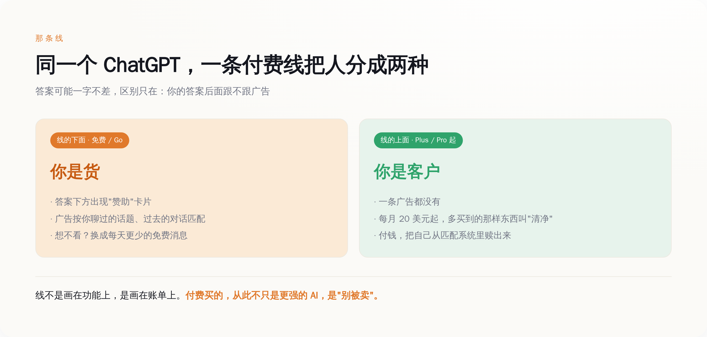
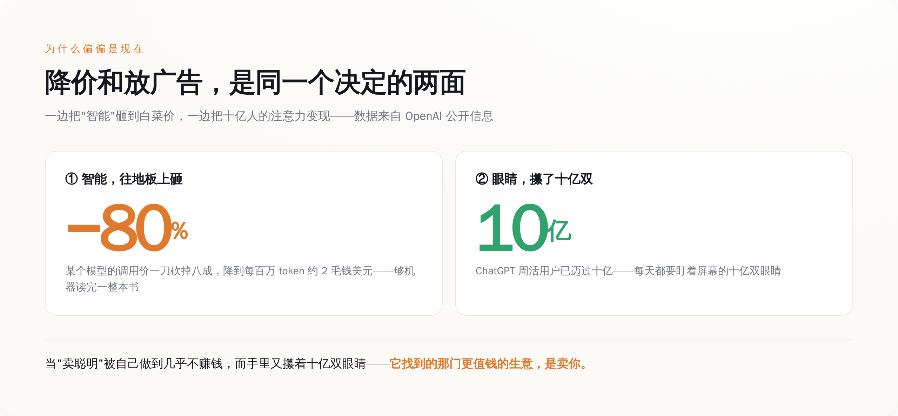

# ChatGPT 今天开始在答案下面放广告，只放给免费用户——付费买的，从此是"别被卖"

> **发布日期**：2026-08-24 | **分类**：AI 前沿

今天是星期一。如果你在德国、法国、西班牙这些地方用免费版的 ChatGPT，你大概率会在某个回答的下面，看到一小块灰色的卡片，角上标着"赞助"。

如果你是付费用户，你什么都没看到。

这块卡片看不看得见，取决于你给不给钱。而这件事本身，比卡片里卖什么，重要得多。

  
🎨

  
概念图占位

  

生成 Prompt
<pre>a person looking at a glowing screen in the dark, a small price tag reflected in their eyes, minimalist conceptual illustration, tech style, muted blue and grey palette, no text, no labels, clean background</pre>

## 今天到底发生了什么

先把事情说清楚，不带情绪。

8 月 24 日，OpenAI 把 ChatGPT 里的广告，一次性铺到了 31 个欧洲国家——德国、法国、西班牙、意大利、瑞典、挪威、丹麦、荷兰、奥地利……这是它这门年轻广告生意到目前为止最大的一次扩张。

广告长什么样，OpenAI 自己写得很细：出现在回答下方，做成单独的卡片，明确标注"赞助"，和正文答案在视觉上分开。谁能看到？只有免费版（Free）和最便宜的 Go 档的用户。掏钱升到 Plus、Pro、Business、Enterprise、Edu 的，一条广告都不会有。未成年人也不给看。

这不是从今天才开始的。往前翻，2 月 9 日 OpenAI 就在美国上线过一模一样的东西——免费和 Go 两档看广告，先拿本土用户试水。今天这一下，是把在美国跑通的模式，搬到了欧洲。

所以真正的新闻不是"ChatGPT 有广告了"，那是半年前的旧闻。真正的新闻是：这个在美国跑通了的模式，如今被判定为值得往全世界铺开。

## 那条线

现在把注意力从广告卡片本身，挪到一个更安静的地方——那条决定谁看广告的线。

这条线不是画在功能上，是画在账单上。线的下面，是免费用户和只花小钱的 Go 用户；线的上面，是每月掏二十美元起步的付费用户。同一个 ChatGPT，同一批模型，同样的问题问过去，答案可能一字不差。唯一的区别是：下面那批人的答案后面跟着广告，上面那批人的不跟。

把这条线看明白，你就看懂了这次的全部。

**线的下面，你不是用户，你是货。**

广告要卖给广告主，卖的从来不是那块卡片，是看卡片的那双眼睛。OpenAI 说得很直白：广告怎么匹配？看你当前聊天的话题，看你过去的对话，看你过去点没点过广告。翻译成人话就是，它拿你聊过的东西，去给你配一条最可能让你掏钱的广告。在欧洲，因为有 GDPR 管着，这种个性化匹配得先经你明确同意——但"同意"这个动作本身，恰恰证明了被拿去用的是什么。

线的上面，你是客户。你每月付的那笔钱，买的是更高的用量、更强的模型，现在还多买到一样东西：**清净。** 你付钱，把自己从那套匹配系统里赎了出来。

*图注：同一个 ChatGPT，一条付费线把人分成两种——线下面是被卖的货，线上面是花钱赎身的客户*

OpenAI 还留了个更诚实的小口子：你可以选择不看广告，代价是每天能免费发的消息更少。

品品这个选项。它等于把话挑明了摆上桌：想白用我，你总得付点什么。要么付钱（订阅），要么付注意力（看广告），要么付用量（换更少的额度）。三种货币，随你挑，但都得付，而且付的都是你自己身上的东西。

**免费从来不是没有价格，只是这个价格不写在账单上。**

## OpenAI 急着撇清的那句话

这次公告里，有一句话 OpenAI 说得格外用力，反复强调：广告不会影响答案。

它给的保证很具体：广告系统和聊天模型是两套分开的系统；广告主没有任何能力去塑造、排序、或者改动 ChatGPT 给你的回答；OpenAI 也不会把你对话里的内容交给广告主。

一家公司什么时候会把一句话说得这么满？是它知道你正担心这件事的时候。

想想 ChatGPT 过去凭什么让人放心。你问它一个问题，你默认它给你的那个答案，是它"算"出来的，不是谁"买"下来的。这份默认的信任，是它和满屏竞价广告的搜索引擎之间，最后那点区别。而广告一旦坐到了答案的正下方，这份信任就成了那个被架在火上的东西。

OpenAI 当然懂这个。所以它拼命在广告和答案之间砌一堵墙，反复告诉你墙有多厚。问题是，这条路怎么走，所有人都看过一遍了——当年的搜索广告，一开始也把"自然结果"和"付费结果"分得清清楚楚，后来那条线是怎么一点点模糊掉的，不用我多说。

墙砌得越高调，越说明墙那边压着的东西越沉。

## 为什么偏偏是现在

一个顺理成章的问题：OpenAI 缺这点广告费吗？

某种意义上，它比谁都需要。因为它同时在干另一件看起来矛盾的事——把"智能"本身的价格，往地板上砸。

今年 OpenAI 一路在给自家模型的调用降价，最新的一刀砍下去，某个版本直接降了 80%，降到每一百万个 token 只要两毛钱美元。两毛钱，能让机器读完一整本书。它在拼命让"用 AI"这件事，便宜到接近不要钱。

把这两件事摆在一起看，逻辑就出来了。

一边是十亿人。ChatGPT 的周活用户，已经迈过了十亿这道坎。一边是白菜价的智能。当"卖聪明"这门生意被自己做到几乎不赚钱，而你手里又攥着十亿双每天都要盯着屏幕的眼睛——任何一家公司，都会做同一个选择。

**它把"卖聪明"做到不值钱，不是因为发善心，是因为它找到了一门更值钱的生意——卖你。**

这不是 OpenAI 的发明。Google 走过，Facebook 走过，YouTube 走过。凡是免费给到十亿人用的东西，最后都会走到答案下面那块广告卡片这里，一个都没跑掉。OpenAI 唯一的不同，是它把别人走了十年的路，三年就走完了。三年前，它还是"智能的未来"；三年后的今天，它是"一个可以在答案下面放广告的地方"。

*图注：一边把智能的价格砸到地板，一边把十亿人的注意力变现——降价和放广告，是同一个决定的两面*

## 数据来源

- [ChatGPT Ads expands across Europe（OpenAI 官方公告）](https://openai.com/index/chatgpt-ads-expands-across-europe/)
- [Testing ads in ChatGPT（OpenAI 官方，广告机制说明）](https://openai.com/index/testing-ads-in-chatgpt/)
- [Our approach to advertising and expanding access to ChatGPT（OpenAI 官方，广告理念与分档）](https://openai.com/index/our-approach-to-advertising-and-expanding-access/)
- [Ads in ChatGPT（OpenAI 帮助中心，广告如何匹配与如何关闭）](https://help.openai.com/en/articles/20001047-ads-in-chatgpt)
