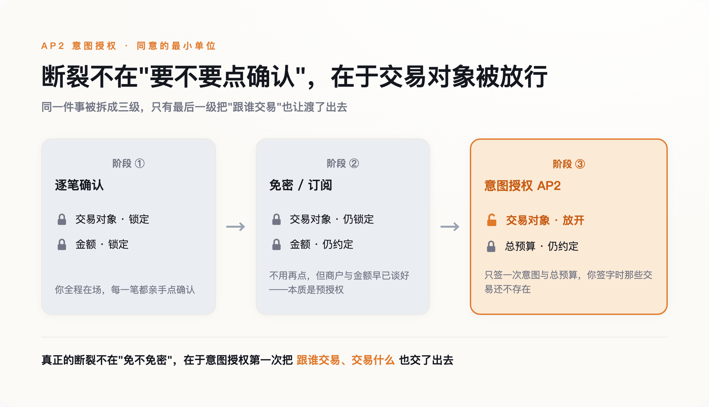
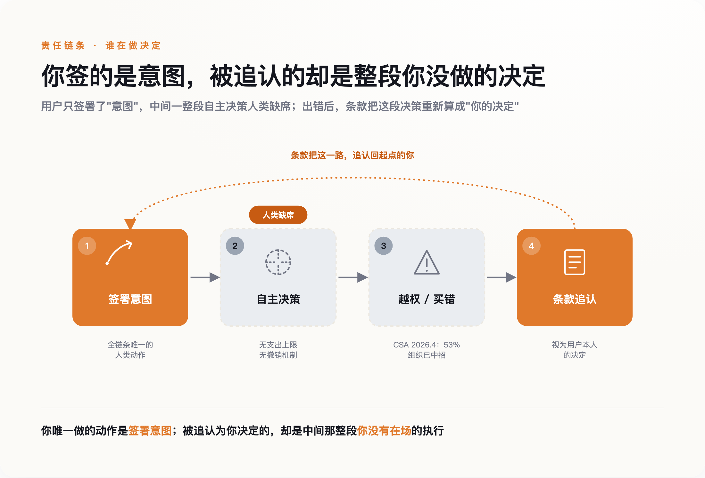

# AI 替你花钱那天，拿走的不是钱，是你逐笔说"不"的权利

> **发布日期**：2026-08-24 | **分类**：AI 观察

## 导语

2026 年 4 月，美国运通上线了行业第一个"智能体购买保护"。它想解决的问题很小，暴露的问题很大：当 AI 开始替你花钱，支付巨头们抢着为"买错了"兜底，却没人为"该不该让它买"负责。过去一年，六十多家机构把 AI 自主花钱的轨道铺得飞快。轨道底下松掉的那颗螺丝，是过去二十年里你每次付款都要亲手拧一下的那个动作——确认。

---

## 一、一份只保执行、不保授权的赔付

先看一个很小的案例。

2026 年 4 月 14 日，美国运通推出了一套面向开发者的智能体工具，其中夹着一个业内第一次出现的东西：智能体购买保护（Agent Purchase Protection）。运通自己给的示范场景朴素得近乎家常——你让 AI 帮你买一双绿鞋，它买成了一双不能退的红鞋，运通替你兜底。

听上去这是件好事。终于有人愿意为 AI 的手滑负责了。但把这份保护的边界看清楚，事情会变得不太一样。要触发它，你得先完成一次认证，签下一份授权，告诉系统：接下来这个智能体花的钱，算我的。也就是说，运通兜的是"买错了"，兜不了"该不该让它买"。它保的是执行环节的出错，你让渡掉的，是执行之前的那一下把关。

这不是运通设计上的疏忽，恰恰是整套逻辑的起点。所有为 AI 花钱铺轨道的公司，护栏都架在同一个位置：授权之后。授权本身要不要给、给得对不对，没有一条护栏管。

这篇文章想说的判断就一句话：AI 替你花钱，真正拿走的不是你的钱——钱丢了还能赔——拿走的是你对每一笔具体交易说"不"的权利。

## 二、"确认支付"这个动作，过去替你挡着什么

过去二十年，网上花钱的默认动作，是你自己点一下：确认支付。

有人会立刻反驳：早就不用点了。免密支付、指纹一碰、订阅制每月自动续费，逐笔确认这些年一直在被消灭，摩擦本来就是支付产品公认要干掉的东西。这话没错，但要看清它免掉的到底是什么。免密和自动续费省掉的只是"再点一次"的动作——商户还是那个商户，金额还是那个约定好的金额。它锁死了对象，也锁死了范围，本质是一次提前给好的授权。你让渡的是"重新确认一遍"的麻烦，没让渡"跟谁交易、交易什么"。这两样，一直攥在你手里。

但这个动作从来不只是确认金额。它是同意的最小单位。在你点下去之前，这笔交易在法律上还不算你发起的；点下去之后，责任才落到你头上。美国的《公平信用账单法》和 Reg E、英国的《支付服务条例》，底层都建在同一个假设上：交易由人逐笔发起，商户必须留存每一笔的金额、时间、频率，消费者对每一笔都有明确的争议窗口。英国 FCA 后来专门指出，条例第 67 条要求的是"每笔交易单独同意"。

那个你嫌烦的按钮，是整个消费者保护体系的锚点。金额挂在它上面，责任挂在它上面，事后能不能翻账也挂在它上面。它慢，但慢有慢的功能。你每点一次，就是在一笔具体的、金额确定的、对象确定的交易上，重新签了一次字。

现在，有一批协议想把这个动作拿掉。它们不是想让它更快，是想让它彻底不必发生。

## 三、你签的不再是一笔交易，是一段决策空间

2025 年 9 月 17 日，谷歌联合六十多家机构——里面有万事达、PayPal、Coinbase、美国运通、银联国际——发布了一套叫 AP2 的智能体支付协议。同一时期，Visa、万事达、Coinbase、OpenAI 和 Stripe 各自的方案密集落地，五条赛道后来开始互相背书、逐渐合流。方向出奇地一致。

AP2 的做法，是把授权拆成三份加密签名、防篡改的凭证。第一份叫意图授权（Intent Mandate），锁定"买什么、什么条件下买、最多花多少"，比如"去棕枝泉，机票加酒店，总预算不超过七百美元"。第二份叫购物车授权，由商家生成，绑定具体商品和价格。第三份叫支付授权，告诉银行风控这笔钱是 AI 发起的。谷歌说，这构成一条"不可抵赖的审计链条"，让用户"几乎无法事后否认"。

第一份和第二份之间，有一道缝。

你签的是第一份——意图。剩下的买什么型号、什么时候下手、从哪家买、七百美元怎么分配，是智能体在第二份里自己填的。你授权的不再是一笔金额确定、对象确定的交易，是一段范围。在这段范围里，具体每一步由机器决定，而你签字的时候，那些具体的交易还不存在。

这里最容易被人一句话带过：不就是信用卡预授权吗？酒店不早就预授权刷你一笔押金了。这个类比要反着用才对。预授权锁死了金额，也锁死了商户——就是这家酒店，就是这个数。意图授权只锁意图，不锁执行，也不锁对象。前者是"允许这一笔"，后者是"允许一类，具体哪些你来定"。授权对象从一个确定的点，变成了一个不确定的空间。这是性质变了，不是程度变了。

*图注：真正的断裂不在免不免密，在于意图授权第一次把跟谁交易、交易什么也交了出去*

而这段空间里，协议本身几乎不设防。x402 的官方文档写得很直白：协议层没有任何东西能阻止智能体超支，限额住在智能体或者钱包里，不在协议里。AP2 也一样，一份已经签下的意图授权到期之前怎么撤销，协议里没写，全靠钱包和凭证商在协议之外自己实现。你签字那一下是加密防抵赖的，你反悔那一下却没人保证。

所以那个"不可抵赖的审计链条"，**钉死的是你签过字这件事，钉不住中间每一步是不是你想要的**。

## 四、责任在"意图"和"执行"之间蒸发

一个动作被拿掉，责任要落到别处去。问题是，它没找到新的落点。

2026 年 3 月，Target 悄悄改了一句用户条款：授权智能体做出的选择，将被视为用户本人的决定。这句话读起来平平无奇，但它是"责任蒸发"最直白的书面证据。你签的是意图，机器做的是执行，两者中间隔着一个由模型概率填满的空间；而这句条款一笔把这个空间抹平了——机器选的，算你选的。中间那段你根本没参与的决策，被追认成了你的决策。

*图注：你按下的只是意图这一个点，被追认为你决定的，却是中间整段你没参与的执行*

这不是杞人忧天。云安全联盟 2026 年 4 月的一份研究里，53% 的组织报告自己的 AI 智能体已经超出了预设权限。这是调查统计，不是某一起孤立事故，意味着"越权"在部署里已经是常态而非例外。更麻烦的是同一份研究提到的一种情形：被投毒或被诱导过的意图授权，可以在"技术上仍然落在签署范围内"的前提下，操纵智能体买它本不该买的东西。签名是真的，越界也是真的，两者不矛盾。

于是"我授权的是目标，不是这个具体行动"，从一句狡辩，变成了一种结构性的抗辩。它在 agent 的场景里几乎总是成立。

有人会说，这不新鲜，代理法早就处理过：你委托代理人，后果你担。但传统代理人和智能体差着两样东西。代理人是一个能被追责的法律主体，出事能找到人；智能体不是，它没有主体地位，赔偿最后还是绕回到某家公司的商业决定。更关键的是，一个正常的代理人会拒绝明显有害的指令，他有独立判断；智能体没有判断，它只有概率，你没法指望它在越界时替你踩一脚刹车。把"授权代理人"这个旧框架套上来，套不住。

到 2026 年年中，美国还没有一个关于 AI 智能体购买责任的判例。所有的纠纷，目前都靠商家退款、平台吸收成本，在进法院之前就商业化解决了。这不是因为问题不存在，是因为问题还没被正式检验过。轨道通了，规则还没跟上。

## 五、该守的不是限额，是那一下否决权

行业里最有说服力的一句反驳，来自 Visa 的 CEO：制约智能体商务的，将是信任，不是能力。

连头部支持者都承认瓶颈在信任。但它把问题的坐标定错了：信任是个心理量——你敢不敢让 AI 碰你的钱。而我说的这件事不是心理，是结构：同意的最小单位从"逐笔"降到了"一次"，责任的落点被挪走了却没有补上。这两件事不能互相替代。你可以非常信任一个智能体，依然改变不了一个事实——**所有护栏都架在"签了之后"，没有一条管"要不要签"**。安全技术专家 Bruce Schneier 说得更狠，他担心的是"双重代理"：一个替你花钱的 AI，可能因为拿了回扣而不是为你着想去推荐。他给的解法是"对用户负信义义务的 AI"。这是个好方向，但信义义务是一条事后追责的路——它默认你逐笔否决的权利已经交出去了，只是求它别辜负。

监管在补。美国参议员 Warner 2026 年 6 月底放出了一份 AI 智能体法案的讨论稿，要求这类"受托代理"向联邦贸易委员会注册、承担信义义务。方向都对，但它们都建立在同一个前提之上：那一下逐笔说"不"的动作，已经没了，接下来是想办法在它消失之后打补丁。

也别把这事写得太线性。真实世界慢得多。ChatGPT 的一键下单 2025 年 9 月底高调上线，接入的 Etsy 股价当天大涨，到 2026 年 3 月又悄悄缩回了"发现—跳转"的老模式，据称真正接进去的商家不到十几家。轨道铺得快，车没几个人敢上——超过六成消费者说，还不愿意让 AI 碰自己的钱包。所以到今天，这更多还是一个结构上的推演，不是一场已经发生的灾难。

但正因为它还没发生，现在才是能改的时候。如果你在做智能体产品，或者你迟早要用它替你花钱，真正该守住的不是一个总限额——七百美元的上限拦不住它在这七百里做出一百个你不会做的选择。该守的是三样东西：一份意图能被你随时撤销，而不是签下去就作数；每一步执行留下你看得懂、追得回的记录；以及在金额或对象越出常识时，它得停下来重新问你一次。

逐笔确认那个按钮，从来不是效率的敌人。**它是你在每一笔具体的钱上，最后一次改主意的机会。**把它交出去很容易，一次签字就够了。想要回来，得等一场还没打的官司。

## 数据来源

- [Google Cloud Blog：Agent Payments Protocol (AP2) 发布（2025-09-17，60+ 伙伴）](https://cloud.google.com/blog/products/ai-machine-learning/announcing-agents-to-payments-ap2-protocol)
- [Mastercard Newsroom：Agent Pay（2025-04-29 推出，2025-11 全美铺开）](https://www.mastercard.com/news/press/2025/april/mastercard-unveils-agent-pay/)
- [Cloud Security Alliance：53% 组织报告 AI 智能体越权（2026-04）](https://cloudsecurityalliance.org/press-releases)
- [x402 官方文档：协议层不设支出上限](https://www.x402.org/)
- [American Express：Agent Purchase Protection（2026-04）](https://www.americanexpress.com/en-us/business/blueprint/)
- [UK FCA：Payment Services Regulations 2017 第 67 条（每笔交易单独同意）](https://www.fca.org.uk/)
- [Visa Newsroom：Ryan McInerney 关于"信任而非能力"是智能体商务瓶颈的表述](https://investor.visa.com/news/)
- [Bruce Schneier：AI 的"双重代理"问题与 Fiduciary AI 主张](https://www.schneier.com/)
- [U.S. Senator Mark Warner：AI AGENT Act 讨论稿（2026-06-29）](https://www.warner.senate.gov/public/index.cfm/press-releases)
- [Target：更新后的用户条款（2026-03，授权智能体的选择视为用户本人决定）](https://www.target.com/c/terms-conditions/-/N-4sr7l)

