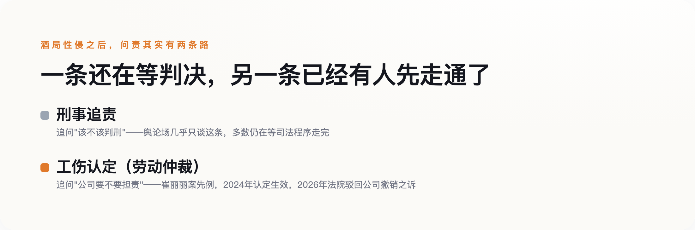

# 酒局性侵案吵得最凶的从来是"这个人渣不渣"，但已经有一个判例，把责任问到了公司头上

> **发布日期**：2026-08-24 | **分类**：社会与法律

## 导语

最近网上又出现一起涉酒局的性侵指控，引发讨论——这类讨论的走向几乎是固定的：先吵这个人渣不渣，再吵受害者当时该不该喝那么多酒，吵到最后不了了之。这篇文章不打算复述任何一起具体案情，因为真正值得追问的问题，从来不在某一起案子的细节里，而在这类案子反复出现的结构里：已经有一份生效的法律判例显示，一起酒局性侵发生之后，除了追问当事人的刑事责任，其实还有另一条问责的路——问责这家公司。

## 一、酒桌上没人敢说"不"，不是因为怯懦，是权力距离在起作用

中央党校学者强舸2019年发表在核心期刊《社会学研究》上的一项实证研究提出过一个反常识的判断：酒文化不是某种该被淘汰的落后风气，而是一套非正式制度，功能是弥补正式治理体系说不清楚的部分——谁在组织里更有分量、谁该敬谁、谁能拒绝谁，这些正式规则写不清楚的位次关系，都在酒桌上被反复演练和确认。**酒局本身就是权力结构的展示场，不是喝酒本身的问题。**

这也能部分解释为什么酒局现场往往"没人阻止"。中欧国际工商学院一篇分析文章指出，中国职场的酒桌文化体现的是"高权力距离"——下级向上级敬酒是默认动作，拒绝或介入需要打破这套默认的位次关系，代价由下级一个人承担。西方经典的"旁观者效应"理论说的是，在场人数越多，个体出手干预的责任感反而越被稀释；这套理论本身没有专门针对中国酒桌场景的本土实证研究（老实说，没查到这方面的本土数据），但把它和"高权力距离"放在一起看，大致能解释一个更具体的现象：酒桌上人越多，反而越没人敢先开口。

## 二、"她为什么喝那么多""为什么不当场反抗"——这套话术有名字，叫荡妇羞辱

几乎每一起酒局性侵的舆论场里，都会出现同一批质疑：受害者当时是不是穿得太少、喝得太多、跟对方走得太近，是不是"自己也有问题"。这套把责任从加害者身上转移到受害者身上的话术，社会学里有专门的名字——荡妇羞辱，核心机制是把受害者和某种"性方面的越界"绑在一起，削弱她的可信度，让公众的注意力从"发生了什么"转移到"她是什么样的人"。

针对这套话术里最常见的两句质疑，已经有明确的反驳依据。"当时为什么不反抗"——生物学研究显示，相当比例的性侵受害者会经历"强直静止"，这是一种进化产生的应激反应，身体在极端威胁下自动僵住，不是默许，也不受意志控制。"为什么不当场报警、事后才说"——创伤后应激反应会让受害人自我评价降低、产生羞耻感，进而推迟披露；据北京安定医院援引的一项调查，遭遇性侵的大学生里，选择报警的比例不到4%。**"沉默"本身就是这类创伤最常见的反应之一，不是"说明没那么严重"的证据。**

## 三、醉酒状态下的"违背意志"，法律认定比想象中更难

2022年修订、2023年1月1日起施行的《妇女权益保障法》第23条明确规定，禁止违背妇女意愿、以言语文字图像肢体行为等方式实施性骚扰；第25条给用人单位列了八项具体义务，包括制定规章制度、设置投诉渠道、建立调查处置程序、保护当事人隐私、协助受害人维权。法律条文不缺，缺的是醉酒场景下的具体认定。醉酒型强奸案的司法认定需要审查三点：被害人的主观意愿、意愿是否被表达出来、行为人是否明知这种意愿。难点恰恰出在这三点上——醉酒后的暧昧言行，比如共同饮酒、事后没有立刻推开，都可能被行为人拿来主张"当时存在性暗示"，这也是这类案件举证困难的根源。这些信号能不能被采信为"性暗示"，恰恰是执法标准的局限，不是受害人行为本身有问题——这也是为什么，除了刑事追责，还需要下一节要谈的另一条路。

## 四、当刑事责任还在等判决，已经有人先赢了另一场官司

在讲这条判例之前先说清楚：它和开头提到的"最近这起"没有关系——这是2023年发生、已经走完行政认定和司法审查的另一起案子，只是提供一条此前很少被提起的问责路径。2023年9月，天津一名女员工崔丽丽受公司指派赴杭州出差，参加商务宴请后醉酒遭公司实际控制人性侵。这起案子走的不是普通人第一反应会想到的刑事诉讼，而是劳动仲裁：2024年12月，天津市津南区人社局认定这起事件构成工伤；涉事公司起诉要求撤销这一认定，2026年被法院驳回。据报道，这是全国首例"因公务饮酒后遭性侵被认定工伤"的案例。

工伤认定解决的是"公司要不要为这起事件担责"这个劳动法维度的问题，不替代、也不影响对加害人本人的刑事追责，两条线本该同时存在——但目前舆论场几乎只谈刑事追责、只吵"该不该判刑"，很少有人想到工伤认定这条路同样能走，也同样能给受害者一个交代。

*图：刑事追责还在等判决的时候，工伤认定这条路已经有人先走通了一次。*

## 五、韩国已经把"劝酒"明确定性为职场骚扰，这条路我们还没走

据2012年韩国性别平等与家庭部的一项调查，87%的受访员工表示酒局中性骚扰很常见，76%的女性受访者提到"被要求坐在男上司身边斟酒"是普遍现象。韩国海军后来推行了"회식지킴이"制度，翻译过来就是"酒局监督员"，在酒局现场安排专人监督，遏止性骚扰的发生；近年韩国法律也把"被拒绝后仍强行劝酒"明确定性为职场骚扰行为本身，不再是一种见怪不怪的"文化"。这不是要照搬另一个国家的具体做法，是提供一个参照——把"劝酒"从一种默许的风俗，变成一个可以被制度约束的具体行为，这件事已经有人先做了。

下次再看到一起酒局性侵的新闻，与其在评论区吵"这个人渣不渣""她当时怎么想的"，不如先问一句：这家公司有没有尽到它该尽的八项义务，这起事件除了刑事追责，还有没有别的问责路径没被走通。**个体的道德审判改变不了酒桌上的位次关系，制度和判例才能。**

## 数据来源

- [《中华人民共和国妇女权益保障法》全文（最高人民检察院）](https://www.spp.gov.cn/spp/fl/202210/t20221030_591251.shtml)
- [女子遭职场性侵致创伤后应激障碍被认定工伤，公司上诉遭法院驳回（新京报）](https://m.bjnews.com.cn/detail/1752843555168703.html)
- [遭职场性侵后这两年，崔丽丽经历的漫长诉讼（澎湃新闻）](https://m.thepaper.cn/newsDetail_forward_31696059)
- [醉酒类强奸案件的司法认定：在不确定性中寻求真实（腾讯新闻）](https://news.qq.com/rain/a/20241011A070R700)
- [强舸：制度环境与治理需要如何塑造中国官场的酒文化，《社会学研究》2019年第4期（爱思想网）](https://www.aisixiang.com/data/163496.html)
- [荡妇羞辱（中文维基百科）](https://zh.wikipedia.org/zh-hans/荡妇羞辱)
- [被性侵者为什么时隔许久才发声？背后竟深藏"受害有罪论"？（北京安定医院）](https://bjad.com.cn/News/Articles/Index/103890)
- [Korea's Drinking Culture: When an Organizational Socialization Tool Threatens Workplace Well-being（ResearchGate）](https://www.researchgate.net/publication/301665161_Korea's_Drinking_Culture_When_an_Organizational_Socialization_Tool_Threatens_Workplace_Well-being)
- [酒桌文化="权力游戏"？（中欧国际工商学院）](https://cn.ceibs.edu/new-papers-columns/19654)
