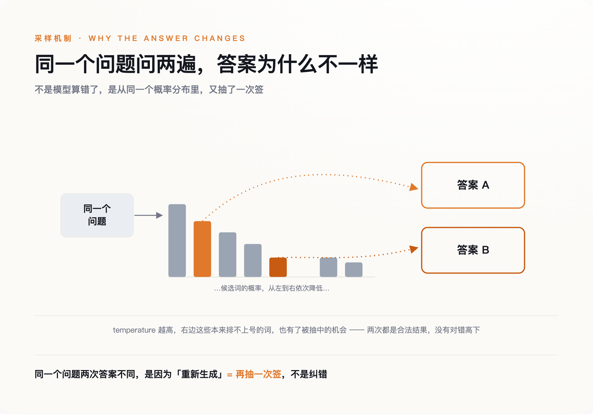
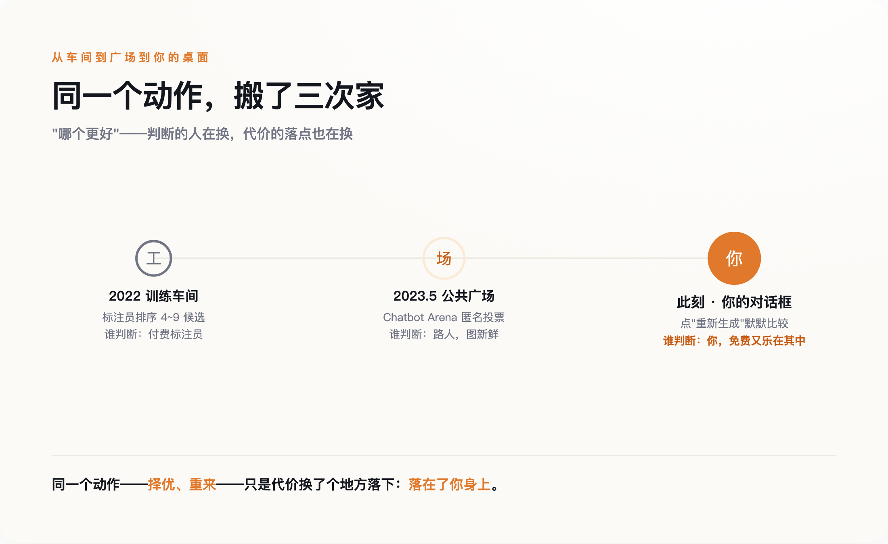
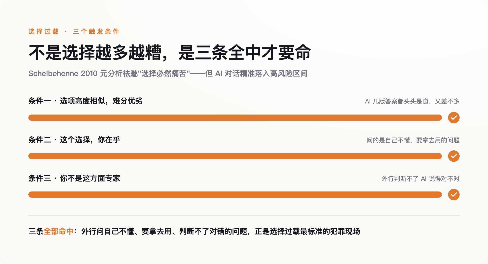

# 那颗「重新生成」按钮，正在教你不再相信有答案

> **发布日期**：2026-08-25 | **分类**：AI 与认知

## 导语

你大概有过这样一个瞬间：AI 给的答案其实已经够用了，你却还是把光标移到那个圈圈箭头上，点了「重新生成」。不是它错了，是你想看看"还有没有更好的"。这颗你天天按、却从没细想过的按钮，正在悄悄改掉你对"一个答案"的态度——它不是给你更好的答案，是训练你不再相信有答案。

---

## 一颗你天天按、却从没想过的按钮

打开任何一个 AI 对话框，答案下面都蹲着同一个小东西。ChatGPT 叫它 Regenerate，Claude 叫 Retry，Gemini 干脆一次给你三份草稿，让你自己翻。它们长得不一样，干的是同一件事：告诉你，这个答案你可以不要，再来一个。

这有什么问题吗？看起来没有。不满意就重来，天经地义，跟你在饭馆觉得菜咸了、让厨房重做一份一样合理。

可饭馆重做，是因为第一份做错了。AI 重新生成，多数时候第一份并没错。你点它，往往不是因为答案不对，是因为你想知道"还有没有更好的"。ChatGPT 甚至会在旁边默默标上版本号——你正在看第 2 个、第 3 个回答。这个小小的计数器，一直在替你记着一笔账：你已经扔掉了多少个"本来够用"的答案。

一个按钮而已，值得这么大惊小怪？我想说的恰恰是：正因为它太小、太顺手、太不像个事，它改造你的时候你完全没感觉。它给你的从来不是"更好的答案"，是一种态度——眼前这个答案，不过是当前展示的这一次而已。

要理解这颗按钮为什么有这种本事，得先知道一件反常识的事：你对面这台机器，从出厂那天起，就没打算给你"一个"答案。

## 机器从出厂起，就没有"一个答案"

我们习惯把 AI 想象成一个知道答案的人：你问，它答，答错了就纠正。但它的工作方式完全不是这样。

大模型每吐出一个字，做的都是同一件事：先算出下一个字所有可能选项的概率——"的"占多少、"是"占多少、几万个候选词各占多少，然后不是雷打不动挑概率最高那个，而是照着这个概率分布随机抽一个。控制这个随机程度的参数叫 temperature（温度）。温度调到接近 0，它就老实挑最可能的，两次回答几乎一样；温度一高，那些排在后面的低概率词也有了真被抽中的机会，于是同一个问题问两遍，答案就不一样了。

同一个问题两次答案不同，不是机器出了故障，是它本来就这么设计的。哪怕你把温度锁死到 0，GPU 在做浮点运算时那点先天的不确定，也可能让两次输出对不齐。

想清楚这一点，"重新生成"的真面目就露出来了。你以为你在校对——让它把没写好的地方改改。其实你在做的，是让这台机器照着同一个概率分布，再抽一次签。

**你以为在校对，其实在摇号。**

*图注：同一个问题问两次答案不同，不是出错，是照同一个概率分布再抽一次签——「重新生成」是摇号，不是校对。*

第一次的答案和第二次的答案之间，没有对错高下之分，它们是同一台老虎机摇出的两个结果。你觉得第二个更好，很多时候只是因为它更新、更贴合你此刻的期待，而不是它更接近某个"正确答案"——因为压根就没有那个唯一的正确答案，在后台等着被你摇出来。

可问题还没完。这台摇号机，为什么天生就带着一个"择优"的动作？答案藏在你看不见的训练车间里。

## "哪个更好"这个动作，本来发生在车间里

今天这些聊天机器人之所以好用，靠的是一道叫 RLHF（基于人类反馈的强化学习）的工序。这道工序从 2017 年被提出来那天起，骨架就是四个字：两两择优。

具体怎么做？2022 年 OpenAI 那篇训练出 ChatGPT 前身的论文（Ouyang et al., arXiv:2203.02155）写得很清楚：他们让标注员面对同一个问题的 4 到 9 个候选回答，排出个高下，再把这些排序拆成一对一对的比较，喂给一个"奖励模型"，教它学会人类觉得哪个更好。这道工序有多管用？论文里，一个只有 13 亿参数、但经过这套人类择优训练的模型，在人们的偏好投票里，赢过了 1750 亿参数、大它 130 多倍却没经过这套训练的老 GPT-3。

换句话说，让机器变得"好用"的核心秘密，不是让它更聪明，是让无数人一遍遍地告诉它"这个比那个好"。

一开始，做这个"择优"动作的是拿钱的标注员，在你看不见的地方。2023 年 5 月，这件事被搬到了明面上。伯克利的一个研究团队上线了一个叫 Chatbot Arena（后来的 LMArena）的东西：你提一个问题，它甩给你两个匿名模型的回答，标着 A 和 B，你投一票选谁更好，投完才告诉你刚才是谁对谁。上线第一周，它就收到了 4700 张投票，用这些票给九个模型排了个类似国际象棋等级分的榜（LMSYS 官方博客，2023-05-03）。

做"哪个更好"判断的人，就这样从领工资的标注员，变成了图新鲜的路人。择优这个动作，第一次从车间走进了公共广场。

而"重新生成"按钮，是这条路的终点。它把同一个动作，从车间、从广场，一路搬进了你自己的对话框。现在，坐在屏幕前一遍遍点重来、心里默默比较"这版和上版哪个好"的那个标注员，是你。你没有工资，还乐在其中。

三个场景，一个动作：择优、重来、再择优。只是代价换了个地方落下——落在了你身上。而这套反复择优的动作一旦成了你人机对话的默认姿势，麻烦就跟着来了：你会越来越难在任何一个答案上停下来。

*图注：「哪个更好」这个动作一路从车间搬到你桌面——做判断的人从付薪标注员，变成路人，最后变成免费又乐在其中的你。*

## 你被悄悄从"满足者"训练成了"最大化者"

代价具体是什么？心理学家 Barry Schwartz 在《选择的悖论》里给过一对好用的分法：满足者（satisficer）和最大化者（maximizer）。满足者找到一个够用的就停，买件差不多的毛衣就回家了；最大化者非要确认自己买到了"最好的那件"，逛遍全城、翻完所有链接，最后即便真买到好的，也因为"万一还有更好的没看到"而不痛快。

"重新生成"按钮，就是一台专门把满足者往最大化者那边推的机器。它在每个答案旁边都挂着一句无声的话：还有下一个哦。你本来看到够用的答案就该走了，可这句话让你多问一句"还有没有更好的"——于是你点了下去。

不过，这里我得停一下，诚实地泼自己一盆冷水。"选择越多越痛苦"这个说法，这些年其实被打过脸。2010 年，Scheibehenne 几位研究者把 50 个相关实验放在一起做了个元分析，结果发现：选项变多带来的平均伤害，接近于零。选择过载不是什么铁律，很多时候它压根不出现。

那本文的论证是不是塌了？没有。后来的研究把话说得更准了：选择过载只在三个条件同时满足时才真的咬人——选项之间高度相似、难分优劣；这个选择你还挺在乎；而你偏偏又不是这方面的专家。

你把这三条对照一下 AI 对话就明白了。一个外行，问一个自己不懂、又打算拿去用的问题（所以在乎），面前是几版听起来都头头是道、又都差不多的答案（高度相似、难分优劣，你还不是专家）——三条全中。**AI 对话不是"选择过载不存在"的反例，恰恰是它最标准的犯罪现场。** 所以我不说"选择永远让人痛苦"那种武断话，我只说：AI 这个场景，精准地踩进了那个高风险区间。

*图注：选择过载不是铁律，只在三条同时满足时才咬人——而外行用 AI 问不懂的问题，三条全中。*

这件事该怎么看，专家们自己就吵起来了。

## 你在笼子里反复抽签，却以为在旷野里挑

像沃顿商学院的 Ethan Mollick 这样的乐观派会反驳我：反复让 AI"再做好一点"，根本不是什么决策疲劳，那是普通人拿到"思维链"的土办法——正因为管用，大家才这么爱用。这话有道理。一个会写代码的人，让 AI 重生成三版，然后挑出他一眼就能判断对错的那版，这是高效，不是退化。

但请注意 Mollick 这个例子的前提：他判断得了。他是专家，重来对他是筛选工具。而大多数人按下那个按钮时，处在的是相反的境地——他判断不了，重来对他不是筛选，是逃避拍板。同一个按钮，在专家手里是杠杆，在外行手里是拖延症的开关。

更麻烦的是另一层。哲学家 Susan Schneider 研究"聊天机器人认识论"，她的提醒是一个"温水煮青蛙"的过程：你和 AI 答案的关系一点点地变，每一步你都察觉不到，累积起来却在悄悄侵蚀你自己判断的自主性。而这个笼子，其实比感觉到的还要小。另一篇论文给它起了个名字，叫"生成式单一文化"（generative monoculture，arXiv:2407.02209）：大模型输出的多样性，比它学过的那些原始材料窄得多，而且你换个采样方式、换个问法都救不回来，因为病根在训练本身。

于是你点"重新生成"，以为自己打开了无穷种可能，其实只是在一个被悄悄缩小的笼子里，反复抽签。按钮让你看到的是一扇扇打开的门——你以为门开了，其实门一直是关着的，而你根本不知道自己被关着。

这套路我们其实见过一次。2006 年前后，一个叫 Aza Raskin 的工程师发明了"无限滚动"——就是你刷手机时永远刷不到底的那个设计。后来他公开忏悔，还在新墨西哥州告 Meta 的案子里出庭作证，说后悔造出了这东西。无限滚动干的坏事，是拿掉了"翻页""这一集完了"这种天然的停止信号（stopping cue），让你没有一个自然的时刻可以停下来。

无限滚动能不能一路证明到"重新生成"，我得说句诚实话：它只是个类比，不是证据。没人做过实验，证明这颗按钮真会把一个人训练成拿不定主意的性格。但两者拿掉的，确实是同一样东西——无限滚动拿掉的停止信号是"这一集完了"，"重新生成"拿掉的那个，叫"这就是答案"。**这颗按钮拿走的不是某个坏答案，是"到此为止"这个念头本身。**

回到开头那个瞬间：答案已经够用，你的手还是伸向了那个圈圈箭头。你点下去，问的是"还有没有更好的"；而你本来可以问另一句——"这个答案够用了吗"。这两句听着差不多，却通向两种人：一种永远在摇号，永远差一版；另一种能拍板，然后转身去把事做了。下次，试着把手收回来。你要拿回的不是一个更好的答案，是相信"一个答案够了"的那点能力。

## 数据来源

- [Training language models to follow instructions with human feedback (InstructGPT, Ouyang et al., 2022)](https://arxiv.org/abs/2203.02155)
- [Chatbot Arena: Benchmarking LLMs in the Wild with Elo Ratings (LMSYS Org, 2023-05-03)](https://lmsys.org/blog/2023-05-03-arena/)
- [Deep Reinforcement Learning from Human Preferences (Christiano et al., 2017)](https://arxiv.org/abs/1706.03741)
- [Generative Monoculture in Large Language Models (arXiv:2407.02209)](https://arxiv.org/abs/2407.02209)
- [Can There Ever Be Too Many Options? A Meta-Analytic Review of Choice Overload (Scheibehenne, Greifeneder & Todd, 2010)](https://doi.org/10.1086/651235)
- The Paradox of Choice: Why More Is Less（Barry Schwartz, 2004）——满足者/最大化者之分
- Chatbot Epistemology（Susan Schneider, *Social Epistemology*, 2025）——AI 对认知自主性的"温水煮青蛙"式侵蚀
- Ethan Mollick 关于"与 AI 反复迭代"的公开观点（沃顿商学院，*Co-Intelligence* 及其 One Useful Thing 专栏）
- [Aza Raskin 与无限滚动 / Center for Humane Technology](https://www.humanetech.com/)
