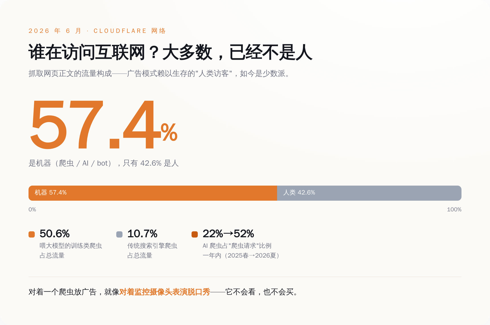
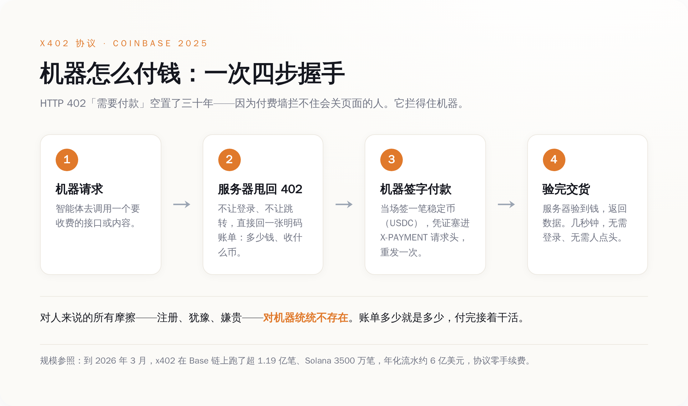
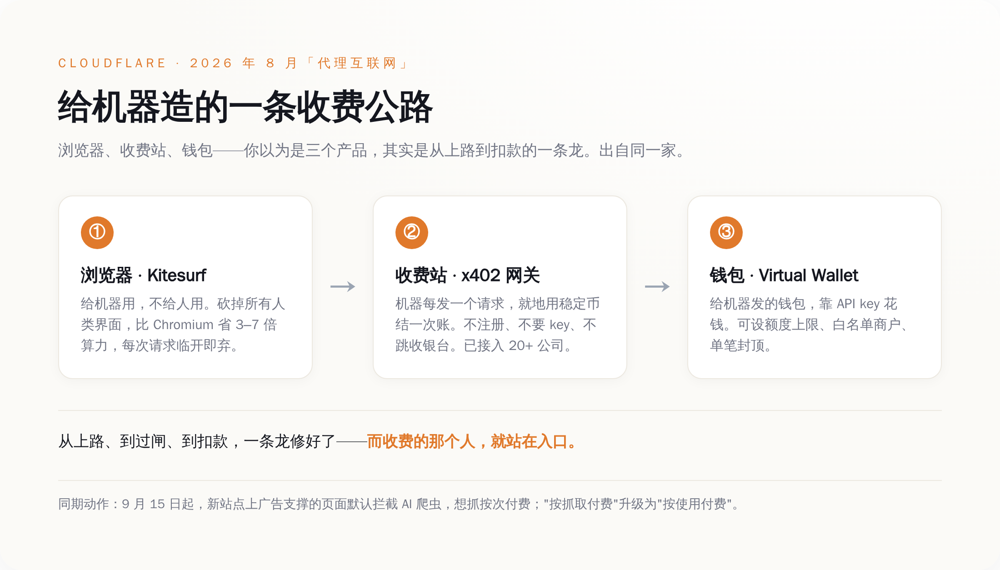
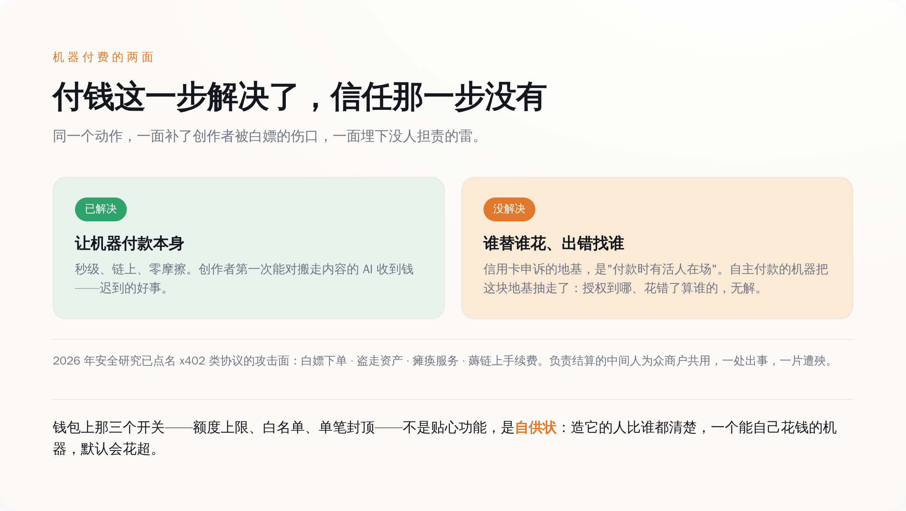

# 你上网看广告，机器上网直接付钱——这个月，有人开始把互联网的客户从"你"换成"你的 AI"

> **发布日期**：2026-08-26 | **分类**：AI 与互联网

## 导语

先说一个今年 6 月的数字：在 Cloudflare 这张覆盖了小半个互联网的网络上，抓取 HTML 网页的流量里，有 57.4% 已经不是人了，是机器。

这句话你可以换个方式读：你每天刷的这个互联网，访客的大多数，早就不再是那个会看广告、会被标题骗进来、会在购物车前面犹豫半天的人类了。是爬虫，是 AI，是替你干活的各种 bot。

然后这个月，有一家公司做了一件顺理成章、但没人愿意大声说的事——它开始给这些机器造一套**专门的互联网**：给它们配了浏览器，修了收费站，发了钱包。人这边继续看广告，机器那边直接掏钱。

免费的互联网不是被 AI 偷内容偷死的。它是被逼着，装了个电表。

---

## 一、互联网上的"人"，已经是少数派了

我们先把那个前提讲清楚，不然后面的事听着像科幻。

过去二十年，整个免费互联网能转起来，靠的是一个特别朴素的假设：**来访问的是个人**。是人，才会看到网页上那条广告；是人，才会被"猜你喜欢"劝动；是人，才会办个会员、点个下单。网站免费给你看内容，转头把你的注意力打包卖给广告主——这套生意，前提是屏幕对面坐着一双能被广告打动的眼睛。

这个前提，正在以肉眼可见的速度失效。

按 Cloudflare 自己 6 月披露的数据：到今年年初夏，它网络上抓取网页正文的流量，机器占了 57.4%。其中光是给大模型喂数据的训练类爬虫，就占了总流量的 50.6%；真正的搜索引擎爬虫，只剩 10.7%。把镜头再拉近一点——在所有爬虫请求里，跟 AI 有关的那部分，从 2025 年春天的 22%，一年时间涨到了 52%。

还有个更荒诞的细节：Cloudflare 说，它归类为"正规"的那些爬虫，一多半的抓取，是在反复重新拉取那些**根本没变过**的页面。机器不知疲倦地敲你的门，敲进来一看，跟上次一模一样，转身走了，明天再来。带宽是你出的。

所以你看，问题不是"AI 会不会取代人上网"，问题是这事**已经发生了**。当一个网站过半的访客是机器，而机器不看广告、不办会员、不点下单——那个"免费换注意力"的古老契约，就没有对手方了。你对着一个爬虫放广告，就像对着监控摄像头表演脱口秀。

广告网的黄金时代，是建立在"访客是个会冲动的人"这件事上的。这件事，正在变成少数派事件。

*图注：抓网页正文的流量里，机器已占 57.4%——广告模式赖以生存的"人类访客"，成了少数派。*

## 二、一个空了三十年的状态码，突然有用了

讲到怎么给机器收钱，得先请出一个冷门到近乎行为艺术的东西：HTTP 402。

用过网页的人都间接见过它的兄弟们——404，页面找不到；403，禁止访问；500，服务器崩了。这些是 HTTP 协议里的"状态码"，是网站跟浏览器之间的暗号。而 402 这个号，对应的暗号叫 **"Payment Required"，需要付款**。

它是 1990 年代末写进 HTTP/1.1 标准的，标注是"保留，留作将来使用"。结果这一"将来"，就是三十年。整整三十年，402 基本没人用，是协议里那个永远没被叫到名字的替补队员。

它为什么空着？不是技术难。是因为**付费墙对人类不好使**。你想想你自己：一个页面弹出来跟你要钱，你的第一反应是什么？是关掉。人会货比三家，会嫌麻烦，会觉得"凭什么"，会掏出信用卡输到一半又放弃。让一个真人为了看一篇文章、调一次接口，就地掏钱——这事的转化率低到没法做生意。所以三十年里，能收钱的地方都改用了别的招：会员订阅、免费加广告、先注册圈住你。402 就这么一直空着。

2025 年 5 月，Coinbase 把它捡了起来，做成了一个叫 **x402** 的协议。逻辑简单到一句话能说完：**让付钱这件事，不再需要人。**

流程是这样的：机器去请求一个要收费的资源，服务器不再是让它登录、跳转、填卡号，而是直接甩回一个 402，附带一张明码标价的账单——多少钱、收什么币。机器读懂账单，当场签一笔稳定币（比如 USDC）转账，把付款凭证塞进一个叫 `X-PAYMENT` 的请求头里，重发一次。服务器一验，钱到了，东西给你。整个过程几秒钟，不用登录，不用注册，链上结算完事。

对人来说的所有摩擦——注册、跳转、犹豫、嫌贵——对机器统统不存在。机器不会嫌麻烦，不会觉得"凭什么"，账单多少就是多少，付完接着干活。

到今年 3 月，这套协议在 Base 链上跑了超过 1.19 亿笔交易，Solana 上 3500 万笔，年化流水大概 6 亿美元，协议本身零手续费。数字在整个支付行业里还小得可怜。但重点从来不是它现在多大，重点是：**那个空了三十年的收费闸口，第一次找到了一个不会关页面、不会拒付、不会投诉的完美顾客。**

它叫机器。

*图注：x402 的四步握手——服务器甩回 402 账单，机器签一笔稳定币塞进请求头，重发、验证、交货，全程无需人类点头。*

## 三、这个月，有人把收费站装到了整个互联网门口

协议是协议，得有人把它铺到路上。这个月干这件事的，是 Cloudflare。

要理解这事的分量，得先知道 Cloudflare 是谁：它是坐在小半个互联网**前面**的那家公司。你访问的海量网站，流量在到达网站之前，先经过它的网络。它既是门房，又是保安，还是收发室。

8 月，它抛出一个词，叫"Agentic Internet（代理互联网）"，并给它定了四条标准：**可读、可发现、可调用、可付费**。翻译成人话就是：一个专门给 AI 智能体用的互联网，机器能读懂它、能找到它、能调用它——还能对它掏钱。为了凑齐这四条，它一口气上了三个东西，你把它们摆一起看，画风就出来了。

**第一件，浏览器，叫 Kitesurf。** 但这不是给你用的浏览器。它是给机器用的。它跑在 Cloudflare 自己的服务器上，用一种极省的方式运行，比正经的 Chromium 浏览器省 3 到 7 倍的内存和算力，每来一个请求就临时开一个、用完就扔。它照样能通过二十三万多项网页标准测试，能被自动化工具驱动。为什么能这么省？因为它**砍掉了所有为人类准备的东西**——那些界面、按钮、动画、给你看的排版，机器统统不需要。一个不用长眼睛的访客，你给它配什么显示器。

**第二件，收费站，叫 Monetization Gateway。** 它用的正是上面那套 x402。机器每发一个请求，就在 Cloudflare 的网络边缘就地用稳定币结一次账，不用注册、不用 API key、不用跳转到收银台。目前已经有二十多家公司接进了这套机器付费的流水线。

**第三件，钱包。** 分两种：一种"账户钱包"，是给人的，你往里充钱、管着额度；另一种"虚拟钱包"，是给机器的，靠 API key 花钱——而你可以给它设定额度上限、能付款的白名单商户、单笔最多花多少。

浏览器、收费站、钱包。给机器上网用的浏览器，给机器付费用的收费站，给机器花钱用的钱包。你以为这是三个产品，其实这是一整条修好的高速公路——从上路、到过闸、到扣款，一条龙。而收费的那个人，就站在入口。

顺便说一句，就在上个月，Cloudflare 已经宣布：从 9 月 15 日起，新接入的网站上那些广告支撑的页面，**默认拦截 AI 爬虫**，想抓，可以，按次付费。它甚至把老的"按抓取付费"升级成了"按使用付费"——你的内容被 AI 拿去用了、出现在它的答案里了，才给你结钱，首批拉了 Ceramic.ai 和 You.com 两个搭子。

一边默认把不付钱的机器挡在门外，一边把付钱的通道修得又宽又顺。这不叫封锁，这叫**装闸机**。

*图注：浏览器（Kitesurf）+ 收费站（x402 网关）+ 钱包，三件套出自同一家——不是三个产品，是一条从上路到扣款的完整收费公路。*

## 四、别急着骂"圈地"——它同时解了一个真问题，又埋了一个新雷

到这儿最省事的写法，是把 Cloudflare 骂成一个趁乱收过路费的地主。但那样就蠢了，也不诚实。

先把话说公道：这套东西解决的是一个**货真价实的问题**。前面那 57.4% 的机器流量，绝大多数是 AI 公司免费来搬运创作者的内容——训练也好、现抓现答也好，搬走了，创作者一分钱没见着，还得自己出带宽。这是过去两年内容行业真正的伤口。让机器为它拿走的东西付费，对写东西、做内容的人，是好事，是迟到的好事。这一点，不用替它谦虚。

但同一个动作，另一面是另一回事。

**第一层麻烦，是安全。** 一个能自己签字付款的机器，天然是块肥肉。2026 年已经有安全研究把 x402 这类协议的攻击面挨个点了名：白嫖下单、盗走资产、瘫痪服务、薅链上手续费——每一样都对应着"让机器替人花钱"这件事本身的漏洞。更要命的是，这套流程里负责验证付款、结算上链的那个中间角色（叫 facilitator），是一堆商户共用的。共用意味着集中，集中意味着——它一处出问题，接在它后面的一大片服务跟着遭殃。

**第二层麻烦，更根本，是没人担责。** 你用信用卡被盗刷，有一整套几十年磨出来的规矩兜底：你可以申诉，损失在发卡行、收单行、商户之间分。这套规矩的地基是什么？是**假设付款的时候，有个活人在场**、由这个人来确认"是我本人要付这笔钱"。现在换成一个自主付款的机器，这个地基就塌了一角。它替谁花的钱？授权到什么份上？真花出去的那笔，是它该花的吗？出了错找谁？——用研究者的话说：**付钱这一步是解决了的，难的是信任那一步，还没解决。**

其实最诚实的证据，就藏在那个钱包上。Cloudflare 给机器钱包配了什么？额度上限、白名单商户、单笔封顶。

你想过没有，这三个开关意味着什么。它意味着造这个钱包的人，比谁都清楚：**一个能自己花钱的机器，默认状态是会花超的。** 那三个限制不是贴心功能，是自供状。他们不是在防你的机器被坏人利用，他们首先是在防你的机器**自己**。

*图注：付钱这一步解决了，信任那一步没有——钱包上的额度、白名单、单笔封顶，不是贴心，是"机器会花超"的自供状。*

## 数据来源

- [Cloudflare Blog：Building an open Agentic Internet — readable, discoverable, callable, and payable](https://blog.cloudflare.com/the-agentic-internet/)
- [Cloudflare Blog：Introducing Kitesurf, the agent-first browser on Cloudflare Workers](https://blog.cloudflare.com/kitesurf/)
- [Cloudflare Blog：Your site, your rules — new AI traffic options（按抓取/按使用付费、9 月 15 日默认拦截）](https://blog.cloudflare.com/content-independence-day-ai-options/)
- [Coinbase：Introducing x402 — a new standard for internet-native payments](https://www.coinbase.com/developer-platform/discover/launches/x402)
- [arXiv 2607.19545：When HTTP 402 Meets the Blockchain — Risks on Emerging x402 Payments](https://arxiv.org/abs/2607.19545)
- [arXiv 2605.11781：Five Attacks on the x402 Agentic Payment Protocol](https://arxiv.org/html/2605.11781v1)
