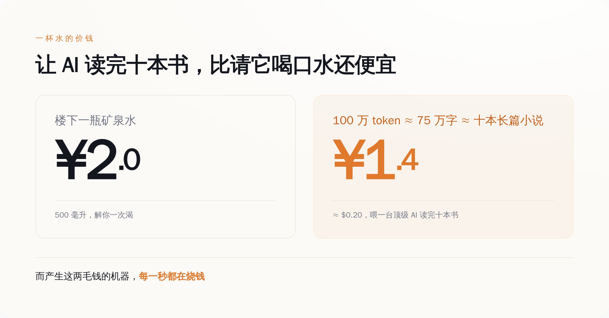
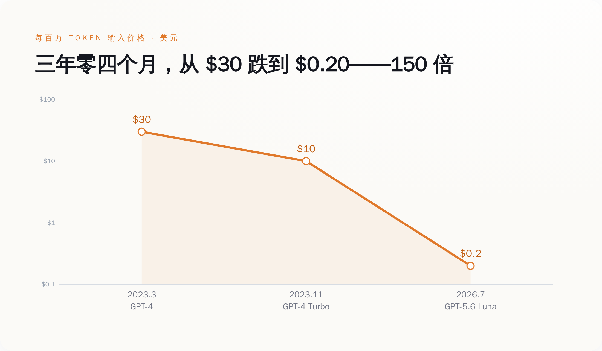
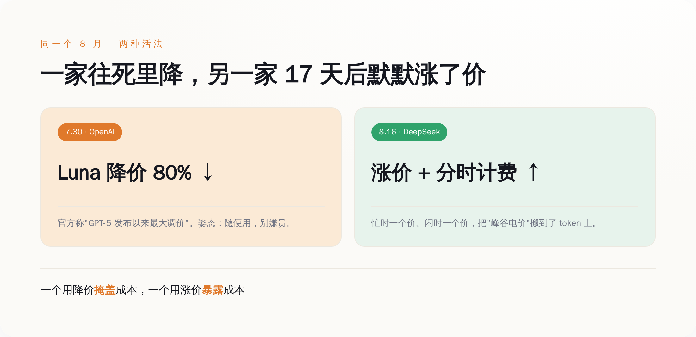
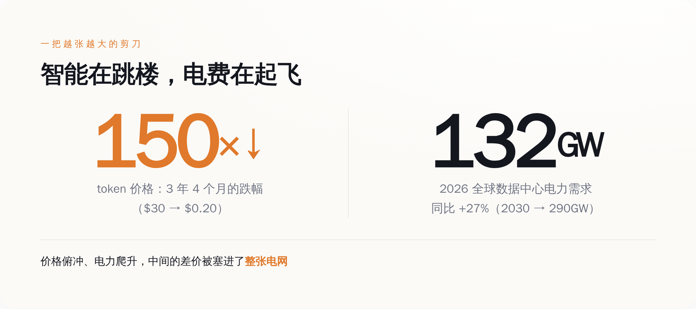
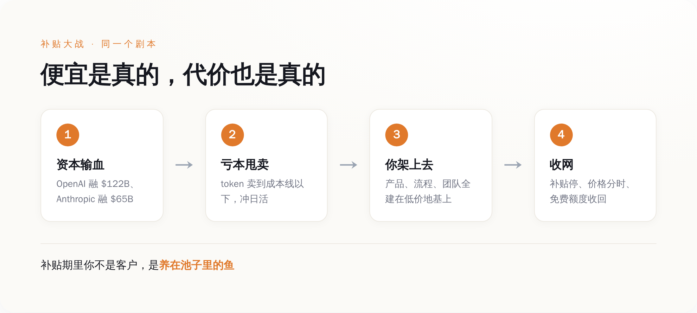

# 一百万个字，卖你两毛钱，比一瓶矿泉水还便宜——但这不叫智能降价，这叫有人在亏本抢你，趁你还没离不开它

> **发布日期**：2026-08-27 | **分类**：AI 与商业

## 导语

先给你报个价。

今年 7 月 30 日，OpenAI 把它一款叫 GPT-5.6 Luna 的模型，输入价格砍到了每一百万个 token 两毛钱美元。一百万个 token，粗算是七十五万个汉字，差不多十本长篇小说的文字量。你把《三体》全套喂进去让它读一遍，花不到两毛钱。

两毛钱，人民币一块四出头。你楼下那瓶矿泉水两块。

也就是说，现在让一台顶级 AI 读完十本书，比你请它喝口水还便宜。

这事听着特别像好消息。技术进步嘛，摩尔定律嘛，普惠嘛，人人用得起智能嘛。每次有大厂降价，评论区都是一片"感谢开源""感谢内卷""建议再降"。

我劝你先别急着感谢。

**东西卖得比成本还低，从来不是因为它变便宜了，是因为有人急着把你变成他的人。** 这个道理，打过车、点过外卖、办过健身卡的中国人，本该比谁都熟。

---

## 一、两毛钱背后，是一台一直在烧钱的机器

我们先把"便宜"这两个字拆开看，别被它糊弄过去。

一个 token，你可以粗略理解成 AI 眼里的一个"字"。你问它一句话、它答你一段话，中间来回吞吐的就是 token。按 OpenAI 官方定价页现在的数字：Luna 这一档，输入每一百万 token 两毛钱，输出一美元二。这是它整个 GPT-5.6 系列里最便宜的一档，官方自己给它的定位就是"给那些量特别大、又特别在乎成本的活儿用的"。翻译成人话：**这一档就是拿来给你敞开了用的，用得越狠越好。**

问题是，产生这两毛钱的那台机器，一点都不便宜。

它跑在一排排 GPU 上，那玩意一张卡几万美元，插电就发烫，几年就得换代淘汰。它吃的是电，而且是海量的电。你每问一句，背后是一片数据中心在轰鸣。这台机器从造出来到跑起来，每一秒都在烧钱——烧显卡的折旧，烧机房的电费，烧工程师的工资，烧那些一次训练就是几千万美元的模型本身。

**一个每分钟都在流血的东西，最后卖给你的价格，比一瓶水还低。**

这中间的窟窿，不会因为你没看见就不存在。它只是被人先垫上了。谁垫的、为什么垫、垫到什么时候，这才是"两毛钱"这三个字底下真正的故事。而不是什么"感谢内卷"。

*图注：让一台顶级 AI 读完十本书，比请它喝口水还便宜——但产生这两毛钱的机器，每一秒都在烧钱。*

## 二、三年零四个月，从三十美元跌到两毛，跌了 150 倍

要看清这不是"正常降价"，得把时间拉长，看它跌得有多不讲道理。

2023 年 3 月，OpenAI 发布 GPT-4，当时最能打的旗舰。它的输入价格是多少？每一千 token 三美分，换算成一百万，就是**三十美元**。那会儿开发者们已经觉得"哇好贵"，一个稍微复杂点的应用，一天调用下来账单能吓人一跳。

同年 11 月，OpenAI 开第一届开发者大会，甩出 GPT-4 Turbo，官方原话是输入比 GPT-4"便宜三倍"，一下降到每百万十美元。全场鼓掌。

然后你把镜头快进到 2026 年 7 月，同一梯队能力更强的 Luna，输入两毛钱。

三十美元，到两毛钱。**跌了整整 150 倍。中间只隔了三年零四个月。**

你找个别的行业感受一下这个斜率。三年里，房价跌 150 倍你信吗？猪肉跌 150 倍你信吗？连最卷的消费电子，三年也就跌个几成。而 AI 推理的价格，是从三十跌到零点二——不是打折，是跳楼，是从三十楼纵身往下，中间一层没停。

当然，这里面有真本事的成分。芯片确实在进步，模型确实在变小变快，推理确实在被优化，这些都是实打实的技术功劳，不能一笔抹掉。研究机构 Epoch AI 长期跟踪这条曲线，结论也是同档能力的推理成本每年都在以惊人的速度往下掉。

但技术进步解释得了"跌三倍""跌十倍"，解释不了"跌到成本线以下还在跌，还抢着比谁跌得快"。**技术让它有可能变便宜，商业逻辑才让它变得比水还贱。** 前者是物理，后者是战术。你把两者混成一句"技术普惠"，就正好上了套。

> **降价降到亏本，那不是慷慨，是投名状——纳的是你，交的是给资本市场看的增长曲线。**

*图注：GPT-4 的 30 美元到 Luna 的 0.2 美元，三年四个月跌 150 倍——不是打折，是从三十楼往下跳，中间一层没停。*

## 三、就在这个月，剧本裂了——一家往死里降，另一家默默涨了价

如果故事只是"大家一起降价冲",那还只是常规内卷。真正有意思的，是这个月发生的一次分岔。

7 月 30 日，OpenAI 把 Luna 砍了 80%，官方自己都承认这是"GPT-5 系列发布以来最大的一次调价"。往死里降，姿态是"来，随便用，不要钱"。

结果只隔了 17 天。

8 月 16 日下午（UTC 时间 16 点），DeepSeek 的新价格生效。它刚在 8 月 13 日把 V4-Pro 正式版铺开，紧接着就动了价目表——而且方向，是**往上**。它第一次搞起了"分时计价"：忙的时段一个价，闲的时段一个价，峰谷分开。说白了，就是电网那套"峰谷电价"，被搬到了 token 上。

你把这两件事摆一块儿看，画风就很微妙了。

同一个 8 月，AI 圈两家最能打的，一家把价格往地板上摁，一家把价格往上抬还学会了分时段收费。这不叫巧合，这叫**两种活法**。

往死里降的那家，背后站着刚融到天量美元的金主，账上不缺钱，它降价的目的不是赚钱，是抢地盘、是把日活冲上去、是给一级市场讲一个"用户还在爆发式增长"的故事。降价对它是投资，烧的是别人的钱，买的是你的习惯。

往上抬的那家，做的其实是件更诚实的事：**它在告诉你，token 是有成本的，而且忙的时候更贵。** 分时计价这四个字，本质上是承认了一件被"两毛钱"精心遮住的事——机器不是不要钱，是同一杯水，中午高峰和半夜低谷，真实成本根本不一样。

一个用降价掩盖成本，一个用涨价暴露成本。你说哪个更把你当外人？我倒觉得，后者反而更拿你当明白人。

> **能长期免费请你喝水的，往往不是水便宜，是他打算之后卖你别的；老老实实告诉你水多少钱一杯的，反而没打你别的主意。**

*图注：同一个 8 月，一家降 80% 往地板上摁，一家 17 天后涨价还上了分时计费——降价的在掩盖成本，涨价的在暴露成本。*

## 四、智能在跳楼，电费在起飞——中间那个窟窿，正在被塞进电网

现在回到那个被两毛钱盖住的窟窿：成本到底去哪了？

答案是，它没消失，它跑到了你看不见的地方——电网上。

看两组一手数据。市场研究机构 Gartner 今年披露：2026 年全球数据中心的用电需求，预计比去年涨 27%，从 104 吉瓦冲到 132 吉瓦；全年耗电量预计到 565 太瓦时。其中专门跑 AI 的那些服务器，吃掉了数据中心用电的三分之一，而且照这个势头，到 2027 年 AI 服务器的耗电就要反超所有传统服务器。再往后，到 2030 年，全球数据中心的用电还要再翻到 290 吉瓦。

再看高盛的口径，单算美国：数据中心用电需求，2025 年 31 吉瓦，2026 年 41 吉瓦，2027 年 66 吉瓦。两年，翻一倍还多。多出来的这些电，几乎全是 AI 这波基建给拽上去的。

你把这两条曲线画在一张纸上，会看到一把张开的剪刀：**一边，token 的价格三年跌 150 倍，往地板扎；另一边，喂养它的电力需求年年两位数往上蹿，朝天花板顶。** 一个俯冲，一个爬升，中间的口子越张越大。

这口子就是那个窟窿的真身。你为智能付的钱在飞速变少，可产生智能要烧的电在飞速变多。这笔差价不会凭空蒸发，它只是从"买 token 的你"，转移给了"整张电网"——转移给了电力公司要多发的电，转移给了要新建的变电站、要多烧的天然气、要重新排队的并网申请，最后转移给跟 AI 八竿子打不着、却发现自家电费莫名其妙涨了的普通人。

所以下次再有人跟你说"AI 让智能变得几乎免费"，你可以补一句：智能是快免费了，但电没有，而且电是不会陪你演"免费"这出戏的。**电表是这个行业里唯一不会说谎的东西。**

*图注：token 价格三年跌 150 倍往下扎，数据中心电力需求年年两位数往上蹿——一把越张越大的剪刀，中间的差价被塞进了整张电网。*

## 五、这套剧本，你其实在 2025 年的外卖大战里全看过

到这儿，"谁在垫钱"这个问题，答案已经呼之欲出了。

看两个官方数字。今年 3 月 31 日，OpenAI 官宣完成 1220 亿美元融资，投后估值 8520 亿，创了私募纪录。5 月 28 日，Anthropic 官宣 Series H 融资 650 亿，估值 9650 亿，反超 OpenAI 成了全球估值最高的创业公司，同时它披露自己的年化营收已经越过 470 亿美元。

你注意这个组合：一边是营收已经做到几百亿美元量级的公司，一边还要伸手向一级市场要成百上千亿的美元。一家健康赚钱的生意，是不需要靠这种规模的持续输血来续命的。这么大的融资摆在这么高的降价旁边，答案基本就写在脸上了：**替你垫那两毛钱窟窿的，是投资人的钱。** 你用得越爽，他们烧得越多，账面上的增长曲线越好看，下一轮就越好融——直到有一天融不动为止。

这套路，你真不陌生。

倒回 2025 年，中国的外卖大战。美团、饿了么背后的淘宝闪购、还有杀进来的京东，三家为了抢你手机里那一单，把补贴砸到什么地步？据美团自己的财报，它那个一直是现金牛的核心本地商业板块，当季直接由盈转亏，一个季度亏掉一百四十多亿人民币；三家在 2025 年年中那两个季度砸进去的补贴，加起来超过八百亿。

八百亿买什么？买你打开哪个 App 的手指记忆。那阵子你点顿饭能省十几块，爽不爽？爽。可你心里清楚，这十几块不是哪家良心发现，是它们在拿钱买你的习惯，赌的是补贴停了以后你已经离不开、已经懒得换。补贴大战从来没有"消费者长期赢"这个选项，只有"先让你占便宜、再连本带利收回来"这一种结局。

**现在把外卖换成 token，把美团换成 OpenAI，把你的手指记忆换成你公司的技术栈——是同一个剧本，同一个赌注，同一批人在赌你会离不开。**

区别只在于，外卖你随时能卸载，损失一顿饭钱。而 token 不一样：你今天贪它便宜，把整个产品、整套业务流程、整个团队的工作方式，全都架在它这两毛钱的地基上。等哪天补贴停了、价格分时了、免费额度收了——你搬得动吗？你那套跑起来的系统，早就不是"换一家供应商"那么轻巧了。

> **补贴期里，你不是他的客户，你是他养在池子里的鱼。水便宜的时候使劲喂，不是心疼你，是等你长肥，好在收网那天，一条都跑不掉。**

*图注：资本输血→亏本甩卖→你把业务架上去→收网，同一个剧本你在 2025 年外卖大战里全看过——补贴期里你不是客户，是被养的鱼。*

便宜是真的便宜，你能占的这点便宜也是真的。占，没问题。但占便宜的时候心里得有本账：**这价格是别人替你烧钱烧出来的，它随时会变；越是白菜价，越别把身家性命架上去。** 等电表和资本市场这两样东西同时不肯再演下去的那天——而这一天一定会来——账单会重新出现，而且会找一个真正的人来付。

那个人，最好别是当年感谢内卷感谢得最大声的你。

## 数据来源

- [OpenAI：Advancing the price-performance frontier with GPT-5.6（Luna 降价 80% 至 $0.20/$1.20，2026-07-30）](https://openai.com/index/advancing-the-price-performance-frontier-with-gpt-5-6/)
- [OpenAI：New models and developer products announced at DevDay（GPT-4 Turbo 输入 $10/1M，2023-11-06）](https://openai.com/index/new-models-and-developer-products-announced-at-devday/)
- [OpenAI API 官方定价页](https://developers.openai.com/api/docs/pricing)
- [DeepSeek API Docs：DeepSeek-V4-Pro GA Release（新定价 2026-08-16 16:00 UTC 生效，引入分时计价）](https://api-docs.deepseek.com/news/news260813/)
- [DeepSeek API Docs：Change Log / Models & Pricing](https://api-docs.deepseek.com/quick_start/pricing/)
- [Google：Gemini API 官方定价页](https://ai.google.dev/gemini-api/docs/pricing)
- [Gartner：数据中心电力需求 2026 年增长约 27% 至 132GW](https://www.gartner.com/en/newsroom/press-releases)
- [Goldman Sachs：US data center power demand（31GW→41GW→66GW）](https://www.goldmansachs.com/insights/articles/us-data-center-power-demand-projected-to-double-by-2027)
- [OpenAI：Accelerating the next phase（$122B 融资、估值 $852B，2026-03-31）](https://openai.com/index/accelerating-the-next-phase-ai/)
- [Anthropic：Series H（$65B 融资、估值 $965B、年化营收 $47B，2026-05-28）](https://www.anthropic.com/news/series-h)
- [Epoch AI：LLM inference price trends](https://epoch.ai/data-insights/llm-inference-price-trends)
