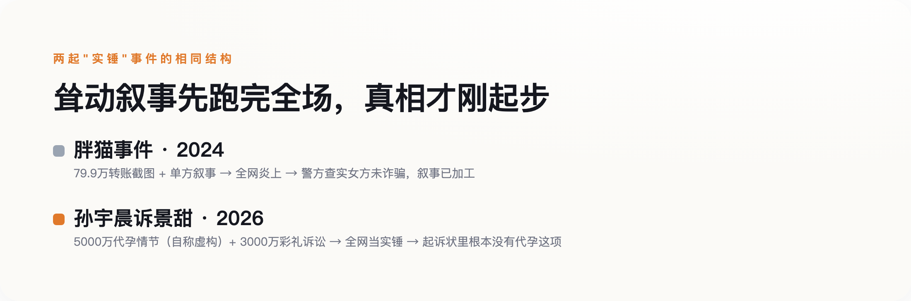

# 孙宇晨起诉景甜要的是3000万彩礼，全网传疯的却是他自己标注"纯属虚构"的代孕情节

> **发布日期**：2026-08-29 | **分类**：媒介与传播

## 导语

8月27日晚，孙宇晨发布长文《我的女友景甜》，讲述了一段长达19年的暗恋与恋情，文中提到双方谈及海外代孕、因五千万美元的取卵费用谈崩，随后他起诉景甜及其父母，追讨恋爱期间的转账。这条新闻当晚就冲上热搜，各种版本的"实锤"截图刷屏。但一个几乎没人提的细节是：那篇长文的结尾，孙宇晨自己写了一行字——"本文纯属虚构，如有雷同纯属巧合"；而他委托律师正式提交给法院的起诉状里，追讨的是3000余万元"彩礼"，压根没有代孕这一项诉求。一份文件说这是虚构故事，另一份文件对这段故事只字不提，但全网记住并疯传的，恰恰是这个被作者本人标注为编的部分。

## 一、起诉的是彩礼，疯传的是代孕——这是两份根本不同的文件

据孙宇晨代理律师张起淮发布的案件事实说明（新浪财经披露），本次诉讼以景甜及其父母为被告，诉讼请求是追讨恋爱及谈婚论嫁期间支付的彩礼，标的3000余万元人民币，法院已立案并申请了财产保全。这份法律文件里，没有代孕，没有"五千万美元换取卵子"，没有那些在社交平台被反复截图、被营销号写进标题的耸动细节。这些内容只存在于孙宇晨自己发布的长文里——一篇他自己在结尾处标注"纯属虚构"的长文。这里要提醒一句：五千万美元是长文里的取卵费说法，三千余万元人民币是起诉状里的彩礼诉求，币种不同、事项也不同，网上常把两个数字混着说，其实压根不是一回事。

但社交平台上流传的版本完全是另一回事。多家媒体的标题直接把代孕情节当作既定事实呈现，用的是"实力曝光""内幕揭秘"这类不容置疑的措辞，仿佛这是一份已经查证属实的爆料，而不是一个自称虚构的故事。**一段被作者亲手标注"编的"的情节，比一份正式提交给法院的诉状，传得更远、被信得更彻底。**

## 二、"我没法保证每个细节100%"——连他自己都没有完全背书

8月28日凌晨，孙宇晨接受采访回应长文内容，原话是："绝大多数我觉得就是符合我意愿的一个真实的陈述吧，在文章中写了是虚构的""我也没有办法保证每个东西都是100%"。他说长文是自己熬了两个晚上、借助AI工具协助写成的，当时人在不丹，白天要处理公司事务，只能在时差里的凌晨动笔。

这段回应本身就留了一个暧昧的口子——他既没有说"内容都是真的"，也没有说"内容都是编的"，而是用"绝大多数符合我意愿""无法保证每个细节"这种说法，把最容易引发争议的具体情节留在了一个既不肯定也不否认的灰色地带。景甜工作室的声明则是另一个极端：全盘否认恋爱及代孕等一切传闻，称这是"以艺人声誉为要挟的碰瓷行为"，交由司法处理；景甜本人回应"我依然眼光不行，我依然智慧欠奉，但我过去、现在、未来都不会为钱出卖我的爱情"。双方各执一词，案件目前仍处于管辖权异议阶段，没有实体审理结果。

## 三、这不是孙宇晨第一次这么做

理解这次事件为什么会这样传播，孙宇晨过去的公众形象是一条不能跳过的线索。2019年，他以456.8万美元拍下巴菲特20周年慈善午餐，随后以"突发肾结石"为由推迟赴约，被质疑是营销炒作；直到2020年1月才实际赴约，他本人事后公开道歉，称自己"过度营销、热衷炒作"。2023年，美国证券交易委员会起诉他和相关公司，指控通过对敲交易制造交易活跃假象、向明星支付未披露报酬进行推广，2026年3月双方和解，他支付了1000万美元——和解不等于认罪，这类证券类和解通常附带"不承认也不否认指控"的条款，这里同样不宜把"和解"直接读成"坐实"。2024年，他又以620万美元拍下一件行为艺术作品——一根用胶带贴在墙上的香蕉，并当众把它吃掉。

把这几件事放在一起看，孙宇晨长期以来的公众形象，就是擅长制造耸动话题、真假掺半、事后常被证实有夸大或表演成分。这次他自己说长文"存在虚构成分"，对熟悉他过往行事风格的公众来说，不是一个削弱可信度的意外，反而是一个符合预期的确认——观众早就习惯了用"半信半疑、当娱乐看"的方式消费他的内容。

## 四、两年前那只"胖猫"，教训还没被吸取

2024年那起被称为"胖猫事件"的案例（21经济网、新京报均有报道），提供了一个先例，虽然主导叙事的人不同，但"耸动数字跑赢原始事实"这个结果是一样的。年轻人刘某跳江身亡后，他的姐姐主动策划，持续发布聊天记录和一张79.9万元的转账截图，塑造出"女友诈骗捞钱"的耸动叙事，并联系他人代写文案、购买流量扩散，事件迅速引爆全网。警方后续查实，女方并未实施诈骗，两人是真实恋爱关系——也就是说，最初点燃全网情绪的那个"实锤"叙事，从一开始就是被加工过的。这次的不同在于，制造耸动细节的是当事人本人，不是像胖猫事件里那样由第三方代理发布——但这个差异并不影响核心结论：不管耸动叙事出自本人还是他人之手，一旦先跑赢了原始事实，公众的情绪反应和现实伤害都已经造成，没有办法收回。

*图：两起事件都是一方主导叙事、耸动数字当钩子，真相跟上时，传播已经先跑完了全程。*

这次事件里，同样的模式还在继续发酵：网友仅凭"大甜甜挑男人的逻辑，真是十年如一日地扎实"这类联想式评论，就把景甜2022年的旧闻对象张继科也拖进了话题，尽管没有任何实质细节能证明这两件事有关联。张继科本人在直播里一边吃玉米一边回应："跟我没关系""没看"，随即把话题转向了别的事——一次干脆的切割，没有提供任何新信息，但话题本身已经借着联想又扩散了一轮。与此同时，网络上还独立滋生出"孙宇晨曾找景甜要两亿和解费"这类更夸张的传闻，脱离原始信源自我繁殖，以至于需要专门的账号出面辟谣。

## 五、下次看到"实锤"，先找一下原始文件写了什么

这次事件里最值得记住的，不是代孕到底是不是真的，也不是这场官司最后谁会赢——目前案件还没进入实体审理，这些都没有答案。真正值得记住的是：一份被作者自己标注"纯属虚构"的故事，和一份正式提交给法院、只字未提这段情节的起诉状，摆在同一个人手里，公众选择相信、传播、当成谈资的，几乎全是前者。**"自曝内容有编造"从来不是免罪金牌，也从来不是让最耸动的部分停止传播的开关——它只是给这场传播多加了一层"反正也说不清"的免责声明。**下次再看到一份足够劲爆的"实锤"，与其急着转发，不如先找一下：真正具有法律效力的那份文件，到底写了什么。

## 数据来源

- [孙宇晨发文《我的女友景甜》并提起诉讼（腾讯新闻）](https://news.qq.com/rain/a/20260828A02FH700)
- [起诉状未含代孕诉求，转账细节尚无实证佐证（新浪财经）](https://cj.sina.com.cn/articles/view/7879776328/1d5abd8480680275dw)
- [景甜工作室发表严正声明（腾讯新闻）](https://news.qq.com/rain/a/20260828A031MB00)
- [孙宇晨回应长文争议："无法保证每个细节100%"（腾讯新闻）](https://news.qq.com/rain/a/20260828A053IM00)
- [孙宇晨采访回应全文（解放日报）](https://www.jfdaily.com/wx/detail.do?id=1167418)
- [景甜本人首次回应（观察者网）](https://www.guancha.cn/economy/2026_08_28_828949.shtml)
- [张继科直播回应：跟我没关系（网易）](https://www.163.com/dy/article/L5DU5DGR055682OR.html)
- ["两亿和解费"传闻遭辟谣（新浪新闻）](https://www.sina.cn/news/detail/5336935350403686.html)
- [胖猫事件始末与警方通报（21经济网）](https://www.21jingji.com/article/20260520/herald/10e856d9cf4037a2d7afd356014ab62a.html)
- [孙宇晨拍下巴菲特午餐后"肾结石"缓期赴约（香港01）](https://global.hk01.com/即时娱乐/60384487/)
