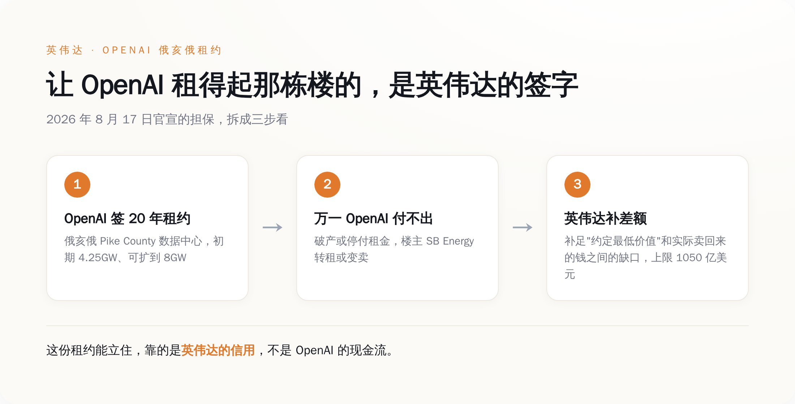
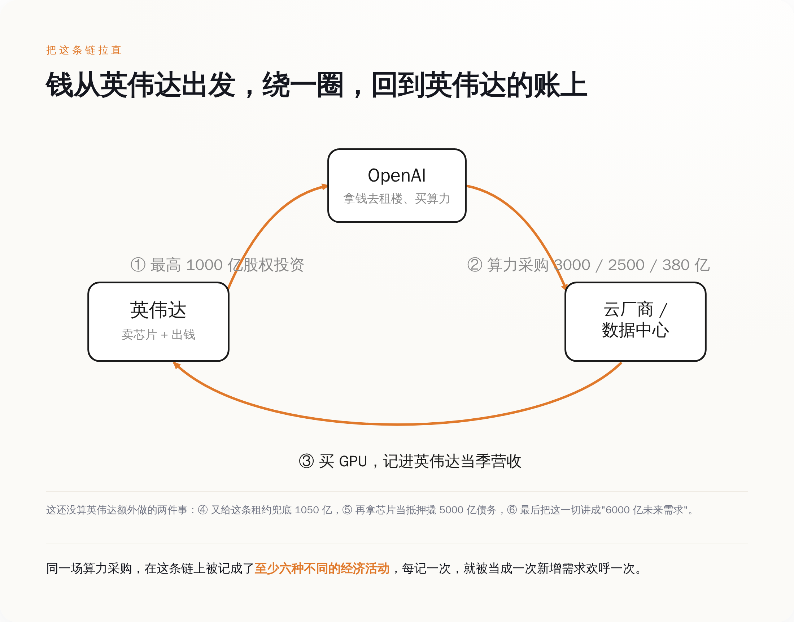
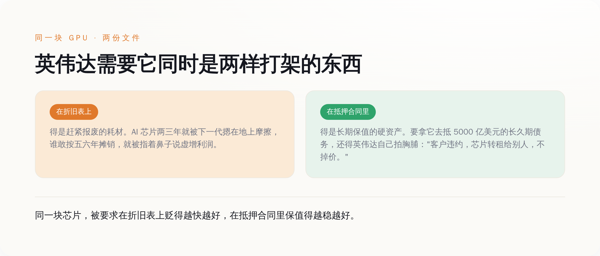
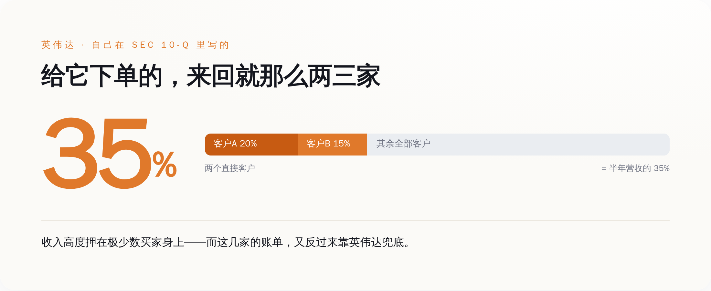

# 英伟达给 OpenAI 兜底 1050 亿，又拿芯片抵押借 5000 亿：黄仁勋说这不叫循环——对，这叫一块钱数六遍

> **发布日期**：2026-08-29 | **分类**：AI 与资本

## 导语

这周财经圈最热闹的一条消息，是 8 月 17 日英伟达宣布给 OpenAI 在俄亥俄的数据中心兜底最高 1050 亿美元。标题一水儿的"史上最大算力承诺""AI 基建大爆发"，转得飞起。热闹归热闹，几乎没人停下来问一句最朴素的问题：这 1050 亿，是谁的钱？答案有点尴尬——大头不是 OpenAI 掏的（它现在也掏不出这么多现金），是英伟达签字担保的。英伟达为了让 OpenAI 租得起那栋楼、好在楼里塞满英伟达自己的芯片，先出面给这笔租金当了担保人。九天后，黄仁勋亲自出来灭火，说这"不是循环融资，风险很低"。他这句话，我信。这确实不太像循环融资——循环好歹是钱转一圈又回来了，账面上还算干净；而这套玩法的真正精髓是，同一笔算力开支，在这条链上被不同的公司分别记了六遍账，每记一遍，就被当成一次全新的需求，欢呼一次。

---

## 一、先把这周发生的事说清楚：英伟达给别人的租金签了字

8 月 17 日，OpenAI、英伟达、软银旗下的 SB Energy 三家一起官宣了这单。事儿本身不复杂：OpenAI 在俄亥俄 Pike County 租一座巨型数据中心，跟 SB Energy 签 20 年租约，初期算力 4.25 吉瓦，带扩容选择权、最终能到 8 吉瓦。这栋楼由 SB Energy 建、SB Energy 持有，英伟达顺手又往 SB Energy 里投了 15 亿美元股权。

关键在担保这块。英伟达兜的不是"帮 OpenAI 直接把租金付了"，而是一个更绕的东西：**万一 OpenAI 破产或者停止付租，楼主先去转租或者变卖这栋楼，卖回来的钱要是不够约定的"最低价值"，缺口由英伟达补足，上限 1050 亿美元。** 说人话，就是英伟达给 OpenAI 这个租客做了信用背书，告诉出租方："你放心签，他要是跑了，我兜。"

*英伟达为 OpenAI 的 20 年租约兜底最高 1050 亿美元——让这栋楼租得起的，是英伟达的信用，不是 OpenAI 的现金流。*

这个数字还是砍过一刀的。据《华尔街日报》，英伟达最早琢磨的是给 OpenAI 的数据中心承诺兜底最高约 2500 亿美元，后来缩到了不到 1200 亿。缩水的原因也很实在：消息一出，英伟达自己的股价先跌了，投资者担心的正是——你一家卖芯片的公司，怎么把这么大一坨客户的信用风险，往自己资产负债表上扛？

一家芯片公司，操心起了客户交不交得起房租。这本身就是个信号。正常生意里，是客户求着供应商赊账；轮到英伟达这儿，是供应商追着给客户的账单做担保，生怕客户买不动自己的货。谁更需要谁，一目了然。

## 二、"这不是循环融资"——黄仁勋在偷偷换一个定义

8 月 26 日，英伟达发完 2027 财年第二季度财报，黄仁勋上了 CNBC 的《Mad Money》节目，正面回应"循环融资"的质疑。原话里最硬的一句是"the risk is low"——风险很低。他的逻辑是：算力这东西，就算一个客户经营不善用不上了，也能重新部署给别的客户、别的工作负载，砸不到英伟达手里。

这话听着挺有道理，但他在悄悄换概念。"循环融资"这个词，被他窄化成了一个特别狭窄的定义：我直接掏钱给你、你转手直接买我的货。照这个定义，英伟达当然可以说"我们不循环"——因为它绕了个弯：不是直接给现金，是给股权投资、给租约担保、给抵押品增信。钱没有明晃晃地转一圈回来，而是变成了一张又一张的信用凭证，垫在整条链的底下。招式升级了，本质没变。

真正把底裤漏出来的，是黄仁勋自己另一句辩护。他说，这是"第一代需要几百亿美元才能启动、还要几百亿美元才能盈利"的创业公司。这句话翻译过来就是：这些 AI 公司当前的经营现金流，根本撑不起它们签下的采购规模，所以缺的那一大截，得英伟达用自己的信用来补。**他不是在否认循环，他是在解释为什么必须循环——终端赚的钱不够买货，那就由卖货的先把买货的钱给垫上。**

## 三、把这条链拉直：同一笔钱，是怎么被数成六笔的

黄仁勋反复讲一个"良性循环"的故事：算力越多，AI 越强；AI 越强，用得越多；用得越多，收入越多；收入越多，又买更多算力。听上去是个正反馈飞轮。问题是，这个飞轮转一圈，同一场算力采购会在账本上留下好几个不同的脚印，而每一个脚印，都被当成一件独立的好事来数。

咱们挑 OpenAI 这条主线，一步步数：

英伟达先对 OpenAI 承诺最高 1000 亿美元股权投资（2025 年 9 月的意向），这笔记成英伟达的"对外投资"、OpenAI 的"融资到账"——**第一遍**。OpenAI 拿着这些钱和自己的收入，转身签下天量算力采购：给甲骨文的五年合同 3000 亿美元、给微软 Azure 新增 2500 亿美元、给亚马逊 AWS 七年 380 亿美元——这些记成云厂商们的"收入"和"在手订单"，华尔街为之欢呼——**第二遍**。云厂商和数据中心拿这些钱去买英伟达的 GPU，记成英伟达当季"营收"，财报一超预期股价再涨一波——**第三遍**。到了俄亥俄这单，英伟达又给这条租约兜底 1050 亿，让本来立不住的租约立住，记成一笔"信用支持"——**第四遍**。紧接着，英伟达把芯片打包当抵押物，撬动 5000 亿美元第三方债务（这个后面细说），这批芯片的价值又被重新计价、抵押一次——**第五遍**。最后，黄仁勋把这一整套讲成"OpenAI 到 2030 年可能带来约 6000 亿美元英伟达算力需求"，记成对未来的"需求指引"，再欢呼一次——**第六遍**。

*同一场算力采购，沿着这条链被记成至少六种不同的经济活动，每记一次就被当作一次新增需求。*

同一堆芯片、同一场采购，投资、订单、营收、担保、抵押、未来需求，六个身份轮流上场，每个身份都被市场当成一次崭新的增长信号。这不是有人在造假账，每一笔单看都合规、都真实。问题出在，当你把它们加总起来惊呼"AI 需求何其汹涌"的时候，你其实在把同一块钱，数了六遍。

## 四、同一块芯片，英伟达需要它同时是两样打架的东西

芯片被拿去抵押这件事，单拎出来，藏着这轮游戏最精分的一个矛盾。

8 月 11 日前后，英伟达官宣拉上了六家机构——阿波罗、贝莱德、黑石、博枫、高盛、KKR——计划以英伟达芯片作抵押，撬动超过 5000 亿美元的第三方资本，投进 AI 基础设施。分工是：高盛是里头唯一的银行，负责主导公开债券发行；另外五家另类资产管理机构，负责把长久期的机构和保险资金部署进来。抵押品保值的承诺，还是英伟达自己给的——客户要是违约，芯片转租给别人，不掉价。

矛盾就在这儿。这批芯片，英伟达需要它在两份文件里，是两样互相打架的东西：

*折旧表要它赶紧报废，抵押合同要它长期保值——英伟达需要同一块芯片同时是这两样打架的东西。*

在给股东看的折旧表上，AI 芯片得是个贬值飞快的耗材才对。2025 年 11 月，"大空头"迈克尔·伯里（Michael Burry）就是盯着这一条开炮：他指控几家云巨头把英伟达 GPU 按五到六年折旧，可实际上这些芯片两三年就被下一代摁在地上摩擦，经济寿命远没那么长。他给的数字是，2026 到 2028 年间这么一算，全行业约有 1760 亿美元的折旧被少提、利润被虚增；他还专门点了甲骨文和 Meta 的名，说到 2028 年它们的利润可能分别被高估约 27% 和 21%。他在社交平台上撂下一句：**"靠延长资产使用寿命来少提折旧、虚增利润，是当代最常见的财务造假手法之一。"** 他把眼下这套，比作互联网泡沫顶点的思科。

可是转过身，在那份 5000 亿美元的抵押合同里，同一块芯片又必须是长期保值的硬资产——不然谁会拿一个两三年就归零的东西，去给一笔长久期的债务当抵押？飞机租赁能这么玩，是因为飞机有二三十年的可预期残值和成熟的二手市场；英伟达这套的拧巴之处在于，它一边（在折旧口径上）被质疑寿命只有两三年，一边（在抵押品估值上）被要求稳如老狗，而且给这块抵押品"保证保值"的担保人，恰好又是卖芯片给你的英伟达本人。抵押品的价值担保方，和芯片的销售方，是同一个人。

## 五、"风险很低"是真的——只不过风险不在他那儿

黄仁勋那句"the risk is low"，我前面说我信，是真信。对英伟达来说，风险确实很低。客户违约了，芯片砸手里还能转租；股权投资亏了，反正是拿升值的股票投出去的。真正接住这条链尾部风险的，不是英伟达，是那 5000 亿第三方债务背后的钱——那是养老金、是保险资金，是通过高盛发的债券、通过贝莱德黑石们的产品，一层层卖给普通人退休账户的长久期资本。风险没有消失，它只是被从卖芯片的账上，挪到了买债券的人账上。

这条链有多依赖那么几个大买家，英伟达自己在 SEC 文件里写得清清楚楚。在它提交的 10-Q 里，公司披露：仅一个直接客户就占了某个半年度总营收的 20%，第二个直接客户又占了 15%——两家加起来，就是营收的三分之一还多。而且这个集中度这几年是往上走的，不是往下走。

*英伟达在 SEC 10-Q 里自己披露：两个直接客户就占了半年营收的 20% 和 15%，收入押在极少数买家身上。*

这里得诚实补一句：10-Q 里说的"直接客户"，通常是系统集成商、代工厂那一层，不能一一对应到 OpenAI、微软这些最终名字。但它足够说明一件事：英伟达的营收，高度押在极少数下游买家身上；而这极少数买家，又反过来在靠英伟达替它们的账单做担保、做抵押、做增信。买家靠卖家兜底才买得起，卖家靠这几个买家才有营收——两根柱子互相靠着才站得住。风险很低，前提是没有任何一根先倒。

## 六、所以呢

我不打算在这儿预测泡沫哪天破、破不破——那是算命，不是分析。这轮 AI 是不是有真需求？有，ChatGPT 的用户是真的，账单也有人真在付。我也没说英伟达在造假，前面数的那六遍账，每一笔单独看都合规、都做得出来。

我想说的只有一件事，一件读完这篇你今天就能用上的事：往后再刷到"OpenAI 又签下三千亿算力大单""某某 AI 基建再创纪录"这种标题，先别急着当成"需求又暴涨了三千亿"的独立利好去激动。先花三秒钟问一句——这三千亿，是谁的钱，这块钱在这条链的别处，是不是已经被当成"需求"数过一遍了。

判断一个东西是不是循环，不看当事人怎么定义"循环"，看那笔钱最后回没回到出发的地方。这条链上，它回来了。就这。

## 数据来源

- [Nvidia to provide up to $105 billion guarantee for OpenAI's Ohio data center（CNBC）](https://www.cnbc.com/2026/08/17/nvidia-financing-open-ai-data-center-ohio.html)
- [OpenAI announces massive Ohio data center with Nvidia guarantee（Axios）](https://www.axios.com/2026/08/17/openai-nvidia-ohio-data-center-sb-energy)
- [Jensen Huang defends Nvidia's growing financial support for AI ecosystem, says 'the risk is low'（CNBC, 2026-08-26）](https://www.cnbc.com/2026/08/26/jensen-huang-defends-nvidias-growing-financial-support-for-ai-ecosystem-says-the-risk-is-low-.html)
- [CNBC Transcript: Jensen Huang Speaks with Jim Cramer on "Mad Money"（2026-08-26）](https://www.cnbc.com/2026/08/26/cnbc-transcript-nvidia-founder-ceo-jensen-huang-speaks-with-cnbcs-jim-cramer-on-mad-money-today.html)
- [Nvidia $500B AI funding: Jensen Huang's plan faces China risk（CNBC, 2026-08-11）](https://www.cnbc.com/2026/08/11/nvidia-ai-funding-jensen-huang-china-risk.html)
- ['Big Short' investor Michael Burry accuses AI hyperscalers of artificially boosting earnings（CNBC, 2025-11-11）](https://www.cnbc.com/2025/11/11/big-short-investor-michael-burry-accuses-ai-hyperscalers-of-artificially-boosting-earnings.html)
- [The question everyone in AI is asking: How long before a GPU depreciates?（CNBC, 2025-11-14）](https://www.cnbc.com/2025/11/14/ai-gpu-depreciation-coreweave-nvidia-michael-burry.html)
- [NVIDIA CORP Form 10-Q（SEC EDGAR，客户集中度披露）](https://www.sec.gov/cgi-bin/browse-edgar?action=getcompany&CIK=0001045810&type=10-Q)
