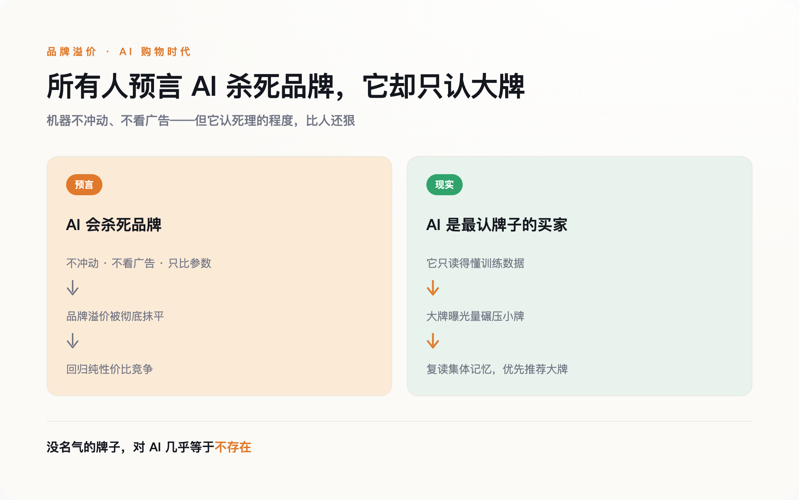
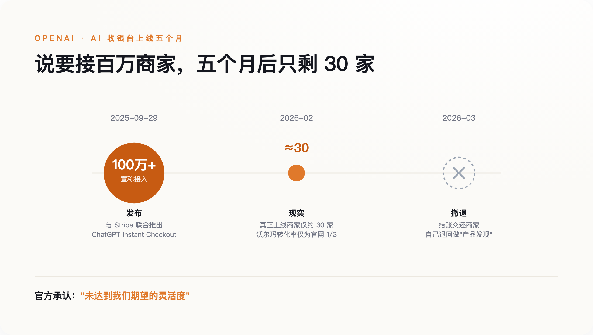

# 人人都说 AI 会终结品牌，它却是史上最认牌子的买家

> **发布日期**：2026-08-30 | **分类**：AI 商业观察

## 导语

2026 年 3 月，OpenAI 悄悄把自己半年前高调发布的"AI 收银台"撤了下来。

去年 9 月，它和 Stripe 一起宣布，你可以在 ChatGPT 里直接买东西——不用跳转，不用填地址，让 AI 替你结账。媒体给这一年起了个名字，叫"机器客户元年"。可上线只有五六个月，OpenAI 就把结账这一步交还给了商家，自己退回去做"帮你发现商品"。造出这个未来的人，第一个投了反对票。

被这半年证伪的，其实不是"AI 会不会花钱"。它证伪的，是另一个几乎所有人都深信的预言。

---

## 一、一个营销学教授，让 AI 帮他买酒

先讲一个人。

Mark Ritson 是营销科学界出了名不留情面的一个人，专栏写了二十年，最爱做的事就是拿数据打脸各种时髦说法。今年戛纳广告节前后，他挨个去问 AI：该喝什么，该买哪种护肤品。几轮下来他发现，模型递过来的几乎全是那些卖了几十上百年、人人都认得的大牌，小众牌子基本进不了它的嘴。

Ritson 给这个现象安了一个学界早有的词：流行度偏见，或者叫在位者优势。他的意思很直白：AI 给你推荐时，会不成比例地偏向那些在数据里出现得最多、被夸得最多的大牌子。

**对一个大模型来说，"知名度"不是什么虚头巴脑的品牌形象，它就是数据本身。** 一个牌子被提到得越多、被夸得越多——无论是在它训练时读过的语料里，还是在它当场检索到的网页和评价里——模型就越"看得见"它、越信任它；而一个没什么名气的牌子，在 AI 眼里几乎等于不存在，不是被比下去，是压根没进过它的视野。

问题在于，这个发现，和过去两年所有人挂在嘴边的预言，正好是反的。

## 二、"AI 会杀死品牌"——一个听上去无懈可击的预言

这两年流行一套推理：AI 买东西，不冲动，不看广告，不讲忠诚。它不会因为一句走心文案就下单，不会被货架陈列和限时折扣勾着走，也不会因为"用惯了"就懒得换。它只会把参数拉平了比——成分、价格、配送时间。于是结论顺理成章：品牌溢价会被一层层抹掉，商业退回到最朴素的性价比竞争。有营销人干脆宣布"品牌已死"，也有国内的商业媒体追问"AI 是不是正在吃掉品牌溢价"。

这套逻辑每一步听着都对：机器确实不冲动，也确实不看广告。

它错的只有一个地方，但这个地方是致命的。机器不看广告，可它"读"的是数据——不管是训练时吞下的语料，还是当场从网上抓来的商品页和评价，大牌的曝光量都碾压小牌。你以为 AI 在替你做一场冷静客观的比价，其实它是在复述整个互联网的集体记忆。而集体记忆本身，从来就偏心大牌。

这不是第一次了。搜索引擎刚普及时，也有一模一样的预言：信息一旦完美透明，消费者就会货比三家，品牌溢价撑不住。结果呢？大家反而更倾向于在搜索框里直接打出那个自己早就认识的牌子。**机器不是不认牌子，它比人还认——人有时候还会同情一下弱者、图个新鲜尝尝小众，机器只认它见过的名字。**

*图注：所有人预言 AI 会抹平品牌，实测却相反——它读的是偏向大牌的数据，等于在复读集体记忆*

## 三、那 OpenAI 为什么撤了？

如果 AI 买家对大牌这么友好，商家应该抢着上才对。可现实是，那条最风光的结账链路，自己先塌了。

把 OpenAI 这半年的时间线摊开看，落差很扎眼。2025 年 9 月发布时，官方口径是"即将接入上百万家 Shopify 商户"，还点了 Glossier、SKIMS 一串品牌的名。可到了 2026 年 2 月，业内盘点下来，真正把这个功能跑起来的商家只有大约三十家。沃尔玛试了一下，测出来 ChatGPT 里下单的转化率，只有把用户导回自家网站的三分之一。又过了一个月，OpenAI 官方承认，第一版"没能达到我们期望的灵活度"，于是把结账交还给商家，自己聚焦"产品发现"。

AI 当然会买，卡住的是整条链路——它还没准备好被机器接管。

*图注：从宣称接入百万商家，到实际约 30 家，OpenAI 的 AI 收银台上线五个月就退场*

责任归给谁，到现在都没说清。2025 年 11 月，亚马逊把 Perplexity 告了，理由是它的 Comet 代理没经许可、擅自替用户在亚马逊下单。这背后是一个没人愿意先回答的问题：AI 替你买错了、买贵了、被人钻空子骗了，账算谁的？技术这头也不结实——已经有安全研究系统性拆解过这套代理商务的协议栈，从伪造代理身份到劫持授权会话，找出了一整类结构性漏洞。一句话，让机器安全地替人花钱，本身还是个没解决的难题。

## 四、真正在发生的事，和权力去了哪

但你要是就此断定"机器买家是场空欢喜"，又看轻它了。

落地是真的，只是没在聚光灯底下。在上海，已经有人用美团的语音助手"小美"点外卖——它记得你的口味，帮你付钱，还能替你改配送地址，这不是内部试点，是天天在跑的生产系统。亚马逊那头更实在：据它自己披露，AI 购物助手 Rufus 在 2025 年带来了近 120 亿美元的增量年销售，用它的人转化率还要高出六成。机器早就在花钱了，只是它花钱的地方，安静得很。

这些变化真正撬动的，不是"品牌还存不存在"，而是"谁来当那个守门人"。

过去,守门人是搜索框，是超市货架。现在，它正在变成 AI 代理这一层——有人管它叫"代理货架"。而在这层货架上，规则对大牌明显更有利。想进超市货架，你出一笔陈列费就行；想进模型那份不成文的"默认推荐名单"——也就是那些它见过得足够多、能准确复述细节、张口就能说出来的牌子——门槛要高得多，也贵得多，你得先成为互联网上被反复提到、绕不过去的名字。Gartner 预测，到 2030 年，机器客户将直接参与或影响高达 30 万亿美元的采购。这块蛋糕真要长出来，第一口大概率还是喂给早就有名的那批人。

于是就有了一个反直觉的结论。品牌真正该做的，不是把预算一股脑砍向"机器可读的规格页和结构化数据"——那是最低门槛，做了也就是不掉队，谈不上占先。它该继续做那件最老派、最不性感的事：**把名字做大，做得被正面提到得足够多，让自己成为绕不过去的存在。知名度在 AI 时代不是过时了，它是变成了硬通货。**

AI 不会把世界推平，它只会把马太效应又拧紧一圈——有名的更有名，没名的连被看见的机会都没有。收银台最后由谁来按，其实没那么重要。重要的是，当机器替一个人做决定的那一刻，它的记忆里，到底有没有你。

## 数据来源

- [Stripe：为智能体商务开发开放标准（ACP / Instant Checkout 发布）](https://stripe.com/blog/developing-an-open-standard-for-agentic-commerce)
- [CNBC：OpenAI 在 Instant Checkout 受挫后改造 ChatGPT 购物体验（2026-03-24）](https://www.cnbc.com/2026/03/24/openai-revamps-shopping-experience-in-chatgpt-after-instant-checkout.html)
- [The Drum：Mark Ritson 谈 AI 代理正在偏向成熟大牌](https://www.thedrum.com/opinion/mark-ritson-ai-agents-are-already-learning-which-brands-to-pick)
- [Forrester：智能体商务的领跑者刚刚踩下了刹车](https://www.forrester.com/blogs/what-it-means-that-the-leader-in-agentic-commerce-just-pulled-back/)
- [Gartner / Forbes：机器客户（custobot）与到 2030 年 30 万亿美元采购的预测](https://www.forbes.com/)
- [Google Cloud：Agent Payments Protocol（AP2）与 60+ 合作机构](https://cloud.google.com/blog/products/ai-machine-learning/announcing-agents-payments-protocol-ap2)
