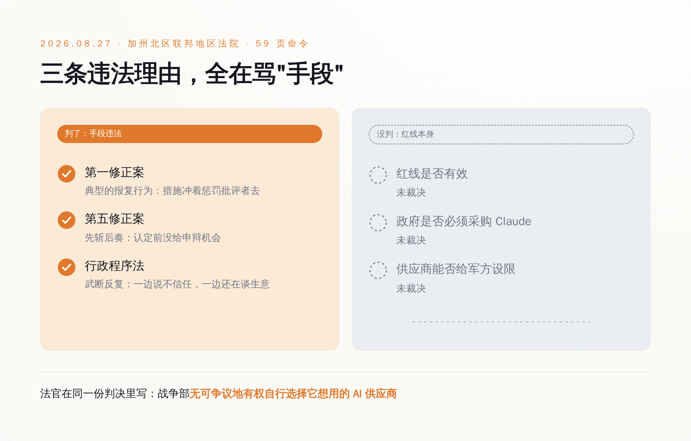
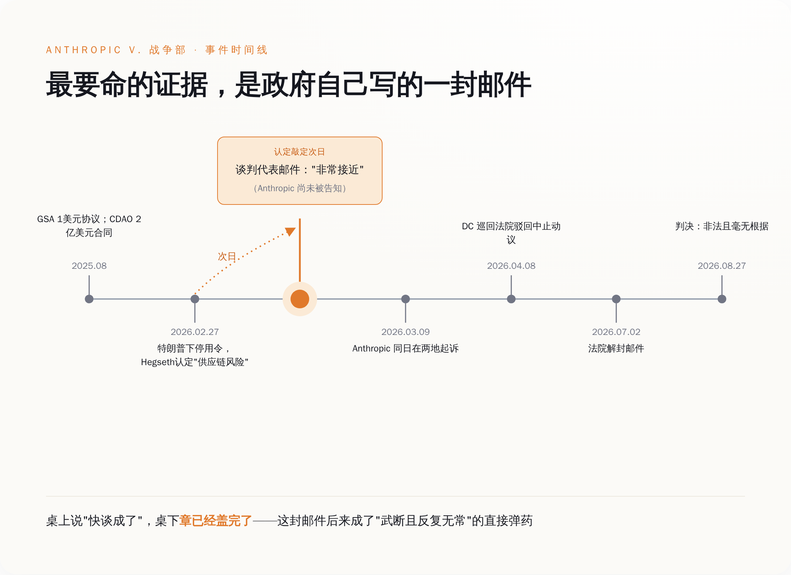
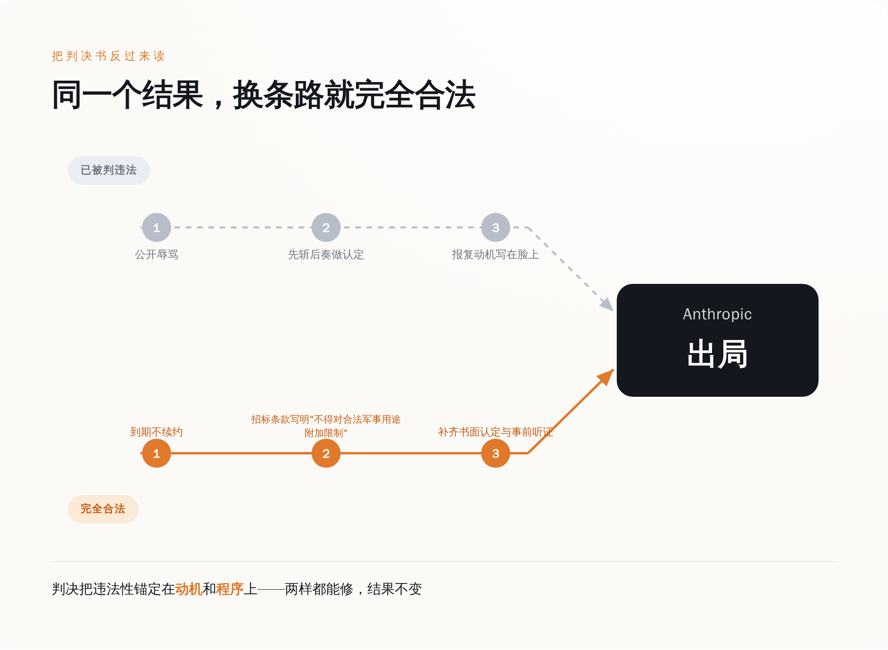
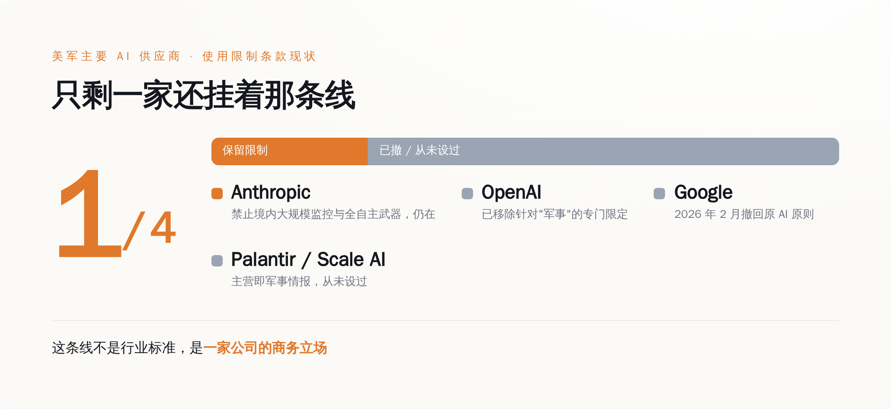

# Anthropic 告赢了五角大楼，那条红线还是一天都没赢过

> **发布日期**：2026-08-30 | **分类**：AI 治理观察

## 导语

2026 年 8 月 27 日晚，加州北区联邦地区法院法官 Rita F. Lin 签发了一份 59 页的命令，把国防部（现在叫"战争部"）按在地上摩擦了一遍。

她写：国家安全的空洞援引，不是惩罚和报复政府批评者的空白支票。她还写：这些措施出于想拿 Anthropic "杀鸡儆猴"、惩罚它批评政府时的"傲慢"，而不是基于任何站得住脚的、认为 Anthropic 真会破坏自家模型的理由。

第二天全网都在庆祝。标题清一色是"AI 安全的胜利""法院给企业良心撑腰"。

我把当天的主要报道翻了一遍——TechCrunch、NBC、CNN、The Hill、Fortune——同一份判决书里的另一句话，没有一家把它拎出来说：

**"战争部无可争议地有权自行选择它想用的 AI 供应商。"**

这句话是法官亲手写的，就写在"illegal and baseless"那句的前半段。它的意思很朴素——Anthropic 赢的是"你不能因为我批评你就整我"，不是"你必须接受我给你划的线"。

那条被吹了半年的红线，从头到尾，一天也没赢过。

---

## 一、判决书判了什么，以及它精心绕开了什么

这场胜诉拆开看，法官给出的违法理由是三条，一条不多一条不少。

第一条，第一修正案。法官认定这套操作属于"典型的第一修正案报复行为"，并且说得很直白：这些宽泛措施看起来并非针对政府自己声称的国家安全利益，它们看起来就是冲着惩罚 Anthropic 去的。

第二条，第五修正案正当程序。国防部在把 Anthropic 定成"供应链风险"之前，没给它任何事前申辩的机会——法律术语叫"剥夺前程序"，人话叫先斩后奏。

第三条，行政程序法里的"武断且反复无常"。这条最要命的证据是：国防部一边对外说不信任 Anthropic，一边还在跟 Anthropic 谈生意。法官拿这个反手打脸官方理由。

三条理由，全部指向同一件事：你处置的方式违法。没有任何一条说的是，你处置的对象合法。

判决没有认定供应商有权对军方用途单方面设限。没有强令政府必须采购 Claude。没有说 Anthropic 那两条禁令——不许拿 Claude 做美国境内大规模监控、不许拿 Claude 驱动无人类介入的全自主武器——在法律上具有任何效力。

法院给的救济是永久禁令，但禁的范围写得很精确：禁止政府"基于同一报复动机"再来一次。翻过来说就是，换个动机，或者干脆什么动机都别说出口，剩下的路是通的。

*图注：三条违法理由全部指向"手段"，红线本身在判决里一个字都没被确认*

## 二、这场架是怎么打起来的：一封晚了一天的邮件

时间线值得完整过一遍，因为这里面最好笑的部分被埋在卷宗里。

2025 年 8 月，美国总务管理局（GSA）跟 Anthropic 签了个 OneGov 协议，象征性收 1 美元，把 Claude 铺给联邦政府三大分支。同一时期，国防部首席数字与人工智能办公室（CDAO）给 Anthropic、OpenAI、Google、xAI 各批了一份上限 2 亿美元的原型合同。那会儿大家还是一家人。

矛盾出在续谈的条款上。据国会研究服务处（CRS）2026 年 4 月那份编号 IN12669 的简报，国防部要的是"完全、不受限制地访问 Anthropic 的模型"，用于"一切合法目的"。Anthropic 说其他都可以谈，两件事不行：美国境内的大规模监控，以及能自主选定并攻击目标、中途不需要人再点头的武器系统。

Anthropic 给的理由才是关键。Dario Amodei 的原话是：自主武器系统"可能对我们的国防至关重要。但今天的前沿 AI 系统，根本不够可靠到可以驱动那种不需要操作员再介入就能选定并攻击目标的全自主系统"。

这不是一句"我们不作恶"。这是一句"这玩意儿现在还不靠谱"。中间留了一个巨大的口子：等它靠谱了呢？

2026 年 2 月 27 日，特朗普下令联邦机构立即停用 Anthropic 的技术，国防部长 Hegseth 同步把 Anthropic 认定为"供应链风险"。Hegseth 说：美国的作战人员永远不会被大科技公司的意识形态心血来潮绑架，这个决定是最终的。特朗普在社交媒体上的措辞更朴素一点：Anthropic 那帮左翼疯子，他们的自私正在把美国人的命、我们的军人和国家安全置于危险之中。

3 月 9 日，Anthropic 同日在两个法院起诉。3 月 26 日拿到地区法院的初步禁令。4 月 8 日，华盛顿特区巡回上诉法院驳回了它的中止动议——这一回合是输的，而且理由很值得记住：撤销这个认定，等于逼着美军在一场正在进行的重大军事冲突当中，继续跟一个它不想要的关键 AI 服务供应商打交道。

然后是 7 月 2 日，法院解封了一批文件。

里面有 Amodei 和国防部研究与工程副部长 Emil Michael 的往来邮件。时间点是这样的：供应链风险认定最终敲定的**第二天**，五角大楼这边负责谈判的人还在邮件里说，双方"非常接近"达成一致——而此时 Anthropic 还没被正式告知自己已经被拉黑了。

一边在桌上说快谈成了，一边桌子底下章已经盖完了。这份邮件后来成了 Anthropic 论证"认定是找借口"的核心证据，也是 8 月那三条违法理由里"武断且反复无常"的直接弹药。

*图注：认定敲定的第二天，谈判代表还在说"很接近"——这封邮件后来变成了政府自己的呈堂证供*

## 三、这份判决顺手给政府写了一本合规手册

一份认定"你的动机违法"的判决，反过来读，就是一份"怎样才不违法"的说明书。这是这场胜诉最尴尬的地方。Lin 法官把违法性锚定在三个地方：报复动机、缺少事前程序、理由站不住脚。这三个地方，全都是可以修的。

想让 Anthropic 出局，且完全合法，路线大致是这样：不用发推特骂人，不用开发布会说"绝不被绑架"，不用把认定书当武器；到期不续约就行。或者在下一轮招标的技术需求里写清楚"投标方不得对合法军事用途附加使用限制"——这是采购需求，不是报复，法院管不着。再或者，走完完整的书面认定加事前听证，把程序补齐，理由写扎实。

Anthropic 一样出局，法官一样没话说。

这不是我瞎推。判决书自己那句"战争部无可争议地有权自行选择它想用的 AI 供应商"，就是法院主动划的边界。分析者说得更直接：政府随时可以停止从 Anthropic 采购，它只是不能绕开采购制度来做这件事。

美国法律里这条路早就有人走过。1996 年最高法院判过一个叫 Umbehr 的案子：堪萨斯州一个县的垃圾清运承包商，长期公开骂县委员会，结果合同没续。最高法院 7 比 2 判承包商赢，把原本只保护政府雇员的"不得因言论报复"原则，扩展到了独立承包商身上。

这个先例保护的是什么？是你骂政府的权利。它保护不了什么？它保护不了你在合同里塞进去的条款。你依然可以在下一轮招标里因为报价高、因为条件苛刻、因为对方就是不喜欢你的条款而落选。三十年前定的这个边界，2026 年一个字没变。

四月份华盛顿那个合议庭已经把态度演示得很清楚了：战时，法官对"军方不想要这个供应商"是有同情心的。

**这场胜诉真正保住的，是 Anthropic 在公开场合把话说完的权利。至于话的内容，法律一个字都没背书。**

*图注：判决把违法性锚定在动机和程序上——两样都能修，结果不变*

## 四、全行业只剩它一家还挂着这条线

还有一件事，比判决书本身更能说明这条红线的分量：它压根不是什么行业标准，它是一家公司的商务立场。

OpenAI 早就改了自家政策，把针对"军事"的专门限定拿掉了，只留一句宽泛的不得开发或使用武器，然后跟五角大楼签了部署 AI 代理的合同。Google 在 2 月撤回了它那份写着不把 AI 用于武器和监控的原则，同样拿到了那份 2 亿美元的 CDAO 合同。Palantir 和 Scale AI 更省事——它们的主营业务本来就是军事和情报，从来就没设过这种线；Palantir 的 Maven 项目扩展合同上限一亿美元，Scale AI 的"雷霆熔炉"军事规划项目也早就在跑。

给美军供货的头部 AI 公司里，撤线的撤线，本来就没线的照旧做生意，只剩 Anthropic 一家还挂着。

而 Anthropic 自己怎么说的？Amodei 公开表态："Anthropic 理解，做军事决策的是战争部，而不是私营公司。" 他还说，公司从未对具体军事行动提出反对，也没有随意限制过自家技术的使用。

一家公司，一边坚持两条禁令，一边强调自己无意替军队做决定，理由还是"技术不够可靠"而不是"这件事本身不对"——这条线的性质，从头到尾就不是道德红线，是一次技术风险评估加一场合同谈判。

它能站住，靠的从来不是宪法，是 Anthropic 手上还有别人想要的东西。

*图注：同批拿 2 亿美元合同的四家公司里，只有一家还挂着限制条款*

## 五、真正该问的问题，不在这家公司身上

裁决出来之前，Tech Policy Press 上有篇文章的标题是《Anthropic 的红线不能替代公共法律》。作者的意思是：一家没经过选举、不对公众负责的企业，凭什么替国会决定军队能用什么不能用什么。

那篇文章发在 Anthropic 输的时候，读起来像在挑刺。等 Anthropic 赢了，这句话反而更成立了。

因为这场官司从头到尾，真正被审判的东西一直是缺席的。全自主武器该不该用，美国政府能不能拿 AI 做境内大规模监控——这两个问题在法庭上一次都没有被裁决过。法院处理的是一个政府机关有没有滥用行政权力去报复批评者，这是一道程序题。

那两道实体题，本来该由国会来答。国会研究服务处在 4 月就把选项摆到了国会面前，编号 IN12669，标题里明明白白写着"给国会的潜在议题"。到 8 月底，答案还是没有。

于是就出现了现在这个局面：一件关乎战争伦理的事，唯一还在挡着的，是一家私营公司用户协议里的两行字，以及这家公司的谈判筹码够不够硬。

**能靠一纸用户协议挡住的东西，也能靠一次不续约放开。**

这不是 Anthropic 的问题，恰恰相反，它做了它能做的全部，还赢了官司。这是那个更大的空缺的问题——当一件事只剩企业条款在挡的时候，它挡不挡得住，取决于这家企业下一季度还有没有筹码，而不取决于对错。

所以下次再看到"某某 AI 公司拒绝了某项用途"这类新闻，可以少激动一点。那不是一条法律，那是一次报价。

## 数据来源

- [Fortune：法官认定五角大楼因 Anthropic 的"傲慢"而惩罚它，属违法（2026-08-28）](https://fortune.com/2026/08/28/anthropic-pentagon-ruling-rita-lin-arrogance/)
- [CNN Business：法官裁定五角大楼对 Anthropic 的供应链风险认定不合法（2026-08-27）](https://www.cnn.com/2026/08/27/tech/anthropic-pentagon-supply-chain-risk-unlawful-hnk)
- [NPR：法官称五角大楼不能把 Anthropic 认定为"供应链风险"（2026-08-28）](https://www.npr.org/2026/08/28/nx-s1-5947951/judge-says-the-pentagon-cant-designate-ai-company-anthropic-a-supply-chain-risk)
- [NBC News：联邦法官阻止五角大楼对 Anthropic 的封杀，称其"非法且毫无根据"](https://www.nbcnews.com/business/business-news/anthropic-pentagon-blacklist-claude-judge-rcna594825)
- [TechCrunch：Anthropic 在供应链风险标签一案中取得首场胜诉（2026-08-28）](https://techcrunch.com/2026/08/28/anthropic-gets-its-first-court-win-over-the-pentagons-supply-chain-risk-label/)
- [The Hill：法官裁定五角大楼的封杀违反第一修正案](https://thehill.com/policy/technology/6056436-judge-rules-pentagon-anthropic-blacklist-illegal/)
- [国会研究服务处 CRS Insight IN12669：五角大楼与 Anthropic 关于自主武器系统的争议（Kelley M. Sayler，2026-04-21）](https://www.congress.gov/crs-product/IN12669)
- [Jones Walker：两个法院，两种姿态——DC 巡回法院拒绝中止意味着什么](https://www.joneswalker.com/en/insights/blogs/ai-law-blog/two-courts-two-postures-what-the-dc-circuits-stay-denial-means-for-the-anthrop.html)
- [Lawfare：Anthropic 案中恰当的救济](https://www.lawfaremedia.org/article/the-right-remedy-in-the-anthropic-case)
- [Tech Policy Press：Anthropic 的红线不能替代公共法律](https://www.techpolicy.press/anthropics-red-lines-are-no-substitute-for-public-law/)
- [Tech Times：解封邮件显示五角大楼在拉黑前夕仍称谈判"非常接近"（2026-07-04）](https://www.techtimes.com/articles/319713/20260704/pentagon-blacklisted-anthropic-over-autonomous-weapons-limits-emails-reveal-very-close-talks.htm)
- [CNBC：国防部、Anthropic 与 AI 战争风险（2026-02-27）](https://www.cnbc.com/2026/02/27/defense-anthropic-ai-war-risks-hegseth-amodei.html)
- [Justia：Board of County Commissioners, Wabaunsee County v. Umbehr, 518 U.S. 668 (1996)](https://supreme.justia.com/cases/federal/us/518/668/)
