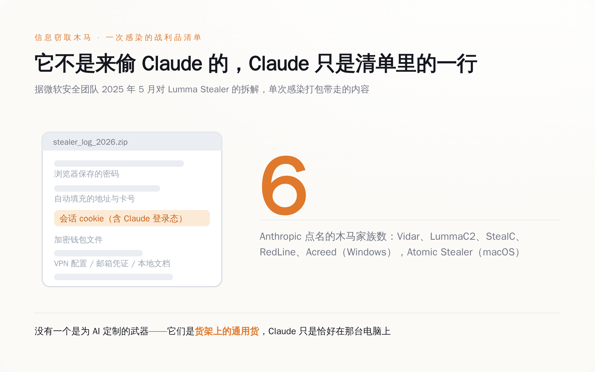
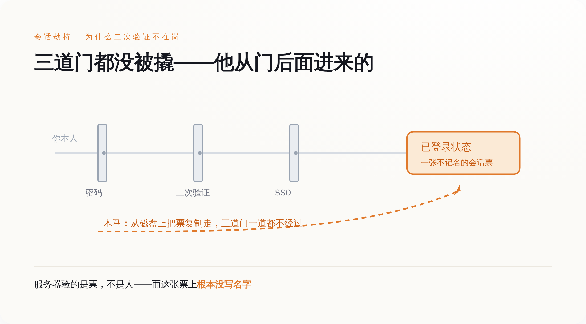
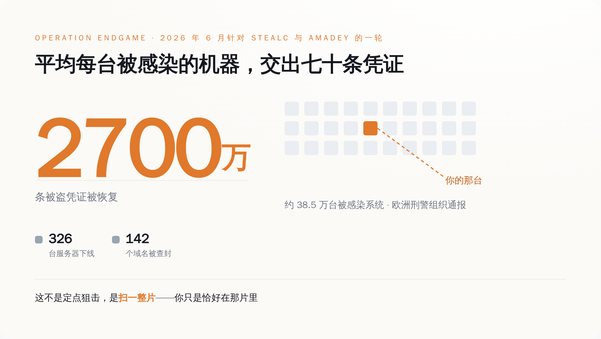
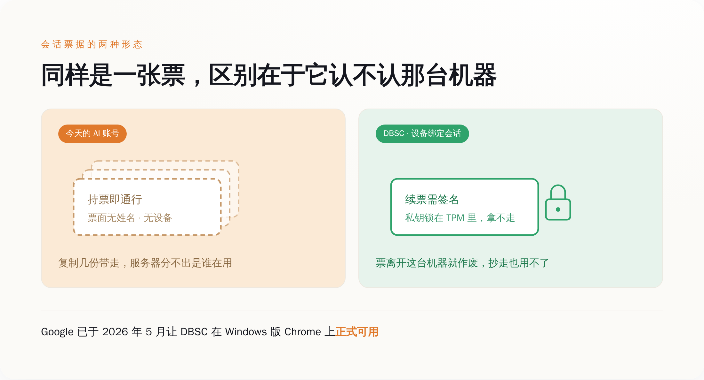

# 有人正在用你的 Claude 额度干活，而他从头到尾没输过你的密码

> **发布日期**：2026-08-31 | **分类**：AI 安全

## 导语

8 月 30 日起，一批 Claude 用户收到了一封不太寻常的邮件。Anthropic 一口气做了三件事：把他们从 Claude 强制登出，把他们存在账号里的支付方式删掉，把认定为未经授权的扣费退回去。

这套动作看上去像是 Anthropic 自己被黑了。它没有。被黑的是这些用户手上的电脑。而拿走他们账号的人，从头到尾一次密码都没输过。

---

## 一、额度自己刷新，又自己见底

Anthropic 在给受影响用户的邮件里描述了一个症状，我建议每个花钱买 AI 订阅的人都把它记住：如果你的用量额度看起来刷新了，然后在你根本没用 Claude 的时候被抽干，那多半就是这件事。

英文原话是 "If your usage limits looked like they refilled and then drained while you weren't using Claude, this was likely the cause."

这句话值得单拎出来，因为它描述的是一种以前不存在的受害体验。银行卡被盗刷，你看到的是余额少了；邮箱被盗，你看到的是发件箱里躺着几封你没写过的信；网盘被盗，你看到的是文件被下载过。这些东西都有一个共同点——你能看出来"东西没了"。

AI 订阅不一样。额度被偷走，你看到的是"今天怎么这么早就用完了"。

所以第一反应不会是报警，甚至不会是查账号。第一反应是骂厂商：又偷偷降额度，又暗改限制，又不给个说法。骂完关掉页面，明天接着骂。你被偷了一个多月，情绪上却一直觉得自己是在跟客服吵架。

Anthropic 这次点了名，六个恶意软件家族：Windows 上的 Vidar、LummaC2、StealC、RedLine、Acreed，以及少量 Mac 上的 Atomic Stealer。这五六个名字不用记，它们干的事一模一样，区别只是谁写的代码、谁在卖。这份名单里没有一个是为 AI 定制的武器。它们全都是这个行业里跑了好几年的通用货，专业名字叫信息窃取木马（infostealer），业务范围是把一台电脑上所有能卖钱的东西打包带走。Claude 不在它们的靶心上，Claude 只是恰好在那台电脑上。

Anthropic 自己也把话说死了："We have no reason to believe that this malware is related to Claude, installed through Claude, or related to anything you did with Claude."——跟 Claude 无关，不是通过 Claude 装上的，也不是你在 Claude 里做了什么导致的。它补了一句，这类东西通常随着非官方下载或者恶意应用一起进来。

盗版游戏，破解软件，假安装包，那个"绿色版"的解压工具。就这些。

话说到这个份上，剩下的问题就只有一个：这次到底波及了多少账号、涉及多少钱、退了多少款。截至本文写作，Anthropic 一个数字都没有公布，受影响账号数没有，金额没有，退款总额也没有。

*图注：木马一次打包带走的是整台电脑的登录状态，Claude 的会话只是清单里的一行——你不是被针对，你是被顺手拿走的*

## 二、他没输过密码，因为根本不需要

微软安全团队在 2025 年 5 月拆解 Lumma Stealer 时，把这类木马的取货范围写得很直白："Lumma Stealer extracts saved passwords, session cookies, and autofill data from Chromium (including Edge), Mozilla, and Gecko-based browsers."

保存的密码，会话 cookie，自动填充数据。请注意中间那一项。

密码是"证明你是你"的东西，会话 cookie 是"已经证明过了"的收据。你的二次验证、你的短信、你的指纹、你公司的 SSO（统一登录），全都发生在登录那一瞬间；这一瞬间过完，服务器就发给浏览器一张票，接下来几天几周你每一次刷新页面，验的都是这张票，不再验你的人。

木马把这张票复制一份带走，服务器那头看见的仍然是一张合法的票。它不知道拿票的人已经换了。它没有办法知道——这张票上根本没写名字。

同一份微软报告列出的打包清单，值得逐项念一遍：浏览器里保存的密码，会话 cookie，自动填充的地址和卡号，MetaMask、Electrum、Exodus 这类加密钱包的文件，VPN 配置，邮箱凭证，FTP 客户端的数据，Telegram 的登录状态，桌面上的 .pdf、.docx、.rtf 文档，最后再附一份这台机器的系统信息。你的 Claude 会话只是这张清单里的一行，排在自动填充后面，排在钱包前面。

这个产业的规模，执法机关自己给过数字。微软数字犯罪部门 2025 年 5 月 21 日联合多国执法机构打击 Lumma，通报里的数字是：约 2,300 个恶意域名被查封或暂停；在 3 月 16 日到 5 月 16 日这两个月的窗口里，识别出超过 39.4 万台被感染的 Windows 设备。欧洲刑警组织的 Operation Endgame 行动在 2026 年 6 月针对 SocGholish、StealC、Amadey 这几个家族又打了一轮，通报的合计数字是：下线 326 台服务器和 142 个域名，从大约 38.5 万台被感染的系统里恢复出约 2,700 万条被盗凭证。

38.5 万台机器，2,700 万条凭证，平均每台机器七十条。

这就是为什么你不该问"我为什么被针对"。你没有被针对。有人扫了一整片，你在那片里，你的 Claude 在你的电脑里，仅此而已。

*图注：密码、二次验证、SSO 全都守在登录那一瞬间；会话票据发出之后的日子里，它们一个都不在岗*

## 三、为什么偏偏现在轮到 AI 账号

赃物是有行情的，这行的人比你更懂什么值钱。

Group-IB 在 2023 年 6 月发过一份报告：2022 年 6 月到 2023 年 5 月之间，他们在 Raccoon、LummaC2、RedLine 这些窃取木马的日志里找到了超过 10 万条 ChatGPT 账号凭证，光是 2023 年 5 月一个月就新增 26,800 条，按地区分，亚太最多，约 4.1 万条。那个时候这些凭证的卖点还是"里面有聊天记录"——买家想看的是别人往对话框里粘了什么公司文件。

三年过去，卖点变了。现在偷的不是你说过什么，是你还能用多少。

订阅制自己把一件东西做成了商品：额度。而额度作为赃物，有三个让同行眼红的属性。

第一，它不需要洗。偷银行卡得洗钱，偷加密钱包得过混币器，中间层层抽成，风险全在变现那一步。AI 额度不用——它本身就是能直接花掉的东西，花掉的形态是算力。小偷不需要把它换成钱，他只要拿它去干活。

第二，它有下游，而且下游的胃口大得吓人。Sysdig 的威胁研究团队 2024 年 5 月披露过一类叫 LLMjacking 的攻击：攻击者拿被盗的云凭证，去跑受害者账号底下的大模型推理服务，报告里给出的数字是，被劫持的 Claude 2 类模型可以让受害者一天产生高达 46,000 美元的消耗，不加控制的情况下单次行动一天能烧掉超过 10 万美元。那次偷的是云 API 凭证，不是浏览器里的会话 cookie，路径完全不一样；但它证明的是同一件事——算力本身就是能直接花掉的赃物，而且花起来很快。

顺着这个差别再走一步：按量计费的云账单会给你告警，包月订阅不会。攻击者薅的是你的限额，你连一条扣款短信都收不到。

第三，受害者发现得慢。慢到什么程度？慢到你会先怪厂商，再怪自己昨晚多问了几个问题，最后才怀疑账号。

Anthropic 的用户条款里写着，你不得把账号登录信息、API key 或账号凭据分享给任何人，也不得让别人使用你的账号。这条款是写给你看的，用来在出事时界定你的责任。

对面那个人不看条款。他甚至不需要你的账号——他要的是你的限额，用完这个月，下个月他还在。

*图注：38.5 万台机器、2,700 万条凭证，是欧洲刑警组织 2026 年 6 月一轮行动里恢复出来的数字——平均每台机器七十条*

## 四、删掉你存的银行卡，是它能做的全部

回头看 Anthropic 那三个动作，每一个都值得拆开——强制登出，杀掉的是那张被复制走的票。杀不掉的是那台机器上还活着的木马。你登出，你再登进去，浏览器发一张新票，木马把新票再抄一份——它一直在那儿，它的工作时间是 7×24。

删掉已保存的支付方式，这一步最说明问题。Anthropic 给的建议是：确认电脑上的恶意软件彻底清干净之后，再把支付方式加回去。翻过来说就是——在你证明自己那台机器是干净的之前，我们不打算让这个账号还有花钱的能力。它没有明说，但这个动作等于承认了一件事：一个 AI 订阅账号，本质上是一个绑着卡、能自动续费、能升级套餐的钱包。

退款，是把它自己认定为未经授权的扣费还回去。谁来认定，认定的标准是什么，一样没有公布。

三件事全部发生在你这一侧。因为漏洞确实不在它那儿——木马是你自己电脑上的，这一点 Anthropic 说得没错，也没什么好赖的。

但"漏洞不在我这儿"和"我什么都做不了"，是两码事。浏览器行业已经在同一个问题上打了整整两轮。

第一轮是 Chrome 在 2024 年 7 月随 127 版本在 Windows 上推的 App-Bound Encryption，思路是把 cookie 的加密和 Chrome 这个应用本身绑定，木马想拿到 cookie 就得先拿到系统级权限或者往 Chrome 进程里注代码，动静大到杀软能看见。公开报道随后给出的结果是：这道墙立起来没多久，Lumma、Vidar、StealC、Rhadamanthys 这些家族就陆续跑出了绕过版本。

第二轮才是真正打在要害上的那一拳，叫 DBSC，设备绑定会话凭据。建立会话的时候浏览器生成一对公私钥，私钥塞进 TPM（主板上专门存密钥、只进不出的那块芯片）里出不来，之后浏览器必须周期性地证明"我持有这把私钥"才能把票续下去。票据从此和这台设备长在一起，抄一份走没有用，因为抄不走那把钥匙。Google 在 2026 年 5 月宣布 DBSC 在 Windows 上的 Chrome 里正式可用。

顺带说一句，这两轮升级到目前为止都发生在 Chrome 里。你要是平时用 Safari 或者 Firefox 登录 Claude，等于连这两轮都没赶上，风险只会更高，不会更低。

所以真正该问的问题不是"用户为什么要装盗版游戏"。真正该问的是：AI 厂商什么时候把会话绑到设备上。

在那之前，**你的"已登录"就是一张不记名的票，谁捡到算谁的**。

*图注：不记名的票谁捡到都能用；绑了设备的票离开那把硬件里的钥匙就是一张废纸——这是行业已有的答案，只是还没轮到 AI 厂商*

## 五、防的是冒充你的人，来的是直接用你的人

如果你怀疑自己中招了，顺序很要紧，做反了等于白做：先清机器，再作废会话，最后才改密码。这个顺序不能倒过来——木马还在跑的时候你改的密码、你重新登录换来的新会话，会在几分钟内被同一个东西抄走第二遍，你只是给对方换了一张更新鲜的票。

"清机器"这三个字比看上去难。这类木马里有相当一部分是一次性的：偷完就自删，杀毒软件事后再扫，报告干干净净，而你的凭证已经躺在别人的日志包里了。所以别拿"我杀毒软件说没事"当结论——换一款你日常不用的反恶意软件做一次全盘扫描；如果这台机器上装过任何破解工具、盗版游戏、来源不明的安装包，最彻底的做法是重装系统。

然后去 Claude 的设置里，账户那一栏往下拉，有一个活跃会话列表，能看到每个设备、大致位置和最后活跃时间。"登出所有设备"会把除当前之外的会话全部作废；单条会话旁边的三点菜单里有终止，点下去那台设备的令牌立刻失效。用 Claude 账号登录过 Claude Code 的，还要去设置里的 Claude Code 那一栏，把授权令牌一并删掉。

改密码要改两处：登录 claude.ai 的账号密码是一处；如果你的邮箱密码、系统密码跟这台机器上保存过的密码有重复，一并换掉——被打包带走的从来不只是 Claude 那一行。

用 API key 写程序的，这条同样适用。木马从 `.env`、配置文件、环境变量里把 key 原样捞走，跟捞 cookie 是同一个动作、同一个日志包。去 Console 的 API Keys 页面吊销旧的、生成新的，别等到账单上出现你没跑过的推理。

支付方式最后再说。确认机器干净之前，别急着加回去。

这些年安全行业教给普通人的所有东西——设一个长密码，开二次验证，绑手机，接短信，用指纹——保护的都是同一个瞬间：你走进门的那一下。整条防线全部堆在门口。

而这批人不进门。他们等你自己走进去，然后把你落在门里的那张票拿走。

所以下次再有人问你账号安全做得怎么样，"我开了二次验证"不是一个答案。**二次验证防的是想冒充你的人。现在这批人不冒充你，他们直接用你。**

## 数据来源

- [Microsoft Security Blog：Lumma Stealer — breaking down the delivery techniques and capabilities of a prolific infostealer（2025-05-21）](https://www.microsoft.com/en-us/security/blog/2025/05/21/lumma-stealer-breaking-down-the-delivery-techniques-and-capabilities-of-a-prolific-infostealer/)
- [Microsoft On the Issues：Microsoft leads global action against favored cybercrime tool（Lumma 打击行动通报，2025-05-21）](https://blogs.microsoft.com/on-the-issues/2025/05/21/microsoft-leads-global-action-against-favored-cybercrime-tool/)
- [Anthropic 给受影响用户的通知邮件（2026-08-30 起发出，本文英文引语出自该邮件，经多家安全媒体转述）](https://www.bleepingcomputer.com/news/artificial-intelligence/anthropic-warns-infostealer-malware-is-hijacking-claude-sessions-to-drain-usage/)
- [Europol Newsroom：Operation Endgame 历次行动通报（2026-06 针对 SocGholish / StealC / Amadey 一轮）](https://www.europol.europa.eu/media-press/newsroom)
- [Group-IB：Stealers ChatGPT Credentials（2023-06）](https://www.group-ib.com/media-center/press-releases/stealers-chatgpt-credentials/)
- [Sysdig Threat Research：LLMjacking — Stolen Cloud Credentials Used in New AI Attack（2024-05）](https://www.sysdig.com/blog/llmjacking-stolen-cloud-credentials-used-in-new-ai-attack)
- [Google Chrome：Device Bound Session Credentials 在 Windows 上正式可用（2026-05）](https://workspaceupdates.googleblog.com/2026/05/prevent-account-takeovers-with-DBSC-now-generally-available-in-the-Chrome-browser-for-Windows.html)
- [Google Security Blog：Protecting cookies with Device Bound Session Credentials](https://blog.google/security/protecting-cookies-with-device-bound-session-credentials/)
- [Anthropic Help Center：How do I log out of all active sessions?](https://support.claude.com/en/articles/10310342-how-do-i-log-out-of-all-active-sessions)
- [Anthropic Consumer Terms of Service](https://www.anthropic.com/legal/terms)
