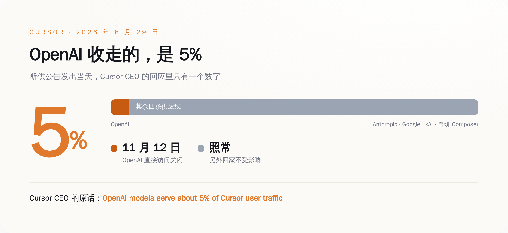
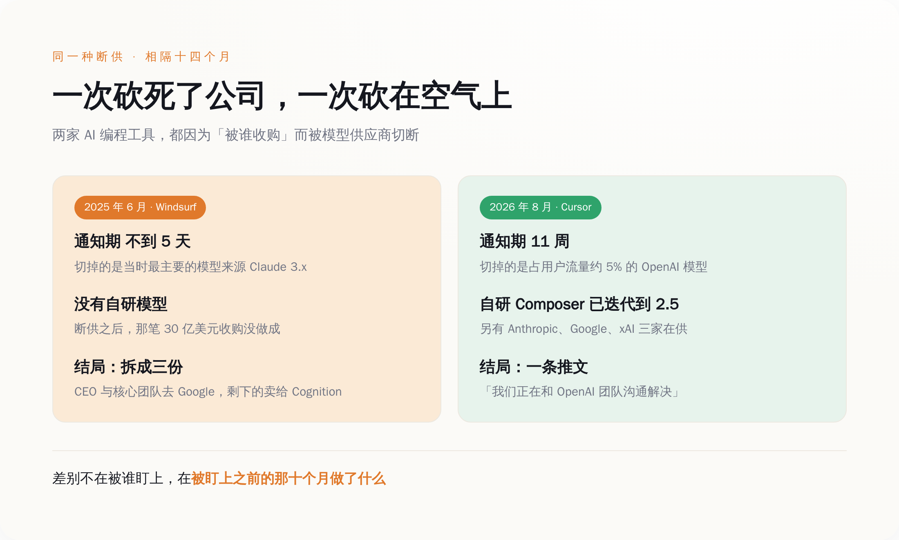
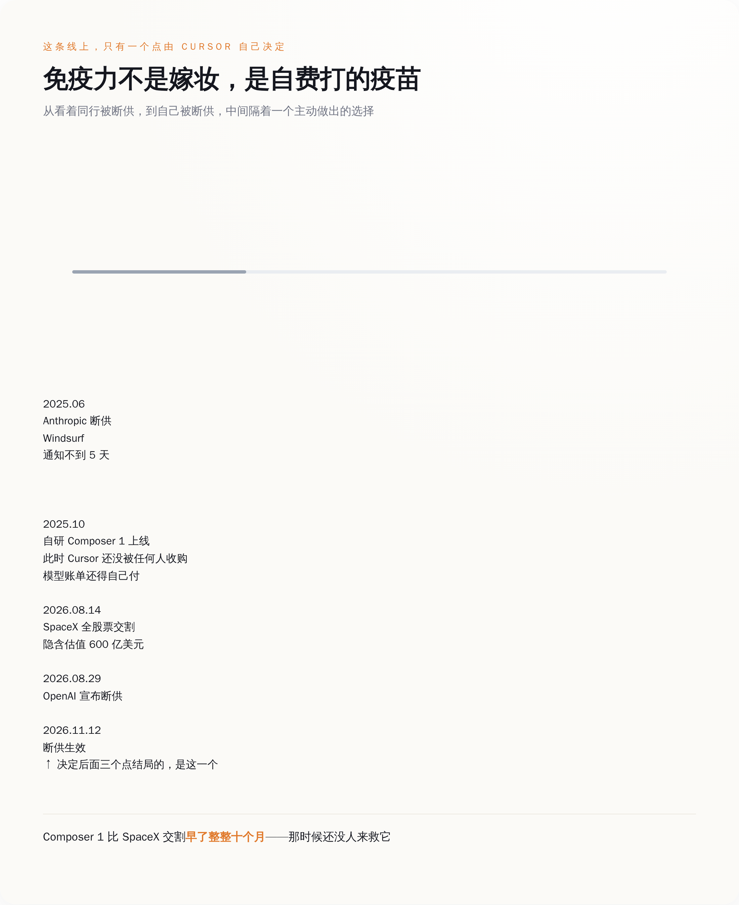

# OpenAI 断了 Cursor 的模型，Cursor 回了句"你占我 5%"——上一家被这么断的公司，已经散成三份了

> **发布日期**：2026-09-01 | **分类**：AI 行业

## 导语

8 月 29 日，周六，OpenAI 发了条公告，说要停止向 Cursor 供应自己的模型，日子定在 11 月 12 日。

理由不是 Cursor 干了什么，是 Cursor 被谁买了。很快，Cursor 的 CEO 在 X 上回了一条。那条回复里有个数字，比 OpenAI 的整份公告都值钱：5%。

---

## 一、被掐脖子的那家，当天在算百分比

8 月 14 日，SpaceX 完成了对 Anysphere 的收购。Anysphere 是 Cursor 的母公司。全股票交易，Cursor 的普通股和优先股换成约 3.89 亿股 SpaceX A 类股，隐含估值 600 亿美元。这被称为有记录以来最贵的一笔创业公司收购。

十五天后，OpenAI 在自己的 X 账号上发了公告：

> "We're ending our partnership with Cursor following its acquisition by SpaceX. Under our proposal, Cursor's direct access to our models would end on November 12."

配套的声明里，把理由讲得很直：

> "We are making this choice because we cannot be confident that SpaceX will use our technology within our terms of service, based on our experience with Elon Musk's companies violating contracts."

一句话：你现在归马斯克了，马斯克的公司有违约前科，我不卖给你了。

Cursor 联合创始人兼 CEO Michael Truell 的回复很短：

> "We're sorry to see that OpenAI put out a note saying they plan to block Cursor users from accessing OpenAI models in three months. OpenAI models serve about 5% of Cursor user traffic, and we're speaking with the OpenAI team to resolve this."

遗憾，三个月，5%，还在谈。四个信息点，就把这件事从"生死危机"降格成了"供应商变动通知"。

马斯克本人的反应更省事，X 上四个词：**"I couldn't care less."**

同一个晚上，Anthropic 联合创始人兼首席运营官 Tom Brown 在 X 上发了这么一条：

> "Cursor has been a trusted partner of Anthropic since Sonnet 3.5. We'll continue to increase compute to support Claude models in Cursor and are excited for what comes next with them at SpaceX."

同一桩收购，OpenAI 读出的是"不能信任"，Anthropic 读出的是"期待接下来在 SpaceX 的发展"。这两句话隔了不到二十四小时。

一家宣布断供，另一家宣布加供，被断的那家说你占我 5%。这个场面不太像掐脖子，更像有人在群里退了群，还发了条公告解释为什么退，而群里剩下的人正在讨论中午吃什么。

*图注：OpenAI 收走的是 5%，Cursor 的另外 95% 分给了 Anthropic、Google、xAI 和自研的 Composer*

## 二、上一次这么断的时候，通知期不到五天

要理解 5% 这个数字有多贵，得回到 2025 年 6 月。

那年 5 月 6 日，彭博社报道 OpenAI 已就以约 30 亿美元收购 Windsurf 达成协议。那是当时最被看好的 AI 编程工具之一，也是 Cursor 最直接的对手。

不到一个月，Anthropic 动手了。6 月 3 日，Windsurf 的 CEO Varun Mohan 在 X 上写道：

> "With less than five days of notice, Anthropic decided to cut off nearly all of our first-party capacity to all Claude 3.x models."

不到五天通知，砍掉几乎全部 Claude 3.x 的直供容量——不是限流，是把它从 Anthropic 的一手客户名单上划掉。Mohan 还说了一句更难受的：Windsurf 是愿意照单付钱的。钱不是问题，问题是它要被谁买。

Anthropic 联合创始人兼首席科学官 Jared Kaplan 后来在一场公开场合把话说得很坦白：

> "It would be odd for us to be selling Claude to OpenAI."

把 Claude 卖给 OpenAI 用，那多奇怪啊。

这话没什么好反驳的。奇怪的是后面发生的事：Windsurf 被切断模型访问之后，那笔 30 亿美元的收购最终没做成。2025 年 7 月，Google 花约 24 亿美元把 Windsurf 的 CEO Varun Mohan、联合创始人 Douglas Chen 和核心团队整队挖走，走的是"许可 + 招人"的路子，不买公司。7 月 14 日，Cognition——做 Devin 那家——宣布收购 Windsurf 剩下的 IP、产品、商标和团队。

从被断供那天算起，一个半月，一家公司被拆成三份：人去了 Google，壳和产品去了 Cognition，原本的收购方 OpenAI 空手而归。

把两次并排放：Windsurf 那次，通知期不到五天，砍的是它最主要的模型来源，砍完公司没撑住；Cursor 这次，通知期十一周，砍的是占它 5% 流量的东西，被砍的人当天发推说我们再谈谈。

同样的动作，同一个行业，中间隔了十四个月。差别不在运气。

*图注：十四个月，两次因收购而起的断供——通知期从不到五天变成十一周，结局从公司拆成三份变成一条推文*

## 三、那 5% 是花十个月买回来的

Windsurf 出事的时候，Cursor 在场。

2025 年 10 月，Cursor 发布 2.0 版本，同时端出了 Composer 1——它自己训的编程模型。之后一路迭代，Composer 1.5、Composer 2、Composer 2.5 一版接一版地出，到今天，Cursor 的 Auto 模式经常直接把请求交给自研模型来跑。

Composer 1 发布是 2025 年 10 月，SpaceX 完成收购是 2026 年 8 月 14 日，中间隔了整整十个月。

也就是说，Cursor 把 OpenAI 从主力降到 5% 这件事，不是当上 SpaceX 子公司之后才有底气干的，是它自己在还没卖身、还得自己交模型账单的日子里，一行行代码干出来的。免疫力不是嫁妆，是自费打的疫苗。

动机也不神秘。Cursor 这类工具的商业模型有个公开的丑处：营收看着漂亮，钱大半流向模型商。社交媒体上流传过一份基于公开信息的测算，说 Cursor 在截至 2026 年 1 月的那个季度毛利率是负的——每收进 1 美元，要付出去 1.2 美元出头的 API 成本。这个数字来自第三方推算而非财报，谁也没法拿它当铁证，但方向上跟多家媒体的定性报道是一致的：Cursor 长期被上游成本压着，自研模型是它给自己止的血。

到 2026 年 8 月，Cursor 的模型菜单上摆着五家：OpenAI、Anthropic、Google、xAI 的 Grok，以及自家的 Composer。OpenAI 是这五个里最能被拿掉的那个。

**所以 OpenAI 这一刀砍下去的时候，砍到的是它自己十个月前就已经被挪开的位置。**

*图注：Windsurf 被断供 → Cursor 自研模型上线 → SpaceX 交割 → OpenAI 断供，这条线上真正决定结局的是第二个点*

## 四、OpenAI 拿出的前科，是马斯克在自己输掉的官司里说的一个词

OpenAI 声明里给了两条依据，两条都值得查一下。

第一条：马斯克收购 Twitter 之后，那家公司违反了与 OpenAI 的合同条款。这条我查不到细节。哪份合同、什么时候签的、违反了哪一条、有没有走过法律程序，公开报道里一概没有，所有媒体转述的都是 OpenAI 声明里的同一句话。它可能完全属实，但现在它只是一方的说法。

第二条更具体：马斯克本人在宣誓作证时承认，xAI 违反过 OpenAI 的服务条款。这条能查到，而且现场比声明里写的有意思得多。

2026 年 4 月 30 日，加州奥克兰联邦法院，一场陪审团审判的第四天。案子叫 Musk v. Altman——注意原告是马斯克，他告的是 Sam Altman 和 Greg Brockman，说这两个人背离了 OpenAI 的非营利初衷。他是自己走进法庭的。

庭上，对方律师问他，xAI 有没有"蒸馏"过 OpenAI 的模型来训练 Grok——说白了，就是拿人家模型吐出来的答案当教材，喂自己的学生——律师要一个是或者不是。

马斯克说：**"Partly."**

一部分。

三周后的 5 月 18 日，陪审团讨论了不到两个小时，一致判他败诉。输的理由跟对错无关，是他这官司告得太晚，过了加州三年的诉讼时效。马斯克在 X 上说这是日历上的技术性问题，扬言上诉。

所以 OpenAI 手里这份"前科"，完整版长这样：马斯克自己跑去起诉别人，在自己发起的庭上被问住，答了一个词，最后官司还输了。当时的报道措辞相当克制，只说这种做法"看起来违反"服务条款；OpenAI 引用的时候，把"看起来"三个字直接抹了。

OpenAI 有没有道理，其实不重要。它根本不需要有道理。

商业合同里有一类东西叫控制权变更条款。它的作用就是：当你的股东结构发生特定变化，我可以走人，不需要证明你做错了什么。援引条款和讲道理是两码事。OpenAI 把理由写得声情并茂，是公关动作；真正让它能在十五天内下手的，是那张纸上早就有的一行字。

## 五、条款是老的，依赖是新的

控制权变更条款一点都不新鲜。做企业软件的合同里几乎全都有。

它的通行写法大同小异：客户的控制权发生变更，尤其是被供应商的直接竞争对手拿下过半权益时，供应商有权终止协议，或者重新坐下来谈。这是并购尽调里的标准检查项，律师们管它叫高风险条款，因为一个供应商的同意权就能把整笔交易拖住或者抬价。

条款存在很多年了。有意思的地方在于，你几乎找不到它被真正按下去的公开案例。云厂商、SaaS 厂商、数据库厂商，人人都写，但真到客户被竞争对手收购那天，大多数时候的结果是重新谈价钱，不是断供。

因为在 SaaS 时代，断供是核武器——你把客户的 CRM 关了，客户去用别家的 CRM，功能差不多，你损失一个大客户，客户损失两个月的迁移工期。核弹按下去，双方一起难看，还没什么用。

模型层不一样。同一个产品换掉底层模型，用户当天就能感觉到手感变了：补全的节奏、改多文件时的判断、犯蠢的方式，全都换了一套。所以在模型层，这个开关第一次真正有了威慑力。

然后事实是：这个刚刚变得有威慑力的开关，十四个月里被按了两次。第一次按死了一家公司，第二次按在空气上。

区别只有一个——第二家公司提前十个月开始，把自己的产品能力从任何一家供应商身上拆下来。

这件事没有什么高深道理。它只是把一句老话重新算了一遍账：核心能力如果是租来的，你的估值里就永远藏着一张别人手上的期权。行权不要钱，也不用跟你商量，条件只有一条——"你的股东名单让我不高兴"。

Cursor 现在值 600 亿。Windsurf 曾经差 30 亿成交。两家都被同一种条款瞄准过。

区别是，一家在被瞄准之前，就自己动手把靶心挪开了。所以 11 月 12 日那天，OpenAI 走的时候只能带走 5%。

## 数据来源

- [OpenAI 官方 X 账号 2026-08-29 的断供公告原帖](https://x.com/OpenAI/status/2093515564786540695)
- [Michael Truell（Cursor 联合创始人兼 CEO）2026-08-29 的 X 回应原帖](https://x.com/mntruell/status/2093532254006063557)
- [OpenAI to end model access to Cursor after acquisition by Elon Musk's SpaceX（CNBC，2026-08-29）](https://www.cnbc.com/2026/08/29/openai-cursor-spacex-model-access.html)
- [OpenAI cuts off Cursor after SpaceX acquisition, citing Musk's history of breaking contracts（The Decoder）](https://the-decoder.com/openai-cuts-off-cursor-after-spacex-acquisition-citing-musks-history-of-breaking-contracts/)
- [Cursor customers will lose access to OpenAI coding models in November（InfoWorld）](https://www.infoworld.com/article/4216503/cursor-customers-will-lose-access-to-openai-coding-models-in-november.html)
- [Tom Brown（Anthropic 联合创始人兼 COO）2026-08-29 的 X 原帖](https://x.com/NotTomBrown/status/2093541294027280657)
- [Varun Mohan（Windsurf CEO）2025-06-03 的 X 原帖："With less than five days of notice…"](https://x.com/_mohansolo/status/1930034960385356174)
- [Windsurf says Anthropic is limiting its direct access to Claude AI models（TechCrunch，2025-06-03）](https://techcrunch.com/2025/06/03/windsurf-says-anthropic-is-limiting-its-direct-access-to-claude-ai-models/)
- [Anthropic co-founder on cutting access to Windsurf: 'It would be odd for us to sell Claude to OpenAI'（TechCrunch，2025-06-05）](https://techcrunch.com/2025/06/05/anthropic-co-founder-on-cutting-access-to-windsurf-it-would-be-odd-for-us-to-sell-claude-to-openai)
- [Anthropic Cuts Windsurf's Claude Access Before OpenAI Acquisition（Forbes，2025-06-05）](https://www.forbes.com/sites/johanmoreno/2025/06/05/anthropic-cuts-windsurfs-claude-access-before-openai-acquisition/)
- [Cognition to buy AI startup Windsurf days after Google poached CEO（CNBC，2025-07-14）](https://www.cnbc.com/2025/07/14/cognition-to-buy-ai-startup-windsurf-days-after-google-poached-ceo.html)
- [Cognition, maker of the AI coding agent Devin, acquires Windsurf（TechCrunch，2025-07-14）](https://techcrunch.com/2025/07/14/cognition-maker-of-the-ai-coding-agent-devin-acquires-windsurf/)
- [Elon Musk testifies that xAI trained Grok on OpenAI models（TechCrunch，2026-04-30）](https://techcrunch.com/2026/04/30/elon-musk-testifies-that-xai-trained-grok-on-openai-models/)
- [Elon Musk Admits xAI Used OpenAI Technology To Train Its Own Models（Forbes，2026-04-30）](https://www.forbes.com/sites/antoniopequenoiv/2026/04/30/elon-musk-admits-xai-distilled-openai-data-to-train-models-heres-what-that-means/)
- [Musk testimony dominated first week of Musk v. Altman trial in Oakland（CNBC，2026-05-02）](https://www.cnbc.com/2026/05/02/musk-testimony-dominated-first-week-musk-v-altman-trial-in-oakland.html)
- [Jury throws out Elon Musk's lawsuit against OpenAI and Sam Altman in less than two hours（NBC News，2026-05-18）](https://www.nbcnews.com/tech/tech-news/openai-elon-musk-case-verdict-rcna345655)
- [Musk slams Altman trial verdict as a 'technicality,' vows to appeal（CNBC，2026-05-18）](https://www.cnbc.com/2026/05/18/musk-altman-openai-trial-verdict.html)
- [Change of Control 条款在 SaaS 合同中的普遍性与文本示例](https://gc.ai/clauses/change-of-control)
