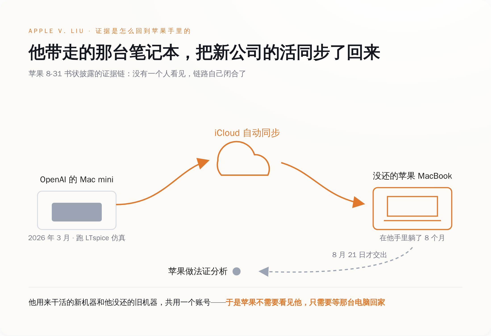
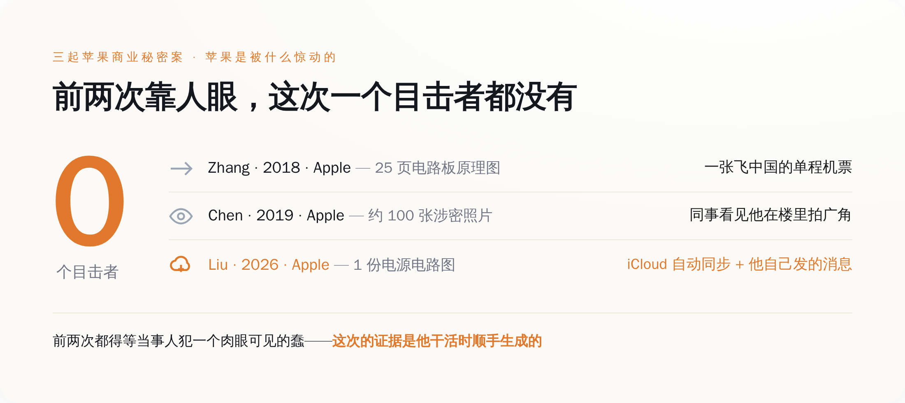
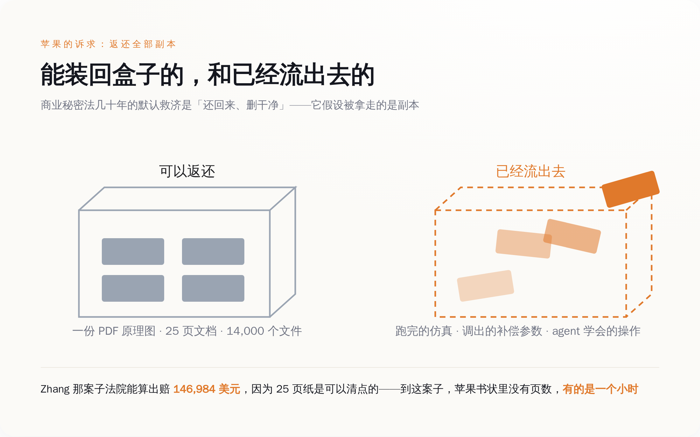

# "过去一小时，我的 agent 学会了跑 LTspice"——苹果把这句话交给了法院

> **发布日期**：2026-09-02 | **分类**：AI 行业

## 导语

8 月 31 日苹果递进法院的那份材料里，有一句话不是律师写的，是被告自己写的。一行英文，讲他刚刚发现的一件很爽的事。

苹果给这份材料的定语是：shocking。

材料递到的地方是加州北区联邦地区法院，目的是请 Edward J. Davila 法官批准"加速取证"——原告绕过正常的取证排期，要求法院立刻放行调查。法院一般不轻易批，除非你能说服它：再等下去，东西就没了。

---

## 一、他没还的那台笔记本，一直在替苹果记账

Chang Liu 在苹果干了八年，职位是 senior system electrical engineer——高级系统电气工程师，管电的那种。2026 年 1 月，他离职去了 OpenAI。

走的时候，苹果配给他的那台 MacBook 没有还。

苹果最早盯上他，用的还是老办法。7 月 10 日提交的那份诉状（案号 5:26-cv-07078）里，苹果的证据是访问记录和下载记录：Liu 离职后仍然能进苹果的内部网络存储，靠的是一个身份验证上没修好的洞；他在入职 OpenAI 之后的几周里下载了数十份苹果机密硬件文件，累计超过一千页，按诉状的说法是"机密技术演示、表格、PDF 和书面工作成果"。

到这一步为止，一切都还很传统：谁在什么时候登录了什么、拉走了多少东西。服务器日志能告诉你的，就这么多。

8 月 31 日那份新材料要回答的是下一个问题：东西拉走之后，被拿去干了什么。（顺带说清用词：7 月 10 日那份叫诉状，是立案时递的起诉书；之后每次要求法官做点什么另外递的文件叫书状，8 月 31 日这份是其中一份。）

苹果称，2026 年 3 月，也就是他离职两个月后，Liu 下载了一份苹果的电源转换电路原理图，把它装进 LTspice 跑了仿真——这是电源工程师的日常工具，用来在焊出实物之前先算一遍电路会怎么表现。跑完之后，他发消息告诉别人，这次仿真是为了电源转换方面的开发工作。

苹果是怎么知道这件事的？

他用那份图的机器是一台 Mac mini。那台 Mac mini 通过 iCloud，同步到了他从苹果带走、一直没还的那台 MacBook 上。

八个月后，2026 年 8 月 21 日，被告方律师把这台 MacBook 交给了苹果。苹果的书状里对这个交付时间点有个括号级的补充：`only after weeks of delay`——拖了好几周才给。

拿到机器，苹果做了法证分析。法证分析不是什么黑科技，就是把这台设备上的同步记录、文件时间戳、消息记录一条条拉出来排队，还原成一条"这台电脑什么时候打开过什么、往哪儿传过什么"的时间线。

排完之后，苹果写了这段：

> "This shocking evidence—which Defendants chose to ignore despite its availability—demonstrates why Apple urgently needs expedited discovery. The MacBook represents the very limited information Defendants provided so far (and only after weeks of delay), and shows Apple is not conducting 'fishing expeditions' but that its trade secrets are being used and evidence is being destroyed."

翻过来大意是：这份令人震惊的证据——被告明知它就在那儿却选择无视——说明了苹果为什么急需加速取证。这台 MacBook 是被告迄今提供的极其有限的材料（还是拖了好几周才给的），它表明苹果不是在搞"钓鱼式取证"，而是它的商业秘密正在被使用，证据正在被销毁。

一台没还的公司笔记本，安安静静地在他家躺了八个月，把他后来在新公司干的活，一件一件同步了回来。

*图注：他用来干活的新机器和他没还的旧机器共用一个 iCloud 账号，苹果不需要看见他，只需要等那台电脑回家*

---

## 二、那句话不是招供，是炫耀

书状里最要命的那条证据，是 Liu 自己打的一行字：

> "In the past hour, my agent learned how to run LTspice, look at result, tune compensation parameter."

过去一小时，我的 agent 学会了跑 LTspice、看结果、调补偿参数。

这句话在电源工程师那儿的分量，外行不容易掂出来。补偿参数（compensation parameter）是开关电源环路里最烦的那部分——它决定电源在负载突变的时候会不会震荡，调它没有公式一步到位，全靠改一点、跑一遍仿真、看波形、再改一点。这活很多人调一整天调不出来，是那种熬人的、纯手工的、你必须坐在屏幕前一遍遍点的东西。

他把这活交给了 agent。一小时。

这句话的语气也不像一个正在做坏事的人。"In the past hour"——他在计时，他在算这玩意儿帮他省了多少。这是一个工程师刚发现新工具好使、忍不住要跟人说一嘴的语气，里面没有一丝心虚。

问题在于，要让 agent 学会跑这个仿真，他得先把那张苹果的电路图，完整地、明文地，交到 agent 手里。

以前偷图的人，图是躺在硬盘里的。这次这张图必须被打开、被读懂、被接进一条流水线，还得被一个会记录的东西反复调用。他不是把图藏起来了，他是把图接上了电。

**过去，机密被偷走之后会安静下来。现在它得开始工作，而工作是有动静的。**

---

## 三、以前的人是怎么被抓的：一张单程机票，和一个同事的眼睛

苹果告前员工偷东西，前面有过两回；隔壁谷歌还有一回更贵的。这三次是怎么破的，值得摆出来对照。

Xiaolang Zhang 是苹果自动驾驶项目 Project Titan 的工程师。2018 年，他休完陪产假回来说要辞职去中国的小鹏汽车。他拿走的东西里有一份 25 页的文档，内容是自动驾驶车电路板的工程原理图，他把它下载到了妻子的电脑上。他是在圣何塞机场被 FBI 抓的，因为他买了一张飞中国的单程机票。2022 年 8 月认罪，2024 年 2 月判决：120 天监禁，三年监督释放，赔偿 146,984 美元。

Jizhong Chen 同样出自 Project Titan，2019 年 1 月被捕。苹果注意到他，是因为一个同事看见他在项目大楼里拍照——用广角，拍得很宽，同事觉得可疑，报告了。苹果内部审查之后，在他的个人设备上找到了约一百张涉密照片和两千多份含手册与原理图的机密文件。

Anthony Levandowski 这个不是苹果的，是谷歌的。Waymo 起诉 Uber 那桩案子，Waymo 的律师主张他离职前复制了 14,000 份文件。案子开庭没几天就和解，Uber 拿出 0.34% 的股权，按当时 720 亿美元估值算，约合 2.45 亿美元。

把苹果那两件事的破案环节单独抽出来看：一张飞中国的单程机票，一个同事的余光。全靠巧合和人眼。

商业秘密案难打，难就难在这里。东西是无形的，拷贝不留缺口，你拿走一份图纸，原件还在原处。检方和原告能拿到什么证据，长期取决于当事人有没有在某个环节犯一个愚蠢的、可被肉眼观察到的错误。买单程机票是愚蠢的。在楼里举着相机拍广角是愚蠢的。

这次没有人看见 Chang Liu 干任何事。

话别说得太满。苹果最初把他告上法庭，靠的还是老路子——访问日志和下载记录，这跟前两案没有本质区别。日志能证明的是"他拿了"。

而商业秘密案真正难打的从来不是"他拿了"，是"他用了"。文件躺在硬盘里，被告方可以说我只是忘了删、从来没打开过，这是这类案子里最标准的抗辩。要凿穿这层，过去只能靠单程机票、靠同事的余光、靠对方自己开口承认。

苹果这次拿到"他用了"，靠的是两样东西：一个他自己没关掉的 iCloud 同步，和一句他自己打的、一个字都不用别人添的消息。

*图注：前两起苹果案都得等当事人犯一个肉眼可见的蠢，这次的证据是他干活时顺手生成的*

---

## 四、OpenAI 的辩护，正好指着那根绞索

9 月 1 日，也就是苹果交材料的第二天，OpenAI 向同一个法院提交了回应。

OpenAI 的核心说法是，这整件事是 `a mess of Apple's own making`——苹果自己搞出来的一摊烂事。书状里还有一句更硬的：苹果 `cannot use its own sloppy procedures to blame others for its own mess`，不能拿自己稀烂的流程去怪别人。

OpenAI 具体点了苹果两条（这是 OpenAI 的单方主张，苹果并没认）：苹果鼓励员工用个人 iCloud 账号访问工作文档；离职流程一塌糊涂，员工走的时候根本分不清哪些是个人的、哪些是公司的。

OpenAI 还在法庭文件里放了个数字：它已经为硬件项目招了大约 400 名前苹果员工。这个数字它没多解释，但摆在那儿的意思不难读——苹果这案子冲的不只是偷窃，是人往外跑。

这段辩护本身很聪明。它绕开了"到底用没用那张图"，改去打"苹果自己也不干净"。

只是绕出来的位置有点不巧。

OpenAI 指着骂的那条——员工的个人 iCloud 和公司文件搅在一起——正是把 Mac mini 上那次仿真送回苹果那台 MacBook 的通道。苹果这次拿得出证据，靠的恰恰是 OpenAI 认定它管理稀烂的那套东西。

OpenAI 在法庭上说：你看，苹果的边界全是漏的。苹果在同一个法庭上说：对，所以我们才看得见。

**两边争的从来不是他有没有用那张图。是这事算不算苹果自己活该。**

---

## 五、图能还，跑出来的东西还不了

按公开报道的诉状内容，苹果 7 月提出的诉求里有很传统的一条：命令被告返还苹果商业秘密和机密信息的全部副本。这句话是商业秘密诉讼的标准配置，几乎每一份这类起诉书里都有。

这句话在商业秘密法里躺了几十年，一直好使，因为过去被拿走的东西就是"副本"——一份图纸、一个文件夹、一块硬盘。你把它交回来、把拷贝删干净，损害就算按住了。至于人脑子里记住的部分，法律基本上放弃追究，默认那点东西泄漏得慢、复现得难。

按苹果这次的指控，被拿去用的不再只是一份副本，而是一次跑完的仿真、一组已经调出来的补偿参数，和一个 agent 在一小时里"学会了"的一套操作——打开工具、载入这张图、读波形、改参数、再来一遍。

那张 PDF 当然能还，交回去、删干净，技术上没有任何难度。

还不回去的是那次仿真跑出来的结果，和据此调出来的那组参数——按苹果的指控，它们已经进了 OpenAI 的电源开发工作。这里不需要把 agent 说得多玄（它并不会跨会话"记住"什么，删掉配置就没了），要紧的是更朴素的一件事：一个已经算出来的正确答案，一旦被人看过一眼、写进了别处，就不存在"退回"这个操作。

*图注：商业秘密法假设被拿走的是可以清点的副本，而这次被指控用掉的是一次跑完的仿真和一组调出来的参数*

Zhang 被抓那年，他拿走的是 25 页纸。法院判他赔 146,984 美元，那是一个可以被清点的东西——多少页、值多少钱、还回来多少。

到 Chang Liu 这儿，苹果书状里没有页数。有的是一个小时。

**他把偷来的东西接上电的那一刻，"还回来"这三个字就已经不够用了。**

而苹果能把"他用了"这一环钉住，不是因为他藏得不够好。是因为 agent 干得太快、太顺、太值得说一句——快到他非得打开对话框，敲下 "In the past hour"。

那一刻，他手边所有的机器都在替苹果记账。

10 月 1 日上午九点，Davila 法官会在圣何塞第 4 法庭开庭，听苹果讲为什么这件事等不了。

---

## 数据来源

- [Apple Inc. v. Liu et al., No. 5:26-cv-07078 (N.D. Cal.) 案卷](https://www.courtlistener.com/docket/73602437/apple-inc-v-liu/)
- [Apple 起诉状全文 PDF（2026-07-10）](https://9to5mac.com/wp-content/uploads/sites/6/2026/07/Apple-Inc.-v.-Liu-et-al.pdf)
- [Apple 8-31 书状披露的法证证据与 LTspice 消息](https://9to5mac.com/2026/08/31/apple-openai-forensic-macbook-evidence/)
- [Reuters：Apple 指控 OpenAI 员工入职后仍访问电路图](https://www.investing.com/news/stock-market-news/apple-alleges-openai-employee-accessed-circuit-plans-after-joining-startup-4883277)
- [OpenAI 9-1 回应书状："a mess of Apple's own making"](https://9to5mac.com/2026/09/01/openai-calls-trade-secret-dispute-a-mess-of-apples-own-making/)
- [OpenAI 官方声明：Apple is getting this wrong](https://openai.com/index/apple-is-getting-this-wrong/)
- [US v. Xiaolang Zhang 量刑（2024-02）](https://appleinsider.com/articles/24/02/08/stealing-apple-trade-secrets-can-get-you-120-days-in-prison-and-a-boatload-of-debt)
- [US v. Jizhong Chen 起诉（2019-01）](https://www.cnbc.com/2019/01/30/apple-autonomous-vehicle-engineer-accused-of-stealing-trade-secrets.html)
- [Waymo v. Uber 和解：0.34% 股权，约 2.45 亿美元](https://www.nbcnews.com/tech/tech-news/uber-waymo-reach-surprise-245-million-settlement-self-driving-trade-n846306)
