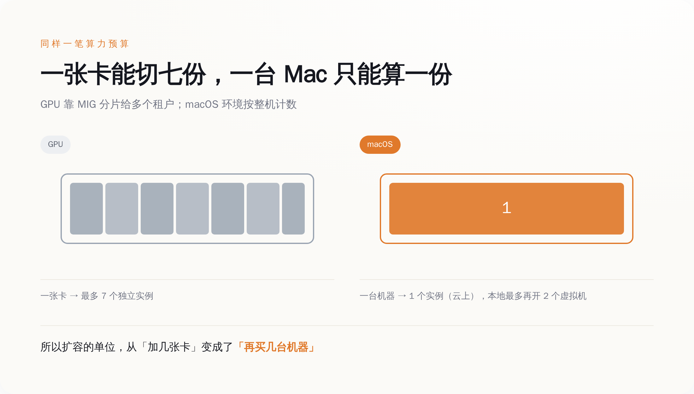
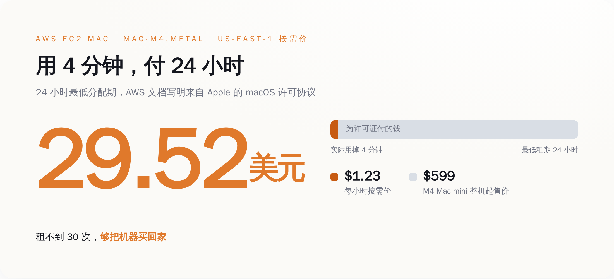
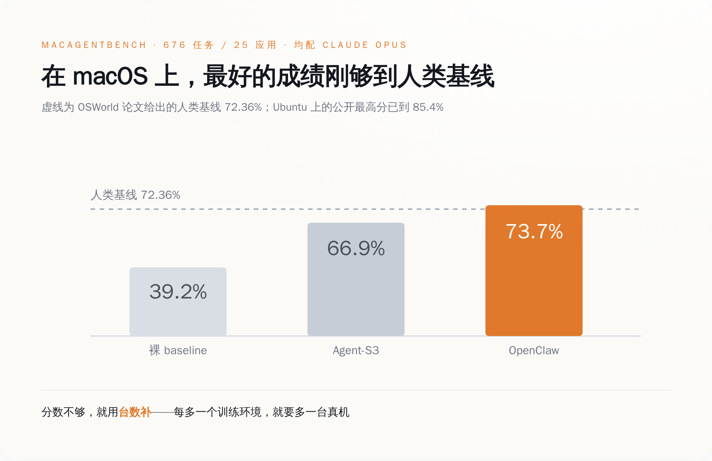
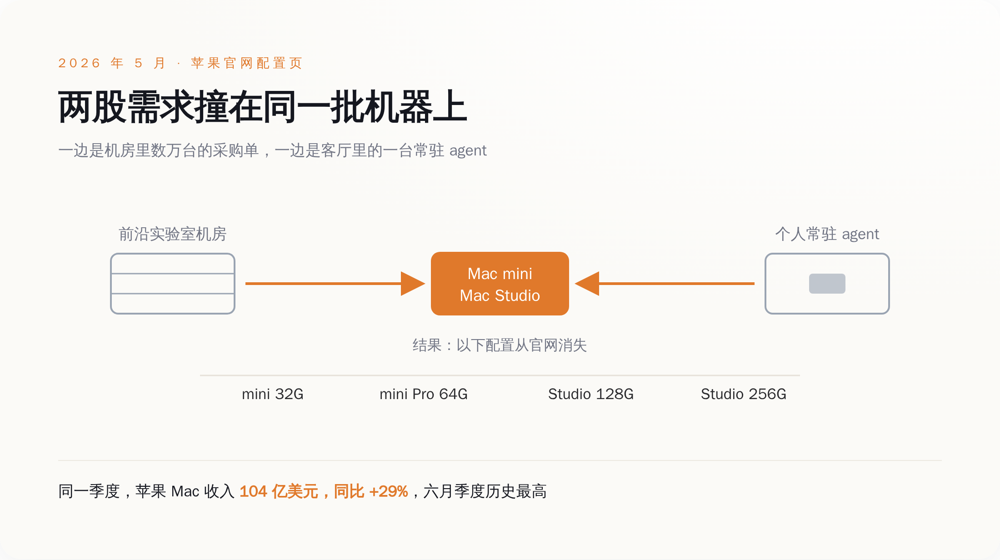

# OpenAI 把几万台 Mac mini 摞进了机房，就为了教 AI 点鼠标——你买不到 32G 那一档，怪它

> **发布日期**：2026-09-03 | **分类**：AI 行业

## 导语

你现在去苹果官网配一台 M4 的 Mac mini，内存那一栏只剩 16G 和 24G。32G 那一档没了。往上一档 M4 Pro，最高只能选到 48G，64G 也没了。不是"暂时缺货"，是选项直接从下拉菜单里消失。

苹果给的说法是全球内存紧张加上需求超出预期。这话一个字都没错，它只是没说需求是谁的。

---

## 一、显卡能切开卖，Mac 不能

The Information 在 9 月初报道，OpenAI 过去几个月买了数万台 Mac mini 和 Mac Studio。不配显示器，不配键盘，不配鼠标，整机直接进机房当计算节点，专门用来跑强化学习，训练那种能自己操作电脑的 agent。Anthropic 在干同一件事，路线不同，走的是 AWS 租。报道还说 OpenAI 还在继续买。OpenAI 到今天没有确认过这个数字，苹果也没有。

看到这条新闻的正常反应是：训练 AI 不是应该买显卡吗，买这玩意儿干什么。

因为这一轮要训练的东西，需要的不是浮点数，是**一台能被点的电脑**。

你让 agent 学会"用电脑"，它得真的去做这些事：打开 Finder 翻到某个文件夹，在 Numbers 里改一个单元格，把一份 PDF 拖进邮件正文，点掉一个突然弹出来的系统更新提示，等一个加载转圈转完，发现自己点错了再原路退回去重来。每一步都得有个真的操作系统在下面接着，得有真的窗口层级、真的剪贴板、真的文件系统权限、真的那个"应用程序未响应"的转菊花。

强化学习还有个更贵的要求：这一整套环境得能一键推倒重来。学一次不算学会，得让它在同一个初始状态上反复试一万次，试错、拿反馈、再试。所以你需要的不是一台电脑，是一万个可回滚的电脑状态。

一张 H100 可以用 MIG 切成七份，分给七个互不相干的租户，各跑各的。

一台 Mac 不能切。

*图注：同样是算力，GPU 的最小单位是一张卡的七分之一，macOS 的最小单位是一整台机器——差别不在硬件，在许可证。*

---

## 二、卡住这件事的，是一份 2011 年写好的许可证

苹果的 macOS 软件许可协议里有这么一句：在你已经拥有并且已经在跑 macOS 的每一台 Mac 上，你可以额外安装、使用和运行**最多两份**（up to two）macOS 的副本或实例，跑在虚拟操作系统环境里。

后面还跟着限定：这两份只能用于软件开发、开发过程中的测试、运行 macOS Server，或者个人非商业用途。再往后还有一句，不许把它用在 service bureau、分时、终端共享或者类似性质的服务上——说人话就是，不许拿去当云卖。

这不是一句写在合同里没人管的道德劝诫。你在 Apple Silicon 上试着起第三个 macOS 虚拟机，Virtualization framework 会直接把你顶回来，报错原文是 `The maximum supported number of active virtual machines has been reached`。这条从 Mac OS X Lion 就在，2011 年。

AWS 把 Mac 搬上云的时候没有绕过这一条，它是照着许可证的形状把服务捏出来的。AWS 自己的文档写着，EC2 Mac 实例是**裸金属实例，跑在单租户专用主机上**，理由原文是 "to comply with macOS licensing"——为了符合 macOS 的许可。一台专用主机，一个实例。文档还有一句更有意思的："Because Amazon EC2 Mac instances are bare-metal instances, macOS has direct access to the Mac mini hardware."

更狠的是租期。AWS 文档原话：`As part of Apple's macOS Software License Agreement (SLA), there is a 24-hour minimum allocation period for macOS in the cloud.` 你申请到一台专用主机，24 小时的钟就开始走，最早也要等满 24 小时才能释放。

我们来算一笔账。us-east-1 区的 mac-m4.metal，按需价 1.23 美元一小时。乘 24，一次分配最少 29.52 美元。你的 agent 上去点了四分钟鼠标，然后崩了，你也得按一整天付。

而一台 M4 的 Mac mini，官网 599 美元起。租不到三十次，够你把机器买回家。OpenAI 选择买断，这不是什么高瞻远瞩的战略眼光，这是小学算术。

*图注：许可证把云上 Mac 的最小计费单位钉成了 24 小时——你用四分钟，账单按一整天出，这才是几万台机器被搬进自家机房的直接原因。*

---

## 三、那用 Linux 不就完了——问题是分数不认

既然 macOS 这么麻烦，用 Ubuntu 不就完了——容器随便开几百个，一分钱不用给苹果，这是任何一个工程师都会先问的问题。

对，所以大家一直在 Ubuntu 上刷分。OSWorld 这个基准的原始论文里写着两个数：人类基线 72.36%，当时最好的模型 12.24%。到 2025 年 12 月，Simular 的 Agent S3 报出 72.6%，第一次越过人类基线。现在公开的 leaderboard 上，最高那条已经到 85.4%。两年时间，从人类的六分之一干到人类的一点二倍。

然后你把同一套东西挪到 macOS 上。MacAgentBench 这个基准有 676 个任务、25 个应用，仓库里贴出来的成绩是：OpenClaw 配 Claude Opus，73.7%；Agent-S3 配同一个 Opus，66.9%；不套任何框架的裸 baseline，39.2%。

同一个 Claude Opus，不套框架 39.2%，套上最好的框架 73.7%——在 macOS 上折腾到今天，最好的成绩刚刚够到 OSWorld 两年前给人类定的那条 72.36% 的线。Ubuntu 那边早就翻过去了。

而且这个基准的 README 里坦白得很直接：任务跑在 macOS 的 Docker 容器环境里，你得先下一个大约 50GB 的 macOS 虚拟机镜像，每个任务开一个独立容器。OSWorld 的 README 更是干脆写着，macOS 主机一般不支持 KVM，在 macOS 上建议用 VMware。翻译过来就是：Linux 那套靠内核虚拟化把机器切碎、把成本摊薄的省钱办法，在苹果这儿不成立。

于是做这个方向的研究者只能这么干。macOSWorld 有 202 个任务、30 个应用，整套跑在 AWS 的 Mac mini 上；今年新出的 MacArena 有 421 个任务、50 个应用，跑在苹果自家的 Virtualization 框架上。

你要提高吞吐，办法只有一个：加台数。

*图注：Ubuntu 上的成绩早已翻过人类基线，macOS 上折腾到今天，最好的组合才刚够到那条线——缺口就是买机器的理由。*

---

## 四、另一头，普通人在抢同一个箱子

刚才那个拿到 73.7% 的 OpenClaw，不是哪家大厂的产品。它是一个开源的自托管 agent 运行时，2025 年底放出来，几周之内在 GitHub 上冲过 15 万星。

它跟聊天框的区别在于它不下班。它是常驻在你机器上的后台进程，跨会话保留记忆，能执行 shell 命令，能开浏览器，你睡觉的时候它接着干活，通过你本来就在用的聊天软件跟你说话。

跑它最舒服的机器是哪台？Mac mini M4 Pro，64G 内存。这个配置能以每秒 10 到 15 个 token 跑 32B 参数的模型，整机功耗 20 到 40 瓦。统一内存加上不用装空调，是它成为"个人 AI 服务器"首选的全部理由。

所以现在有两拨人在抢同一个 SKU：一拨在机房里成千上万台地摞，一拨在客厅电视柜上放一台。

撞车的结果 5 月就摆出来了。苹果一口气砍掉了四个配置：M4 Mac mini 的 32G 没了，M4 Pro Mac mini 的 64G 没了，M3 Ultra Mac Studio 的 256G 没了，M4 Max Mac Studio 的 128G 也没了。库克在 2026 财年第二财季的电话会上说，供需平衡还要好几个月。

再看另一张表。苹果 2026 财年第三财季（截至 6 月 27 日）的财报里，Mac 业务收入 104 亿美元，同比涨 29%，六月季度历史最高。公司总收入 1094 亿美元，涨 16%。库克在通稿里的原话是，这是苹果史上最强的六月季度，iPhone、Mac 和服务三条线全部两位数增长。

8 月 25 日，苹果宣布 Mac Studio 和 Mac mini 换代，9 月 22 日发货。

从头到尾，苹果一个字都没提 OpenAI。它也确实不需要提。

这里要替苹果说句公道话：内存配置消失这件事，不能全算在 OpenAI 头上。2026 年全球 DRAM 本来就在涨，AI 服务器把高带宽内存的产能吃掉一大块，涨价是行业性的，跟谁买 Mac mini 没关系。苹果自己给的口径也是两条并列——供给紧张，加上需求超预期。

但这两条不是互相替代的关系，是互相放大的关系。如果只是内存涨价，苹果的合理动作是涨价，不是砍配置；如果只是需求平平，涨价的成本可以慢慢往售价上转。砍掉四个高内存档位，意味着这些档位的订单量已经大到会挤占别的产品线——而 Mac 收入同比涨 29%、创六月季度纪录这个数摆在那儿，说明它不是一个"卖不动只好下架"的故事。买走高内存 Mac 的人，和让 Mac 创纪录的人，大概率是同一批。

*图注：机房和客厅抢同一个箱子，最先消失的是中间那几档内存——这是普通买家第一次直接为算力竞赛买单。*

---

## 五、想看谁是真干活的，去数它买了多少台

这几年判断一家公司在 AI 上认不认真，大家习惯看两样东西：模型跑分，和融资额。这两样都能修饰。跑分可以挑基准、可以调采样、可以在提交前多试几遍；融资额更是想写多少写多少。

采购单不行。几万台 Mac mini 是要有人签字、有人验收、有人插网线、有人给它们腾出地方的。这东西造不了假，也没法在发布会上一笔带过。

所以在 computer-use 这个方向上，最诚实的指标已经变成了一个特别土的数：机房里有多少台真机。

这一轮跟前几年还有个不一样的地方，在代价的落点。之前 AI 抢 H100、抢电、抢水，普通人是有距离感的——你又不买 H100，你家也没有变电站。这次它抢的东西你每天都在用，甚至是你原本已经放进购物车的那一档内存。

你在苹果官网点开那个下拉菜单，发现 32G 不见了，那一刻你已经是这场军备竞赛的乙方了，只是没人通知你。

AI 学会用电脑之前，得先把电脑买光。就这。

## 数据来源

- [Amazon EC2 Mac 上手指南（AWS 官方样例仓库，24 小时最低分配期与裸金属单租户条款原文）](https://github.com/aws-samples/amazon-ec2-mac-getting-started/blob/main/ec2-macos.md)
- [MacAgentBench 基准仓库（676 任务 / 25 应用，各框架成绩）](https://github.com/JetAstra/MacAgentBench)
- [OSWorld 基准仓库（macOS 主机不支持 KVM 的说明）](https://github.com/xlang-ai/OSWorld)
- [Cua：跨系统 computer-use 集群与 Lume（基于 Apple Virtualization.Framework）](https://github.com/trycua/cua)
- [Apple 2026 财年第三财季财报（Mac 收入 104 亿美元，同比 +29%）](https://www.apple.com/newsroom/2026/07/apple-reports-third-quarter-results/)
- [Apple 下架 Mac mini / Mac Studio 高内存配置（MacRumors，2026-05-05）](https://www.macrumors.com/2026/05/05/apple-mac-studio-mac-mini-ram-cuts/)
- [macOS 虚拟机数量上限的技术与许可来源（The Eclectic Light Company）](https://eclecticlight.co/2022/08/04/virtualisation-on-apple-silicon-macs-8-how-apple-limits-vms/)
- [Apple 开发者论坛：第三个 macOS 虚拟机的报错原文](https://developer.apple.com/forums/thread/729580)
- [MacArena：在线 macOS 环境上的 computer-use 基准（421 任务 / 50 应用）](https://arxiv.org/abs/2606.06560)
- [OSWorld 官方项目页（人类基线 72.36%）](https://os-world.github.io/)
- [OSWorld 公开榜单（当前最高分）](https://leaderboard.steel.dev/leaderboards/osworld/)
- [Simular Agent S3 越过 OSWorld 人类基线（72.6%）](https://www.simular.ai/articles/simulars-computer-use-agent-outperforms-humans)
- [mac-m4.metal 按需价格与规格](https://instances.vantage.sh/aws/ec2/mac-m4.metal)
- [OpenAI 采购数万台 Mac mini / Mac Studio 的报道（TechRepublic 转述 The Information）](https://www.techrepublic.com/article/news-openai-mac-mini-mac-studio-ai-agents/)
