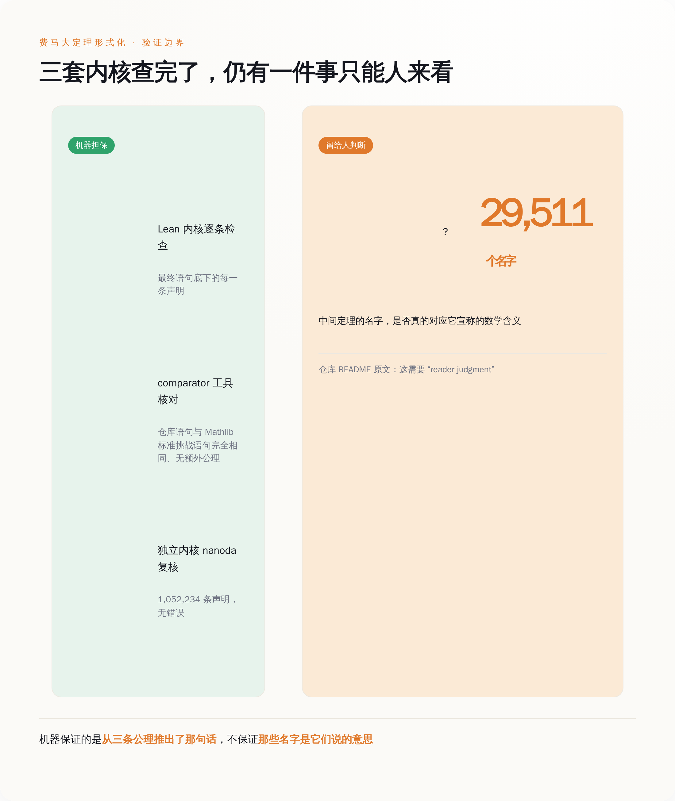
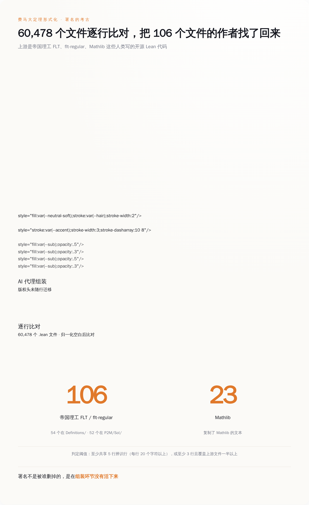
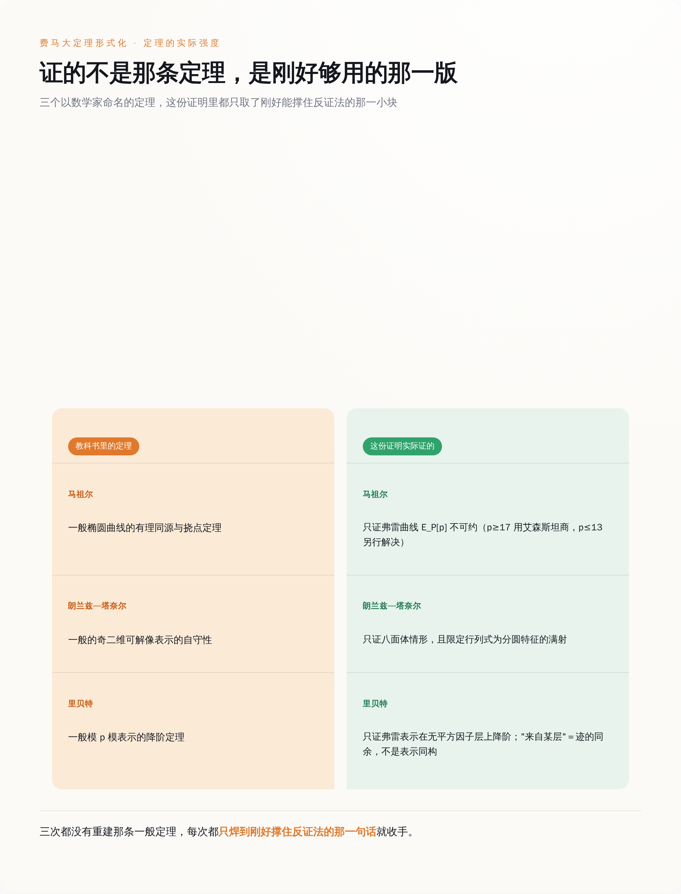

# 费马大定理被证完了，只是这一次，没有人读过它

> **发布日期**：2026-09-05 | **分类**：AI 观察

## 导语

9 月 3 日，GitHub 上多出一个仓库，名字叫 `fermats-last-theorem`。它只有一次提交，提交信息是「Fermat's Last Theorem in Lean 4 (Lean 4.33.1, Mathlib v4.33.0)」，作者一栏写着 `claude`。

仓库里有 60,475 个 Lean 模块、29,511 条定理、1,450 个定义。费马大定理的完整机器证明就在里面，`Theorems/Thm_fermat_last_theorem.lean`，一句话，`a ^ n + b ^ n ≠ c ^ n`。

这几天的新闻标题都在说 11 天、1300 万行、60 亿 token。这些数字没错，但它们讲的是生产端的故事。真正值得看的东西在交付端：这是数学史上第一个重要证明，被摆在所有人面前，却没有一个人从头读过它——而且按它自己的说明书，也不打算让人读。

---

## 一、它交付的不是证明，是一个可以被机器检查的对象

先把最容易误会的地方讲清楚：这件事里没有新数学。

仓库根目录的 `PROOF-PATH.md` 第一句就写明了路线：「The argument is that of Frey, Serre, Ribet, Wiles and Taylor-Wiles, largely as in Darmon, Diamond and Taylor, run as a proof by contradiction.」弗雷、塞尔、里贝特、怀尔斯、泰勒—怀尔斯，走的是达蒙、戴蒙德和泰勒那本讲义的讲法，用反证法组织。1994 年最终补完的那个证明，一步没变。

变的是这些论证被翻译成了什么。Lean 是一个证明助手，它的内核只认一件事：从公理出发的每一步推理是否合法。所以形式化的工作不是发现，是把一篇人类数学论文里所有「显然」「同理可得」「细节留给读者」全部补齐，补到机器不再抗议为止。这一直是数学界公认的苦力活，苦到怀尔斯的证明摆了三十多年没人做完。

Anthropic 交出来的东西，长得也确实像苦力活的产物。定理语句放在 `Theorems/`，证明放在 `P2M/Sol/`，一个文件的 `import` 行就是它引用了哪些定理——引用关系不是写在注释里的，是写在编译依赖里的。最后由 `FinalCheck.lean` 确认整份证明只用到 Lean 的三条标准公理：`propext`、`Classical.choice`、`Quot.sound`。没有 `sorry`，没有额外声明的 `axiom`，没有 `native_decide` 这类把计算外包出去的后门。

这份东西的价值，全部押在「机器说它是对的」上面。也正因为如此，接下来两件事才要紧：机器到底说了什么，以及机器没说什么。

*图注：Lean 内核担保的是「从三条公理推得出那句话」，至于中间两万九千个定理的名字对不对得上数学含义，仓库说明白了：那是读者的活。*

## 二、机器担保的那一半，和留给人的那一半

`README` 里有一节标题就叫 **What is NOT verified**（哪些没有被验证）。这一节写得很老实，也很致命。

被验证的部分做得非常重。Lean 内核把最终语句底下的每一条声明都检查了一遍；`comparator` 工具拿仓库里的语句和 Mathlib 标准库的挑战语句做比对，确认两者完全相同、没有偷加公理，跑完给出的结论是一句 `Your solution is okay!`；然后换一个用 Rust 独立实现的内核 `nanoda`，把导出的 1,052,234 条声明再核一遍，结果是 checked 1,052,234 declarations with no errors。同一件事，三套互相独立的机器各查了一遍。

没被验证的部分只有一句话：中间那些定理的名字，是否真的对应它宣称的数学含义。原文写的是这需要 reader judgment——读者自己判断。

这一句话的分量，得配上仓库另一段说明才看得出来。在「代码生成与署名」那一节，Anthropic 写明了这份代码是给机器验证用的，不是给人读的：名字由机器生成；`P2M` 和十六进制后缀是流水线标记，不是数学；注释被去掉了；**当名字和语句冲突时，以语句为准**。

于是链条变成这样：内核保证「从三条公理可以推出 `Thm_fermat_last_theorem.lean` 里的那句话」，`comparator` 保证「那句话和 Mathlib 写的费马大定理是同一句」。这两环焊死了。但那 29,511 条定理的名字，叫 `frey_no_cofixed_large` 也好，叫别的什么也好，它到底是不是数学家嘴里那个定理，机器不管，只有人能看。

而人要看，就得读 Lean 语句本身。仓库配了 390MB 的离线 HTML 文档，29,511 个定理页，每页有语句、引用和依赖图，还有搜索框。文档最后补了一句：英文摘要和参考文献是自动生成的，以 Lean 语句为准。

也就是说，那份人能读的东西，也是机器写的。

## 三、想复核？先准备 230GB 内存

「不放心可以自己验」这句话在这里是成立的，仓库把命令写得清清楚楚。只是账单也一起写清楚了。

从零构建一遍：96 个并行任务跑 5.5 小时，某些模块单个就要 36GB 内存，实测峰值 153GB。硬盘方面，`.lake` 目录 67GB，编译过程中另外产生约 220GB 的 C 文件。

`comparator` 那一轮更狠：实测 14 小时 46 分，峰值内存约 230GB，文档里建议准备 300GB。`nanoda` 相对温柔，16 线程半小时，40GB 内存，但导出文件本身 37.8GB，导出过程要 90GB、一小时。

写代码那 11 天是 Anthropic 花的钱。而验证这件事，是任何一个想独立确认「这玩意儿真的成立」的人要自己花的钱。一台 230GB 内存的机器加一整天，把一个想复核的人挡在门外，挡得比看不懂论文更彻底——看不懂至少还能慢慢学，机器不够就是不够。

**过去数学界的信任来自「别人读过」，现在它来自「别人跑得起」。**

*图注：生成一次的成本落在 Anthropic 头上，复核一次的成本落在每一个不信的人头上——后者是 14 小时 46 分和 230GB。*

## 四、然后他们回过头去，把作者的名字一个个找回来

仓库里最让人愣一下的文件不是那两万九千条定理，是 `ATTRIBUTION.md`。

这份文件干的事是：逐个文件地列出这个仓库里所有含有第三方 Lean 文本的地方——106 个文件带着帝国理工 FLT 项目或 flt-regular 项目的材料（54 个在 `Definitions/` 下，52 个在 `P2M/Sol/` 下），另有 23 个文件复制了 Mathlib 的文本——写明上游文件是哪个，并把上游的版权持有人和作者名单原样抄回来。

为什么要专门做这么一件事，文件自己给了理由：这些 Lean 文件是由 AI 代理组装的，发布时不带注释，所以上游的版权头没能留在原处。

上游的版权头没能留在原处。这一句就是整件事里最具体的一个截面：署名不是被谁删掉的，是在流水线里没活下来。代码被读进去、被改写、被重新组装，出来的时候干干净净，谁写的这一层信息不属于「证明是否成立」，于是它没有被携带。

恢复的办法是考古。把 60,478 个 `.lean` 文件和上游做归一化空白后的逐行比对，判定标准写在文件里：至少共享 5 行有辨识度的行（20 个字符以上），或者至少 3 行且覆盖上游文件的一半以上，才算数。然后按比例算出每个文件里有多少非空行来自上游，一栏一栏填进表格。

`ATTRIBUTION.md` 的第 5 节还老实交代了这场考古的局限：比对语料只有工作树里的 100 个上游文件；低于阈值的零散片段没有被系统性归属；上游只记录了分支和日期（2026 年 5 月 21 日），不是每个 commit 的哈希。

被找回来的名字里，排在最前面的是 Kevin Buzzard，后面跟着 Andrew Yang、Matthew Jasper、Salvatore Mercuri、Ruben Van de Velde、Pietro Monticone；flt-regular 那边是 Alex J. Best、Christopher Birkbeck、Riccardo Brasca、Eric Rodriguez Boidi 等人。

Buzzard 这个名字值得单独说一句。帝国理工那个 FLT 项目的仓库 README 是这么写的：项目目前由 Kevin Buzzard 领导，到 2029 年 9 月为止由 EPSRC 的 EP/Y022904/1 号资助支持，路线基本上是 Richard Taylor 在和 Buzzard 的讨论中规划出来的。一群人、一笔排到 2029 年的经费、1700 多次提交，做的正是同一件事。

这些人的代码，最后成了那个单次提交的仓库里 106 个文件的底料。合规上没有任何问题，两边都是 Apache 2.0，`NOTICE` 和 `ATTRIBUTION.md` 该给的都给了。但机制上，值得记住的是顺序：**AI 流水线默认丢掉来源，把来源找回来是一件要单独立项去做的工程。**

*图注：署名不是被删掉的，是在组装环节没活下来；找回来的办法是拿 60,478 个文件去和上游做逐行比对。*

## 五、它证的每一个定理，都是「刚好够用」的那一版

`PROOF-PATH.md` 的最后一节叫 **Exact strength of the named steps**，逐条说明那些以数学家名字命名的步骤，在这份证明里到底被证到了什么程度。这一节读下来的感受，和读一本数学讲义完全不同。

马祖尔那一步，证的是弗雷曲线的 E_P[p] 不可约（p ≥ 17 用艾森斯坦商的论证，p ≤ 13 那几个指数则靠库默尔定理或直接下降各自解决）。没有证的是：马祖尔关于一般椭圆曲线的有理同源和挠点的定理。

朗兰兹—塔奈尔那一步，只证了八面体情形，且限定在行列式为分圆特征的满射 ρ̄₃ 上，交付形式是一个权 1 的模形式，再乘以爱森斯坦级数、过一次德利涅—塞尔提升引理，变成权 2 的同余特征形式。没有证的是：一般的奇二维可解像表示的自守性。

里贝特那一步，证的是弗雷表示在由 abc 的素因子支撑的无平方因子层上的降阶，而且「来自某个层」被定义成迹的同余，不是表示的同构。没有证的是：一般模 p 模表示的里贝特定理。

怀尔斯那一步，证的是「每个判别式非零、且没有素数同时整除判别式和 c₄ 的整 Weierstrass 模型都是模的」，模性被定义成在好素数处 a_ℓ 与某个 Γ₀(N) 上的权 2 正规化特征形式相符。这个假设是加在选定的整方程上的，对非半稳定曲线、模参数化、L 函数，一个字都没说。

这是工程师的写法，不是数学家的写法。数学家证一般情形，因为定理要拿去教学生、拿去给别人用；这份证明只需要撑住最下面那一句话，所以每一根柱子都只做到刚好承重。`PROOF-PATH.md` 开头那句话说得更直接：**Where this prose and the Lean differ, the Lean is right.**——这些说明文字和 Lean 代码不一致的时候，以 Lean 为准。文字只是导游，代码才是地形。

*图注：三个以人名命名的步骤，证的都是「够撑住结论」的特化版本，而不是教科书里那条通用定理。*

## 六、这件事真正的规格

把这几件事叠在一起看，这份交付物的规格是清楚的：结论可核验、过程不可读、来源需重建、定理按需裁剪。

这四条不是费马大定理独有的。任何一个用 AI 大规模生产出来的东西——一个上万行的补丁、一份合规报告、一套数据管线——出厂时都是这个样子：对不对可以查，怎么来的没人讲，谁的功劳要考据，覆盖范围刚好卡在你提的那句需求上，多一寸都没有。

区别只在于，数学有 Lean。它有一个不看名字、不看注释、不看你说了什么，只按公理逐条核对的内核，所以「没人读过」这件事才勉强可以接受。你手上那份 AI 产出没有内核。你只有一个感觉良好的 review，和一句「看着挺对的」。

所以下次收到 AI 交付的东西，那个该问的问题不是它写得对不对，而是：**这玩意儿有没有一个不依赖我阅读的验证器？** 有，那就照 Lean 的标准去信它——先确认验证器检查的那句话，正好是你要的那句话。没有，那你手上就是一份 60,475 个模块，谁也没读过。

费马当年在书页空白处写，这里太窄，写不下我这个绝妙的证明。三百多年后空白被填满了：390MB 的 HTML，37.8GB 的导出文件，一次提交，作者一栏写着 `claude`。

没有人会从头读一遍。也不需要了。

---

## 数据来源

- [anthropics/fermats-last-theorem 仓库（README、ATTRIBUTION.md、PROOF-PATH.md）](https://github.com/anthropics/fermats-last-theorem)
- [ImperialCollegeLondon/FLT 项目仓库](https://github.com/ImperialCollegeLondon/FLT)
- [leanprover-community/flt-regular 项目仓库](https://github.com/leanprover-community/flt-regular)
