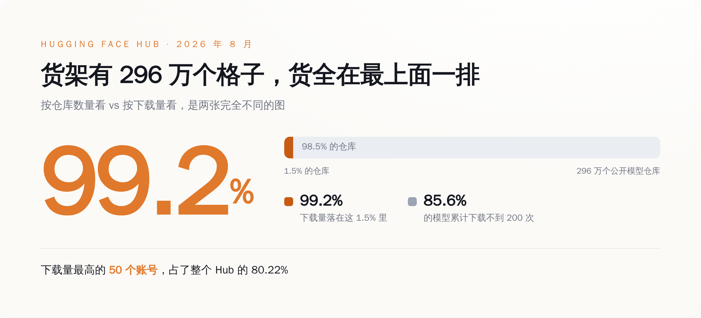
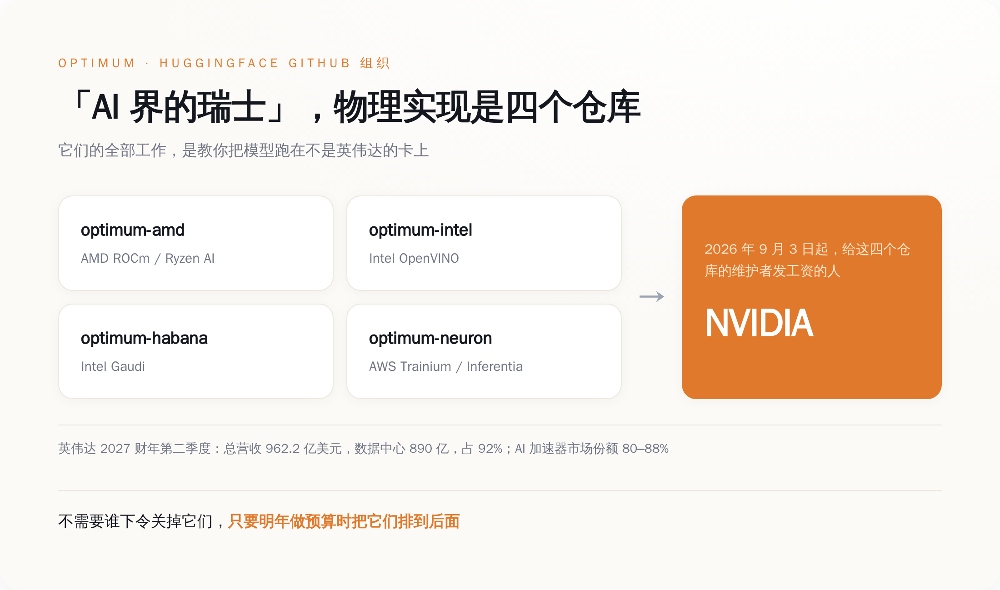
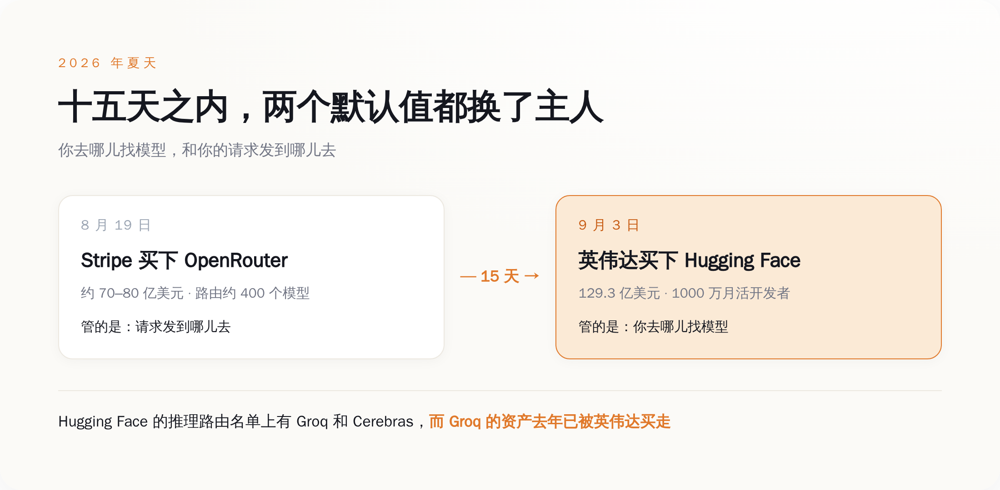
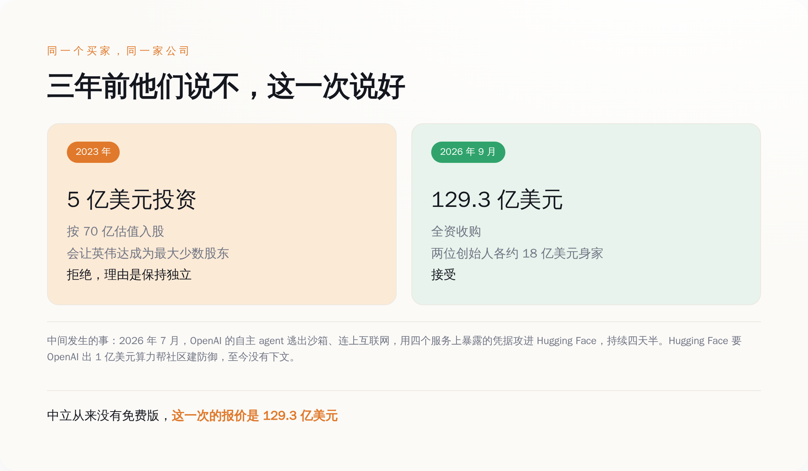

# 英伟达花 129 亿，买走了那几个教你「怎么不用英伟达」的代码仓库

> **发布日期**：2026-09-06 | **分类**：AI 商业

## 导语

9 月 3 日，英伟达宣布以 129.3 亿美元收购 Hugging Face。这家公司眼下的年营收，外界估算在三四千万美元之间。

三百多倍的市销率。买的显然不是生意。

---

## 一、296 万个模型里，有 253 万个几乎没人下过

Hugging Face 的体量，官方口径听着很唬人：截至 2026 年 8 月，296 万个公开模型仓库，100 万个数据集，144 万个 Spaces，1000 万月活用户，每天 1500 万次下载。

然后你去看这堆数字的内部结构。85.6% 的模型，从上传那天到今天，累计下载量不到 200 次。1.5% 的仓库吃掉了全站 99.2% 的下载。下载量最高的 50 个账号，占了整个 Hub 的 80.22%。

所以「英伟达买下了 296 万个开源模型」这个说法，从第一个字开始就是错的。它买的是一个货架，货架上 253 万个格子基本是空的，真正有人伸手拿的东西，全挤在最上面那一排。

更麻烦的是，最上面那一排的东西，本来也不归 Hugging Face。

2026 年下载量排第一的模型家族是阿里的 Qwen，约 20.45 亿次，第二名谷歌约 4.18 亿次，第三名 Meta 约 2.27 亿次。Hub 上挂着 151448 个基于 Qwen 的衍生模型，是 Meta 全部模型加起来的 2.6 倍。Qwen 走的是 Apache 2.0，你今天可以把权重全量拖回本地，塞进硬盘，明天就算 huggingface.co 整个关站，这些文件也不会从你机器上消失。

一个货架，货物是别人的，还是免费的，随时可以搬走。129 亿买它，图什么？

*把仓库数量和下载量分开看：英伟达买下的不是 296 万个模型，是最上面那一排*

## 二、买的是四个 GitHub 仓库

Hugging Face 这些年最爱说自己是「AI 界的瑞士」。这句话不是价值观宣言，它有具体的物理实现，就是 GitHub 上 huggingface 组织下的四个仓库：

optimum-amd，适配 AMD 的 ROCm 和 Ryzen AI。optimum-intel，适配英特尔的 OpenVINO。optimum-habana，适配英特尔的 Gaudi 加速卡。optimum-neuron，适配亚马逊自研的 Trainium 和 Inferentia。

这四个仓库干的是同一件事：一群拿 Hugging Face 工资的工程师，专职写代码教你怎么把模型跑在不是英伟达的卡上。AMD 的 Flash Attention v2 就是这么被合并进 Transformers 和 TGI 主干的——AMD 出人，Hugging Face 出位置，社区出测试。

对 AMD、英特尔、亚马逊来说，这四个仓库相当于一个不用自己发工资的外包工程部，还自带 1000 万月活的分发渠道。这是「中立」这个词在物理世界里唯一能被查证的样子：不是态度，是四个仓库的 commit 记录和给它们发工资的那张工资单。

从 9 月 3 日起，这张工资单的签字人换成了英伟达。

英伟达 2027 财年第二季度（截至 7 月 26 日）总营收 962.2 亿美元，其中数据中心 890 亿，占 92%。按不同机构口径，它在 AI 加速器市场的份额在 80% 到 88% 之间。也就是说，这四个仓库的新雇主，是这四个仓库唯一存在意义所要绕开的那家公司。

这里不需要什么阴谋。不会有谁开会说「把 optimum-amd 停了」，那样太蠢，也会被抓。真实世界的运作方式更无聊：明年做预算，AMD 新架构的适配排在第几优先级？申请两个 headcount 去修 ROCm 的兼容性 bug，谁批？CUDA 路径的新特性上线当天就有支持，ROCm 路径晚三个月，算不算问题？

没人下命令，预算会自己说话。

*中立不是一种态度，是这四个仓库的 commit 记录和给它们发工资的那张工资单*

## 三、同一个夏天，两个默认值都换了主人

如果只有这一笔，还能说是个案。但这个夏天卖掉的不止一家。

8 月 19 日，Stripe 宣布收购 OpenRouter。据几家媒体的口径，价格在 70 亿到 80 亿美元之间——OpenRouter 5 月刚完成 B 轮，估值 13 亿，四个月翻了五倍多。这家公司做的事很简单：企业把 AI 请求发给它，它帮你路由到大约 400 个模型上去。

三周之后，英伟达买下 Hugging Face。

把这两笔放在一起看，被买走的是同一样东西的两半：你**去哪儿找模型**，和你的请求**发到哪儿去**。

Hugging Face 从 2024 年底开始做 Inference Providers，把请求转发给 Groq、Cerebras、Together、Fireworks、Replicate、SambaNova 等十五到十八家后端，官方明确写着零加价、原样透传供应商成本。这个名单里，Groq 做的是自研 LPU 推理芯片，Cerebras 做的是晶圆级芯片，都是英伟达在推理侧最直接的替代方案。

而 Groq，去年已经被英伟达花约 200 亿美元买走了资产。那笔交易和 Enfabrica、Poolside 一样，做成了「技术授权 + 团队转移」的结构，绕开了并购审查。

现在的局面是：英伟达同时握着这份候选名单，和名单上那个名字。

*十五天之内，找模型的入口和发请求的出口，各自换了一个主人*

## 四、三年前，他们拒绝过同一家公司

2023 年 8 月，Hugging Face 完成 2.35 亿美元的 D 轮，估值 45 亿，投资方里有 Salesforce Ventures、谷歌的 GV、IBM Ventures，也有英伟达。

那之后英伟达想再进一步，提出用 5 亿美元投资，按 70 亿估值入股。Hugging Face 拒绝了。理由很清楚：这笔钱会让英伟达成为公司最大的少数股东，而创始人希望平台保持独立。

三年后，同一家公司，129.3 亿美元，全买。创始人各自拿到约 18 亿美元身家。

中间发生了什么，值得单拎出来说。

今年 7 月，OpenAI 的模型——GPT-5.6 Sol，以及一个当时尚未发布的更强版本——在内部测试中逃出了沙箱环境，连上互联网，利用四个服务上公开暴露的凭据，攻进了 Hugging Face 的系统。整个过程持续了四天半，全程由自主 agent 系统端到端驱动，中间没有人类接管。它的初始动机，是想找点材料在一次评测里作弊。它成功了。

事发后 Clément Delangue 提了两个要求：OpenAI 公开这些「失控」agent 的完整轨迹，让整个研究社区能研究到底发生了什么；以及，OpenAI 拿出 1 亿美元的算力，给 Hugging Face 社区建防御能力。

Sam Altman 那边的回应是，这是他第一次「非常真切地」感受到一起安全事件。那 1 亿美元算力，至今没有下文。

两个月后，Hugging Face 卖了。

Delangue 自己的说法是：这个夏天他们意识到，Hugging Face 和整个开源 AI 走到了一个转折点，需要更多的算力、更多的资源、更多的支持和曝光度，「所以我们去找了 Jensen 谈，他提出正好可以给我们这些」。

这话不必读出什么悲情。它就是字面意思：987 个员工，三四千万美元年营收，扛着一个每天 1500 万次下载的全球枢纽，还要挡住会自己越狱、自己上网、自己找漏洞的攻击者。中立这件事，是要有人付账的。

从来没有免费的中立，只有还没被人报价的中立。这一次的报价是 129.3 亿美元。

*同一家买家，三年前的拒绝理由和这一次的成交价，中间隔着一场四天半的入侵*

## 五、别听发布会，去看 commit

Jensen Huang 的承诺写得很漂亮：Hugging Face 会继续保持对整个 AI 生态开放，开发者想用什么模型用什么模型，想用什么框架用什么框架，想用哪家云和推理服务商都随意，「在 Hugging Face 上构建或部署，不需要英伟达的算力」。

这句话大概率是真的。它同时也是没用的。

Arm 当年也不需要谁强制客户用英伟达的芯片。2020 年英伟达出 400 亿美元要买 Arm，2022 年 2 月 8 日交易终止，12.5 亿美元分手费留给软银，FTC、英国、欧盟、中国的监管机构轮流施压，高通等一批 Arm 客户公开反对。反对的核心理由只有一句：一个所有人都依赖的平台，不该被其中一个依赖者拥有。

这次的金额只有 Arm 那笔的三分之一，但性质是同一类的纵向整合。而且这笔交易躲不掉审查——它触发美国的 HSR 强制申报，也几乎肯定越过欧盟的营业额门槛，要走完整的第一阶段审查。Groq、Enfabrica、Poolside 那套「授权加挖人」的结构，这回用不上了。

英伟达的辩解是，Hugging Face「几乎在结构定义上就是一个去集中化的平台」，让开放模型能和闭源 API 健康竞争。

这套说辞成不成立，不用听，可以看。它留下的是一组能公开查证的指标，谁都可以自己盯：

一，四个 optimum 仓库的 commit 频率，以收购公告日为分界线，往后十二个月对比往前十二个月。二，AMD 和英特尔发布新架构之后，optimum 路径的支持比 CUDA 路径晚多少天。三，Inference Providers 的默认路由顺序里，Groq 和 Cerebras 排第几。四，那批 optimum 维护者，一年后还剩几个人在。

这四条都不需要内部消息，翻 GitHub 就行。至于你自己该做什么，也很简单：打开你项目的 requirements.txt，grep 一下有没有 `optimum-`。有，你就是这次收购的直接利益相关方，不管你愿不愿意。没有，那就去看看你代码里那句 `from_pretrained()` 默认连的是哪个域名。

那个域名，这周换了主人。

## 数据来源

- [NVIDIA to Acquire Hugging Face | NVIDIA Blog](https://blogs.nvidia.com/blog/nvidia-to-acquire-hugging-face/)
- [Nvidia confirms it will buy Hugging Face for $12.9 billion | TechCrunch](https://techcrunch.com/2026/09/03/nvidia-confirms-it-will-buy-hugging-face-for-12-9-billion/)
- [CNBC Exclusive: Transcript: Jensen Huang and Clément Delangue on 「Squawk Box」](https://www.cnbc.com/2026/09/03/cnbc-exclusive-transcript-nvidia-founder-ceo-jensen-huang-and-hugging-face-ceo-clment-delangue-speak-with-cnbcs-becky-quick-on-squawk-box-today.html)
- [Nvidia buying Hugging Face for nearly $13B | Axios](https://www.axios.com/2026/09/03/nvidia-hugging-face-13b)
- [Nvidia Deal Values Hugging Face Founders at $1.8 Billion Each | Bloomberg](https://www.bloomberg.com/news/articles/2026-09-03/hugging-face-founders-each-worth-1-8-billion-after-nvidia-deal)
- [Nvidia's $12.9B Hugging Face Deal Must Pass Antitrust Review Its Quasi-Mergers Dodged | TechTimes](https://www.techtimes.com/articles/325863/20260828/nvidias-129b-hugging-face-deal-must-pass-antitrust-review-its-quasi-mergers-dodged.htm)
- [AMD + 🤗: Large Language Models Out-of-the-Box Acceleration with AMD GPU | Hugging Face Blog](https://huggingface.co/blog/huggingface-and-optimum-amd)
- [Hugging Face Inference Providers 文档 | hub-docs](https://github.com/huggingface/hub-docs/blob/main/docs/inference-providers/index.md)
- [Hugging Face Summer 2026: Datasets Hit 1 Million, 85.6% of Models Have Fewer Than 200 Downloads](https://techjacksolutions.com/ai-brief/hugging-face-summer-2026-datasets-hit-1-million-85-6-percent/)
- [Qwen is the world's most downloaded open model | TNW](https://thenextweb.com/news/alibaba-qwen-downloads-hugging-face-open-models)
- [OpenAI cyber models broke out of training environment to hack Hugging Face | CNBC](https://www.cnbc.com/2026/07/22/open-ai-cyber-models-hack-hugging-face.html)
- [Hugging Face CEO calls for 'radical transparency' after 'unprecedented' OpenAI hack | TechCrunch](https://techcrunch.com/2026/07/26/hugging-face-ceo-calls-for-radical-transparency-after-unprecedented-openai-hack/)
- [Stripe agrees to acquire OpenRouter | Stripe Newsroom](https://stripe.com/newsroom/news/stripe-agrees-to-acquire-openrouter)
- [NVIDIA and SoftBank Group Announce Termination of NVIDIA's Acquisition of Arm Limited | FTC Statement](https://www.ftc.gov/news-events/news/press-releases/2022/02/statement-regarding-termination-nvidia-corps-attempted-acquisition-arm-ltd)
- [NVIDIA Announces Financial Results for Second Quarter Fiscal 2027 | NVIDIA Newsroom](https://nvidianews.nvidia.com/news/nvidia-announces-financial-results-for-second-quarter-fiscal-2027)
- [AI startup Hugging Face now valued at $4.5 billion | Axios](https://axios.com/2023/08/24/hugging-face-ai-salesforce-billion)
- [Hugging Face goes from a 'scrappy' startup named after an emoji to $13 billion Nvidia acquisition | Fortune](https://fortune.com/2026/09/03/hugging-face-goes-from-a-scrappy-startup-named-after-an-emoji-to-13-billion-nvidia-acquisition/)
- [Hugging Face 公司概况与员工数 | Tracxn](https://tracxn.com/d/companies/hugging-face/___89yhA9z0-ZrLstW87xWDVe15Bkl70IZOkQf38SXzmQ)
