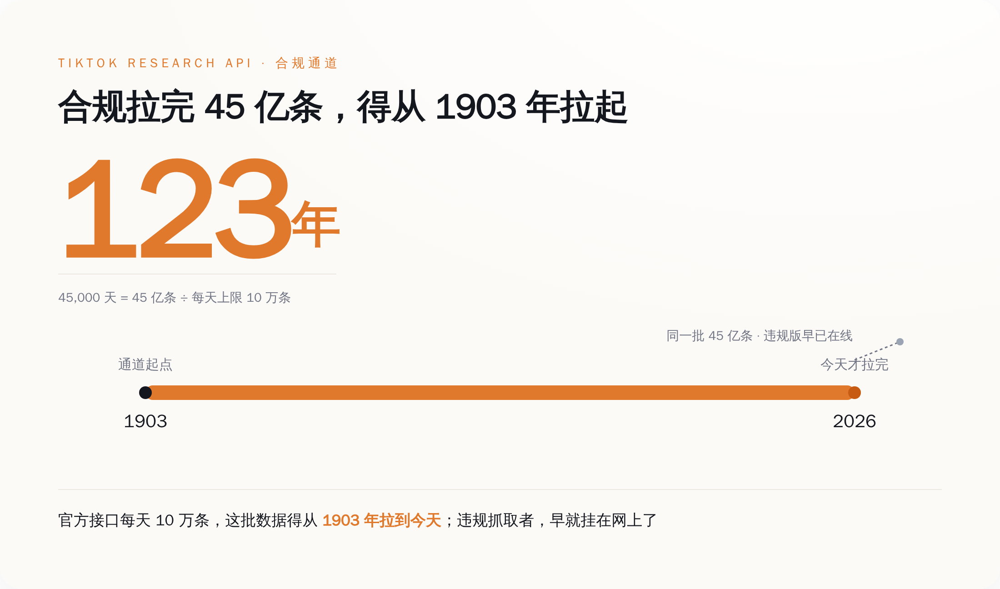
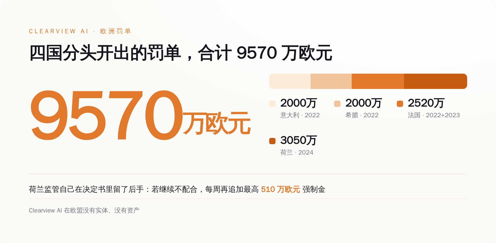
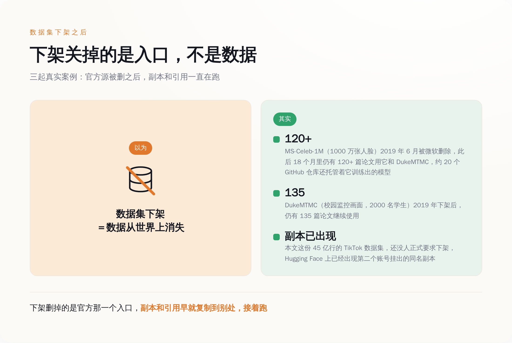
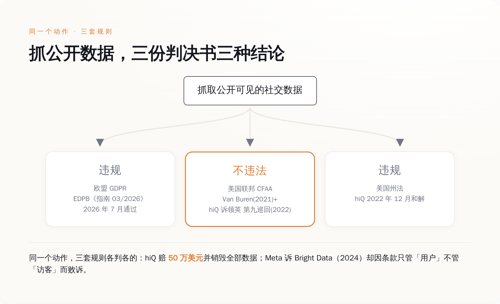

# 45 亿条 TikTok 挂在网上，而走官方接口拿同一批数据，要 123 年

> **发布日期**：2026-09-07 | **分类**：AI 与数据

## 导语

Hugging Face 上现在挂着一个 289GB 的文件夹，45 亿行，每一行是一条 TikTok 视频的档案。想合规地拿到同样一批数据，TikTok 官方接口每天给你 10 万条。你自己算一下要多久。

---

## 一、289GB，45 亿行，License 那栏填的是"research-use"

数据集叫 `kuben-developer/tiktok-videos-4b`。27 个 Parquet 文件，zstd 压缩后 289GB，45 亿行。每一行装的是一条视频的档案：文案、播放数、点赞数、评论数、收藏数、用的哪首背景音乐、发布国家、发布时间。

里面没有视频文件。45 亿条视频只占 289GB，正是因为一帧画面都没有，全是元数据（有人立刻会觉得这样风险就小了，这个后面单独说）。你要是这几年在 TikTok 上发过视频，这 45 亿行里，很可能就有你那一行。

仓库的提交记录停在 29 次，最近一次是四天前。License 那一栏填的是 research-use——这不是任何一个标准协议的名字，SPDX 列表里没有，Hugging Face 的标准标签里也没有，是上传者自己敲进去的一行字符串。标签栏挂着五个词：tiktok、social-media、short-video、recommender-systems、social-network-analysis。翻译过来就是：这批东西是拿来训推荐系统的。

Hacker News 上那条帖子攒了 51 分、59 条评论。讨论最集中的问题是违反服务条款会怎么样，票数靠前的回答大意是：服务条款是你不想被平台封号时才遵守的东西，你要是不在乎账号，那就随便玩。整个评论区争的是会不会被封号，不是会不会被追责——因为大家都清楚追责这件事不存在。

就这。

那么换个人，一个真想守规矩的人，从正门走，拿到同样这批数据，得花多久？

## 二、45,000 天

TikTok 是有官方研究接口的，叫 Research API，文档挂在 developers.tiktok.com 上，写得清清楚楚：每天 1000 次请求，视频和评论接口每次最多返回 100 条记录，一天上限 10 万条，UTC 零点重置配额。想要更多，发邮件去申请。

45 亿除以 10 万，等于 45,000 天。

**45,000 天是 123 年。你得从莱特兄弟试飞的 1903 年开始拉，中间一天不断、一次不漏，今年刚好拉完。**

*官方接口每天上限 10 万条，45 亿条得连着拉 45,000 天——从莱特兄弟试飞那年拉到今年。*

而且你得先有资格排这个队。TikTok 的文档里写着，美国和欧洲的非营利大学的研究者可以申请，另有巴西等少数国家的合格研究者也在名单上；紧接着下一句是，如果你是创作者、广告主或者商业用户，你不具备访问资格。也就是说，全世界绝大多数真正想用这批数据的人，连那 123 年的队都排不上。

TikTok 自己不卖这批数据，所以没有官方价目表可查。但同类社交数据的行情是公开的：X 在 2023 年改版之后，企业档接口被报道的入门价是每月 4.2 万美元；Reddit 把数据授权给 Google，报道的金额是一年约 6000 万美元；新闻集团和 OpenAI 那份合同是五年最高 2.5 亿美元；Shutterstock 光 2023 一年的 AI 授权收入就有 1.04 亿美元。这是买一家平台的数据要花的钱的量级。

侧门的价目表同样是公开的，而且就挂在供应商官网上：Bright Data 的住宅代理，999 美元买 332GB 流量，按量付费 8 美元一 GB，承诺量足够大的时候能压到 3 美元。289GB 这个体量，在这张价目表上是一笔四位数的月账单。

一边是 123 年、一份学术机构证明、一年六千万美元；另一边是一笔付得起的带宽费。这两条路通向的是同一批数据。

官方接口当年是按"研究者只需要一个样本"设计的。而现在所有人都要全量。

## 三、罚单是写给有欧洲资产的公司看的

那规则呢？规则一直都在，而且罚得挺狠。

Clearview AI 是最好的样本——一家从网上抓了几十亿张脸做人脸检索的美国公司。它挨过的欧洲罚单可以列成一张表：意大利数据保护局 2022 年 2 月 10 日，2000 万欧元；希腊数据保护局 2022 年 7 月 13 日，2000 万欧元；法国 CNIL 2022 年 10 月 17 日，2000 万欧元，2023 年 5 月 10 日因为拒不整改追加 520 万欧元；荷兰数据保护局 2024 年 5 月决定、9 月 3 日公布，3050 万欧元。

加起来 9570 万欧元。

*五张罚单合计 9570 万欧元；荷兰还在罚款之外挂了每周 510 万的强制金，等于自己承认这钱不好收。*

荷兰人在那 3050 万之外还挂了一条：如果继续不配合，按每周最高 510 万欧元累加。一个监管机构在罚单之外还要再写一条按周计费的强制金，某种程度上等于在决定书里先认下了一件事——光靠一张罚单，这钱大概率是收不上来的。Clearview 在欧盟没有实体、没有资产、没有需要在欧洲续签的牌照，那张罚单寄过去，只是一封信。

英国那张 750 万英镑更能说明这套机制的实际效率：2022 年 5 月开出，2023 年 10 月被一审法庭撤销，2025 年 10 月上级法庭又认定属于 GDPR 管辖范围，案子到今天还在打。四年过去了，行政程序还没走完，而模型早就训完上线了。

顺带一提，这次被扒的 TikTok 自己也是被罚过的一方——2023 年 9 月 1 日，爱尔兰数据保护委员会因为儿童账号默认公开等问题，罚了它 3.45 亿欧元。

这套系统对付有欧洲总部、有欧洲银行账户、有欧洲法务的公司，是相当好用的。对付一个 Hugging Face 用户名，它没有接口。

## 四、下架不等于消失

退一万步，就算罚不到人，把数据集下架总可以吧。这件事行业已经实验过好几次了，结论一致得让人尴尬。

MS-Celeb-1M，微软 2016 年发布的人脸数据集，1000 万张照片、10 万人，名义上是"名人"，实际上混进了大量根本没被征求过意见的普通人。2019 年 6 月，微软把它从官网撤了。撤下之后的 18 个月里，仍有 120 多篇论文在使用它和同期下架的 DukeMTMC；约 20 个 GitHub 仓库还托管着用它训出来的模型；学术种子站上照样能完整下载。

同期下架的 DukeMTMC 走的是同一个剧本：杜克大学校园里 8 个摄像头拍下的 200 多万帧监控画面，2000 名学生，没有一个人签过同意书，下架之后仍有 135 篇论文在用，其中不乏 CVPR、AAAI 这个级别的会议。

80 Million Tiny Images 是 MIT 2006 年建的图像库，2020 年 7 月因为被查出含有种族歧视标注和偷拍内容而撤回。MIT 同时做了一件很体面也很无力的事：公开请求所有已经下载过的人删除本地副本。请求。

Books3，近 20 万本书的纯文本，2023 年 8 月 16 日被丹麦的 Rights Alliance 用一封 DMCA 通知从托管方那里下架。一年后作者们提起集体诉讼，论据之一就是副本还在网上流传。

LAION-5B 是这几个里处理得最认真的：2023 年 12 月 20 日斯坦福互联网观测站报告查出 1008 条指向儿童性虐待内容的链接，数据集当天下架；2024 年 8 月 30 日清洗后重新发布 Re-LAION-5B，累计移除 2236 条链接。这已经是全行业公认的最佳实践了——代价是八个月。

而这份 TikTok 数据集眼下的状态是：原始仓库在线，另一个账号挂的同名副本也在线。下架程序还一步都没走，第二份已经就位了。

*下架只关掉了官方入口：MS-Celeb-1M 撤回后 18 个月里还有 120 多篇论文在用它。*

**"被遗忘权"写在法条里是一项权利，落到工程上是一封群发邮件：请各位自觉删除本地文件。**

## 五、规则还在征求意见，数据已经在跑了

欧洲数据保护委员会（EDPB）今年 7 月通过了《Guidelines 03/2026 on web scraping in the context of generative AI》1.0 版，专门讲生成式 AI 场景下的网络抓取。里面把最容易被拿来挡枪的那句话堵死了：内容公开可得，既不等于用户同意，也不构成处理个人数据的合法性基础；只要抓取动作里含个人数据，GDPR 就从采集一路管到模型部署。

这份文件现在的状态是：公开征求意见中，截止日期 2026 年 10 月 30 日。

指南还在等各方提意见。那 289GB 已经在别人的硬盘里了。

美国那边是另一套算法，而且自己跟自己打架。2021 年 Van Buren 案，最高法院把《计算机欺诈和滥用法》收窄成"门是开着的就不算闯入"——违反网站服务条款，不再等于触犯联邦刑法。2022 年 4 月，第九巡回法院据此在 hiQ 诉领英案里认定，抓取公开可访问的数据不构成 CFAA 意义上的未授权访问。抓取方赢了。

同年 12 月，hiQ 和领英达成和解：hiQ 支付 50 万美元，承认在加州普通法下构成动产侵占和信息盗用，接受永久禁令，销毁全部抓来的数据、源代码和算法。联邦刑法那关过了，州法这关没过，公司也就到此为止了。

再往后，2024 年 1 月 23 日，加州北区法院在 Meta 诉 Bright Data 一案中判 Meta 败诉，理由朴素得近乎滑稽：Meta 的服务条款只约束"用户"，不约束"访客"，而 Bright Data 是在登出状态下抓的公开页面，因此不构成违约。

三套规则，你想论证抓公开数据合法还是不合法，都能各自找到一份现成的判决书。

*同一个抓取动作，欧盟说违规、美国联邦法说不违法、美国州法又说要赔钱——三份判决各自成立。*

开头埋的那个念头，现在该说了——这次这份东西是元数据，不是人脸，不是视频，跟 Clearview 完全不是一个量级。这话是对的。45 亿行文案和播放量做不出人脸检索，最现实的用途就是训推荐系统和内容生成模型——风险量级确实低得多。

但 MS-Celeb-1M 留给行业的教训从来不是"人脸多可怕"，而是"东西一旦发出去，你就再也管不着它了"。而 EDPB 那份指南里说得很清楚：用户亲手打进去的那句文案，是个人数据。

你去年随手发的那条视频，配的那句文案，此刻是某个 Parquet 文件里的一行。这件事本身谈不上多可怕。可怕的是从它被抓走到今天，整条链路上没有任何一个环节，能给出一个比"请自觉删除"更硬的答案。

规则一条都不缺。只是老实走完它要 45,000 天，而绕过它的那个人，早就把 27 个文件都传完了。

## 数据来源

- [kuben-developer/tiktok-videos-4b · Datasets at Hugging Face](https://huggingface.co/datasets/kuben-developer/tiktok-videos-4b)
- [mrfakename/tiktok-videos-4b · Datasets at Hugging Face](https://huggingface.co/datasets/mrfakename/tiktok-videos-4b)
- [4.5B Posts Scraped from TikTok | Hacker News](https://news.ycombinator.com/item?id=49548625)
- [TikTok Research API FAQ | TikTok for Developers](https://developers.tiktok.com/doc/research-api-faq)
- [EDPB Guidelines 03/2026 on web scraping in the context of generative AI（PDF）](https://www.edpb.europa.eu/system/files/2026-07/edpb_guidelines_2020603_webscraping_v1_en_0.pdf)
- [EDPB：网络抓取与匿名化相关指南新闻稿](https://www.edpb.europa.eu/news/edpb-sheds-light-on-anonymisation-and-web-scraping-for-generative-ai-and-adopts-final-version_en)
- [Ireland's DPC issues 345M euro TikTok children's privacy fine | IAPP](https://iapp.org/news/a/irelands-dpc-issues-345m-euro-tiktok-childrens-privacy-fine)
- [hiQ and LinkedIn Reach Proposed Settlement in Landmark Scraping Case | Proskauer](https://newmedialaw.proskauer.com/2022/12/08/hiq-and-linkedin-reach-proposed-settlement-in-landmark-scraping-case/)
- [hiQ Labs v. LinkedIn, 9th Cir. (2022) | Justia](https://law.justia.com/cases/federal/appellate-courts/ca9/17-16783/17-16783-2022-04-18.html)
- [Major Decision Affects Law of Scraping: Meta Platforms v. Bright Data | Farella Braun + Martel](https://www.fbm.com/publications/major-decision-affects-law-of-scraping-and-online-data-collection-meta-platforms-v-bright-data/)
- [Van Buren v. United States | Wikipedia](https://en.wikipedia.org/wiki/Van_Buren_v._United_States)
- [Investigation finds AI image generation models trained on child abuse | Stanford FSI](https://cyber.fsi.stanford.edu/news/investigation-finds-ai-image-generation-models-trained-child-abuse)
- [Releasing Re-LAION 5B | LAION](https://laion.ai/blog/relaion-5b/)
- [Anti-Piracy Group Takes Prominent AI Training Dataset 'Books3' Offline | TorrentFreak](https://torrentfreak.com/anti-piracy-group-takes-prominent-ai-training-dataset-books3-offline-230816/)
- [MIT takes down 80 Million Tiny Images data set | VentureBeat](https://venturebeat.com/2020/07/01/mit-takes-down-80-million-tiny-images-data-set-due-to-racist-and-offensive-content/)
- [AI datasets are prone to mismanagement, study finds | VentureBeat](https://venturebeat.com/ai/ai-datasets-are-prone-to-mismanagement-study-finds/)
- [Microsoft deleted a facial recognition database, but it's not dead | Vice](https://www.vice.com/en/article/microsoft-deleted-a-facial-recognition-database-but-its-not-dead/)
- [Bright Data pricing overview | AIMultiple](https://aimultiple.com/proxy-pricing)
- [Twitter introduces a new $5,000 per month API tier | TechCrunch](https://techcrunch.com/2023/05/25/twitter-introduces-a-new-5000-per-month-api-tier/)
- [Google strikes $60M deal with Reddit for AI training data | Tom's Guide](https://www.tomsguide.com/ai/google-strikes-dollar60m-deal-with-reddit-for-ai-training-data-what-you-need-to-know)
- [News Corp, OpenAI Ink Content Licensing Deal | Variety](https://variety.com/2024/digital/news/news-corp-openai-licensing-deal-1236013734/)
- [Shutterstock made $104 million licensing assets to AI developers | PetaPixel](https://petapixel.com/2024/06/04/shutterstock-made-104-million-licensing-assets-to-ai-devs-last-year/)
