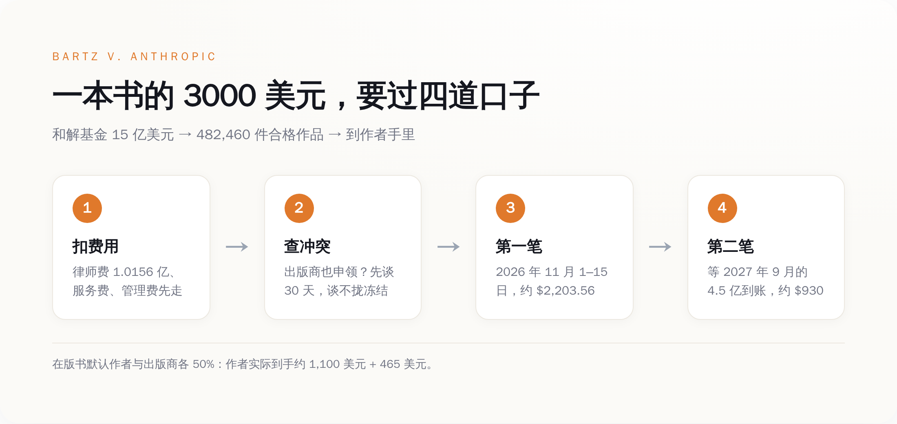
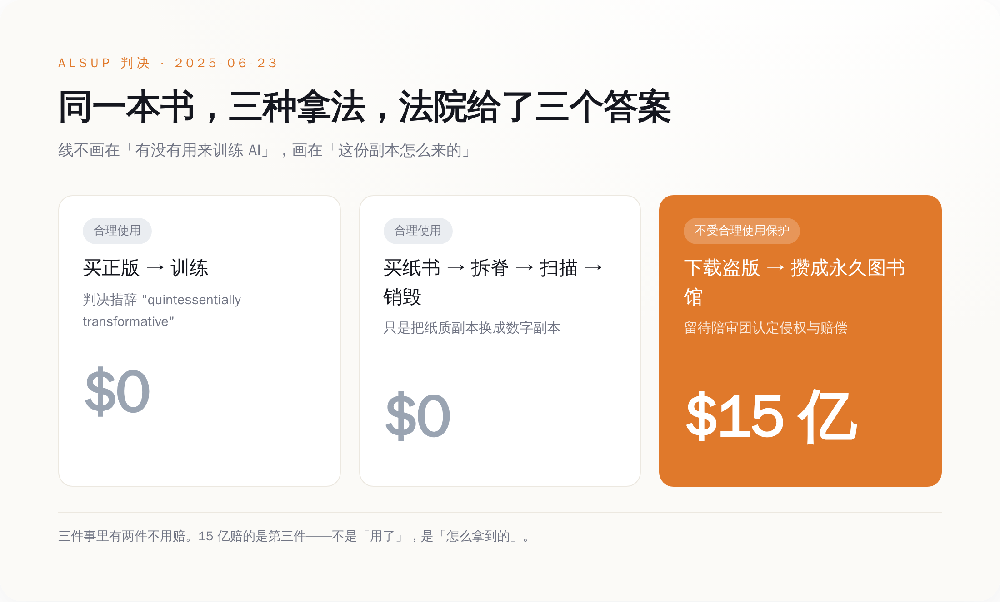
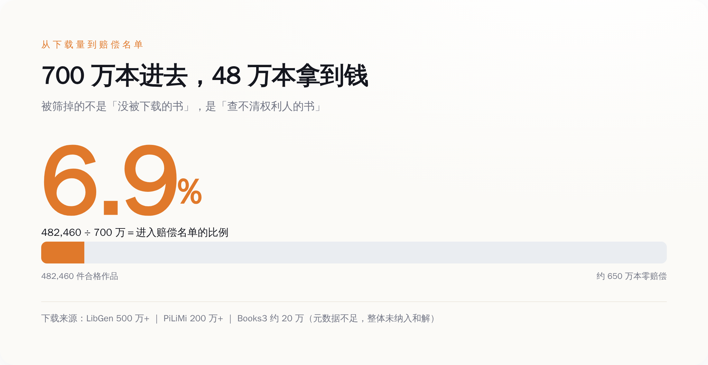
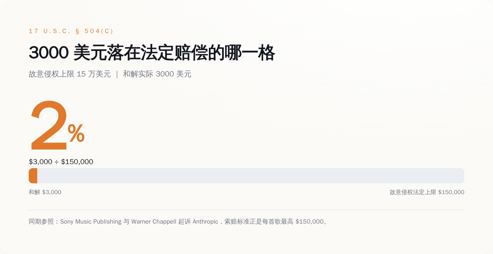

# 一本书赔 3000 美元；把同一本书买来、拆开、扫完扔掉，法院说合法

> **发布日期**：2026-09-08 | **分类**：AI 与版权

## 导语

9 月 4 日，44 万本书的赔偿通知发了出去。这是美国历史上最大的一笔版权和解，15 亿美元。作者们打开信，第一眼看到的不是自己能拿多少钱，是另一个人的名字——那个人也在申领这本书。通常是他们自己的出版商。

---

## 一、9 月 4 日，那封信

信是 JND Legal Administration 发的，它是这个案子的结算管理人。信里逐条列出你申领的每一本书、这本书还有谁也提交了索赔、对方主张的分配比例是多少。

于是就出事了。

悬疑小说作者 April Henry 收到通知后发现，HarperCollins 对她的七本书各主张了 50% 的份额。这七本书当年是 Harlequin 出的，Harlequin 后来被 HarperCollins 买了下来，而这七本书的权利在 1996 到 2008 年之间就已经全部回到她自己手里。最近的那本，也已经回归十七年了。她把七份权利回归文件全部上传上去反驳。

Writer Beware 的 Victoria Strauss 把收到的投诉分成两类：一类是出版商对早就不属于自己的书提出索赔，另一类是明明只能拿一半却申领了全额。除了出版商，还有一批文学经纪人也提交了索赔——经纪人根本不是版权持有人，按规则没有申领资格。

美国作家协会的 CEO Mary Rasenberger 对《纽约时报》的说法是，她不认为这是出版商在抢钱，也不觉得谁在专门坑作者，问题出在记录管理太差和整个索赔流程太乱。

这个解释大概率是对的。出版业的权利记录本来就是一笔糊涂账，很多合同签在纸上，扫描件躺在某个前员工的硬盘里，一本 1997 年的书到底谁还持有电子权利，往往需要翻箱倒柜。这次和解逼着整个行业在同一时间把这笔账摊开对一遍，账目里的窟窿就一次性全冒出来了。

冒出来之后的处理流程写得很清楚：共同索赔人先自己谈 30 天；谈不拢，结算管理人下场撮合；还谈不拢，交给法院指定的特别专家 Theodore K. Cheng 裁决，双方提交的出版合同封存不公开。争议解决之前，这本书对应的钱一分不放。

钱本身是这么排的：第一笔在 11 月 1 日到 15 日之间打出去，每件作品约 2,203.56 美元，这是扣掉律师费、服务费和各项开支之后的毛额；条件是这本书的所有权利人意见一致、付款信息齐全。第二笔约 930 美元，要等 Anthropic 在 2027 年 9 月 25 日之前存进第四期的 4.5 亿美元。两笔加起来，一本书三千出头。

*一本书 3000 美元的完整路径：先扣掉 1.4 亿的费用，再看有没有人跟你抢，再分两笔、跨一年打给你。*

而且这三千块还要再切一刀。按和解条款，书如果还在版、还归传统出版社，钱由作者和出版商五五开。只有自出版的书，或者出版商已经让书绝版、权利已经回归作者的书，作者才拿全额。

所以 April Henry 那七本书的争议不是学术问题。争的是一本书一千五百美元。

## 二、这 15 亿，赔的是哪一个动作

绝大多数人对这个案子的理解是：Anthropic 拿作家的书训练了 AI，被告了，赔了 15 亿。

这个理解是错的，而且错得很关键。

2025 年 6 月 23 日，加州北区联邦法院的 William Alsup 法官在这个案子（案号 3:24-cv-05417）里做出了简易判决。他没有把 Anthropic 的行为当成一件事来判，而是拆成了三件，一件一件说：

第一件，用书训练大语言模型。判决的措辞是 quintessentially transformative——本质意义上的转化性使用。属于合理使用。不赔。

第二件，把合法买来的纸质书拆开、扫描成数字文件、然后把纸扔掉。判决认为这只是用一份更方便的数字副本替换掉了纸质副本，是格式转换。属于合理使用。不赔。

第三件，从盗版书库下载电子书，并且把它们攒成一个长期保存的"中央图书馆"。这个不受合理使用保护。这一项被驳回简易判决，留给陪审团去定侵权和赔偿。

然后 Anthropic 就和解了。15 亿美元，赔的是第三件。

*同一本书，三种拿法，两种合法：判决划的线不在「用不用来训练」，在「这一份副本是怎么来的」。*

这条线画在哪，决定了作家们真正卖掉的是什么。它不画在"你能不能用我的书训练模型"上。这个问题在 2025 年 6 月就被回答了，答案是能，而且不用给钱。它画在"你手上这一份副本是怎么来的"上。同一本书，付钱买来的，随便用；从 Library Genesis 上拖下来的，一本三千。

**作家们在这场史上最大的版权和解里赢下来的，是一张迟到的书款账单。**

## 三、合规那条路，Anthropic 自己走过

判决里那个"买纸书、拆开、扫描"的场景，不是法官为了说理编出来的假设。那是 Anthropic 真干过的事。

2024 年初，Anthropic 内部启动了一个代号 Project Panama 的项目：从 Better World Books、World of Books、Zoom Books 这些渠道大批量买二手实体书，运到处理点，用液压驱动的切割机切掉书脊，把散页送进工业级扫描仪，扫成可搜索的文件，然后把纸扔掉。Snopes 的事实核查和《华盛顿邮报》的报道都提到了这条链路上的货运记录：加州、密尔沃基、科罗拉多斯普林斯，最后进了一处代号 VGT3 的亚马逊仓库。花了多少钱，公司没披露过，媒体的说法是"数千万美元"。

这条路，法院说合法。

另一条路的账是这样的：Anthropic 从三个盗版书库下载了超过 700 万本电子书——Library Genesis 500 万本以上，Pirate Library Mirror 200 万本以上，Books3 大约 20 万本。

700 万本里，最后进入和解范围、能拿到那 3000 美元的，是 482,460 件。

剩下的 650 多万本去哪了？门槛卡在两件事上：这本书得有 ISBN 或 ASIN，得在美国版权局按期完成登记，得能从 Bowker 和 ISBNdb 这两个 ISBN 数据库里查到作者和出版商是谁。Books3 那 20 万本整体没进和解，理由是元数据太烂，没法可靠地识别出作者和书名。

也就是说，一本书能不能拿到赔偿，取决于它在出版业的数据库里被登记得够不够规整。登记得不好的书，被下载的方式和别人一模一样，赔偿是零。

*700 万本被下载，482,460 本拿到钱——不是因为剩下的没被下载，是因为查不清作者是谁。*

回到 Project Panama。它证明了一件事：那条合法的路是走得通的，成本是数千万美元级别，Anthropic 有能力走，也确实在走。下载盗版并不是因为没有别的办法，是因为那个办法慢，而且要花钱。判决最后的效果，是给这个选择标了个价：走捷径的部分，事后按每本三千补票。

## 四、3000 美元在哪个刻度上

美国版权法第 504 条 (c) 款写着法定赔偿的区间：每件作品不低于 750 美元，不高于 30,000 美元；认定为故意侵权的，法院可以提到每件最高 150,000 美元；善意侵权的可以降到 200 美元。

**3000 美元是 150,000 的 2%。**

这个"2%"不是我算出来挤兑人的，是那些退出和解、决定自己去打官司的作者写在新诉状里的原话。退出的人一共约 350 位，其中包括普利策奖得主 John Carreyrou，他们按每部作品对每个被告 150,000 美元的标准，把 Anthropic、OpenAI、Google、Meta、xAI、Perplexity 一起告了。另有 53 人提交了正式异议，7 人到庭陈述。

科罗拉多作家 Laura Pritchett 有四本书在名单上，她对科罗拉多公共广播说的是："我觉得我值三千美元以上。"她还说了另一句更硬的：这场诉讼勉强算个减速带，虽然它是史上最大的版权和解，但它同时也是世界上最大的一次版权盗窃。

这 15 亿本身也不是整份进作者口袋的。原告律师团最初申请 1.875 亿美元律师费，占基金的 12.5%，相当于他们自报工时成本 2708 万美元的 6.92 倍。法官 Araceli Martínez-Olguín 在 2026 年 7 月 20 日的终审批准裁定里把这个数砍到了 101,561,111 美元，占比 6.8%，倍数压到 3.75 倍，其中 10% 还先扣着不给，等律师提交分配账目再核。三位集体代表原告每人申请 5 万美元服务费，批下来的是 1.5 万。

101,561,111 除以 3000，等于 33,854。律师团拿走的钱，相当于 33,854 本书的赔偿总额。

*3000 美元不是「赔多赔少」的问题，是它落在法定区间的哪个位置——故意侵权上限的 2%。*

换个尺子量这 15 亿。TechCrunch 在 2026 年 8 月 17 日报道 Anthropic 的年化收入达到 650 亿美元。按这个数摊到每天约 1.78 亿，15 亿大概是它八天半的收入。一家公司用八天半的营收，买断了 44 万本书的历史遗留问题。

## 五、这 3000 块买断的是什么

买断的范围写得很清楚，作家协会也在公告里专门强调过：和解只覆盖 Anthropic 在 2025 年 8 月 25 日之前"获取和复制"作品的行为。基于 AI 输出内容的索赔，没被免除。基于未来行为的索赔，没被免除。和解也没有给 Anthropic 任何未来使用这些作品的许可。

听起来像是给作家留了后手。实际效果是另一回事：那 700 万本书早就读完了。训练是一次性的动作，模型权重已经生成，不会因为赔了钱就把书从参数里退出来。作家卖掉的是一个已经发生完、且不可逆的动作的追认权。至于"未来行为"——如果 Anthropic 从今往后老老实实按 Project Panama 那套流程买书、拆书、扫书，按 Alsup 的判决，它一分钱都不用再付。

后手留下了，只是门后面已经没有人了。

这条线一旦划下来，别人就都照着走。2026 年 8 月 28 日前后，Sony Music Publishing 和 Warner Chappell 在同一个加州北区联邦法院起诉 Anthropic，诉状把创始人 Dario Amodei 和 Benjamin Mann 个人列为被告，指控它进行了一场"公然的非法种子下载、抓取和下载"，涉及数以万计的音乐作品，被点名的包括《Ain't No Mountain High Enough》《Eye of the Tiger》和泰勒·斯威夫特的《Paper Rings》。索赔标准是每首歌最高 15 万美元，外加每次删除版权管理信息最高 2.5 万。注意他们指控的措辞：torrenting、scraping、downloading。三个动词全是"怎么拿到的"，没有一个是"拿去干了什么"。

9 月 1 日，美国司法部依据 28 U.S.C. §517 向纽约南区联邦法院提交了一份约 20 页的利益声明，介入 OpenAI 的合并版权诉讼。文件里的原话是：美国政府有强烈的利益，希望法院驳回任何认为"用受版权保护的文本训练大语言模型违反版权法"的主张。司法部把训练称为 extraordinarily transformative，并主张反对方混淆了"训练"和"输出"这两件事。《纽约时报》发言人的回应是，政府站在了几家万亿美元级公司那边，代价是无数作品被偷的美国创作者。Above the Law 补了一刀：司法部提交这份文件的时候，忘了提自己正在跟 OpenAI 谈持股。

同一天的另一头，Andersen 诉 Stability AI 的陪审团审判在加州北区开庭，案号 3:23-cv-00201，法官 William H. Orrick。这是美国第一次由陪审团来判 AI 图像训练的版权问题，而它之所以值得盯着，是因为原告手里有两张 Bartz 案没有的牌：一是 2024 年 8 月法院认可的"模型即复制件"理论——模型本身可能就是原告作品的压缩变换；二是兰哈姆法下的虚假背书主张，指控 Midjourney 把艺术家的名字列进了"可复制风格"的清单。合理使用这个抗辩，够不着兰哈姆法。

所以九月的第一周，同一件事有三个版本在跑：一个已经结账，按每本三千；一个刚开庭，赌的是模型本身算不算复制件；一个由司法部出面，主张这事根本不该赔。

回到 9 月 4 日那封信。它给了作者一个数字，2,203.56 美元，还给了一个名字——那个也在申领这本书的人。它没有回答的是：这笔钱到底买了什么。答案在 2025 年 6 月的判决里，只是没写进信里。

买的是当年那份 PDF 的书钱，加上滞纳金。

书已经读完了。

## 数据来源

- [Bartz v. Anthropic 和解官方网站](https://www.anthropiccopyrightsettlement.com/)
- [和解关键日期页 | anthropiccopyrightsettlement.com](https://www.anthropiccopyrightsettlement.com/dates)
- [Authors Guild：Important Information Regarding Anthropic Copyright Settlement Claim Notices](https://authorsguild.org/news/important-information-regarding-anthropic-copyright-settlement-claim-notices/)
- [Authors Guild：91.3% of Books Claimed in Settlement](https://authorsguild.org/news/anthropic-settlement-update-91-percent-of-books-claimed/)
- [Authors Guild：Court Grants Final Approval of the Anthropic Copyright Settlement](https://authorsguild.org/news/court-grants-final-approval-anthropic-copyright-settlement/)
- [Authors Guild：What Authors Need to Know About the Anthropic Settlement](https://authorsguild.org/advocacy/artificial-intelligence/what-authors-need-to-know-about-the-anthropic-settlement/)
- [Writer Beware：Publishers Are Making Incorrect Claims on Authors' Payouts（2026-09-04）](https://writerbeware.blog/2026/09/04/anthropic-copyright-settlement-publishers-are-making-incorrect-claims-on-authors-payouts/)
- [Publishers Lunch：Widespread Problems as Authors Receive Anthropic Settlement Notices](https://lunch.publishersmarketplace.com/2026/09/widespread-problems-as-authors-receive-anthropic-settlement-notices/)
- [TechCrunch：Authors push back as publishers and agents make claims on Anthropic settlement（2026-09-06）](https://techcrunch.com/2026/09/06/authors-push-back-as-publishers-and-agents-seek-share-of-anthropic-settlement/)
- [Publishers Lunch：Anthropic Settlement Approved, Attorney Fees Slashed](https://lunch.publishersmarketplace.com/2026/07/anthropic-settlement-approved-attorney-fees-slashed/)
- [终审批准裁定 PDF（2026-07-20）](https://cdn.arstechnica.net/wp-content/uploads/2026/07/Bartz-v-Anthropic-Order-Approving-Settlement-7-20-26.pdf)
- [Alsup 法官合理使用裁定 PDF（2025-06-23）](https://www.fbm.com/content/uploads/2025/07/6-23-25-Alsup-Anthropic-Order.pdf)
- [Bartz v. Anthropic 案件 docket | CourtListener](https://www.courtlistener.com/docket/69058235/bartz-v-anthropic-pbc/)
- [Goodwin：Using Copyrighted Works to Train AI Models Is Fair Use, but Using Pirated Copies to Build a Central Library Is Not](https://www.goodwinlaw.com/en/insights/publications/2025/06/alerts-practices-aiml-district-court-issues-ai-fair-use-decision)
- [17 U.S.C. § 504 法定赔偿条文 | Cornell LII](https://www.law.cornell.edu/uscode/text/17/504)
- [NPR：Anthropic to pay authors $1.5B over pirated chatbot training material](https://www.npr.org/2025/09/05/g-s1-87367/anthropic-authors-settlement-pirated-chatbot-training-material)
- [Snopes：AI companies destroying books fact check（Project Panama）](https://www.snopes.com/fact-check/ai-companies-destroying-rare-books/)
- [Washington Post：Anthropic AI scan and destroy books](https://www.washingtonpost.com/technology/2026/01/27/anthropic-ai-scan-destroy-books/)
- [Publishers Weekly：Authors File New Lawsuit Against AI Companies Seeking More Money](https://www.publishersweekly.com/pw/by-topic/industry-news/publisher-news/article/99347-authors-file-new-lawsuit-against-ai-companies-seeking-more-money.html)
- [Colorado Public Radio：作家 Laura Pritchett 谈和解](https://www.cpr.org/2025/10/15/anthropic-ai-copyright-lawsuit-author-settlement/)
- [TechCrunch：Anthropic's annualized revenue surges to $65B（2026-08-17）](https://techcrunch.com/2026/08/17/anthropics-annualized-revenue-surges-to-65b/)
- [TechCrunch：Sony Music, Warner sue Anthropic alleging a brazen campaign of intellectual property theft](https://techcrunch.com/2026/08/29/sony-music-warner-sue-anthropic-alleging-a-brazen-campaign-of-intellectual-property-theft/)
- [Fortune：Sony and Warner Music sue Anthropic over alleged theft of songs](https://fortune.com/2026/09/01/anthropic-warner-sony-music-songs-lawsuit/)
- [IPWatchdog：DOJ Sides With OpenAI, Warns Obstacles to AI Development Threaten National Security](https://ipwatchdog.com/2026/09/03/doj-sides-with-openai-warns-obstacles-to-ai-development-threaten-national-security/)
- [司法部利益声明 PDF | CourtListener RECAP](https://storage.courtlistener.com/recap/gov.uscourts.nysd.640396/gov.uscourts.nysd.640396.754.0.pdf)
- [Above the Law：DOJ Tells Court AI Training Is Fair Use, Forgets To Mention It's Negotiating A Stake In OpenAI](https://abovethelaw.com/2026/09/doj-tells-court-ai-training-is-fair-use-forgets-to-mention-its-negotiating-a-stake-in-openai/)
- [Deadline：纽约时报回应司法部介入](https://deadline.com/2026/09/new-york-times-justice-department-openai-1237066310/)
- [Andersen v. Stability AI 案件 docket | CourtListener](https://www.courtlistener.com/docket/66732129/andersen-v-stability-ai-ltd/)
- [NYU JIPEL：Andersen v. Stability AI — 模型即复制件与兰哈姆法主张](https://jipel.law.nyu.edu/andersen-v-stability-ai-the-landmark-case-unpacking-the-copyright-risks-of-ai-image-generators/)
- [Publishers Lunch：和解网站上线可检索作品数据库](https://lunch.publishersmarketplace.com/2025/10/anthropic-settlement-website-launches-searchable-database-of-works-claims-portal/)
