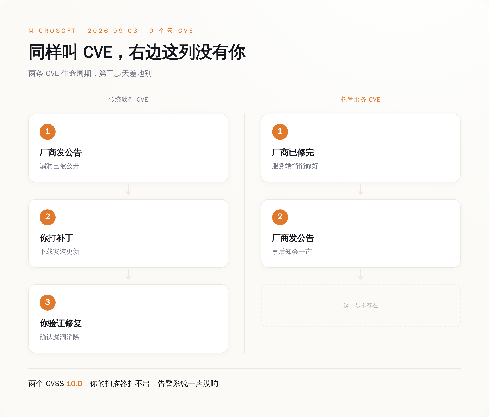
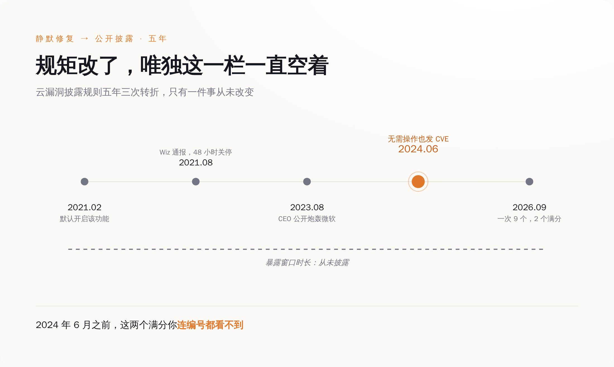
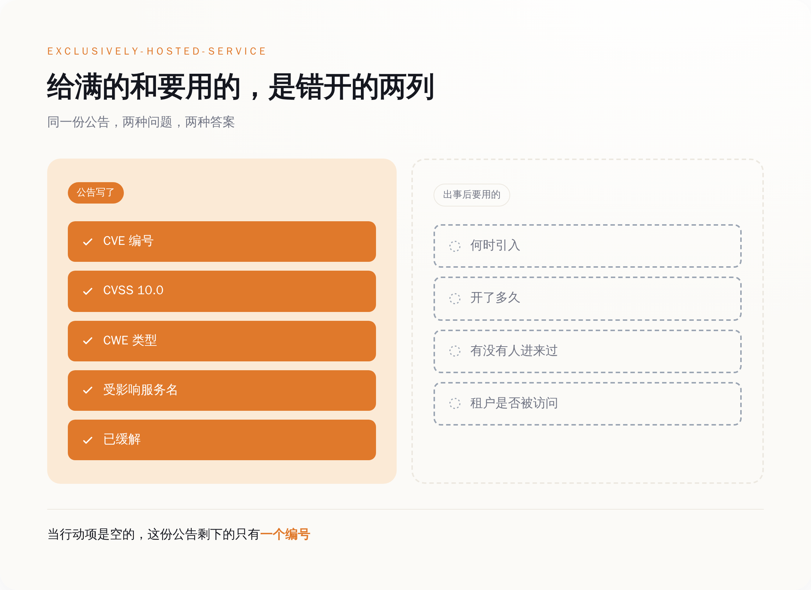
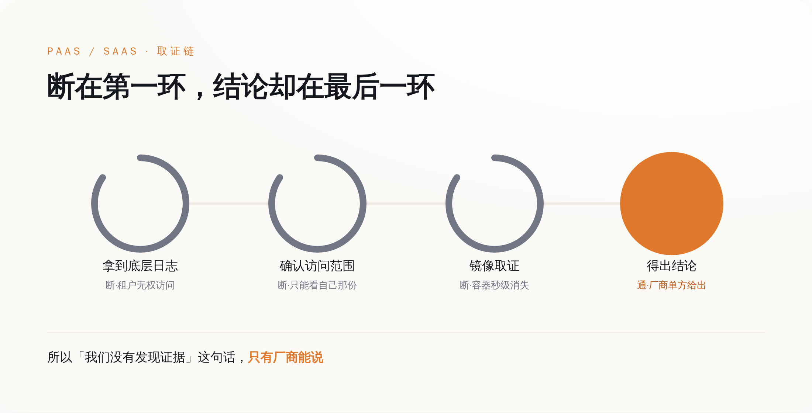
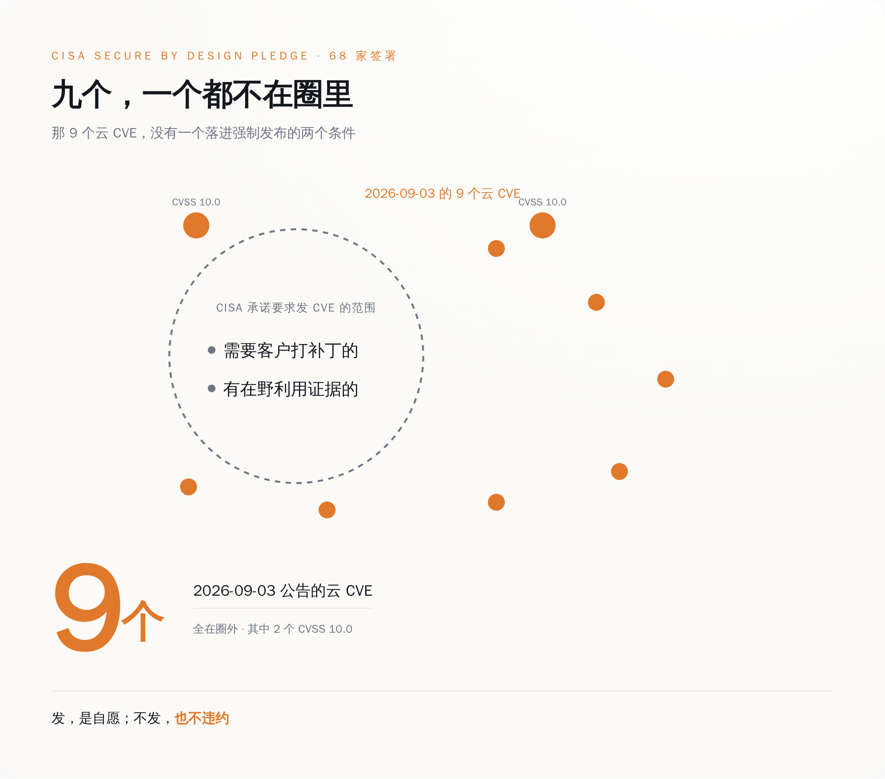

# Azure 的 AI 服务上开了两个 10 分的洞，微软修完才发公告——唯独没说它开了多久

> **发布日期**：2026-09-10 | **分类**：AI 安全

## 导语

9 月 3 日，微软在补丁星期二之外单独发了一批公告：九个漏洞，八个严重级，两个满分。全都开在云上，全都已经修好了。留给客户的那一栏写着：无需采取任何操作。

---

## 一、满分意味着什么

CVSS 是安全行业给漏洞打分的尺子，满分 10.0。想拿满分，一个漏洞得同时满足好几条：从公网就能够到，不用先摸进内网；利用起来不费劲；不需要任何账号密码；不需要骗谁点一下链接；打穿之后能越过授权边界影响到别人的东西；机密性、完整性、可用性三样一起失守。每一项都拉到顶，才是 10.0。

9 月 3 日那批公告里，有两个。

CVE-2026-70352 开在 Azure AI Language Authoring 上。这是 Azure AI Language 服务的创作和管理面，企业在上面配置、训练自己的文本理解模型——意图识别、实体抽取、文档摘要、客服问答，都是这一类活。它的 CWE 分类是 CWE-306，关键功能缺失身份验证。这个编号翻译过来只有一句话：那扇门上没装锁。不是锁坏了，不是配错了钥匙，是压根没装。

另一个是 CVE-2026-83711，开在微软的云身份服务上，CWE-639，通过用户可控的键绕过授权。这个更朴素：请求里有个 ID 字段是你自己填的，你把别人的 ID 填进去，系统就把别人的东西端出来给你。

那一批一共九个 CVE，八个严重级，全部是云服务，Copilot Studio、Entra ID 之类一个不落。九个全部由微软在自己的服务端修完，修完之后才发的公告。

于是那天出现了一个挺荒诞的画面。安全媒体照着处理普通漏洞的老套路发稿，byteiota 那篇的标题直接写着「9 Critical CVEs — Patch Now」。打什么补丁？这批东西没有补丁给你打。你的漏洞扫描器扫不出来，你的资产清单里没有对应条目，你的告警系统那天一声没响。微软在 CVE.org 的记录上给这类漏洞打的标签叫 exclusively-hosted-service，独占托管服务，配套的含义就是：客户无需采取任何操作。这句话之后，整批公告里再没有第二句和你有关的话。

*图注：同样叫 CVE，右边这一列缺的那一步，就是你能做的全部。*

## 二、这类公告是 2024 年才被发明出来的

要掂量「无需操作」这四个字的分量，得先知道一件事：两年前，这两个漏洞你连编号都看不到。微软安全响应中心 2024 年 6 月 27 日发过一篇公告，标题叫《Toward greater transparency: Unveiling Cloud Service CVEs》，开头第一句就把过去的规矩摊开了：

> "In the past, Cloud service providers (CSPs) refrained from disclosing information about vulnerabilities found and resolved in cloud services, unless customer action was required."

翻过来是：以前云厂商在自己服务里发现并修掉的漏洞，只要不需要客户动手，就不对外说。这不是瞒，是行规。传统软件发 CVE 的全部意义就是催你打补丁——补丁在你手上，不告诉你，你就不会打，系统就一直破着。云上的逻辑正好反过来：补丁在厂商手上，厂商推一次，全世界的租户下次调用时自动就是修好的版本。既然你什么都不用做，通知你干什么呢。

这套逻辑自洽，也确实运行了很多年。它的代价在 2021 年的 ChaosDB 事件上露过一次底。云安全公司 Wiz 那年 8 月发现，Azure Cosmos DB 的一个 Jupyter Notebook 功能能让任意一个 Azure 用户拿到别的客户数据库的完整管理权限，读、写、删都行。这个功能 2019 年上线，2021 年 2 月起对所有实例默认开启，8 月被人发现。中间大约半年。

微软的响应速度没得挑，8 月 12 日收到通报，8 月 14 日就把功能关了。发给客户的邮件里，关键的那句是：

> "We have no indication that external entities outside the researcher had access to the primary read-write key associated with your Azure Cosmos DB account(s)."

后来把这件事骂上台面的是 Tenable 当时的 CEO Amit Yoran。2023 年 8 月，他在 LinkedIn 上写长文炮轰微软在 Power Platform 的一个漏洞上从 3 月拖到 8 月才彻底修完，用的词是 "grossly irresponsible, if not blatantly negligent"。

压力堆到 2024 年，微软改了规矩。从那年 6 月起，云服务里的严重漏洞，不管客户需不需要动手，一律发 CVE。同年 11 月，Google Cloud 跟进了同一套做法，连标签都用的同一个 exclusively-hosted-service。这是进步，这句话我说得毫无保留——2024 年 6 月之前，9 月 3 日那两个满分，你根本不会知道它们存在过。

同一篇公告里，微软自己还补了一句：

> "MSRC acknowledges that not all customers want to invest time and energy in addressing this new class of CVEs that don't require further action."

在宣布这项透明度改革的同一篇文章里，微软提前替你说了：我们知道，你们中有些人并不想在这类不用干活的 CVE 上花时间和精力。它猜对了。

*图注：五年里变的是「说不说」，没变的是「说多久」。*

## 三、公告上写了什么，以及没写什么

一份 exclusively-hosted-service 类型的漏洞公告，能给你的信息是固定的那几样：CVE 编号、CVSS 分数和向量、CWE 类型、受影响的服务名、一句已缓解。拿到这些，你知道了「有过一个洞」和「这洞有多大」。

你不知道的是另外四件事：这个洞是哪次发版引入的、它开了多久、这期间有没有人从这儿进来过、你自己的租户有没有被访问过。而这四件事，恰好是出了事之后唯一有用的四件事。

微软不是没有给客户发通知的渠道。Azure 官方博客专门写过 Service Health 的漏洞通报机制：漏洞影响到客户资源时，客户会在 Azure 门户的 Service Health 里收到消息，消息里包含 CVE 编号、严重程度，以及客户可以采取的防护步骤，而且「在大多数情况下，还会列出你订阅里需要采取行动的具体资源」。

这套机制的每一个字段都指向「你要做什么」——步骤、资源清单、行动项。那么当行动项是空的时候，它还剩下什么？

剩下一个编号。

这就是 ChaosDB 那句话为什么值得反复看。没有迹象表明有人访问过——没有迹象，和没有发生，是两回事。中间隔着的东西叫日志覆盖率、日志留存期，以及有没有人真的去翻过。这三样你都看不见，你只能接受结论。

**「我们没有发现证据」这句话，只有厂商能说，也只有厂商说了算。**

*图注：左边是公告给的，右边是出了事之后唯一有用的。*

## 四、你想自己查，也查不了

如果你打算自己查一遍——查不了。这不是态度问题，是托管服务的结构决定的。

云取证在 PaaS 和 SaaS 上有个绕不过去的死结：租户拿不到底层日志。研究多租户云取证的文献把这件事写得很直白——PaaS 和 SaaS 环境限制租户访问底层日志和配置状态，当云厂商管理的日志是唯一证据源时，以日志为中心的证据保全根本无法执行。

再往下还有几层。多租户环境里，调查方还得保证只取到你这一个租户的数据，不能碰到别人的隐私，这本身就压缩了能给你看的范围。传统取证靠把硬盘本体拿下来做镜像，云上你连硬盘长什么样都摸不到，证据链从第一步就是断的。容器和 Serverless 这类东西活几秒就没了，证据跟着一起蒸发。所以你能做的事，在事故发生之前就已经被决定了——决定权在厂商开了哪些日志、留多久、给不给你调。

往上再走一层，连「这算不算一个漏洞」都是厂商说了算。CVE-2025-49747 是 Azure Machine Learning 的一个权限提升，攻击者只要拿到存储账户权限就能改 invoker 脚本，用 AML 计算实例的托管身份执行代码，默认配置下能一路打到整个订阅。微软的回应是：这是 intended behavior，设计如此。然后更新了文档，没发补丁。

Azure Health Bot 那次更能说明托管 AI 服务的暴露面长什么样。2024 年 8 月，Tenable 披露 CVE-2024-38109，一个 SSRF 打到权限提升，研究员拿到 management.azure.com 的 token 之后，列出了「hundreds of resources belonging to other customers」——几百个属于其他客户的资源。而那是一个跑在医疗健康场景里的 AI 聊天机器人服务。

**托管服务的 CVE 数量不是安全水平的函数，是披露意愿的函数。**

一家云厂商这个季度发了 20 个云 CVE，另一家发了 2 个，这两个数字之间没有任何可比性。你不知道第二家是真的稳，还是压根没打算说。

*图注：链子断在第一环，结论只能由持有日志的那一方给出。*

## 五、那到底该干什么

CISA 在 2024 年推的 Secure by Design 承诺，首批 68 家厂商签了字，其中关于漏洞透明度的那一条，原文是这么写的：

> "…issue CVEs in a timely manner for, at minimum, all critical or high impact vulnerabilities (whether discovered internally or by a third party) that either require actions by a customer to patch or have evidence of active exploitation."

要求发 CVE 的范围，是「需要客户打补丁」的，或者「有在野利用证据」的。

9 月 3 日这九个，一个都不属于这两类。

所以从承诺条款的覆盖范围看，微软发这批公告不在义务之内，是自愿多发的。今天愿意发，明天不发，不违反任何承诺，不触发任何监管条款，你也没有任何地方可以申诉。这套让很多人产生安全感的透明度，法律地位是「厂商的善意」。

善意这东西，好的时候很好，只是不能写进风险模型里。

*图注：承诺的边界画在这儿，那九个公告全在边界外面。*

能写进去的是这些。采购和续约的时候，别只盯着 SLA 可用性，把三件事写进条款：暴露窗口的起止时间是否披露、租户级访问日志的留存期和调取方式、以及「未发现证据」这个结论的判定依据——查了哪些日志、覆盖了哪个时间段。

做供应商尽调的时候，把「你们过去 12 个月发过几个 exclusively-hosted-service 类 CVE、每个的暴露窗口多长」列成必答题。大概率问不出答案，这正是重点：把「连续两次答不上来」设成一个触发条件，触发了就升级到合规评审，或者把这个服务在选型表里降一档。问不到答案本身就是一条可以记录、可以复盘的信息，前提是你真的去问了。

内部评分表也要动。把「CVE 数量少」这一项的权重删掉，换成两项能查的：披露及时性，以及暴露窗口的披露率——发了多少个云 CVE，其中几个写明了开始和结束时间。后面这个数字目前在各家那里基本都是零，但正因为是零，它才是个干净的基线，谁先动谁就先甩开对手。

至于 9 月 3 日那两个满分，到今天为止，公开信息里能查到的是：编号、10.0、CWE-306 和 CWE-639、Azure AI Language Authoring 和云身份服务、已缓解。查不到的是：在被发现之前，它们在那儿开了多久。

微软说，您无需采取任何操作。

这句话是对的。它没说的是，就算你想操作，也没有你能操作的地方。

## 数据来源

- [Toward greater transparency: Unveiling Cloud Service CVEs（MSRC，2024-06-27）](https://www.microsoft.com/en-us/msrc/blog/2024/06/toward-greater-transparency-unveiling-cloud-service-cves)
- [September 2026 Early security update：9 个 CVE，8 个 critical（2026-09-03）](https://feedly.com/cve/security-advisories/microsoft/2026-09-03-september-2026-early-security-update)
- [CVE-2026-70352（MSRC Security Update Guide）：Azure AI Language Authoring，CWE-306，CVSS 10.0](https://msrc.microsoft.com/update-guide/vulnerability/CVE-2026-70352)
- [CVE-2026-83711（MSRC Security Update Guide）：CWE-639 授权绕过，CVSS 10.0](https://msrc.microsoft.com/update-guide/vulnerability/CVE-2026-83711)
- [CVE-2026-70352 / CVE-2026-83711 的第三方索引（CWE 与 CVSS 辅证）](https://radar.offseq.com/threat/cve-2026-70352-cwe-306-missing-authentication-for-critical-function-in-microsoft-azure-ai-language-cc766b1906a82b39)
- [CVE-2024-35260（Microsoft Dataverse RCE）：首批 exclusively-hosted-service CVE 样本](https://msrc.microsoft.com/update-guide/vulnerability/CVE-2024-35260)
- [Understanding Service Health communications for Azure vulnerabilities（Microsoft Azure Blog）](https://azure.microsoft.com/en-us/blog/understanding-service-health-communications-for-azure-vulnerabilities/)
- [ChaosDB：Wiz 披露 Azure Cosmos DB 跨租户漏洞（2021-08-27）](https://www.wiz.io/blog/chaosdb-how-we-hacked-thousands-of-azure-customers-databases)
- [Tenable CEO Amit Yoran 炮轰微软安全实践（CyberScoop，2023-08）](https://cyberscoop.com/tenable-microsoft-negligence-security-flaw/)
- [Compromising Microsoft's AI Healthcare Chatbot Service：CVE-2024-38109（Tenable，2024-08-06）](https://www.tenable.com/blog/compromising-microsofts-ai-healthcare-chatbot-service)
- [CVE-2025-49747：Azure Machine Learning 权限提升，微软认定为 intended behavior](https://zeropath.com/blog/cve-2025-49747-azure-machine-learning-privilege-escalation)
- [CISA Secure by Design Pledge](https://www.cisa.gov/securebydesign/pledge)
- [Google Cloud expands CVE program（2024-11）](https://cloud.google.com/blog/products/identity-security/google-cloud-expands-cve-program/)
- [Cloud evidence lifecycle framework：多租户云取证的日志依赖问题](https://pmc.ncbi.nlm.nih.gov/articles/PMC13474384/)
