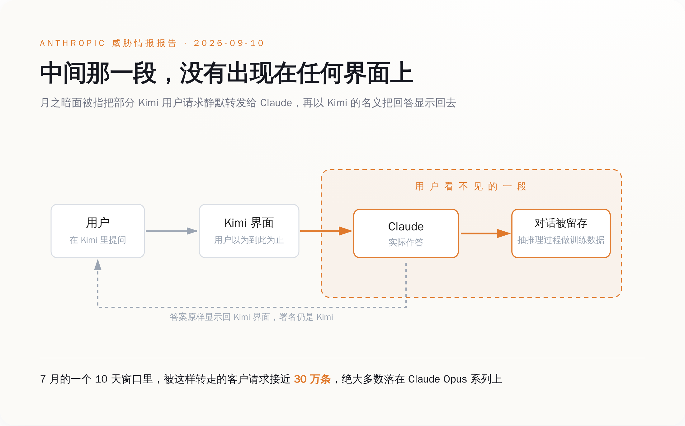
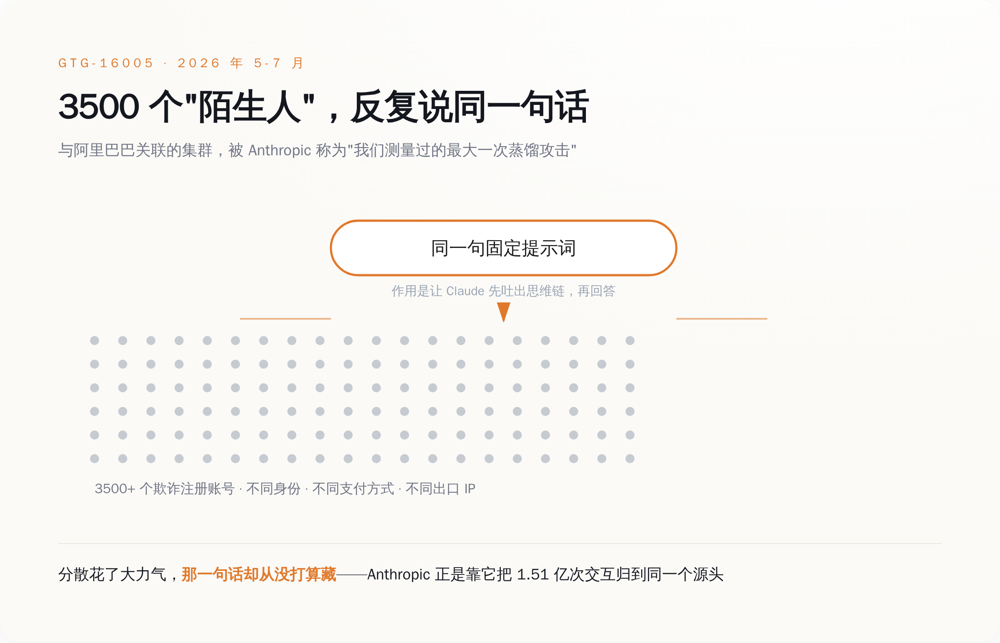
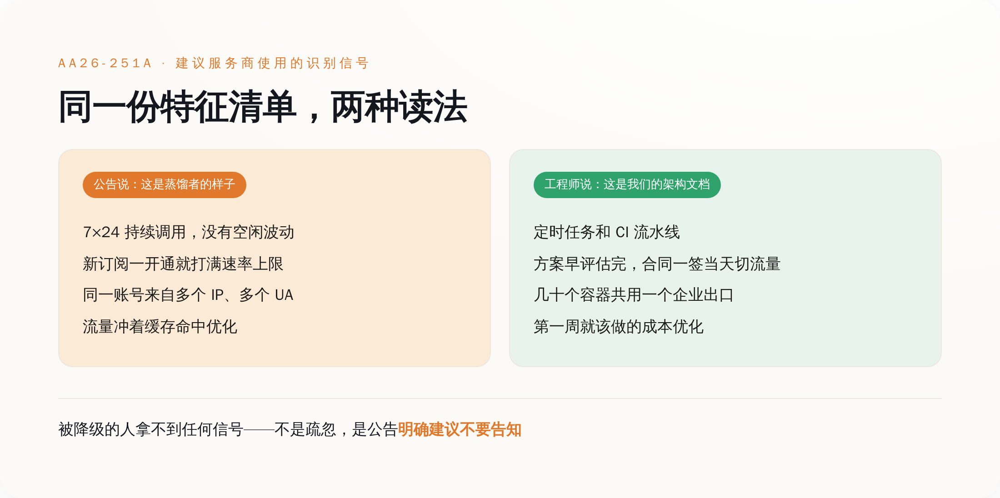
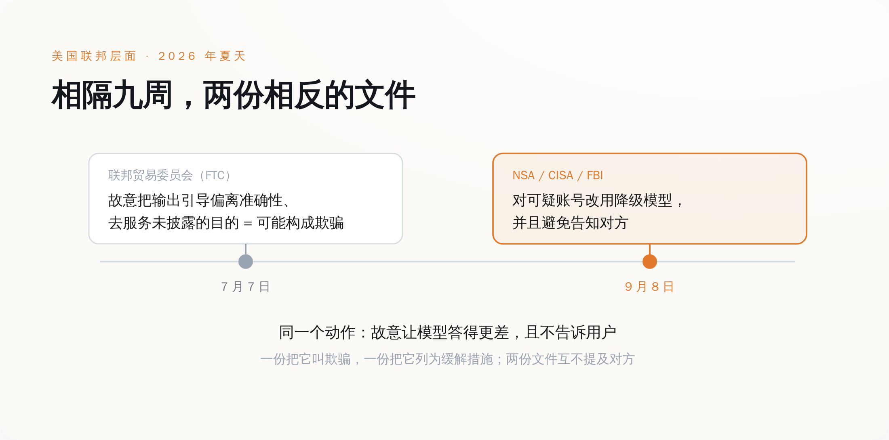

# 你以为你在和 Kimi 说话，它把你的提问转给了 Claude——同一周，美国政府建议 Claude 对可疑账号偷偷答错

> **发布日期**：2026-09-11 | **分类**：AI 行业观察

## 导语

今年 7 月的某 10 天里，有将近 30 万条本该由 Kimi 回答的用户提问，被转发给了 Claude。Claude 答完，答案原样显示回 Kimi 的界面上。提问的人不知道这件事。按 Anthropic 的说法，它也不知道这些人有没有被告知过。

再往前两天，9 月 8 日，美国三家安全机构发了份公告，建议美国 AI 公司对可疑账号偷偷换上能力更差的模型，并且明确写了：不要告诉对方。

隔两天，两份文件，讲的其实是同一条规矩的两头。

---

## 一、那 30 万条提问，去了它们不该去的地方

9 月 10 日，Anthropic 发布了新一份威胁情报报告《Detecting and countering misuse of AI: September 2026》，覆盖 2025 年 12 月到 2026 年 8 月被它处置掉的滥用行为，分七类：网络攻击、影响力行动、监控、诈骗、生物滥用、常规武器，以及蒸馏。

前六类都是老选题。第七类里藏着这周真正的新东西。

报告说，月之暗面（Moonshot AI）把一部分本该由 Kimi 处理的用户请求，静默转发给了 Claude，拿到回答之后，以 Kimi 的名义显示给用户。5 月到 7 月之间，Anthropic 归因到月之暗面的交互超过 2300 万次；其中某个 10 天的窗口里，被转过来的客户请求接近 30 万条，绝大多数落在 Claude Opus 系列上。这些对话它至少保存了一部分，从里面把 Claude 的推理过程抽出来，当自家模型的训练材料。

DeepSeek 被指做了同样的事。7 月的一个 14 天窗口里，Anthropic 记到超过 1210 万次可归因于 DeepSeek 的蒸馏行为，同样是把用户的对话转过来，同样没有通知用户。

数字之外，Anthropic 在报告里还补了一句：它不知道月之暗面有没有就此通知过客户。

一家美国公司，在一份写给全世界看的安全报告里，需要专门说明它无法确认另一家公司的用户是否知道自己在跟谁说话。这句话之所以能写出来，是因为整个行业默认它可以不必知道。

被转走的东西也不都是"帮我写个 Python 脚本"。Anthropic 说，这些被转发的交互里含有敏感信息，来源包括个人用户、大型跨国企业，以及有国家背景的行为体；它同时判断，这类做法很可能既不符合隐私法规，也不符合这些实验室自己的服务条款。

也就是说，如果那 10 天里你正好在 Kimi 里贴了一段公司内部的代码，或者一份还没对外的方案，这段东西大概率去过一趟 Anthropic 的服务器。你不知道，你公司的合规也不知道。你在用的产品页面上写的是国产模型，法务看的隐私政策里写的是国产模型，但那一刻回答你的不是它。

## 二、1.51 亿次对话，栽在同一句话上

报告里规模最大的一笔，Anthropic 给的编号是 GTG-16005，指向一批与阿里巴巴有关联的操作者。

5 月到 7 月，这个集群和 Claude 发生了超过 1.51 亿次交互，峰值日均约 300 万次，来自 3500 多个欺诈注册的账号。Anthropic 称它是"我们测量过的最大一次蒸馏攻击"。目标很具体：Claude Opus 4.6 和 4.7 的思维链，也就是模型在给出答案之前那一段内部推理的文字记录。被重点抽取的场景是智能体任务、软件工程、内核开发和长程任务，抽出来的记录转成微调数据，喂给 Qwen 3.5、3.6、3.7。

3500 个账号，散在不同的身份、不同的支付方式、不同的出口 IP 上，本来就是为了让它们看起来像 3500 个互不相干的客户。

然后这 3500 个账号，用的是同一句提示词。

这句固定的话，作用是让 Claude 先把推理过程吐出来再回答。它在功能上是必需的——不这么问，拿不到思维链；但它在识别上是致命的，因为 3500 个"陌生人"同时反复说同一句话，这件事本身就是签名。Anthropic 把这批流量归到同一个源头，靠的就是它。

蒸馏这门手艺在工程上已经做得相当熟练了：注册走的是教育项目、安全研究项目、创业扶持额度这类审核最松的通道，流量打散在 API 和第三方云平台之间，和正常客户的请求混在一起。上游做到了工业化，下游却用一句写死的 prompt 把整条链子串了起来。

这不是能力问题。是做这件事的人从一开始就不认为它需要藏——藏的是账号来源和付款方式，不是那句话本身。你不会把一句业务上每天要用 300 万次的固定指令当成罪证去伪装，除非你已经承认它是罪证。

## 三、官方给出的对策：换个笨模型，别告诉他

Anthropic 这份报告发布的两天前，9 月 8 日，美国国家安全局、网络安全和基础设施安全局、联邦调查局联合发布了编号 AA26-251A 的网络安全公告，标题直译过来是《中国 AI 公司对美国 AI 公司开展工业规模蒸馏活动》。

公告点名六家：DeepSeek、月之暗面、阿里巴巴、MiniMax、阶跃星辰、Z.AI。说法是这些公司自 2024 年底以来，从 Claude、GPT、Gemini、Grok 的多个版本中提取了数十亿 token、数百万次交互，手段包括被称为"中转站"（transfer stations）的灰色 API 代理、批量共享的高级订阅账号，以及剥掉账号元数据的聚合器。公告用了一句很重的定性：这些活动构成这些公司 AI 研发战略的"核心，而非补充"。

值得读第二遍的是建议部分。公告建议美国 AI 服务商对疑似蒸馏的请求，改用能力更弱的"降级"模型来回应；建议在不同请求之间变换降级的方式，好让对方难以评估回答质量、难以判断自己是不是被区别对待了；然后是那句被到处引用的：

> 避免告知疑似从事蒸馏活动的中国 AI 公司用户，其请求已被切换到降级模型。

理由公告自己写了：一旦告知，对方就能改进规避手段，并且知道该在什么时候把训练回滚掉。

这个理由在反滥用的逻辑里完全成立。蜜罐就是这么做的，反爬虫的 tarpit 也是这么做的——你不会在陷阱门口挂个牌子写"此处有陷阱"。

区别在于，蜜罐对付的是未经授权闯进来的人，你和他之间没有合同。而这里被降级的对象，是一个注册了账号、付了钱、按价目表在调用你 API 的付费用户。你怀疑他，这是你的权利；你按怀疑降低他买到的服务质量，同时收全价，并且照公告的建议不告诉他——这件事在反滥用的语言里叫"缓解措施"，换到消费者保护的语言里，它有另一个名字。

## 四、问题是，这套特征描述的正是一支干活的 agent 集群

公告同时给了服务商一份识别清单，用来判断谁像蒸馏者。几条主要的行为信号是：7×24 小时持续调用，没有人类使用该有的空闲和波动；新订阅一开通就直接打满速率上限，不像正常客户那样逐步爬坡；同一个账号从多个 IP、多个 User-Agent 访问；流量模式明显是冲着缓存命中去优化的，而不是任务本身的多样性。

把这几条念给任何一个在生产环境跑 agent 的工程团队听，他们会以为你在描述他们的架构文档。

7×24 没有空闲，那是定时任务和流水线。新账号立刻满吞吐，那是公司上个季度就把方案评估完了，合同一签当天切流量。一个账号多个 IP 多个 User-Agent，那是几十个容器共用一个企业出口，或者干脆是多地部署。为缓存命中优化，那是任何一个认真控成本的团队第一周就会做的事——各家厂商自己还在文档里教你怎么做。

学术团队批量生成数据集是这个样子。用官方蒸馏功能把大模型的能力搬到小模型上，也是这个样子——OpenAI 自己就卖这个产品，有 Stored Completions 负责把大模型的输入输出对存下来，有 Evals 负责评估，整套流程官方文档写得明明白白。蒸馏这门技术本身，源头是 Hinton 2015 年那篇论文，是教科书内容，不是暗网买卖。

于是这套建议的成本落点就清楚了：它不落在那 3500 个账号上——那批人本来就在用假身份和盗刷的卡，被降级了大不了换一批账号重来，公告自己也承认对方会"改进规避手段"。它落在那些行为特征长得很像、但什么都没干错的付费用户身上。

而这批人拿不到任何信号。不是因为服务商疏忽，是因为公告明确建议不要给。没有通知，就没有申诉；没有申诉，就没有纠错。整个环节里唯一能发现自己被降级的办法，是你自己长期跑一套固定的回归测试，然后某天发现同样的题，答得不如三个月前好了。

历史上偷偷降级被抓出来过两次，代价都不小。苹果在系统更新里给老电池的 iPhone 降 CPU 频率而没有明确告知，2020 年以集体诉讼和解收场，金额区间在 3.1 亿到 5 亿美元，赔款 2024 年 1 月才开始发到用户手里。大众的柴油车装了能识别排放测试工况的作弊软件，只在被测的时候开全套排放控制，2016 年民事和解最高 147 亿美元，2017 年又认了三项联邦重罪，交 28 亿美元刑事罚金。

这两件事能被抓住，是因为降级可以从外部测出来：跑个跑分，或者把车拉到路上实测。

而 AA26-251A 的建议里专门有一条，是让服务商在不同请求之间变换降级的方式，好让对方难以评估回答质量。

## 五、同一个政府的另一个部门，管这个叫欺骗

值得说清楚的是，AA26-251A 没有把蒸馏本身定性成坏事。公告明确承认蒸馏是一项正当且有用的 AI 研究技术，它指控的是这六家把它做成了工业规模的恶意行为。这个区分是成立的，也不该被抹掉——伪造身份、盗刷信用卡、把自己用户的对话在人家不知情的时候转手，这些东西和"用大模型的输出训练小模型"不是一回事。

但落点在哪儿，公告自己也写了：这些公司通过多种路径获取未经授权的访问，由此**违反了美国 AI 公司的使用条款**。

使用条款。这是一份由国家安全局、联邦调查局和 CISA 联署的公告，最后落在了一份点击同意的合同上。公告没有随附任何起诉、制裁或出口管制。

这条路走了快两年。2024 年底，微软的安全人员在 OpenAI 的 API 上发现疑似与 DeepSeek 有关的账号在大量异常抓取数据；2025 年 1 月 DeepSeek R1 发布后，OpenAI 公开表示正在审查蒸馏迹象，白宫的 AI 政策顾问说有"大量证据"。至今没有任何一份公开的技术取证报告，也没有一场官司。2026 年 2 月，OpenAI 改为向美国众议院的中国问题特别委员会递备忘录，措辞是 DeepSeek 在"搭便车"。又过了七个月，事情变成了一份网络安全公告。

从客服工单到国会备忘录再到国家安全公告，中间一次没进过法院。

原因不难猜。模型输出本身在美国的版权地位一直悬着，能拿来主张权利的最硬的东西，就是那句合同条款——OpenAI、Anthropic、谷歌的条款里都写着不许用输出去训练竞品模型，也都同时开了口子：用他们自己的官方蒸馏功能可以。你可以蒸馏，只要用我卖你的那把管子。

中国商务部 9 月 9 日的回应，正是从这个缺口切进去的：指控"缺乏事实和法律依据"，蒸馏是包括美国企业在内的全球模型公司普遍采用的中性技术手段，如果以打击蒸馏为名对中国企业实施遏制打压，中方将采取反制。

至于那句"缺乏法律依据"——公告自己的落点是使用条款，而不是任何一部法律。

真正的裂缝还不在中美之间，在美国政府自己内部。

今年 7 月 7 日，比 AA26-251A 早整整九周，美国联邦贸易委员会在《联邦公报》上发布了一份政策声明草案，题目是《关于人工智能系统中准确性抑制的政策声明》。核心意思是：如果 AI 开发者故意把模型输出引导偏离用户的目标、偏离用户对真实与准确的合理预期，转而服务于一个未披露的目的，这可能构成《联邦贸易委员会法》第 5 条下的欺骗。FTC 特意把这种情况和普通的模型出错、幻觉区分开——技术能力不足导致答错是一回事，为了别的目的故意设计成答得更差是另一回事。声明还写了怎么避免：披露，说清楚你在优先服务一个和用户要求不同的目标。

九周之后，另外三家联邦机构建议 AI 公司故意向一部分付费用户提供降级输出，为的是一个不能披露的国家安全目的，并且特意建议不要披露。

**一个部门说，故意让模型答得更差而不告诉用户，这叫欺骗；另一个部门说，故意让模型答得更差，记得别告诉用户。**

这两份文件里没有一份提到对方。两边的理由也都站得住：一边护的是消费者知情权，一边护的是不让对手拿到干净的训练信号。矛盾不在于谁错了，在于这个行业已经默认，"用户不需要知道是哪个模型在回答"是一个可以被随时征用的空间——反滥用可以用它，商业路由可以用它，国家安全也可以用它。

回到开头那 30 万条提问。它们的主人以为自己在和 Kimi 说话。按照 AA26-251A 的建议往下走，Claude 的一部分付费用户，将来也不会知道回答他们的其实不是 Claude。

这两件事看上去是对立的两边，做的是同一个动作：在用户和模型之间，插进去一层不必向用户交代的东西。管子的一头在瞒，另一头也在瞒，而两头都有充分的理由。

**唯一没有出现在任何一份文件里的角色，是那个正在打字的人。**

## 数据来源

- [China-Based Artificial Intelligence Companies Conducting Industrial-Scale Distillation Campaigns Against U.S. AI Companies（NSA / CISA / FBI 联合公告 AA26-251A，2026-09-08）](https://www.cisa.gov/news-events/cybersecurity-advisories/aa26-251a)
- [CISA 新闻页：三机构联合警告工业规模知识蒸馏活动](https://www.cisa.gov/news-events/news/cisa-nsa-and-fbi-warn-china-based-ai-companies-targeting-us-ai-models-industrial-scale-knowledge)
- [Detecting and countering misuse of AI: September 2026（Anthropic 威胁情报报告，2026-09-10）](https://www.anthropic.com/threat-intelligence-report-september-2026)
- [Anthropic 报告 PDF 全文](https://www-cdn.anthropic.com/e50be2e51e7695dc4b1366a37a245a597377d3b5/Anthropic-Detecting-and-countering-091026.pdf)
- [Chinese AI labs secretly used millions of Claude exchanges to train their models, Anthropic says（CNBC，2026-09-11）](https://www.cnbc.com/2026/09/11/chinese-ai-labs-moonshot-deepseek-alibaba-anthropic.html)
- [Moonshot, DeepSeek secretly routed user requests to Claude, Anthropic claims（南华早报，2026-09-11）](https://www.scmp.com/news/us/diplomacy/article/3367112/moonshot-deepseek-secretly-routed-user-requests-claude-anthropic-claims)
- [Anthropic details distillation campaigns from Alibaba, Moonshot AI, and DeepSeek（TechCrunch，2026-09-10）](https://techcrunch.com/2026/09/10/anthropic-details-distillation-campaigns-from-alibaba-moonshot-ai-and-deepseek/)
- [Policy Statement Concerning the Suppression of Accuracy in Artificial Intelligence Systems（FTC 政策声明草案，《联邦公报》2026-07-07）](https://www.federalregister.gov/documents/2026/07/07/2026-13628/policy-statement-concerning-the-suppression-of-accuracy-in-artificial-intelligence-systems)
- [FTC 公开征求意见页：关于人工智能系统中准确性抑制的政策声明](https://www.ftc.gov/policy/public-comments/policy-statement-concerning-suppression-accuracy-artificial-intelligence-systems)
- [China rejects US claims of industrial-scale AI model distillation, warns of retaliation（南华早报，2026-09-09）](https://www.scmp.com/economy/article/3367001/china-rejects-us-claims-industrial-scale-ai-model-distillation-warns-retaliation)
- [China's Commerce Ministry Rejects U.S. Accusations of Industrial-Scale AI Distillation（National Law Review，2026-09）](https://natlawreview.com/article/chinas-commerce-ministry-rejects-us-accusations-industrial-scale-ai-distillation)
- [Microsoft probing whether DeepSeek improperly used OpenAI's API（TechCrunch，2025-01-29）](https://techcrunch.com/2025/01/29/microsoft-probing-whether-deepseek-improperly-used-openais-api/)
- [OpenAI accuses DeepSeek of distilling US models（2026-02，向美国众议院中国问题特别委员会提交的备忘录报道）](https://finance.yahoo.com/news/openai-accuses-deepseek-distilling-us-221629118.html)
- [OpenAI Model Distillation：Stored Completions 与 Evals 官方蒸馏工作流](https://openai.com/index/api-model-distillation/)
- [Distilling the Knowledge in a Neural Network（Hinton, Vinyals, Dean，2015）](https://arxiv.org/abs/1503.02531)
- [Antidistillation Sampling（arXiv 2504.13146）](https://arxiv.org/abs/2504.13146)
- [What Does It Mean to Break a Distillation Defense?（arXiv 2606.25059）](https://arxiv.org/abs/2606.25059)
- [Apple「电池门」集体诉讼和解：赔付于 2024 年 1 月开始发放（MacRumors）](https://www.macrumors.com/2024/01/06/apple-starts-iphone-batterygate-payouts/)
- [Volkswagen to Spend $14.7 Billion to Settle Allegations of Cheating Emissions Tests（美国司法部，2016-06-28）](https://www.justice.gov/archives/opa/pr/volkswagen-spend-147-billion-settle-allegations-cheating-emissions-tests-and-deceiving)
- [Volkswagen AG Agrees to Plead Guilty and Pay $4.3 Billion in Criminal and Civil Penalties（美国司法部，2017-01-11）](https://www.justice.gov/archives/opa/pr/volkswagen-ag-agrees-plead-guilty-and-pay-43-billion-criminal-and-civil-penalties-six)
