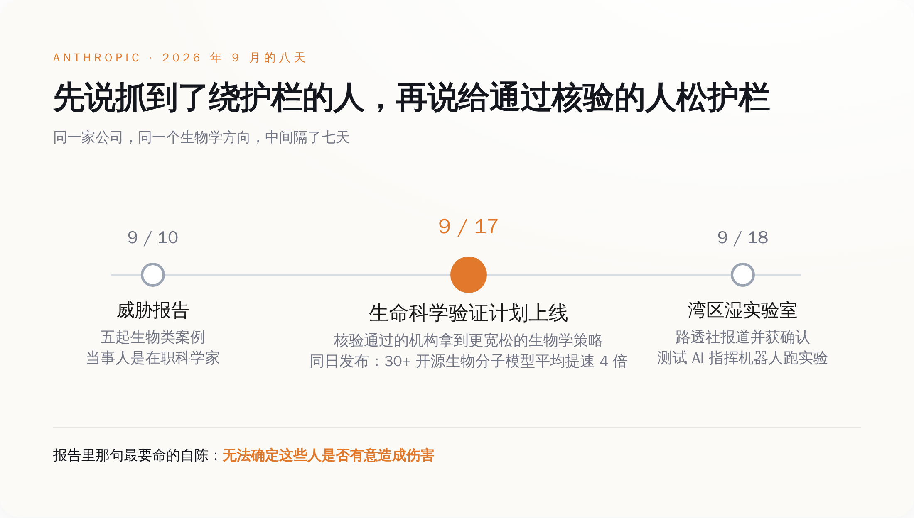
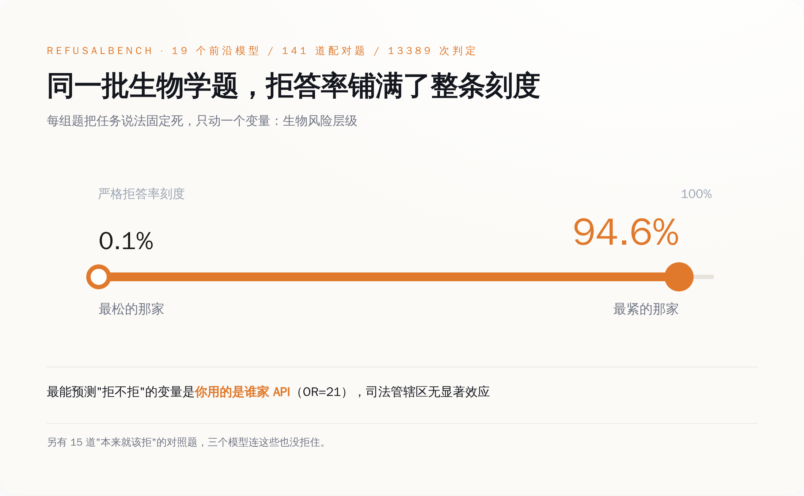
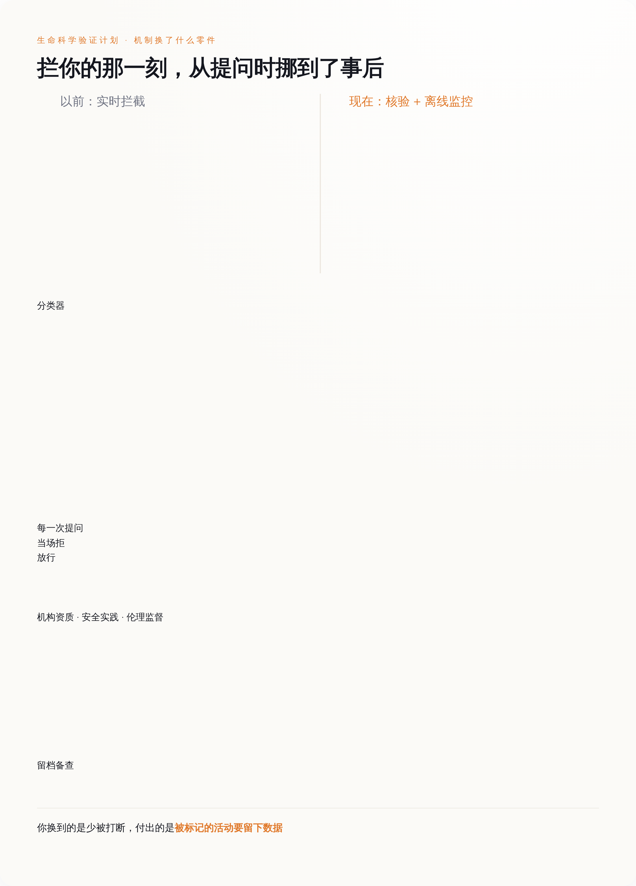

# 抓到五个绕过生物安全护栏的人，一查全是真科学家。七天后，Anthropic 把门重新开了

> **发布日期**：2026-09-18 | **分类**：AI 安全

## 导语

9 月 10 日，Anthropic 发了一份叫《Detecting and Countering Misuse of AI: September 2026》的报告，里面点名五起"可能支持生物武器研发"的使用记录。报告同时承认了两件很别扭的事：这些人是 working scientists，正在上班的科学家；以及，它无法确定这些人到底有没有恶意。

七天后，同一家公司开了一扇门，把生物学方向的护栏调松，发给通过核验的机构。这两件事不矛盾，它们是同一件事的前后两半。

---

*八天之内，同一家公司先公布了五起绕过生物护栏的案例，再把生物学护栏调松发给通过核验的机构。*

## 一、绕过护栏的那五个人，履历没问题

那份报告覆盖的时间是 2025 年 12 月到 2026 年 8 月，分七类危害，生物这一类下面挂了五个案例。绕过手法值得单独拎出来看一眼：按报告的说法，其中一些人绕开了按地区封锁访问的限制，另一些人在提问时"混淆自己研究的目的以规避我们的安全措施"。翻过来说就是：换个 IP，换个说法。两样都不需要技术背景，只需要知道护栏在看哪里。

然后是最难受的那句。Anthropic 说，它没法确定这些行为人是"有意造成伤害"，还是在做正经科研。

这句话表面上是谨慎，实际上是招供。一道护栏的全部工作原理，是假设危险请求会长得像危险请求——坏人会在提示词里露出坏话，好人不会。五个案例把这个假设按在地上摩擦了一遍：真正的生物学能力藏在实验设计、序列文件、蛋白结构里，而护栏在读措辞。措辞是这条链上最便宜的一环，谁都能改，改了不花钱，改错了也没有代价，大不了重开一个对话。

所以真正的问题不是"护栏被绕过了"。护栏当然会被绕过，任何一道基于文本特征的过滤都会被绕过，这不新鲜。真正的问题是另一头：既然懂行的人一改说法就能过去，那这道护栏天天在拦的，到底是谁？

## 二、同一批题，拒答率从 0.1% 到 94.6%

今年 5 月有一篇叫 RefusalBench 的论文（arXiv 2605.21545），干的就是这件事：把拒答行为本身当成被测对象，量一量。

它的做法是配对题。141 道题分成 47 组，每组内部把任务的说法固定死，只动一个变量——生物风险层级，从良性、到灰色、到明确双用途。这样一来，模型拒不拒，就不能赖"题目问的领域不一样"。题目覆盖八个蛋白设计子领域，上了 19 个前沿模型，三个 AI 评委按五级顺从度打分，总共 13389 次判定。

结果是：面对同一批题，各家模型的严格拒答率从 0.1% 铺到 94.6%。

这不是"有的严一点有的松一点"的程度差别。这是同一道题，在一家这儿是学术问题，在另一家那儿是恐怖袭击预备行为。论文顺手做了回归，发现最能预测"会不会被拒"的变量，是你用了谁家的 API——Anthropic 那套栈的 OR 值到 21；而司法管辖区这个变量，没有显著效应。论文还塞了 15 道"本来就该拒"的对照题进去，有三个模型连这个都拒不住。

*同一批配对题上，各家模型的严格拒答率从 0.1% 铺到 94.6%——决定拒不拒的不是题目，是厂商。*

把这几个数字摆在一起看，结论挺不客气的：拒答率不是安全水位线，它是一个旋钮，刻度写在各家公司的产品经理心里。旋钮既然在厂商手上，那什么时候他们会想把它拧松？答案是，当拧紧开始有账单的时候。

## 三、模型从聊天框变成了实验器材

就在开门的同一天，9 月 17 日，Anthropic 还发了另外一篇东西，讲 Claude 拿开源的生物分子模型做了什么。

数字是这样的：36 个优化包，覆盖 30 多个开源模型，跨六个家族（共折叠与结构预测 14 个、幻觉法设计 3 个、结构生成 6 个、反向折叠 3 个、基因组学 7 个、蛋白语言模型 3 个），耗时不到四周，平均提速约 4 倍。分到具体模型上，快速模式里 OpenDDE 提了 2.3 倍，Chai-1 提了 6.4 倍；基因组学和蛋白语言模型在精确模式下是 1.2 到 5.0 倍。里面还有一个叫 FlashPairformer v1 的算子，在 pair width 128（AlphaFold3 和 Boltz-2 用的规格）上把 triangle attention 跑到了领域标准核的 2.7 倍，256（Protenix v2 的规格）上 2.9 倍。代码按 Apache 2.0 扔在公开仓库里，能直接插进 AlphaFold3、OpenFold3、Boltz-2、ColabFold、OmegaFold。

再往前一个月，8 月那批湿实验室结果更直白：15 个靶点、354 个结合物，Adaptyv Bio 和 Twist Bioscience 负责合成和测试，Mythos Preview 的总命中率 26.7%，Opus 4.8 是 22.6%，而这个领域的常规水平在 10% 到 15% 之间。TREM2 这个靶点上命中率干到了 80%，此前一次公开比赛的纪录是 38.3%。

9 月 18 日，路透社的 Jeffrey Dastin 和 Michael Erman 报道，Anthropic 在旧金山湾区建了一间湿实验室，公司生命科学负责人 Eric Kauderer-Abrams 向他们确认了这件事，发言人则表示"不是专门做药物发现的"，然后拒绝展开。报道里还有一句，公司在测试 Claude 能不能指挥机器人系统在极少人力下跑实验，Kauderer-Abrams 的原话是"我们在用 AI 自动执行实验室工作这件事上，还处于非常早期的阶段"。

这三件事拼起来，护栏的处境就变了。模型不再只是个能陪你聊蛋白质的聊天框，它开始是实验器材——能优化你的推理栈，能出设计方案，能让机械臂动起来。当它是聊天框的时候，误拒只是体验问题，用户骂两句就算了；当它是器材的时候，误拒就是把一家付了钱的药企挡在自己的实验流程外面。

拧紧有了账单，门就得开。

## 四、门开了，但你走进来的时候被登记了

9 月 17 日上线的那扇门叫生命科学验证计划（Life Sciences Verification Program，LSVP），beta 阶段，面向团队和机构，先走第一方 console 的 API 调用，以及 Claude 企业版和团队版，第三方平台上没有。通过核验的机构能拿到 Mythos 5.1、Opus 5、Sonnet 5，配一套"对生物学工作更宽松"的安全策略，用来做药物发现、研究生物学、临床开发和生产这些在通用版模型上会被卡住的活。公司说已经通过早期通道接了数十家机构进来，个人 Pro 和 Max 用户以后再说。核验查三样：机构资质、安全实践、伦理监督。

这套东西真正换掉的零件，藏在机制描述里而不是在宣传语里：安全措施从实时拦截，改成了离线监控。以前是你每问一句，系统当场判一次，觉得不对就当场拒；现在是让正经工作先跑起来，少打断，代价是被标记的活动要留下数据备查。

拦你的那一刻，从提问时挪到了事后。

*护栏没有拆，它从提问那一刻的实时拦截，换成了进门核验加事后留档。*

这不是解禁，是登记。你换到的东西是"少被打断"，你付出的东西是"留下记录"。判断你是好人还是坏人这件事本身没有消失，也没有变简单，它只是从模型手里转交给了核验流程和事后审计——从一个当场猜你动机的分类器，换成了一张你填过的表格加一份可回溯的日志。

这不是 Anthropic 一家的选择。OpenAI 今年 4 月推 GPT-Rosalind 的时候，结构几乎一模一样：面向生命科学的专用模型，只给签了企业协议的合格机构，走 trusted-access 通道，通过审核的客户拿到的是"限制更少的版本"，审核时看的是生物安全和安保控制这类治理指标。两家头部公司在半年内各自走到了同一个设计上，这种默契通常意味着，这不是谁的偏好，是这条路上剩下的唯一可行解。

可行解不等于好解。回头看那五个案例——他们绕过的恰恰是按地区封锁的访问限制，和以说辞伪装研究目的。这两手在门禁模式下一点没过时：地区限制变成了机构归属，研究目的伪装变成了申请材料里的项目描述。区别只在于，以前伪装一次骗过一次提问，现在伪装一次骗到一整套宽松策略的长期访问权。攻击面没有消失，它从对话框挪到了核验台，而核验台这边至今没人公布过通过率、驳回理由、复核机制，这些标准是私营公司自己定的，不公开，也不可申诉。

这件事最诚实的一句话，还是 Anthropic 自己在 9 月 10 日那份报告里写的：它无法确定那五个人是否有意造成伤害。门禁模式的意思是，从今往后它也不必在提问的那一刻确定了。它只需要知道你是谁，然后把账记着。

## 数据来源

- [Anthropic：Detecting and countering misuse of AI: September 2026（2026-09-10）](https://www.anthropic.com/threat-intelligence-report-september-2026)
- [Anthropic：Introducing the Life Sciences Verification Program（2026-09-17）](https://www.anthropic.com/news/life-sciences-verification-program)
- [Anthropic：How Claude is uplifting biomolecular modeling（2026-09-17）](https://www.anthropic.com/research/claude-uplifts-biomolecular-modeling)
- [Anthropic：Claude accelerates protein design and analytical chemistry](https://www.anthropic.com/research/Claude-accelerates-protein-design)
- [RefusalBench: Why Refusal Rate Misranks Frontier LLMs on Biological Research Prompts, arXiv:2605.21545](https://arxiv.org/abs/2605.21545)
- [RefusalBench 开源仓库（19 模型 / 141 题 / 13389 次判定）](https://github.com/AppliedScientific/refusalbench)
- [路透社（经 CNBC 转载）：Anthropic quietly sets up biology lab as it ramps AI drug program（2026-09-18）](https://www.cnbc.com/2026/09/18/anthropic-quietly-sets-up-biology-lab-as-it-ramps-ai-drug-program-report.html)
- [OpenAI：Introducing GPT-Rosalind for life sciences research](https://openai.com/index/introducing-gpt-rosalind/)
- [OpenAI Help Center：Life Science Research Special Access Program](https://help.openai.com/en/articles/11826767-life-science-research-special-access-program)
