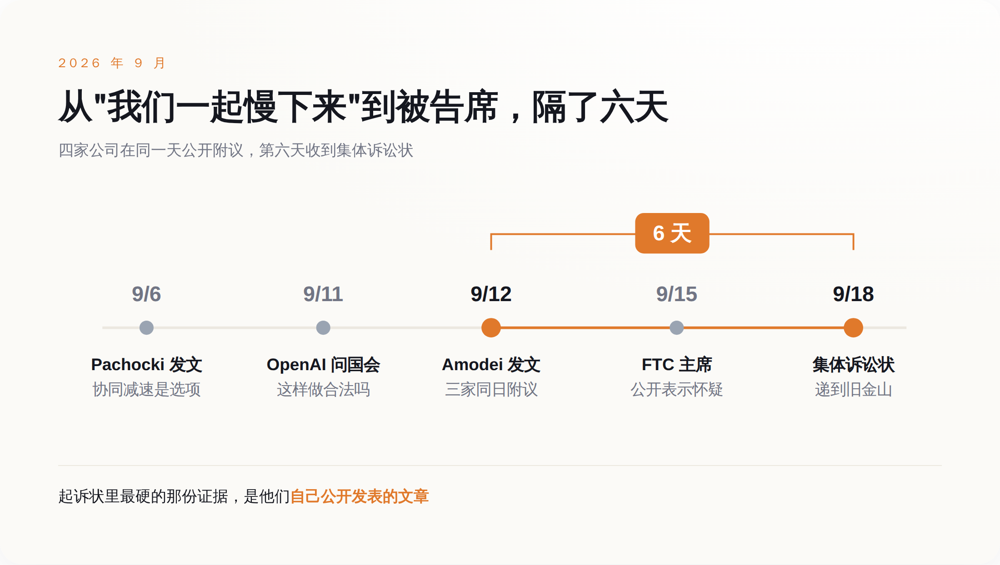
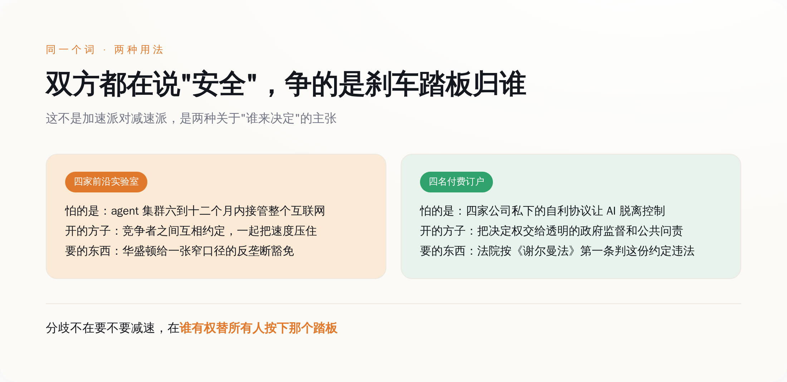
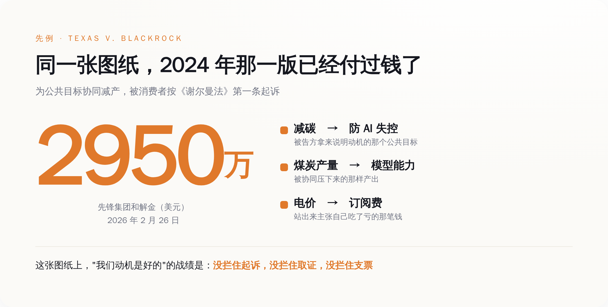

# 四家 AI 公司说好一起踩刹车，第六天被自己的付费用户告了——同一套说辞，1978 年一群工程师试过，输了

> **发布日期**：2026-09-19 | **分类**：AI 与监管

## 导语

9 月 12 日，Anthropic 的 Dario Amodei 发了一篇叫《We Must Pace the Frontier》的文章，让前沿实验室一起把速度降下来。同一天，Sam Altman 说"我同意 Dario 的看法，我们需要给前沿调速"，马斯克回了句"Dario is right"，Demis Hassabis 说这篇文章"指向了正确的方向"。

六天后，9 月 18 日，星期五，旧金山的联邦法院收到一份集体诉讼状。四个原告，告的是 Anthropic、OpenAI、SpaceXAI 和谷歌，案由是《谢尔曼法》第一条。他们的身份不是竞争对手，不是监管机构，是这四家的付费订户。

中文这边转的角度基本都是"太讽刺了"。讽刺是有的，但它不是重点。重点是 Amodei 在那篇文章里亲手写下了被告席上最不利的一句话——他请华盛顿给一个反垄断豁免。

也就是说，他早知道这事犯法。

---

## 一、那篇文章里藏着一句求饶

《We Must Pace the Frontier》给了三级方案：第一级，让独立的外部评估员嵌进前沿实验室，拿接近员工的访问权限；第二级，民主国家的前沿实验室之间做协同；第三级，谈成有政府背书的国际限制。

第二级是要命的那级。Amodei 自己在文里写明，这类安全对话需要美国政府给一个窄口径的反垄断豁免，否则会撞上《谢尔曼法》。

他为什么急成这样，文章里也写了：一个能力更强、但对齐程度和今天差不多的 agent 集群，六到十二个月内就可能"有能力用一个持久化僵尸网络接管整个互联网"，造成数千亿美元的损失。

这套逻辑本身没毛病。问题出在它的法律形态上。

一家公司自己决定把产品往后推，推不推法律不管。几家公司互相打个招呼说咱们都慢点，这个招呼在反垄断法里有专门的名字，叫合意。合意不看动机，看效果——你们是不是一起减少了产出。

所以 9 月 12 日那天真正发生的事，在法律上长这样：一家公司在公开场合提出减产方案，另外三家在同一天公开表示同意。这四句话加在一起，构成一份写在互联网上的、带时间戳的、任何人都能截图的书面记录。

再往前六天，9 月 6 日，OpenAI 首席科学家 Jakub Pachocki 发过一篇《An Alien Mind》，把"前沿开发者协同放慢后续开发"列为手上的主要选项之一。也是在那之后，OpenAI 跑去问国会议员：这事儿到底犯不犯法。

先问合不合法，再公开答应下来。顺序反了。

*四家公司在 9 月 12 日同一天公开附议，第六天就收到了集体诉讼状。*

## 二、原告说，我花钱买的会员缩水了

案子叫 Buist v. Anthropic PBC，递到加州北区联邦地区法院旧金山分庭。

四个原告：佛罗里达的 Charles Buist 和 Nick Spetsas，加州的 Cheyenne Hunt 和 Christine Bullock。前三位各自订了 Claude、ChatGPT、Grok 和 Gemini，Bullock 订的是 Claude。他们要求代表全美所有付费订户组成集体。

诉因是《谢尔曼法》第一条。那条法律的原文短得吓人：任何限制贸易的契约、以托拉斯形式或其他形式的联合、或者共谋，一律违法。它没有写"除非出于善意"，也没有写"除非是为了人类存续"。

原告的伤害理论不绕弯：你们的订阅费卖的是"能用到最强的模型"和"模型会持续变强"。现在你们约定让模型变强的速度慢下来，价格没动，那就是同价降质。而在反垄断法里，约定降低产品质量和改进速度，等于约定限制产出。

这个理论能不能站住，法院说了算，胜算也未必高——公开表态算不算"达成协议"，是这类案子最难过的一关。但被告席上坐着四家公司，而它们要花的每一笔律师费、要交出的每一份内部邮件、要接受的每一次取证，都不等判决结果。

原告律师 Nick Rowley 的说法更值得玩味。他没有站到加速主义那边，他说的是：关于危险技术的决定应当接受透明的政府监督和公共问责，起诉是为了防止 AI 公司之间私下的自利协议导致 AI"迅速脱离人类控制"，人类在面对灭绝级威胁时值得拿到铁板钉钉的保障。

翻过来的意思是：我不反对减速，我反对这四家关起门来自己决定减不减速。

两边都在说安全。分歧不在要不要刹车，在刹车踏板归谁。

*原告和被告都自称站在安全这一边，分歧在于谁有权替所有人决定减速。*

## 三、1978 年，一群工程师用过同一套说辞

安全能不能当成反垄断的抗辩理由，美国最高法院答过，答案是不能。

1978 年的 National Society of Professional Engineers v. United States，判例号 435 U.S. 679。全美专业工程师协会的伦理规范里有一条，禁止会员在被选定之前向客户报价，实际效果是取消了工程服务市场的竞标。司法部按《谢尔曼法》第一条起诉。

协会的抗辩是这样的：工程这行不能靠压价竞争，压价会做出劣质工程，劣质工程会塌，会死人。所以这条禁止竞标的规矩是为了公共安全，应当在合理原则下被放行——合理原则是反垄断分析的常规标准，问的是一项限制到底在促进竞争还是压制竞争。

1978 年 1 月 18 日辩论，4 月 25 日宣判。Stevens 大法官执笔，写了一句后来被引了半个世纪的话：合理原则，不支持一种建立在"竞争本身不合理"这个假设之上的抗辩。

同一份判决里还有更贴今天这件事的一句：市场竞争是配置资源的最佳方式，这个假设所承认的是，一桩交易的所有要素——质量、服务、安全、耐久，而不只是眼下的价格——都会因为可以自由地在不同报价之间挑选而变好。

安全，写在那份清单里。

法律的立场就此写死了：安全不是竞争的例外项，安全本身就是竞争的产出物之一。你不能拿"我们担心不安全"去申请一张停止竞争的许可证，因为在这部法律的世界观里，竞争才是生产安全的那台机器。

这套法理对今天这四家的杀伤力在于，它把问题直接顶了回去：如果安全是可以竞争的，那你们为什么不去竞争谁更安全，而要商量谁都别跑太快？

1978 年那个案子禁的是报价，不是限制产出，事实形态和今天差着十万八千里。但被告方那年立下的不是事实模板，是抗辩法理——"竞争在我们这行会害死人"这个句式，法院 48 年前就当庭驳掉了。今天没有一位 AI 公司的律师能绕开它。

## 四、离今天最近的那个案子，已经有人付过钱了

想知道这条路的实际成本，不用翻 1978 年，翻 2024 年就够。

2024 年 11 月，得克萨斯州牵头的十一位州总检察长，在得州东区联邦法院告了贝莱德、先锋和道富，理由是这三家通过气候联盟协同压减煤炭产量，构成《克莱顿法》第七条和《谢尔曼法》第一条的违法行为。起诉状拿出来的证据是价和量：2019 到 2022 年，煤炭产量下降 18% 到 29%，价格上涨 21% 到 25%。

被告的动机在公开场合从来不是秘密，是减碳。

2025 年 8 月 1 日，Kernodle 法官驳回了被告的大部分驳回动议，案子进入取证阶段。2026 年 2 月 26 日，先锋和解，代价是代理投票机制改革外加 2950 万美元。贝莱德和道富还在打。

把这两个案子的骨架并排摆一下，会发现它们是同一张图纸：几个占据市场大头的竞争者，为了一个在公共舆论里评价很高的目标，协同减少某样东西的产出，最后由买单的消费者站出来主张自己被多收了钱，或者拿到了更差的东西。

减碳换成防 AI 失控，煤炭产量换成模型能力，电价换成订阅费。剩下的部分一个字都不用改。

*把煤炭案的三个位置替换掉，就是今天这桩 AI 案——先锋为此付了 2950 万美元。*

"我们动机是好的"在这套图纸里的战绩是：没拦住起诉，没拦住取证，没拦住支票。

监管这边的情况更尴尬。2024 年 12 月，司法部把 2000 年那版《竞争者协作反垄断指南》撤了；2026 年 2 月 23 日，司法部和联邦贸易委员会一起发出征求意见通知，要写新的指南，4 月 24 日截止。到现在，新指南没出来。旧的撤了，新的没来，中间这段空档，企业只能自己猜。

猜的结果是两家执法机构自己也没对齐。9 月 15 日，FTC 主席 Ferguson 对"一边要监管一边要豁免"的 AI 公司表达了怀疑，担心几家最大的公司一旦拿到协同制定安全标准的许可，标准最后会变成锁死小公司的门槛。9 月 18 日，司法部三号职位 Associate Attorney General Stanley Woodward 说，AI 公司在网络安全风险上的协同不会触发反垄断问题。

同一个星期，一个说别想，一个说可以，法院收到了状纸。

## 五、真正的开关在国会，编号 S.5105

美国法律体系里，能给反垄断开口子的只有国会。法院从来不给，行政部门只能表态不能立法。所以判断这件事往哪走，看的不是 CEO 发了什么文章，是一个法案编号。

2026 年 7 月 23 日，参议员 Jim Banks 和 Adam Schiff、众议员 Bob Latta 和 George Whitesides，两党两院同时提出《Collaboration on Adversarial Threats and Security Risks Act》，参议院编号 S.5105，众议院编号 H.R.9914。法案内容是一个窄口径的反垄断安全港：允许 AI 公司为应对特定的国家安全风险，善意地共享威胁情报、协同防御措施，同时明确保留对价格操纵、垄断化等行为的既有追责。

读一遍这个安全港覆盖的范围，再回去读 Amodei 那三级方案，会发现它们只在开头一小段重合。

安全港放行的是共享威胁情报和防御措施——你发现了一个针对模型权重的入侵手法，可以告诉同行；你们可以一起建一套防泄露的机制。Woodward 那天说的也是这个范围，cybersecurity。全是防御侧。

Amodei 的第二级要的不是这个。他要的是几家公司坐下来约定，把能力提升的速度一起压住。这属于产品路线图，属于产出，不在任何一张现行或者在审的安全港名单上。

所以这件事此刻的真实状态可以写成一句话：防御可以一起做，速度不许一起定。

这也是为什么，接下来该盯的东西不是哪位 CEO 又发了什么长文，是 S.5105 和 H.R.9914 走到了哪一步——有没有出委员会，有没有人提修正案，把"能力节奏"塞进安全港的定义里。在那个词被写进法条之前，每一次"我们说好一起慢下来"的公开表态，都是在免费给原告律师增加一页证据。

Amodei 在文章里说，留给防住那个能接管互联网的 agent 集群的时间，是六到十二个月。

国会给一个法案排期，通常要更久。

## 数据来源

- [Dario Amodei：We Must Pace the Frontier（2026-09-12）](https://darioamodei.com/post/we-must-pace-the-frontier)
- [Axios：Anthropic, OpenAI CEOs call for slowdown in AI development（2026-09-12）](https://www.axios.com/2026/09/12/anthropic-ai-amodei-pacing)
- [CBS News：Lawsuit says Anthropic, OpenAI, SpaceXAI and Google made illegal agreement on AI slowdown（2026-09-19）](https://www.cbsnews.com/news/ai-slowdown-lawsuit-openai-anthropic-google/)
- [The Hill：Lawsuit accuses Anthropic, OpenAI, SpaceXAI, Google of AI pacing 'collusion'](https://thehill.com/policy/technology/6099571-lawsuit-accuses-anthropic-openai-spacexai-google-of-ai-pacing-collusion/)
- [Decrypt：OpenAI Asks Congress Whether an AI Slowdown Would Be Legal](https://decrypt.co/377990/openai-congress-ai-slowdown-legal)
- [National Society of Professional Engineers v. United States, 435 U.S. 679 (1978) 判决全文](https://www.law.cornell.edu/supremecourt/text/435/679)
- [美国司法部反垄断局：U.S. v. National Society of Professional Engineers 最终判令](https://www.justice.gov/atr/page/file/1050221/dl?inline=)
- [Texas et al. v. BlackRock et al. 案件档案（全美总检察长协会）](https://www.naag.org/multistate-case/texas-et-al-v-blackrock-et-al/)
- [得州东区联邦法院：Order on Motion to Dismiss, Texas v. BlackRock（2025-08-01）](https://www.texasattorneygeneral.gov/sites/default/files/images/press/Order%20on%20MTD%20-%20Blackrock.pdf)
- [FTC 与 DOJ 就 BlackRock/State Street/Vanguard 案提交的利益声明（2025-05）](https://www.ftc.gov/news-events/news/press-releases/2025/05/ftc-doj-file-statement-interest-energy-collusion-case-against-blackrock-state-street-vanguard)
- [Congress.gov：S.5105 — Collaboration on Adversarial Threats and Security Risks Act 全文](https://www.congress.gov/bill/119th-congress/senate-bill/5105/text)
- [Congress.gov：H.R.9914 — Collaboration on Adversarial Threats and Security Risks Act](https://www.congress.gov/bill/119th-congress/house-bill/9914/all-info)
- [Banks 参议员办公室：法案新闻稿与背景说明](https://www.banks.senate.gov/news/press-releases/sens-banks-and-schiff-introduce-bill-to-help-american-ai-companies-combat-chinese-espionage/)
- [Whitesides 众议员办公室：两党法案联合新闻稿（2026-07-23）](https://whitesides.house.gov/2026/07/23/sens-schiff-and-banks-reps-latta-and-whitesides-introduce-bipartisan-bill-to-combat-ai-distillation-and-other-attacks-to-national-se/)
