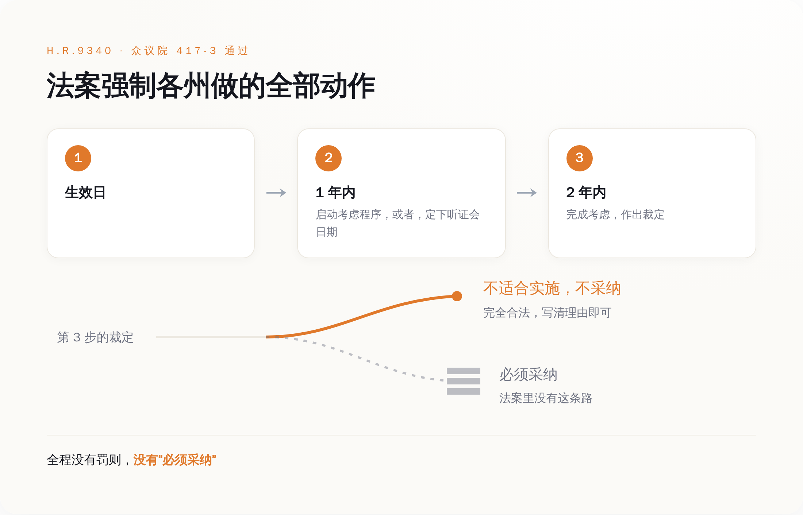
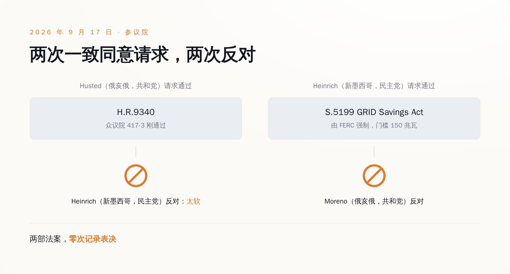
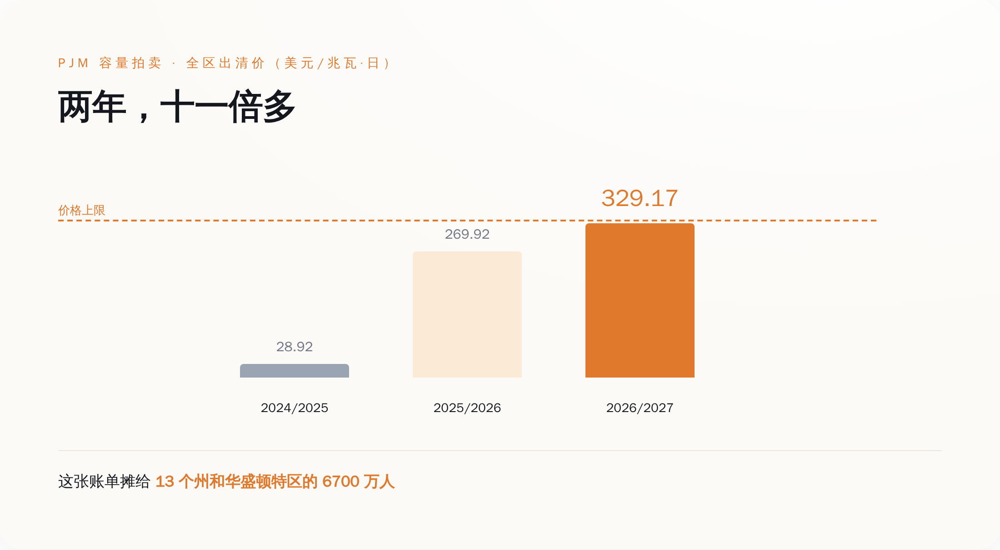

# 417 比 3，国会让各州"考虑"数据中心该不该自己付电费——第二天，参议院有人嫌它太软，把它和更硬的那一版一起否了

> **发布日期**：2026-09-20 | **分类**：AI 与能源

## 导语

9 月 16 日，美国众议院以 417 票赞成、3 票反对，通过了 H.R.9340《Ratepayer Protection Act》。中文这边的标题基本是一个意思：AI 数据中心要自己掏电费了。

把法案文本打开，它要求各州监管机构做的事只有一件：生效一年内，启动考虑程序，或者，把听证会的日期定下来。

两年内做出裁定。裁定的内容可以是不采纳。

---

## 一、法条里最硬的那个动词

H.R.9340 的官方长名称是：修改 1978 年《公用事业管制政策法》，设立一项关于回收服务大负荷用户的升级改造全部增量成本的联邦标准。它干的事，是往 PURPA 第 111(d) 条里加一款，编号第 (22) 款。

这一款要求各州监管机构**考虑设立**一项大负荷标准。标准本身不复杂：为了给一个大用户扩容，电网要新建的发电、输电、配电，这笔钱得从这个用户身上收回来，全额，不打折——不管是走费率还是走单独签的协议。

"大负荷用户"有门槛：非住宅用电户，主要用于运行信息技术基础设施及数据存储、计算相关系统（也就是数据中心），单一场地或园区的峰值电力需求在 100 兆瓦及以上，多个设施可合并计算。

时间表写得很清楚。法案生效后一年内，各州监管机构和非受管制电力公司（不归州里定价管的那部分供电商）应当启动第 111 条项下的考虑程序，**或者设定一个听证日期**。两年内，完成考虑并作出裁定。

这不是外人的刻薄解读。众议院能源与商业委员会在自己网站上介绍这部法案时，用的表述是：要求各州公用事业委员会**考虑**一项让数据中心自己买单的方案。

这就是全部的强制力。没有罚则，没有"必须采纳"，没有联邦兜底条款。一年内把听证会排进日程，两年内开完会写个结论——结论是什么，法案不管。写"我们认真考虑过了，不打算搞"，也算完成任务。

*法案要求各州走完的程序链，终点合法地允许"不采纳"。*

## 二、第二天，参议院花了不到十分钟，把它和更硬的那版一起否了

9 月 17 日，众议院通过的第二天，俄亥俄州共和党参议员 Jon Husted 在参议院提出一致同意请求，想让这部刚拿到 417 票的法案直接通过。

一致同意是参议院的一条捷径：只要现场没有任何一位参议员出声反对，法案不辩论、不表决，直接算过。代价是反过来也成立——任何一位参议员，一个人就能把它摁死。

新墨西哥州民主党参议员 Martin Heinrich 反对。

Heinrich 是参议院能源与自然资源委员会的资深成员，他的理由不是这法案太狠，是太软。他在自己办公室发的新闻稿里写的是：如果超大规模数据中心和其他大科技开发商需要昂贵的新设施和更多能源，他们就该自己付钱——所以我提出了 GRID Savings Act，要求（require），而不是一份自愿协议。

反对完 Husted，Heinrich 紧接着为自己的替代方案 S.5199《GRID Savings Act of 2026》提出一致同意请求。那部法案的路子完全不同：直接给联邦能源管理委员会（FERC）对电力需求 150 兆瓦及以上设施的规则制定管辖权，由联邦强制这些数据中心承担其新增负荷带来的成本。不走"请各州考虑"，走联邦下命令。

俄亥俄州共和党参议员 Bernie Moreno 反对。

两次请求，两次反对，两部法案都没有留下一次记录表决。一部在众议院拿到 417 票的法案，和一部真正带强制力的法案，在同一天下午一起没了。

参议院其实有自己的版本。S.5028，也叫《Ratepayer Protection Act》，Husted 本人 7 月 16 日提的，两读之后交能源与自然资源委员会，到 9 月 17 日这天，还躺在委员会里。

Husted 和 Moreno 是同一个州的两位参议员。

*软的那部被嫌太软，硬的那部被当场挡下，同一个下午。*

## 三、1978 年，"考虑"这个词是故意挑的

PURPA 这套"各州必须考虑联邦标准"的机制，不是国会写软了，是它只能写到这。

零售电价的定价权在各州公用事业委员会手里，不在华盛顿。1978 年国会想改全国的电价设计，又没有权力直接改，于是发明了这个折中：联邦设标准，各州必须走程序考虑它。

法典原文在 16 U.S.C. §2621。第 (a) 款说：各州监管机构和各非受管制电力公司**应当考虑**第 (d) 款设立的每一项标准，并就是否适合实施该标准作出裁定。

第 (b) 款把话说得更明白：本款不禁止任何州监管机构或非受管制电力公司依据其他适用州法下的权限，作出"不适合实施任何此类标准"的裁定。

程序要求是真的：考虑必须在公告和听证之后进行，裁定必须基于裁定中载明的认定和听证会上提交的证据。也就是说，州监管机构不能默不作声，得开会，得写理由。但写完理由说"不采纳"，完全合法。

1982 年，最高法院在 FERC 诉密西西比州案（456 U.S. 742）里审查了这套机制的合宪性。密西西比州告的就是联邦无权指挥州政府。最高法院把这套要求称为"温和的要求"（modest requirement）——各州要考虑，但不一定要采纳联邦规则。法院维持了这些条款，恰恰是因为确认了它们没有强征州政府为联邦执行联邦法。

翻过来看：这个动词之所以是"考虑"而不是"必须"，是因为如果写成"必须"，这部法当年就违宪了。

国会 2026 年给 AI 数据中心的电费问题选的工具，是 1978 年那件被最高法院盖章认证为"不强迫任何人做任何事"的工具。

## 四、被请去"考虑"的那些州，已经把账单寄出去了

联邦请各州考虑的标准是：100 兆瓦及以上的数据中心，自己承担扩容成本。宾夕法尼亚州公用事业委员会今年 5 月就发了终审裁定，案号 M-2025-3054271，给全州的配电公司立了一套大负荷示范费率框架。门槛是单一客户合同容量超过 50 兆瓦，或者相邻多个客户合计 100 兆瓦以上。该委员会在新闻稿里给自己这套框架的定语是"首创"。

弗吉尼亚州公司委员会走得更远：新设 GS-5 费率类别，适用于需求 25 兆瓦及以上的客户，2027 年 1 月 1 日生效。进这个类别的客户要签至少 14 年的合同，按签约输配电需求的 85%、签约发电需求的 60% 付费——用不用得完都得付。弗吉尼亚北部是全美数据中心最密集的地方。

俄勒冈州公用事业委员会批准了波特兰通用电气的大负荷费率框架，案号 UM 2377。按爱迪生电气协会维护的那份大负荷项目与费率清单，已经有 25 个州至少批准了一项大负荷费率，另有 7 个州的方案在审。2025 年一年，各州监管机构批了 29 项大负荷费率；而 2018 到 2024 这七年加起来是 14 项。

把这两组数字并排放：国会用 417 票请各州"考虑"的门槛是 100 兆瓦，弗吉尼亚已经落到 25 兆瓦，宾夕法尼亚落到 50 兆瓦。被请来考虑的学生，作业交得比卷子上的要求还狠。

*联邦标准门槛 100 兆瓦，宾州 50、弗州 25——而且它们已经生效了。*

各州为什么不等国会，看一组数字。PJM 是覆盖 13 个州和华盛顿特区、6700 万人的电网，它每年办一次容量拍卖，卖的是"到时候你得能发出这么多电"的承诺，中标价最终摊进这 6700 万人的电费单。

2024/2025 容量年，全区出清价 28.92 美元每兆瓦日。2025/2026 容量年，269.92 美元。到 2026/2027 容量年——也就是今年 6 月到明年 5 月，正在计费的这一年——全区价格全部顶到了 329.17 美元的上限，再涨就撞天花板了。

一年涨到九倍多，再一年直接顶到上限。两年算下来，十一倍还多。劳伦斯伯克利国家实验室 2024 年那份报告给的背景是：2023 年美国数据中心用掉 176 太瓦时电，占全国用电量的 4.4%，到 2028 年这个数字预计落在 325 到 580 太瓦时之间，占全国的 6.7% 到 12%。

*正在计费的这个容量年，PJM 全区价格顶到了上限。*

也有人不认这笔账。能源咨询公司 E3 去年出过一份白皮书，结论是在现行费率结构下，没有历史证据表明数据中心推高了居民电价，涨价主因是天然气价格、老旧电网改造和灾后重建投资——这份白皮书由数据中心行业协会 Data Center Coalition 发布，利益相关，但它提的那几项成本确实都真实存在。

只是这个争论本身已经说明问题：谁该为电网扩容买单，是一个需要拿案卷、拿证据、一州一州打的仗。等华盛顿两年内"完成考虑并作出裁定"，这轮账单早就收完了。

## 五、票数是给记者看的，案卷号才是给电费看的

417 比 3 是个很唬人的数字。更唬人的是它前面那一步：7 月的委员会审议，52 票赞成，0 票反对。

一部法案能拿到这种票数，通常只有一个原因——它没有明确的输家。不要求任何州做任何事，也就没人需要反对它。

那 3 张反对票来自密歇根的 Rashida Tlaib、宾夕法尼亚的 Summer Lee 和伊利诺伊的 Delia Ramirez，三位都是民主党进步派。公开报道里，她们给的理由方向一致：这法案只是建议各州采取行动，既没碰数据中心的用水和噪音，也没给任何人真正的义务——她们嫌它软，不是嫌它狠。反对席上没有一个人是因为"管得太多"站起来的。

真要判断 AI 的电费会不会摊到你头上，看的不是众议院的计票器。是你所在辖区的监管机构案卷号，是那份费率表里大负荷客户的最低承诺比例，是容量拍卖的出清价。这些东西没有投票直播，没有两党共识，也上不了头条。

它们只是决定了谁付钱。

## 数据来源

- [H.R.9340 - Ratepayer Protection Act, 119th Congress](https://www.congress.gov/bill/119th-congress/house-bill/9340)
- [众议院能源与商业委员会：Ratepayer Protection Act 以 52-0 出委员会](https://energycommerce.house.gov/posts/ratepayer-protection-act-advances-from-house-committee-on-energy-and-commerce)
- [众议院能源与商业委员会：法案在全院通过](https://energycommerce.house.gov/posts/ratepayer-protection-act-passes-house-with-strong-bipartisan-support)
- [H.R.9340 法案文本](https://www.congress.gov/bill/119th-congress/house-bill/9340/text)
- [H.R.9340 众议院表决记录 Roll Call 312](https://clerk.house.gov/Votes/2026312)
- [16 U.S. Code § 2621 - Consideration and determination respecting certain ratemaking standards](https://www.law.cornell.edu/uscode/text/16/2621)
- [FERC v. Mississippi, 456 U.S. 742 (1982)](https://www.law.cornell.edu/supremecourt/text/456/742)
- [S.5028 - Ratepayer Protection Act（参议院版本）](https://www.congress.gov/bill/119th-congress/senate-bill/5028)
- [Heinrich 参议员办公室新闻稿：GRID Savings Act](https://www.heinrich.senate.gov/newsroom/press-releases/heinrich-offers-his-grid-savings-act-to-force-ai-data-centers-to-pay-for-grid-upgrades-highlights-how-husted-backed-bill-falls-short)
- [宾夕法尼亚州 PUC 大负荷示范费率终审裁定新闻稿（Docket M-2025-3054271）](https://www.puc.pa.gov/press-release/2026/puc-releases-final-order-establishing-first-of-its-kind-large-load-model-tariff-framework-05132026)
- [弗吉尼亚州 SCC：数据中心相关举措说明](https://www.scc.virginia.gov/media/sccvirginiagov-home/about-the-scc/fact-sheets/scc-data-center-initiatives-02-2026.pdf)
- [俄勒冈州 PUC 批准 PGE 大负荷费率框架（UM 2377）](https://www.oregon.gov/puc/news-events/Documents/PR-202609.pdf)
- [EEI：大负荷项目与费率清单（2026 年 8 月）](https://www.eei.org/-/media/Project/EEI/Documents/Issues%20and%20Policy/List%20of%20Large%20Customer%20Projects%20and%20Tariffs)
- [PJM 2026/2027 基础剩余拍卖结果新闻稿](https://www.pjm.com/-/media/DotCom/about-pjm/newsroom/2025-releases/20250722-pjm-auction-procures-134311-mw-of-generation-resources-supply-responds-to-price-signal.pdf)
- [PJM 2026/2027 Base Residual Auction Report](https://www.pjm.com/-/media/DotCom/markets-ops/rpm/rpm-auction-info/2026-2027/2026-2027-bra-report.pdf)
- [PJM 2025/2026 Base Residual Auction Report](https://www.pjm.com/-/media/DotCom/markets-ops/rpm/rpm-auction-info/2025-2026/2025-2026-base-residual-auction-report.pdf)
- [PJM 2024/2025 Base Residual Auction Report](https://www.pjm.com/-/media/DotCom/markets-ops/rpm/rpm-auction-info/2024-2025/2024-2025-base-residual-auction-report.ashx)
- [劳伦斯伯克利国家实验室：2024 United States Data Center Energy Usage Report](https://eta-publications.lbl.gov/sites/default/files/2024-12/lbnl-2024-united-states-data-center-energy-usage-report_1.pdf)
