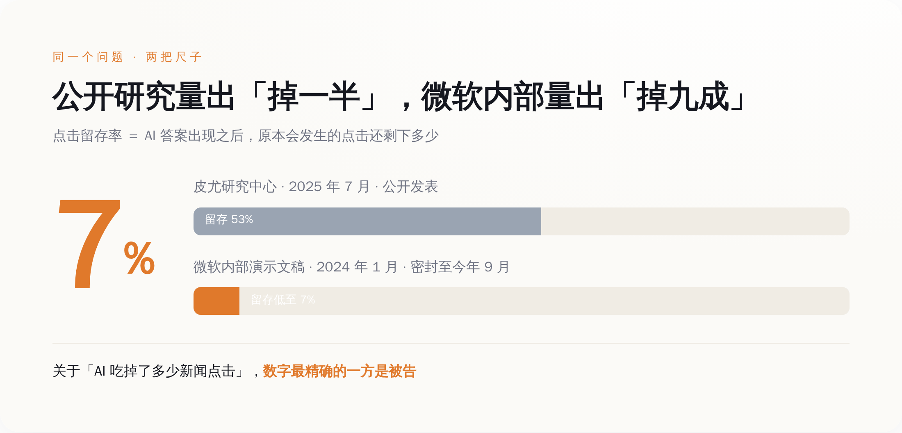
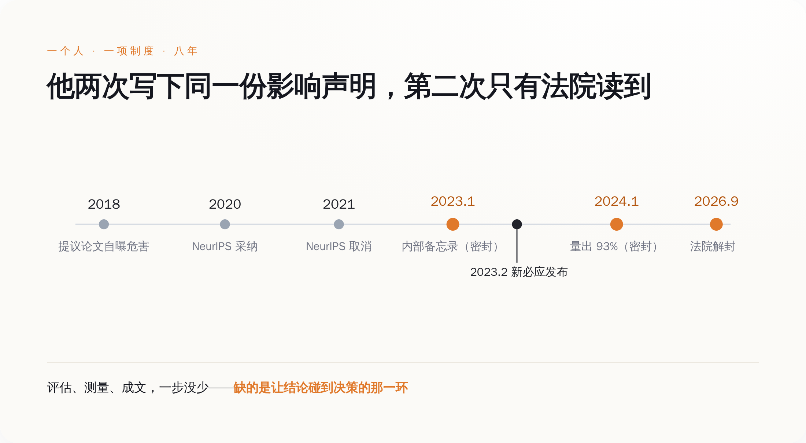
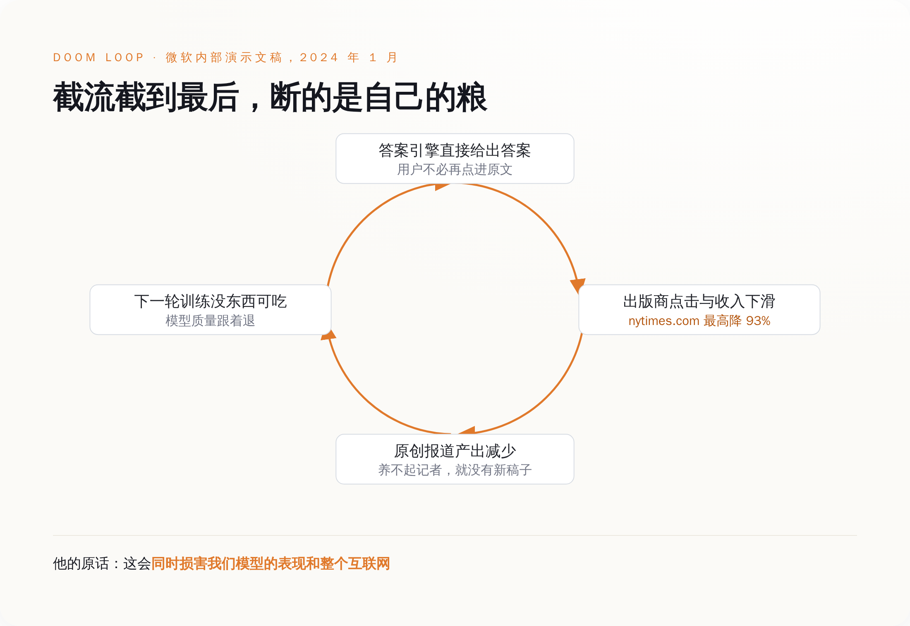

# 他 2018 年逼着 AI 学界给论文写"危害自评"，2021 年这条规矩被取消——2023 年他在微软内部又写了一份，上周被法院解封

> **发布日期**：2026-09-21 | **分类**：AI 与版权

## 导语

9 月 17 日解封的那批法庭文件里，被引用最多的是一句话：人类历史上规模最大的一次劳动盗窃。

写这句话的人叫 Brent Hecht，微软应用科学总监。所有报道都这么介绍他。我把这几天的中英文报道翻了一圈，没见哪篇提到这个人在去微软之前干的是什么——他是那个说服整个机器学习学界、给每篇论文都加上"本研究可能造成什么危害"自评章节的人。

他推动的那项制度，2020 年被 NeurIPS 采纳，2021 年被取消。

然后他去微软写了一份。

---

## 一、金句被引爆，那张图没人看

先把文件说清楚。2026 年 9 月 17 日，纽约南区法院解封了一批此前被大面积涂黑的文件。文件本身是"新闻方原告"——《纽约时报》、《纽约每日新闻》、调查报道中心——向 Sidney Stein 法官提交的简易判决联合意见书的未删节版本。案子是 2023 年 12 月立的，到现在快三年。

意见书里引的，是微软和 OpenAI 员工的内部通信和高管证词。媒体挑出来做标题的有这么几条：

Brent Hecht 在 2023 年 1 月的一份内部备忘录里，把用未授权内容做训练这件事称为"一场规模空前的、令人震惊的盗窃"，另一处写的是"人类历史上规模最大的劳动盗窃"。OpenAI 的 ChatGPT 负责人 Nick Turley 在 2023 年 6 月写下"生存威胁"，2024 年 2 月又补了一句，说公司的产品"在很大程度上具有替代性，句号"，而且"会随着变好而越来越具有替代性"。还有一段更直白的：OpenAI 研究员 Nick Ryder 告诉 Greg Brockman，自己找到了"一个绕过纽约时报付费墙的窍门"，Brockman 回了两个字，"啊，不错"。

这些话很好传播。中文互联网这几天转的基本也是这几句，腾讯新闻、新浪财经、凤凰网，标题里轮流出现"劳动窃取""认了""早知道"。

但这批文件里真正硬的东西不是金句，是 Hecht 在 2024 年 1 月那份内部演示文稿里的一组测量数据：微软自家的 Copilot 答案引擎，让 nytimes.com 这个域名的点击率，相比传统必应搜索下降了八成以上，最高到 93%。Ziff Davis 旗下的域名——IGN、Eurogamer 那一票——是 51% 到 94%。

这个数字值得单独拎出来对照一下。外部世界关于"AI 摘要吃掉新闻点击"这件事，最权威的公开测量来自皮尤研究中心 2025 年 7 月发布的一项研究：追踪约 900 名美国成年人的真实浏览行为，覆盖 68,879 次谷歌搜索，其中 12,593 次触发了 AI 摘要。结论是，出现 AI 摘要时，用户点击传统结果链接的比例是 8%；没有 AI 摘要时是 15%。点击摘要内部引用链接的比例，1%。

掉了将近一半。这是过去一年被引用最多的那个数字，出版商拿它去游说，研究者拿它写论文，媒体拿它做标题。而微软内部拿到的数字，是掉九成。

*同一件事，掌握更精确数字的那一方，是被告。*

## 二、为什么该看那个数字，而不是那句金句

金句是可以被消解的，而且已经被消解了。

Hecht 的话见报当天，微软发言人的回应是一句标准操作：这些评论反映的是"一名员工的个人看法，不是法律分析，不代表公司立场"。

这套说辞挑不出毛病。任何一家十万人的公司，内部永远有人写措辞激烈的备忘录，这是大公司正常运转的一部分，不是定罪证据。微软还补了一段，说 Copilot 属于转换性使用，不构成对出版商新闻业务的替代，立场都写在法庭文件里了。

"个人看法"这四个字能罩住"人类历史上最大规模的劳动盗窃"，因为那确实是一句价值判断，是一个人对一件事的道德定性。你可以说他写得对，也可以说他写得过火。

罩不住 93%。

那不是看法。那是用微软自己的产品、自己的服务器日志、自己的对照方法，对自己的流量分发行为做的一次测量。它有基准组（传统必应搜索），有实验组（Copilot 答案引擎），有明确的观测对象（nytimes.com 这个域名），有结果。

这东西在版权诉讼里的位置很微妙。合理使用抗辩有四个要素，第四个是"对原作品潜在市场的影响"。原告要证明的核心是替代——不是"你抄了我的字"，而是"你让读者不必再来找我"。Turley 那句"在很大程度上具有替代性，句号"是替代的自述，93% 是替代的度量。原告把它们放进同一份意见书，用意不难猜。

同一批文件里还有一组数字：OpenAI 的中期训练数据集中，包含超过 91,692 份来自《纽约时报》、《每日新闻》和调查报道中心的作品副本。

这个案子会怎么判，我不知道，Stein 法官 2025 年 4 月那次裁决也没碰合理使用这一层，只是把大部分驳回动议挡了回去，让案子继续走。法律结论不是我要下的。

我想说的是另一件事：这批数字**不是外部研究者挖出来的，是微软自己做出来的**。有人立了项，有人跑了对照，有人做成 PPT 讲给同事听。公司内部存在一套完整的、运转良好的影响评估机制。

它算出了准确答案。然后答案进了抽屉，直到一张传票把它撬出来。

## 三、做这份评估的人，是靠"做这份评估"成名的

现在说回 Brent Hecht。去微软之前，他在西北大学当副教授，带一个叫 People, Space, and Algorithms 的研究组，拿过美国国家科学基金会的 CAREER 奖，在 CHI、CSCW、ICWSM 这些会上拿过最佳论文。他早期的一批工作，被认为是"算法偏见"这个概念的奠基性研究之一。

2018 年，他和几位同行在 ACM 的博客上发了一篇东西，标题叫《该做点什么了：通过改变同行评审流程来缓解计算研究的负面影响》。主张很简单：论文投稿时，作者必须自己写清楚这项研究可能带来什么负面社会影响；评审不负责判断影响的好坏，只负责评估作者披露得够不够严谨。

2020 年，NeurIPS——机器学习最大的那个会——采纳了。那一年所有投稿论文都必须附一段 Broader Impact Statement。

2021 年，NeurIPS 把这条要求取消了，换成一份勾选清单。

这件事在学界当时有过一轮讨论，结论大致是：作者写得敷衍，评审不知道怎么评，制度成本高于收益。总之它没活过两届。

再往后，Hecht 去了微软研究院，职位是应用科学合伙人总监。

这里有个细节，是这整件事最值得琢磨的地方，而且它不在任何一份密封文件里——它就挂在微软官网上，现在还能打开看。

微软研究院给 Hecht 写的个人页面上，对他研究方向的描述是：**构建可持续的 AI 内容生态，让 AI 用户、AI 公司、内容和数据生产者三方都受益**。同一页还写着，他曾是 ACM FAccT（负责任 AI 研究的头部会议）创始执行委员会成员，并且"在推动 AI 研究者更深入地思考自身工作的社会影响这一运动中，起到了关键的催化作用"，页面里直接点名了 NeurIPS 的作者们。

这段话是微软自己写的，公开挂着，用来介绍这位研究员有多重要。

所以事情是这样的：微软招了一个人，公开宣传他的专长是评估 AI 对内容生态的损害；这个人做了评估，量出了 93%，写了备忘录，做了演示；三年后这份东西被法院解封，微软对它的定性是——

一名员工的个人看法。

## 四、这套制度死了两次

第一次是公开死的。2021 年 NeurIPS 投票取消影响声明，理由体面，过程透明，学界讨论了几轮，大家都知道它没了。

第二次没人看见。

Hecht 那份备忘录写于 2023 年 1 月。微软发布"新必应"——内置聊天的那一版，后来改名叫 Copilot——是 2023 年 2 月 7 日。

写在发布前一个月。

那份带 93% 的演示文稿是 2024 年 1 月，产品已经跑了将近一年，数据是真实用户的真实行为。他在同一份材料里给这个循环起了名字，叫 doom loop：答案引擎截走点击，出版商收入下滑，原创内容产出减少，而模型下一轮要吃的正是这些内容，最后"同时损害我们模型的表现和整个互联网"。

他还担心过另一件事，用的词是"意外的掩盖"。

这些材料从写出来那天起就是密封的。不是被反驳、被否决、被公开争论后搁置，是没有任何一个外部的人知道它们存在，直到 2026 年 9 月 17 日，法院把涂黑的部分去掉。

**让这份影响声明见光的机制，叫传票。**

把时间线拉平了看，中间那段更难堪。

*影响评估的每一步都按时完成了，唯一缺的是让结论影响决策的那一环。*

Hecht 写下"规模空前的盗窃"是 2023 年 1 月，Turley 写下"生存威胁"是 2023 年 6 月。

而 OpenAI 和出版商签授权协议的时间，按公开报道：美联社 2023 年 7 月，阿克塞尔·施普林格 2023 年 12 月，《金融时报》2024 年 4 月，新闻集团 2024 年 5 月，康泰纳仕 2024 年 8 月。

两份内部判断，都早于所有这些协议。这一点很要紧，因为它把"公司没想到"这个解释彻底堵死了。谈判桌上那一方，口袋里揣着自己人写的"这可能是史上最大规模劳动盗窃"，然后按每年千万美元量级的价格，把风险买断了。（具体金额多为媒体援引知情人士的估算，双方基本都没在正式文件里确认过，这本身也挺说明问题。）

这不是失明，是算过账，算完了觉得这个价格能接受。

## 五、所以别再问"做没做过评估"了

Hecht 给那个循环起名叫 doom loop，说的是一件在商业上相当反直觉的事：这套打法最后会反噬打它的人。

*Hecht 警告的循环：答案引擎最终吃掉的是自己下一轮要吃的东西。*

出版商这一头，现在的账是这么算的。《纽约时报》公司 2026 年第二季度的数字：订阅总数约 1335 万，其中纯数字订阅约 1280 万，比上一季度净增约 28 万。看着不像一家正在被杀死的公司。但同一份财报里，"联盟营销、授权及其他"收入同比增长 510 万美元、7.1%，公司自己给的解释是，增长主要来自 Wirecutter 的联盟推荐收入。

也就是说，在报表口径上，把这家公司托起来的不是 AI 授权费，是它的好物推荐页面在抽佣。

至于 AI 内容该值多少钱，目前唯一给出过明确数字的不是谈判桌，是法院：Bartz 诉 Anthropic 案，15 亿美元和解，2026 年 7 月 20 日获终审批准，美国史上最大的版权集体诉讼和解。

过去两年，"我们做了 AI 影响评估"已经变成一句标配的公关话术，每家公司都在说，红队、对齐、伦理委员会、负责任 AI 原则，PDF 出了一份又一份。而这批解封文件给出的，恰恰是这套说辞最尴尬的一个反例——微软的评估不但做了，还做得比外面所有公开研究都准，结论写得比原告的律师还狠。

评估没有失灵。评估环节是全流程里唯一正常工作的那一环。

失灵的是它后面接的东西：没有任何机制规定，这个结论必须被谁看到、必须在哪个会上被讨论、能不能拦住哪怕一次发布。它写完了，存档了，然后产品照常在一个月后上线。

所以下次再有人告诉你他们做了完整的影响评估，那句话基本不含信息量。值得问的是另外三个：评估结论谁有权看，它能否决什么，以及，除了被起诉之外，它有没有第二条见光的路。

到目前为止，这三个问题的答案分别是：法官、什么都否决不了、没有。

## 数据来源

- [Microsoft Research：Brent Hecht 研究员页面（"可持续 AI 内容生态"与 NeurIPS 影响声明运动的表述出处）](https://www.microsoft.com/en-us/research/people/brhecht/)
- [TechCrunch：Microsoft exec called AI scraping 'the largest theft of labor in human history,' new unredacted filings reveal（2026-09-17）](https://techcrunch.com/2026/09/17/microsoft-exec-called-ai-scraping-the-largest-theft-of-labor-in-human-history-new-unredacted-filings-reveal/)
- [The Washington Post：Microsoft exec called AI the 'largest theft of labor' in history, court records show（2026-09-17）](https://www.washingtonpost.com/business/2026/09/17/microsoft-exec-called-ai-largest-theft-labor-history-court-records-show/)
- [Nieman Journalism Lab："An astonishing theft of unprecedented proportions": Court records show what Microsoft and OpenAI actually thought about AI training](https://www.niemanlab.org/2026/09/an-astonishing-theft-of-unprecedented-proportions-court-records-show-what-microsoft-and-openai-actually-thought-about-ai-training/)
- [TheWrap：OpenAI's Head of ChatGPT Warned Publishers Faced an 'Existential Threat' in Unsealed Docs](https://www.thewrap.com/industry-news/tech/openai-microsoft-ai-replace-news-publishers-court-filing/)
- [Futurism：Microsoft Director Admitted in Internal Document That AI Is Creating a "Doom Loop"](https://futurism.com/artificial-intelligence/microsoft-executive-doom-loop)
- [Pew Research Center：Google users are less likely to click on links when an AI summary appears in the results（2025-07-22）](https://www.pewresearch.org/short-reads/2025/07/22/google-users-are-less-likely-to-click-on-links-when-an-ai-summary-appears-in-the-results/)
- [纽约时报公司 2026 年第二季度业绩新闻稿（SEC EDGAR）](https://www.sec.gov/Archives/edgar/data/0000071691/000007169126000032/pressrelease6302026.htm)
- [Authors Guild：Court Grants Final Approval of Anthropic Copyright Settlement（Bartz v. Anthropic，15 亿美元）](https://authorsguild.org/news/court-grants-final-approval-anthropic-copyright-settlement/)
- [Hecht 等：It's Time to Do Something — Mitigating the Negative Impacts of Computing Through a Change to the Peer Review Process（2018）](https://www.researchgate.net/publication/357171302_It's_Time_to_Do_Something_Mitigating_the_Negative_Impacts_of_Computing_Through_a_Change_to_the_Peer_Review_Process)
- [纽约南区法院：NYT v. Microsoft/OpenAI 案 2025 年 4 月驳回动议裁决原文（PDF）](https://www.nysd.uscourts.gov/sites/default/files/2025-04/yf%2023cv11195%20OpenAI%20MTD%20opinion%20april%202025.pdf)

> 说明：2026 年 9 月 17 日解封的《新闻方原告联合简易判决意见书》未删节版本，本文未能直接调取法院 PDF 原件，文中所有内部备忘录、演示文稿与证词的逐字引文，均据上述媒体对该份文件的引述，并做过多源交叉比对。Copilot 点击率降幅在不同报道中记作 83%–93%、87%–93%，本文统一表述为"八成以上、最高 93%"。OpenAI 与各出版商授权协议的金额，多为媒体援引知情人士的估算，双方未在公开文件中确认。
