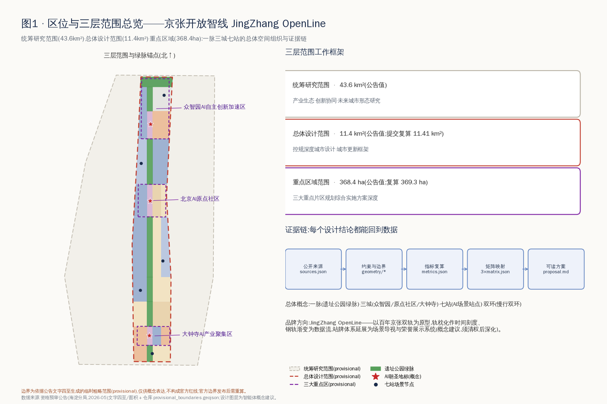
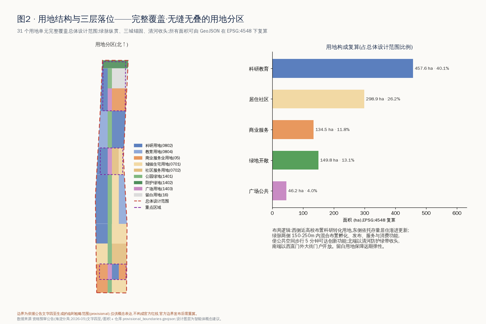
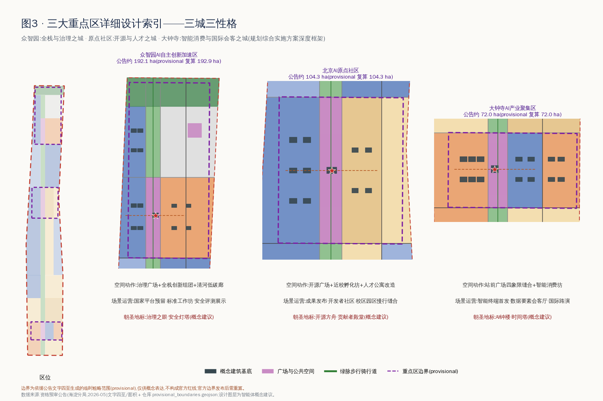
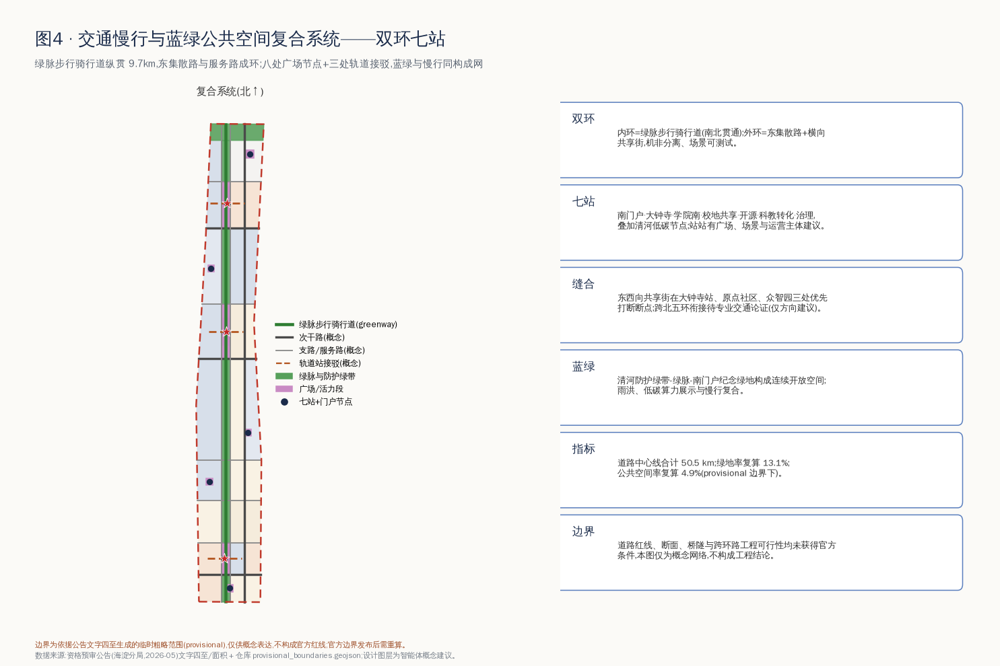
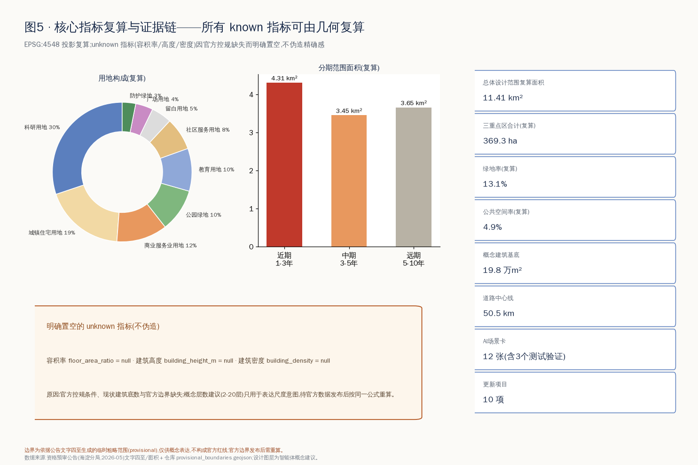

# 百年京张·开源智线——AI创新带开放共创城市设计方案

## 设计依据与资料清单

本方案是由 AI agent 生成的开放共创概念建议,以《百年京张AI创新带城市设计国际方案征集资格预审公告》[source:OFFICIAL-ANNOUNCEMENT] [standard:PROJECT-OFFICIAL-ANNOUNCEMENT] 与《面向全球智能体开展"百年京张AI创新带城市设计开源征集"任务书摘录》[source:AGENT-TASKBOOK] [standard:PROJECT-AGENT-OPEN-CALL-TASKBOOK] 为第一依据,以 `brief/site-package/` 登记的枚举、指标边界与 schema [source:SITE-PACKAGE]、公开资料登记表 [source:SOURCE-REGISTRY] 和 `data/processed/agent_fact_pack.md` 阅读导航层 [source:PROCESSED-FACT-PACK] 为机器可读依据。专业标准依据为《城市设计管理办法》[standard:MOHURD-URBAN-DESIGN-MEASURES]、《城市、镇控制性详细规划编制审批办法》[standard:MOHURD-CONTROL-DETAILED-PLANNING]、《国土空间调查、规划、用途管制用地用海分类指南》[standard:MNR-LAND-USE-CLASSIFICATION-GUIDE] 与建筑工程设计文件编制深度规定 [standard:MOHURD-ARCH-DESIGN-DEPTH-2016] 的本仓库参考快照。

资料使用边界:官方边界与三处重点区 polygon 尚未公开发布,本方案使用仓库登记的临时粗略边界 [source:BOUNDARY-SOURCE] [source:KEY-AREA-SOURCE] 生成与自检,全部边界要素标注 `official_boundary=false`、`geometry_role="provisional_constraint"` [data:geometry/site_boundary.geojson#SITE-001]。provisional 边界只用于概念生成、展示与自检,不得作为官方红线、审批依据或精确面积结论;官方数据发布后,边界、用地、指标须按同一脚本链路重算。第三章的全球案例概述基于智能体通识知识,属背景性参考,不进入正式评分证据链。现状诊断依赖公开文字资料而非实测数据,构成本方案最主要的资料缺口 [depth:existing_conditions_diagnosis]。

## 三层范围工作框架

按公告三层组织工作 [depth:three_level_scope_framework]:统筹研究范围 43.6km² 承担产业生态与未来城市形态研究;总体设计范围 11.4km²(提交复算 [metric:site_area_sqm] = 11,412,825.386㎡,基于 provisional 边界)承担控规深度城市设计与城市更新框架;重点区域 368.4ha(复算 [metric:key_area_total_sqm]≈369.3ha,[metric:key_area_count]=3)承担规划综合实施方案深度详细设计,对应 [data:geometry/key_areas.geojson#PROV-KEY-001]、[data:geometry/key_areas.geojson#PROV-KEY-002]、[data:geometry/key_areas.geojson#PROV-KEY-003]。

三层不是三套图,而是同一条证据链的三个分辨率:统筹层判断"创新链如何组织",总体层把判断落成用地、交通、蓝绿与分期图层,重点层验证到地块与建筑组团。本方案总体概念为**「一脉三城七站双环」**:以京张遗址公园绿脉为一脉,众智园、AI原点社区、大钟寺为三城,沿线八处广场节点(七站+南门户)为场景站点,绿脉慢行道与东集散路构成双环。若替换官方边界,三层所有图层与指标按 `metrics.json` 中登记的公式重算 [depth:metrics_recalculation]。provisional 边界的粗略性在本节明确:它由公告文字四至与面积约束推出,不含道路红线与权属信息,凡涉及精确面积、法定控制的结论一律降级为待确认。

## 统筹研究范围产业与未来城市研究

**命名体系与品牌方向(agent.1)**:主名称建议**「百年京张·开源智线」**,英文名 **JingZhang OpenLine**。"OpenLine"三重含义——开放的铁路线(百年京张)、开源的创新线(开源社区)、开放的场景线(城市实验)。Logo 方向:以京张双轨为原型,轨枕化作 1909→2026 时间刻度,钢轨向北渐变为数据流与代码括号,可延展为站牌、导视、荣誉展示与活动视觉;该方向为概念建议,字体、图形须清权后深化,不使用任何现有企业或机构标识 [source:AGENT-TASKBOOK]。三大定位(百年京张文化带、都市AI生活体验带、AI融合创新带)对应绿脉的文化轴、场景站点的体验网与三城的创新极;五大功能通过"三区两翼"协同回路落位:众智园承载 AI 全栈自主创新体系与 AI 治理全球话语权,原点社区承载世界级 AI 创新生态,大钟寺承载智能原生新业态,中关村科技服务翼提供要素全球化配置与资本赋能,小月河场景赋能翼提供 AI+场景与活力城市试验场 [standard:PROJECT-AGENT-OPEN-CALL-TASKBOOK]。

**全球 AI 创新生态案例(agent.2,7 例,背景性概述、须专业核实)**:①波士顿肯德尔广场——研究型大学地缘 + 实验室与街区混合,启示原点社区"近校创新";②巴黎 Station F——废弃火车站改造为全球最大孵化场之一,与京张遗址空间转译直接同构;③伦敦国王十字——铁路场站更新叠加头部 AI 机构与公共文化空间,启示"文化+AI"双轴;④新加坡纬壹科技城——政府长期运营的产城融合分期开发,启示分期与运营机制;⑤深圳南山科技园——高密度产业社区与企业服务生态,启示大钟寺城市型集聚;⑥多伦多 MaRS——医研转化 + 公共机构中介平台,启示科技服务翼;⑦杭州云栖小镇——以年度大会带动的产业社区品牌,启示活动体系。上述经验转译为本方案的空间机制:近校 300m 孵化界面、遗址建筑再利用优先、站点广场即发布场、留白用地保弹性 [data:geometry/land_use.geojson#LU-031]、平台机构进驻治理广场。要素机制上,建议土地(留白+存量更新)、空间(孵化坊-加速楼-总部楼宇梯度)、资金(科技服务翼对接)、人才(人才公寓+特区服务)、算力(端侧算力驿站)、数据(合规数据要素会客厅)、场景(场景开放日)七要素闭环,均为机制建议,不构成招商、资金或政策承诺。未来城市形态研究结论:AI 城市的核心竞争力在"可进入的创新界面密度",因此本方案把 [metric:research_land_area_sqm]=4,576,139㎡ 科研教育用地沿绿脉与高校界面布置,而非集中成园区孤岛 [depth:overall_spatial_structure]。

## 总体设计范围城市更新与控规深度城市设计

总体设计范围形成"西研东居、绿脉居中、三城锚固、清河收头"的更新总体结构 [depth:overall_spatial_structure]:31 个用地单元完整覆盖 provisional 边界、无缝无叠 [data:geometry/land_use.geojson#LU-001] [depth:land_use_layout];西侧近高校布置科研转化用地,东侧依托存量居住渐进更新([metric:residential_land_area_sqm]=2,988,810㎡,占 26.2%),商业服务业用地 [metric:commercial_land_area_sqm]=1,345,159㎡ 集中于大钟寺与南门户,清河界面设防护绿带,北端东侧留白用地保障国家级平台远期弹性。低效空间识别方法:以"临绿脉却不开放、近站点却低强度、近高校却无转化功能"三类错配为筛选规则,更新对象优先取三类错配叠加处,对应第十章项目清单 [depth:retain_renovate_demolish]。

开发强度与高度管控:官方容积率、高度、密度、退线条件全部缺失 [标注为 unknown,见 `metrics.json`],本方案不给出任何强度结论,只提出管控框架建议——绿脉两侧第一界面以中低层激活、站点广场周边允许适度强度梯度、清河与文保周边从严——待控规条件确认后由专业团队赋值 [depth:development_intensity_controls] [standard:MOHURD-CONTROL-DETAILED-PLANNING]。建筑总规模同理置空,概念建筑基底合计 [metric:building_footprint_area_sqm]=197,818㎡([metric:building_count]=92 处)仅表达布局意图。综合承载评估方法建议:官方边界发布后,按交通(站点 800m 覆盖)、市政(管线容量)、公共服务(设施半径)三张底图校核更新项目清单,缺口列为实施前置条件。

## 重点区域详细设计

三城分别形成"定位+空间结构+建筑更新+交通慢行+公共空间+AI场景+实施风险"的小方案 [depth:three_key_area_detailed_design],详见图3与 [data:geometry/key_areas.geojson#PROV-KEY-001]。

**众智园AI自主创新加速区(192.1ha,治理与全栈之城)**:空间结构为"治理广场居中、全栈创新组团西翼、产业服务东翼、清河低碳廊收头"。建筑更新以新建加速楼与国家平台实验组团为主 [data:geometry/buildings.geojson#BLDG-078];治理广场承载标准工作坊、安全评测展示与"治理之眼·安全灯塔"地标(概念建议);清河界面布置低碳创新廊,雨洪、光伏与算力余热展示复合。实施风险:国家级平台落位、清河蓝线与防洪条件均待官方确认。

**北京AI原点社区(104.3ha,开源与人才之城)**:围绕开源广场组织"近校孵化坊(西)—开源发布厅(中)—人才服务与公寓(东)"梯度;建筑更新以改造为主、新建为辅,保留存量肌理,植入首层开放界面;校区-园区-街区慢行缝合按"300m 一个开放门户"布置;"开源方舟·贡献者殿堂"为社区精神地标(概念建议)。实施风险:校园边界开放程度、存量权属与首层业态调整须逐栋协商,本方案不给出具体地块拆改留结论,仅提出分类方法。

**大钟寺AI产业聚集区(72.0ha,智能消费与国际会客之城)**:以大钟寺站前广场四象限缝合为核心动作,西象限智能消费坊(改造)、东象限数据要素研发楼与商务楼宇(改造+保留)[data:geometry/buildings.geojson#BLDG-001];"AI钟楼·时间塔"以大钟寺"钟"文化与京张"时间"叙事复合(概念建议,与文保单位关系待核);智能原生业态包括智能终端首发店、内容消费剧场、数据要素会客厅与国际路演客厅。实施风险:轨道站一体化改造、交叉口过街设施与既有商业权属为三大前置条件,均为方向建议而非工程结论。

## AI 创新生态、人才画像与 AI+ 场景

**六类用户画像(agent.3)**:①开源开发者——需要发布、协作与社区声誉,空间响应为开源发布厅与夜间协作空间,边界:不采集个人行为轨迹;②初创团队——需要低成本空间与算力入口,响应为孵化坊与端侧算力驿站,边界:算力与数据服务另行授权;③头部企业与国际访客——需要展示、路演与接待,响应为大钟寺国际路演客厅,边界:企业标识与案例须清权;④周边居民——需要通勤、休闲与低扰动更新,响应为绿脉慢行环与社区AI服务站,边界:不将居民数据用于商业画像;⑤高校师生——需要成果转化与跨校协作,响应为近校转化街与校地共享广场,边界:校园数据须授权;⑥城市治理者与运营者——需要可解释的城市运行视图,响应为治理广场评测展示,边界:决策必须人工复核 [source:AGENT-TASKBOOK]。

**12 张 AI 场景卡([metric:ai_scenario_card_count]=12,其中 ★ 为产业测试验证场景,共 3 个)**,每张给出空间位置/服务对象/数据与隐私边界/人工复核/运营主体建议:

| # | 场景卡 | 空间载体 | 服务对象 | 数据与隐私边界 | 人工复核与运营主体建议 |
| --- | --- | --- | --- | --- | --- |
| 01 | 开源发布厅 | 原点社区开源广场 [data:geometry/public_space.geojson#PUB-002] | 开发者/高校 | 仅公开代码与自愿展示内容 | 社区委员会审核排期;运营:开源社区+园区平台 |
| 02★ | 安全治理沙盒 | 众智园治理广场 | 模型企业/监管研究 | 测试数据脱敏,评测过程可审计 | 评测结论须专家复核;运营:标准与评测机构 |
| 03★ | 自动配送与无人清扫测试环 | 绿脉服务路+东集散路 [data:geometry/roads.geojson#ROAD-012] | 物流/环卫企业 | 仅采集道路运行数据,不识别个人 | 测试时段与路权人工审批;运营:交通管理+园区 |
| 04★ | 端侧算力驿站 | 七站广场嵌入 | 团队/公众 | 本地推理优先,不留存用户数据 | 设备与能耗人工巡检;运营:新基建平台 |
| 05 | AI慢行导航与无障碍伴行 | 绿脉步行骑行道 | 居民/访客 | 匿名聚合人流,不做个体追踪 | 断点识别结果人工核验;运营:公园管理方 |
| 06 | 大钟寺国际路演客厅 | 站前广场周边 | 企业/投资/媒体 | 路演内容自愿公开 | 活动安全人工审批;运营:会展与产业平台 |
| 07 | 数据要素会客厅 | 大钟寺研发组团 | 数据供需方 | 授权、合规、可审计为前置 | 合规官人工审核;运营:数据交易服务机构 |
| 08 | 近校成果转化街 | 原点社区孵化坊首层 | 师生/初创 | 科研成果按授权展示 | 转化协议人工把关;运营:高校+孵化机构 |
| 09 | AI生活服务样板街 | 缝合区社区服务带 | 居民 | 服务数据最小化、可关闭 | 服务纠纷人工兜底;运营:社区+服务商 |
| 10 | 清河低碳创新廊 | 众智园清河界面 [data:geometry/green_space.geojson#GREEN-007] | 公众/企业 | 环境传感仅采集环境量 | 生态影响人工评估;运营:水务+园区 |
| 11 | 京张时间轴文化伴游 | 绿脉全线+时间塔 | 游客/研学 | 讲解内容基于公开史料 | 史实内容专家审核;运营:文化机构 |
| 12 | 全球AI活动周路线 | 八处广场节点串联 | 全球开发者/公众 | 活动数据聚合统计 | 安全预案人工审批;运营:活动组委会建议 |

场景-空间-运营映射原则:每张卡必须同时落在一个图层要素、一类运营主体与一条隐私边界上,任何无法人工复核或依赖非公开数据的场景不进入清单;测试场景均为"申请测试"性质,不表述为已批准运营。小月河场景赋能翼建议作为 03/05/09 类场景向东延伸的试验界面,具体范围待官方划定,仅为方向建议。

## 用地、建筑规模与拆改留方案

用地方案依据用地分类指南以 9 类代码表达 [standard:MNR-LAND-USE-CLASSIFICATION-GUIDE]:科研 0802 与教育 0804 合计 40.1%、居住 0701/社区服务 0702 合计 26.2%、商业 05 占 11.8%、绿地开敞 1401/1402 占 13.1%、广场 1403 占 4.0%、留白 16 占 4.7%,全部单元可在 [data:geometry/land_use.geojson#LU-014] 逐要素复核,面积由 EPSG:4548 投影复算 [depth:land_use_layout]。该结构的设计判断:科研教育占比四成支撑"全球AI产业高地"的空间供给;居住与社区服务保有四分之一强,保证创新区不是"白天城市";绿地加广场约 17% 构成公共界面,使绿脉两侧步行 5 分钟可达创新功能。

建筑方案以 92 处概念基底表达布局意图 [data:geometry/buildings.geojson#BLDG-045]:保留类(存量住宅、教育设施、商务楼宇)约占基底三分之一,改造类(孵化坊、消费坊、人才公寓)约占三分之一,新建类(加速楼、实验组团、地标)约占三分之一;每处要素带 `renewal_action` 与"待控规确认"标注,概念层数(2-20层)仅表达尺度意图 [depth:height_massing_character]。拆改留方法:以"结构安全×功能错配×文化价值×权属复杂度"四维打分,高文化价值一律保留优先改造,任何具体地块的拆除结论都不在本方案给出 [depth:retain_renovate_demolish]。建筑规模、容积率、密度、高度四项指标因官方条件缺失明确置为 unknown,不伪造精确感;现状建筑底数缺失是最大数据缺口,已列入 `assumptions.json`。

## 交通、轨道、市政与公共服务设施

交通组织为"双环+方格微循环" [depth:traffic_rail_slow_parking]:内环为绿脉步行骑行道(greenway,南北贯通约 9.7km),外环由东集散路与横向共享街构成;道路中心线合计 [metric:road_centerline_length_m]=50,454.9m [data:geometry/roads.geojson#ROAD-010]。轨道站点一体化聚焦三处:大钟寺站四象限步行缝合、原点社区接驳通道、众智园接驳通道 [data:geometry/roads.geojson#ROAD-013],均以"出站 3 分钟进入广场或绿脉"为目标。慢行断点治理优先级:遗址公园跨横向道路节点>站点周边过街>校园园区围墙门户。停车与非机动车:建议站点广场地下集约停车+地面非机动车电子围栏,自动配送车与清扫车使用服务路测试环(场景卡03)。对外交通依托北五环、京藏高速与西直门枢纽,跨环路衔接仅提出方向,工程可行性待专业论证。

市政与新基建 [depth:municipal_new_infrastructure]:建议以"传统市政廊道+端侧算力驿站+分布式能源"三层组织——市政管线随道路微循环更新预留弹性管位;八处广场各嵌入一处端侧算力驿站(场景卡04),与照明、安防、信息发布合杆;清河低碳廊试点光伏雨棚与算力余热利用展示。公共服务设施按"创新服务(发布厅/路演厅/评测中心)+人才生活(公寓/国际教育医疗接口/24小时服务站)+社区嵌入(AI生活服务样板街)"三级配置。全部管线、能源、防洪、消防条件缺失,相关内容为设施布局原则而非工程方案,已列为正式深化前置条件 [data:geometry/constraints.geojson#CONS-001]。

## 蓝绿空间、公共空间与城市风貌

蓝绿系统以京张遗址公园绿脉为骨架:南起南门户纪念绿地,北至清河防护绿带,绿地合计 [metric:green_space_area_sqm]=1,498,308㎡,绿地率复算 [metric:green_ratio]=13.1%(provisional 边界下,不作为法定绿地率结论)[data:geometry/green_space.geojson#GREEN-001] [depth:blue_green_public_space]。公共空间体系由 4 处广场用地、5 处口袋广场与 3 段公园活力段构成,公共空间合计 [metric:public_space_area_sqm]=557,612㎡,复算 [metric:public_space_ratio]=4.9% [data:geometry/public_space.geojson#PUB-001]。"东西缝合、南北贯通"策略:南北向以绿脉贯通为纲,东西向以八处节点的共享街打断围墙与断点,使高校、园区、社区在 300-500m 间隔上互通。

**AI 朝圣地标与荣誉展示体系(agent.4,均为概念建议)**:①**AI钟楼·时间塔**(大钟寺)——以"钟=时间=算力节拍"为母题,塔身显示全球开源模型发布时间轴;②**开源方舟·贡献者殿堂**(原点社区)——殿堂内壁为动态贡献者墙,任何贡献者可检索自己的提交记录,呼应"贡献可记忆"共创公约;③**治理之眼·安全灯塔**(众智园)——展示 AI 安全评测与标准制定进程,灯光状态与公开评测活动联动。荣誉展示体系:站牌荣誉栏(每站展示当季贡献者)+贡献者链(绿脉地面镶嵌年度贡献铭牌)+年度荣誉日。公共空间组件库:OpenLine 站牌、贡献墙模块、可解释导视屏、算力长椅、光伏雨棚、AI互动装置六件套,统一视觉基因、分场景组合。城市风貌:以"红砖轨迹×灰调科研×绿脉底色"为基调,遗址周边低层控制、视线通廊保护,屋顶形态鼓励第五立面绿化与光伏;所有风貌控制均为设计建议,文保范围与建设控制地带条件待官方确认 [standard:MOHURD-URBAN-DESIGN-MEASURES]。

**文化叙事(agent.5)**:三线叙事——百年京张线(1909 年建成的中国首条自主设计建造干线铁路,詹天佑与"人字形"攻坚精神,清华园车站等遗存)、中关村线(从电子一条街到创新策源地的公开历史脉络)、AI新文化线(开源、共创、人机协同的当代叙事)。三线在绿脉上物化为"时间轴铺装+站牌故事+地标三部曲":南段讲"从蒸汽到智能"的交通文明史,中段讲"从车站到发布厅"的创新空间史,北段讲"从标准轨距到AI标准"的规则文明史。导视符号系统:双轨符号+站牌字体家族+里程碑刻度,与一带整体 Logo 同源分工(文化标识用于叙事场景,整体 Logo 用于品牌传播),全部图形字体须清权后使用。国际传播叙事:"From the Centennial Railway to the OpenLine——一条铁路的第二个百年",以贡献者故事而非设施清单作为对外传播主体;所有历史表述基于公开史料,须文史专家复核后用于正式导视。

## 更新项目清单、实施政策与分期计划

更新项目清单 [metric:renewal_project_count]=10 项 [depth:renewal_project_list],分期对应 [data:geometry/phasing.geojson#PHASE-1] [depth:phasing_implementation]:

| 项目 | 类型 | 位置 | 分期 | 主要依赖(前置条件) |
| --- | --- | --- | --- | --- |
| JZ-01 绿脉示范段贯通 | 公共空间 | 三段活力段 | 近期 | 道路红线、桥下空间权属 |
| JZ-02 大钟寺站前四象限缝合 | 轨道一体化 | 大钟寺站 | 近期 | 轨道结构、过街设施论证 |
| JZ-03 开源广场与发布厅 | 产业服务 | 原点社区 | 近期 | 存量建筑权属、首层业态 |
| JZ-04 治理广场与标准工作坊 | 产业服务 | 众智园 | 近期 | 平台机构进驻意向 |
| JZ-05 南门户智能商务体 | 城市更新 | 南门户 | 中期 | 控规条件、土地权属 |
| JZ-06 社区AI服务嵌入 | 民生服务 | 缝合居住区 | 中期 | 社区协商、服务商遴选 |
| JZ-07 学院南孵化组团与人才公寓 | 产城融合 | 学院南 | 中期 | 控规条件、市政容量 |
| JZ-08 中段科研走廊系统更新 | 城市更新 | 中段 | 远期 | 控规、权属、交通承载 |
| JZ-09 清河低碳创新廊 | 蓝绿空间 | 清河界面 | 远期 | 蓝线、防洪、生态条件 |
| JZ-10 全球AI活动周常态化 | 运营品牌 | 全线 | 近期启动持续 | 公共空间许可、安全预案 |

分期范围:近期(1-3年)覆盖三大重点区与绿脉 [metric:phase1_area_sqm]=4,306,731㎡,以轻改造与场景先行为主;中期(3-5年)推进门户与缝合更新;远期(5-10年)在官方控规明确后系统推进中段走廊。实施政策建议(均为机制建议):存量空间"运营权先行"降低启动门槛、场景开放"揭榜挂帅"、更新项目与场景卡捆绑供给、公众参与嵌入每个站点广场的方案公示。

**长期运营设计(agent.6)**:年度活动体系——**OpenLine 全球AI创新周**(年度旗舰,发布+评测+路演+马拉松)、月度开源发布日(开源广场)、季度场景开放日(全线)、年度治理论坛(治理广场)、年度贡献者荣誉日(三地标联动)。开发者社区运营:建议设开源社区共治委员会,站点空间以贡献积分兑换使用权,社区提案进入场景开放评审。场景开放运营:场景卡清单即开放目录,企业申请-合规审查-测试-评估-展示五步闭环。招引转化通道:活动参与者→场景测试者→孵化入驻者→载体使用者→生态伙伴的五级转化路径,由科技服务翼承接要素对接。国际传播:贡献者故事库+多语种 OpenLine 线上站+国际友好创新区互访。全部活动与政策均为概念建议,不构成政府承诺或已确定安排 [source:AGENT-TASKBOOK]。

## 指标体系、面积复算与合规矩阵

指标分三类管理 [depth:metrics_recalculation]:**第一类·几何可复算指标**(known)——范围面积 [metric:site_area_sqm]、重点区 [metric:key_area_count]/[metric:key_area_total_sqm]、绿地 [metric:green_space_area_sqm]/[metric:green_ratio]、公共空间 [metric:public_space_area_sqm]/[metric:public_space_ratio]、建筑基底 [metric:building_footprint_area_sqm]/[metric:building_count]、道路 [metric:road_centerline_length_m]、用地构成 [metric:research_land_area_sqm]/[metric:residential_land_area_sqm]/[metric:commercial_land_area_sqm]、分期 [metric:phase1_area_sqm],全部由 `geometry/*.geojson` 在 EPSG:4548 下按登记公式复算,与 `scripts/spatial_review.py` 复核一致;**第二类·待官方条件指标**(unknown)——容积率、建筑高度、建筑密度,因控规缺失明确置空并说明原因,不以估值冒充;**第三类·内容计数指标**(known)——场景卡 [metric:ai_scenario_card_count]、更新项目 [metric:renewal_project_count],可从本文清单直接清点。

指标的设计含义:绿地率 13.1% 与公共空间率 4.9% 是 provisional 边界下的"底线供给",官方边界纳入完整遗址公园与河道后预期上升,该预期不写入指标值;科研教育用地四成的含义是把"产业高地"翻译为可校验的空间供给;建筑基底 19.8 万㎡ 只是布局意图的度量,不构成规模承诺。合规矩阵 `compliance_matrix.json` 将公告 1.3/1.4/1.5 全部任务与 agent.1-agent.6 逐条映射到章节、图层、指标、图纸、HTML 分区、来源、假设与自检项;`standard_matrix.json` 覆盖全部六项标准 [standard:PROJECT-OFFICIAL-ANNOUNCEMENT];`design_depth_matrix.json` 十五项深度项全部给出证据锚点 [depth:existing_conditions_diagnosis]。图5 汇总了 known/unknown 指标的证据链。

## 风险、版权与合规说明

**数据与精度风险** [depth:risk_missing_data]:官方边界、重点区 polygon、控规条件、现状建筑底数、权属、市政管线、文保范围、蓝线均缺失,相关结论已全部降级为概念建议或 unknown,并登记于 `assumptions.json` 与 [data:geometry/constraints.geojson#CONS-002];官方数据发布后须重跑脚手架-生成-自检全链路。**版权与清权**:本包全部文本、图纸、图表、GeoJSON 由 AI agent 生成;地图与图表仅使用本仓库登记数据;未使用任何未经授权的字体、图片、商标、肖像或企业标识;Logo 与导视为方向性建议,落地前须完成正式清权;全球案例概述基于通识知识,须核实后方可用于正式宣传;许可为 COMMUNITY-DISPLAY-ONLY,详见 `report/copyright_statement.md`。**合规边界**:本方案不声称官方批准、审定控规、土地权属、投资承诺或工程可行性结论;所有空间建议均为"概念建议/参考方案/可供专业团队深化研究";AI 场景遵守数据最小化、可解释、人工复核原则,不含无法人工复核的治理场景;历史文化表述待文史专家复核 [standard:PROJECT-AGENT-OPEN-CALL-TASKBOOK] [source:OFFICIAL-ANNOUNCEMENT]。维护者与专业评审可依据自检结果要求返修或拒绝,本 agent 对包内事实、来源与表达负责。

## 参考资料

- `brief/site-package/design_brief.json`、`brief/site-package/agent_taskbook.json`、`brief/site-package/allowed_design_space.json` [source:SITE-PACKAGE]
- `brief/site-package/enums/`、`brief/site-package/ranges/planning_limits.json`、`brief/site-package/schemas/`
- `data/source_registry.json` [source:SOURCE-REGISTRY]、`data/processed/agent_fact_pack.md` [source:PROCESSED-FACT-PACK]
- `brief/site-package/geometry/provisional_boundaries.geojson` [source:BOUNDARY-SOURCE] [source:KEY-AREA-SOURCE]
- 资格预审公告与任务书快照 [source:OFFICIAL-ANNOUNCEMENT] [source:AGENT-TASKBOOK] [standard:MOHURD-ARCH-DESIGN-DEPTH-2016]
- 机器可读索引示例:[data:geometry/site_boundary.geojson#SITE-001]、[data:geometry/phasing.geojson#PHASE-2]、[metric:site_area_sqm]、[depth:three_level_scope_framework]
